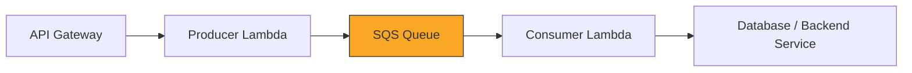

# How to Build a Queue-Based Load Leveling Pattern on AWS

Author: [nawazdhandala](https://github.com/nawazdhandala)

Tags: AWS, SQS, Lambda, Architecture, Scalability

Description: Implement the queue-based load leveling pattern on AWS using SQS, Lambda, and auto scaling to handle traffic spikes without overwhelming your backend services.

---

Your API can handle 100 requests per second. Marketing launches a campaign and suddenly you're getting 1000 requests per second. Without load leveling, your backend falls over, users get errors, and everyone has a bad day.

Queue-based load leveling is a pattern where you put a queue between your frontend and backend. The frontend writes requests to the queue as fast as they come in, and the backend processes them at whatever rate it can handle. The queue absorbs the spike and smooths out the workload.

Let's build this on AWS.

## The Pattern



The queue acts as a buffer. When traffic spikes beyond what your backend can handle, messages pile up in the queue. As traffic drops, the backend catches up. No lost requests, no overloaded services.

## When to Use This Pattern

Queue-based load leveling is the right choice when:

- Your backend has a fixed processing capacity (database write limits, third-party API rate limits)
- Traffic is bursty and unpredictable
- It's okay if processing happens with a slight delay
- You'd rather queue work than drop it

It's not the right choice when you need synchronous responses - users aren't going to wait while their request sits in a queue.

## Setting Up SQS

SQS is the obvious choice for the queue. Standard queues give you near-unlimited throughput. FIFO queues guarantee ordering but cap at 3000 messages per second with batching.

```typescript
// CDK stack
import * as cdk from 'aws-cdk-lib';
import * as sqs from 'aws-cdk-lib/aws-sqs';
import * as lambda from 'aws-cdk-lib/aws-lambda';
import * as apigateway from 'aws-cdk-lib/aws-apigateway';
import * as lambdaEventSources from 'aws-cdk-lib/aws-lambda-event-sources';

export class LoadLevelingStack extends cdk.Stack {
  constructor(scope: cdk.App, id: string) {
    super(scope, id);

    // Dead letter queue for messages that fail processing
    const dlq = new sqs.Queue(this, 'DLQ', {
      retentionPeriod: cdk.Duration.days(14),
    });

    // Main queue with sensible defaults
    const processingQueue = new sqs.Queue(this, 'ProcessingQueue', {
      visibilityTimeout: cdk.Duration.seconds(90), // 6x the consumer timeout
      retentionPeriod: cdk.Duration.days(4),
      deadLetterQueue: {
        queue: dlq,
        maxReceiveCount: 3,
      },
    });

    // Producer: accepts requests and puts them on the queue
    const producer = new lambda.Function(this, 'Producer', {
      runtime: lambda.Runtime.NODEJS_18_X,
      handler: 'producer.handler',
      code: lambda.Code.fromAsset('lambda'),
      environment: {
        QUEUE_URL: processingQueue.queueUrl,
      },
    });

    processingQueue.grantSendMessages(producer);

    // Consumer: processes messages at a controlled rate
    const consumer = new lambda.Function(this, 'Consumer', {
      runtime: lambda.Runtime.NODEJS_18_X,
      handler: 'consumer.handler',
      code: lambda.Code.fromAsset('lambda'),
      timeout: cdk.Duration.seconds(15),
      reservedConcurrentExecutions: 10, // Limit concurrency to protect backend
      environment: {
        DB_CONNECTION_STRING: process.env.DB_CONNECTION_STRING || '',
      },
    });

    // Connect consumer to queue
    consumer.addEventSource(new lambdaEventSources.SqsEventSource(processingQueue, {
      batchSize: 10,
      maxBatchingWindow: cdk.Duration.seconds(5),
      maxConcurrency: 10,
    }));

    // API Gateway in front of the producer
    const api = new apigateway.RestApi(this, 'LoadLevelingApi');
    const ordersResource = api.root.addResource('orders');
    ordersResource.addMethod('POST', new apigateway.LambdaIntegration(producer));
  }
}
```

## The Producer

The producer accepts the HTTP request, validates it, and drops it onto the queue. The response is immediate - we're not waiting for processing.

```javascript
// lambda/producer.js
const { SQSClient, SendMessageCommand } = require('@aws-sdk/client-sqs');

const sqsClient = new SQSClient({});

exports.handler = async (event) => {
  const body = JSON.parse(event.body);

  // Validate the request
  if (!body.orderId || !body.items || body.items.length === 0) {
    return {
      statusCode: 400,
      body: JSON.stringify({ error: 'Invalid order: orderId and items required' }),
    };
  }

  // Create a message with metadata
  const message = {
    orderId: body.orderId,
    items: body.items,
    userId: body.userId,
    submittedAt: new Date().toISOString(),
    source: event.requestContext?.identity?.sourceIp || 'unknown',
  };

  // Send to queue
  await sqsClient.send(new SendMessageCommand({
    QueueUrl: process.env.QUEUE_URL,
    MessageBody: JSON.stringify(message),
    MessageAttributes: {
      orderType: {
        DataType: 'String',
        StringValue: body.priority === 'rush' ? 'rush' : 'standard',
      },
    },
    // Optional: group related messages for FIFO queues
    // MessageGroupId: body.userId,
  }));

  // Return immediately with a tracking ID
  return {
    statusCode: 202, // 202 Accepted - processing will happen asynchronously
    body: JSON.stringify({
      message: 'Order accepted for processing',
      orderId: body.orderId,
      status: 'queued',
    }),
  };
};
```

## The Consumer

The consumer processes messages at whatever rate the backend can handle. The key control is `reservedConcurrentExecutions` on the Lambda - this caps how many messages are processed simultaneously.

```javascript
// lambda/consumer.js
const { DynamoDBClient, PutItemCommand, UpdateItemCommand } = require('@aws-sdk/client-dynamodb');

const dynamoClient = new DynamoDBClient({});

exports.handler = async (event) => {
  const results = [];

  for (const record of event.Records) {
    const order = JSON.parse(record.body);

    try {
      // Simulate backend processing with rate limits
      await processOrder(order);
      results.push({ orderId: order.orderId, status: 'processed' });
    } catch (error) {
      console.error(`Failed to process order ${order.orderId}:`, error);
      // Throwing here will cause SQS to retry the message
      throw error;
    }
  }

  console.log(`Processed ${results.length} orders`);
  return { batchItemFailures: [] };
};

async function processOrder(order) {
  // Write to database
  await dynamoClient.send(new PutItemCommand({
    TableName: 'Orders',
    Item: {
      orderId: { S: order.orderId },
      userId: { S: order.userId },
      items: { S: JSON.stringify(order.items) },
      status: { S: 'processed' },
      submittedAt: { S: order.submittedAt },
      processedAt: { S: new Date().toISOString() },
    },
  }));

  // Update order status
  await dynamoClient.send(new UpdateItemCommand({
    TableName: 'OrderStatus',
    Key: { orderId: { S: order.orderId } },
    UpdateExpression: 'SET #status = :status, processedAt = :time',
    ExpressionAttributeNames: { '#status': 'status' },
    ExpressionAttributeValues: {
      ':status': { S: 'processed' },
      ':time': { S: new Date().toISOString() },
    },
  }));
}
```

## Partial Batch Failure Handling

When processing a batch, some messages might succeed and some might fail. Report partial failures so SQS only retries the failed ones.

```javascript
// Improved consumer with partial batch failure handling
exports.handler = async (event) => {
  const failures = [];

  for (const record of event.Records) {
    try {
      const order = JSON.parse(record.body);
      await processOrder(order);
    } catch (error) {
      console.error(`Failed message ${record.messageId}:`, error);
      failures.push({ itemIdentifier: record.messageId });
    }
  }

  // Only retry failed messages
  return { batchItemFailures: failures };
};
```

## Monitoring Queue Depth

The queue depth tells you how backed up you are. Set up CloudWatch alarms to alert when the backlog grows too large.

```typescript
// Alarm when queue depth exceeds threshold
new cloudwatch.Alarm(this, 'QueueDepthAlarm', {
  metric: processingQueue.metricApproximateNumberOfMessagesVisible({
    period: cdk.Duration.minutes(1),
  }),
  threshold: 1000,
  evaluationPeriods: 3,
  alarmDescription: 'Processing queue backlog is growing',
});

// Alarm when DLQ has messages (processing failures)
new cloudwatch.Alarm(this, 'DLQAlarm', {
  metric: dlq.metricApproximateNumberOfMessagesVisible({
    period: cdk.Duration.minutes(5),
  }),
  threshold: 1,
  evaluationPeriods: 1,
  alarmDescription: 'Messages are landing in the dead letter queue',
});
```

For a full observability setup, check out [building a logging and monitoring stack on AWS](https://oneuptime.com/blog/post/2026-02-12-build-logging-and-monitoring-stack-on-aws/view).

## Scaling the Consumer

Instead of a fixed concurrency limit, you can scale the consumer based on queue depth. When the backlog grows, process faster.

```typescript
// Auto scaling based on queue depth using Lambda's SQS scaling
consumer.addEventSource(new lambdaEventSources.SqsEventSource(processingQueue, {
  batchSize: 10,
  maxBatchingWindow: cdk.Duration.seconds(5),
  maxConcurrency: 50, // Scale up to 50 concurrent executions
  reportBatchItemFailures: true,
}));
```

Lambda automatically scales the number of queue pollers based on queue depth, so you get natural load leveling behavior.

## Summary

Queue-based load leveling is one of the most useful architectural patterns for handling unpredictable traffic. SQS sits between your producers and consumers, absorbing bursts and letting your backend process work at a sustainable rate. The pattern is simple but powerful - your system stays healthy during traffic spikes, and no requests get dropped. Just remember that it introduces asynchronous processing, so design your API responses accordingly.
