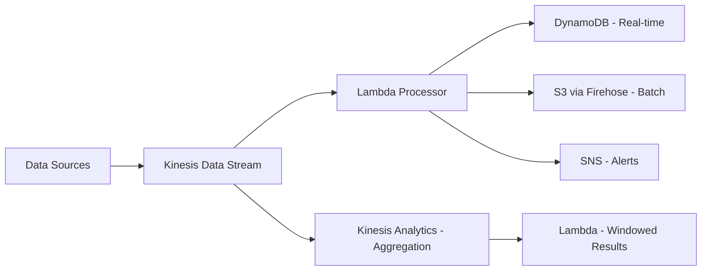

# How to Build a Real-Time Analytics Pipeline with Kinesis and Lambda

Author: [nawazdhandala](https://github.com/nawazdhandala)

Tags: AWS, Kinesis, Lambda, Real-Time Analytics, Streaming

Description: Build a real-time analytics pipeline using Amazon Kinesis Data Streams and AWS Lambda to process, transform, and analyze streaming data as it arrives.

---

Batch processing is fine when you can wait hours for results. But when you need to detect fraud as it happens, track live user behavior, or monitor system health in real time, you need a streaming pipeline. Amazon Kinesis and Lambda together give you a serverless, real-time analytics stack that scales automatically and costs nothing when idle.

This guide walks through building a complete real-time pipeline: ingesting events into Kinesis, processing them with Lambda, enriching the data, and writing results to both DynamoDB (for real-time lookups) and S3 (for batch analytics).

## Architecture Overview



## Step 1: Create the Kinesis Data Stream

The data stream is your buffer. Events go in, consumers read them out. Choose your shard count based on expected throughput - each shard handles 1 MB/s in and 2 MB/s out.

```bash
# Create a Kinesis data stream with on-demand capacity
aws kinesis create-stream \
  --stream-name analytics-events \
  --stream-mode-details StreamMode=ON_DEMAND

# Or with provisioned capacity if you know your throughput
aws kinesis create-stream \
  --stream-name analytics-events \
  --shard-count 4
```

On-demand mode auto-scales shards based on traffic. Provisioned mode is cheaper if your throughput is predictable.

## Step 2: Send Events to the Stream

Let's build a simple event producer. In production, this could be your application backend, an IoT device, or a log collector.

```python
# producer.py - Send events to Kinesis
import boto3
import json
import time
import uuid
from datetime import datetime

kinesis = boto3.client('kinesis', region_name='us-east-1')
stream_name = 'analytics-events'

def send_event(event_type, data):
    """Send a single event to Kinesis."""
    event = {
        'event_id': str(uuid.uuid4()),
        'event_type': event_type,
        'timestamp': datetime.utcnow().isoformat() + 'Z',
        'data': data
    }

    response = kinesis.put_record(
        StreamName=stream_name,
        Data=json.dumps(event),
        # Use a field that distributes evenly across shards
        PartitionKey=data.get('user_id', str(uuid.uuid4()))
    )
    return response

# Send a batch of events for better throughput
def send_events_batch(events):
    """Send multiple events in a single API call."""
    records = []
    for event_type, data in events:
        event = {
            'event_id': str(uuid.uuid4()),
            'event_type': event_type,
            'timestamp': datetime.utcnow().isoformat() + 'Z',
            'data': data
        }
        records.append({
            'Data': json.dumps(event),
            'PartitionKey': data.get('user_id', str(uuid.uuid4()))
        })

    response = kinesis.put_records(
        StreamName=stream_name,
        Records=records
    )

    # Check for failed records and retry
    if response['FailedRecordCount'] > 0:
        failed = [r for r in response['Records'] if 'ErrorCode' in r]
        print(f"Warning: {len(failed)} records failed, retrying...")

    return response

# Example: send user activity events
send_event('page_view', {
    'user_id': 'u-12345',
    'page': '/products/widget-a',
    'referrer': 'google.com',
    'device': 'mobile'
})

send_event('purchase', {
    'user_id': 'u-12345',
    'product_id': 'p-789',
    'amount': 49.99,
    'currency': 'USD'
})
```

## Step 3: Build the Lambda Processor

This Lambda function processes each batch of records from Kinesis. It's where your business logic lives - transformations, enrichment, filtering, and routing.

```python
# lambda_handler.py - Process Kinesis events
import json
import base64
import boto3
import os
from datetime import datetime

dynamodb = boto3.resource('dynamodb')
sns = boto3.client('sns')

# Table for real-time metrics
metrics_table = dynamodb.Table(os.environ['METRICS_TABLE'])
alerts_topic = os.environ['ALERTS_TOPIC_ARN']

def lambda_handler(event, context):
    """Process a batch of Kinesis records."""

    processed = 0
    errors = 0

    for record in event['Records']:
        try:
            # Decode the Kinesis record
            payload = base64.b64decode(record['kinesis']['data'])
            event_data = json.loads(payload)

            # Route based on event type
            event_type = event_data.get('event_type')

            if event_type == 'page_view':
                process_page_view(event_data)
            elif event_type == 'purchase':
                process_purchase(event_data)
            elif event_type == 'error':
                process_error(event_data)

            processed += 1

        except Exception as e:
            print(f"Error processing record: {e}")
            errors += 1

    print(f"Processed {processed} records, {errors} errors")

    # Return batch item failures for partial retry
    return {
        'batchItemFailures': []
    }


def process_page_view(event_data):
    """Update real-time page view counters."""
    data = event_data['data']
    today = datetime.utcnow().strftime('%Y-%m-%d')

    # Increment page view counter in DynamoDB
    metrics_table.update_item(
        Key={
            'metric_key': f"pageviews#{today}",
            'sort_key': data['page']
        },
        UpdateExpression='ADD view_count :inc SET last_updated = :ts',
        ExpressionAttributeValues={
            ':inc': 1,
            ':ts': event_data['timestamp']
        }
    )


def process_purchase(event_data):
    """Track purchases and detect high-value orders."""
    data = event_data['data']
    today = datetime.utcnow().strftime('%Y-%m-%d')

    # Update daily revenue metrics
    metrics_table.update_item(
        Key={
            'metric_key': f"revenue#{today}",
            'sort_key': 'total'
        },
        UpdateExpression='ADD total_revenue :amount, order_count :inc SET last_updated = :ts',
        ExpressionAttributeValues={
            ':amount': int(data['amount'] * 100),  # Store as cents
            ':inc': 1,
            ':ts': event_data['timestamp']
        }
    )

    # Alert on high-value orders
    if data.get('amount', 0) > 500:
        sns.publish(
            TopicArn=alerts_topic,
            Subject='High-Value Order Detected',
            Message=json.dumps({
                'order_amount': data['amount'],
                'user_id': data['user_id'],
                'product_id': data['product_id'],
                'timestamp': event_data['timestamp']
            })
        )


def process_error(event_data):
    """Track error events and alert on spikes."""
    data = event_data['data']
    today = datetime.utcnow().strftime('%Y-%m-%d')
    hour = datetime.utcnow().strftime('%H')

    # Increment error counter
    metrics_table.update_item(
        Key={
            'metric_key': f"errors#{today}#{hour}",
            'sort_key': data.get('error_code', 'unknown')
        },
        UpdateExpression='ADD error_count :inc SET last_updated = :ts, last_message = :msg',
        ExpressionAttributeValues={
            ':inc': 1,
            ':ts': event_data['timestamp'],
            ':msg': data.get('message', '')[:500]
        }
    )
```

## Step 4: Deploy the Lambda and Connect to Kinesis

```bash
# Create the DynamoDB metrics table
aws dynamodb create-table \
  --table-name analytics-metrics \
  --attribute-definitions \
    AttributeName=metric_key,AttributeType=S \
    AttributeName=sort_key,AttributeType=S \
  --key-schema \
    AttributeName=metric_key,KeyType=HASH \
    AttributeName=sort_key,KeyType=RANGE \
  --billing-mode PAY_PER_REQUEST

# Create the SNS alerts topic
aws sns create-topic --name analytics-alerts

# Create the Lambda function
aws lambda create-function \
  --function-name kinesis-analytics-processor \
  --runtime python3.12 \
  --handler lambda_handler.lambda_handler \
  --role arn:aws:iam::123456789012:role/LambdaKinesisRole \
  --timeout 60 \
  --memory-size 256 \
  --environment '{
    "Variables": {
      "METRICS_TABLE": "analytics-metrics",
      "ALERTS_TOPIC_ARN": "arn:aws:sns:us-east-1:123456789012:analytics-alerts"
    }
  }' \
  --zip-file fileb://lambda.zip

# Create the Kinesis event source mapping
aws lambda create-event-source-mapping \
  --function-name kinesis-analytics-processor \
  --event-source-arn arn:aws:kinesis:us-east-1:123456789012:stream/analytics-events \
  --starting-position LATEST \
  --batch-size 100 \
  --maximum-batching-window-in-seconds 5 \
  --parallelization-factor 2 \
  --maximum-retry-attempts 3 \
  --bisect-batch-on-function-error \
  --function-response-types ReportBatchItemFailures
```

Key settings explained:
- `batch-size 100`: Lambda receives up to 100 records per invocation
- `maximum-batching-window-in-seconds 5`: Wait up to 5 seconds to fill the batch
- `parallelization-factor 2`: Process 2 batches per shard simultaneously
- `bisect-batch-on-function-error`: Split failed batches in half for retry
- `ReportBatchItemFailures`: Only retry individual failed records, not the whole batch

## Step 5: Add Kinesis Data Firehose for S3 Archiving

While Lambda handles real-time processing, Firehose archives all raw events to S3 for later batch analysis.

```bash
# Create a Firehose delivery stream
aws firehose create-delivery-stream \
  --delivery-stream-name analytics-events-archive \
  --delivery-stream-type KinesisStreamAsSource \
  --kinesis-stream-source-configuration '{
    "KinesisStreamARN": "arn:aws:kinesis:us-east-1:123456789012:stream/analytics-events",
    "RoleARN": "arn:aws:iam::123456789012:role/FirehoseKinesisRole"
  }' \
  --extended-s3-destination-configuration '{
    "RoleARN": "arn:aws:iam::123456789012:role/FirehoseS3Role",
    "BucketARN": "arn:aws:s3:::my-analytics-archive",
    "Prefix": "events/year=!{timestamp:yyyy}/month=!{timestamp:MM}/day=!{timestamp:dd}/",
    "ErrorOutputPrefix": "errors/",
    "BufferingHints": {
      "SizeInMBs": 64,
      "IntervalInSeconds": 300
    },
    "CompressionFormat": "GZIP",
    "DataFormatConversionConfiguration": {
      "Enabled": true,
      "InputFormatConfiguration": {
        "Deserializer": {
          "OpenXJsonSerDe": {}
        }
      },
      "OutputFormatConfiguration": {
        "Serializer": {
          "ParquetSerDe": {
            "Compression": "SNAPPY"
          }
        }
      },
      "SchemaConfiguration": {
        "DatabaseName": "analytics_db",
        "TableName": "events_schema",
        "Region": "us-east-1",
        "RoleARN": "arn:aws:iam::123456789012:role/FirehoseGlueRole"
      }
    }
  }'
```

This configuration converts JSON events to Parquet format with Hive-style partitioning - perfect for querying later with Athena.

## Monitoring the Pipeline

Real-time pipelines need real-time monitoring. Watch these metrics closely.

```bash
# Check Kinesis stream metrics
aws cloudwatch get-metric-statistics \
  --namespace AWS/Kinesis \
  --metric-name IncomingRecords \
  --dimensions Name=StreamName,Value=analytics-events \
  --start-time "$(date -u -v-1H +%Y-%m-%dT%H:%M:%S)" \
  --end-time "$(date -u +%Y-%m-%dT%H:%M:%S)" \
  --period 300 \
  --statistics Sum

# Check Lambda iterator age (how far behind you are)
aws cloudwatch get-metric-statistics \
  --namespace AWS/Lambda \
  --metric-name IteratorAge \
  --dimensions Name=FunctionName,Value=kinesis-analytics-processor \
  --start-time "$(date -u -v-1H +%Y-%m-%dT%H:%M:%S)" \
  --end-time "$(date -u +%Y-%m-%dT%H:%M:%S)" \
  --period 300 \
  --statistics Maximum
```

Iterator age is the most important metric. It tells you how far behind your Lambda consumer is from the latest data. If it's growing, your processing can't keep up with the incoming event rate. For comprehensive pipeline monitoring, check out our guide on [CloudWatch alarms](https://oneuptime.com/blog/post/2026-02-12-set-up-cloudwatch-alarms-for-ec2-cpu-and-memory/view).

This architecture handles thousands of events per second at low latency, scales automatically, and costs nothing during quiet periods. It's the go-to pattern for real-time analytics on AWS.
