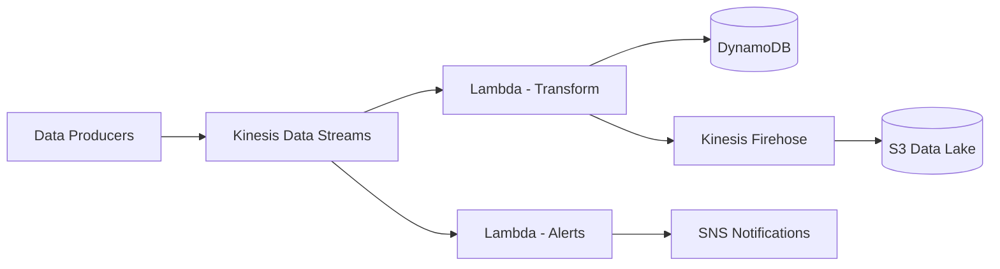

# How to Build a Real-Time Data Processing Pipeline on AWS

Author: [nawazdhandala](https://github.com/nawazdhandala)

Tags: AWS, Kinesis, Lambda, Real-Time, Data Engineering

Description: Design and implement a real-time data processing pipeline on AWS using Kinesis Data Streams, Lambda, and DynamoDB for streaming analytics and event processing.

---

Real-time data processing means acting on data as it arrives rather than waiting for batch cycles. Think of tracking user clicks as they happen, processing IoT sensor readings immediately, or detecting fraudulent transactions in milliseconds. AWS has a rich set of services for building these pipelines, and the core pattern is surprisingly straightforward once you understand the pieces.

## Architecture

Here's the pipeline we're building:



Data flows from producers into Kinesis Data Streams, where multiple consumers process it simultaneously - one for real-time transformations and storage, another for alerting, and Firehose for archiving to S3.

## Setting Up Kinesis Data Streams

Create a stream to ingest your data:

```bash
# Create a Kinesis stream with 2 shards
# Each shard handles 1MB/s in and 2MB/s out
aws kinesis create-stream \
  --stream-name events-stream \
  --shard-count 2 \
  --region us-east-1

# Wait for it to become active
aws kinesis wait stream-exists \
  --stream-name events-stream

# Verify the stream
aws kinesis describe-stream-summary \
  --stream-name events-stream
```

Each shard handles up to 1,000 records per second for writes and 2MB/s for reads. Start with 2 shards and scale up based on your throughput needs.

## Data Producers

Send data to Kinesis from your application. Here's a Node.js producer:

```javascript
// producer.js
const { KinesisClient, PutRecordsCommand } = require('@aws-sdk/client-kinesis');

const kinesis = new KinesisClient({ region: 'us-east-1' });

async function sendEvents(events) {
  // Batch events for efficiency - Kinesis supports up to 500 records per PutRecords call
  const records = events.map(event => ({
    Data: Buffer.from(JSON.stringify({
      eventType: event.type,
      userId: event.userId,
      timestamp: new Date().toISOString(),
      data: event.data,
    })),
    PartitionKey: event.userId, // Ensures same user's events go to same shard
  }));

  // Split into batches of 500
  const batchSize = 500;
  for (let i = 0; i < records.length; i += batchSize) {
    const batch = records.slice(i, i + batchSize);

    const result = await kinesis.send(new PutRecordsCommand({
      StreamName: 'events-stream',
      Records: batch,
    }));

    // Handle failed records (retry them)
    if (result.FailedRecordCount > 0) {
      const failedRecords = result.Records
        .map((r, idx) => r.ErrorCode ? batch[idx] : null)
        .filter(Boolean);
      console.log(`Retrying ${failedRecords.length} failed records`);
      // Implement exponential backoff retry here
    }
  }
}

// Example usage
sendEvents([
  { type: 'page_view', userId: 'user-123', data: { page: '/dashboard' } },
  { type: 'button_click', userId: 'user-456', data: { button: 'signup' } },
]);
```

Here's a Python producer for variety:

```python
# producer.py
import boto3
import json
import time
from datetime import datetime

kinesis = boto3.client('kinesis', region_name='us-east-1')

def send_event(event_type, user_id, data):
    record = {
        'eventType': event_type,
        'userId': user_id,
        'timestamp': datetime.utcnow().isoformat() + 'Z',
        'data': data,
    }

    response = kinesis.put_record(
        StreamName='events-stream',
        Data=json.dumps(record),
        PartitionKey=user_id,
    )

    return response['SequenceNumber']

# Simulate a stream of events
for i in range(100):
    seq = send_event(
        event_type='sensor_reading',
        user_id=f'sensor-{i % 10}',
        data={'temperature': 20 + (i % 15), 'humidity': 40 + (i % 20)},
    )
    print(f'Sent record: {seq}')
    time.sleep(0.1)
```

## Lambda Consumer - Transform and Store

Create a Lambda function that processes records from Kinesis and stores results in DynamoDB:

```javascript
// transform-handler.js
const { DynamoDBClient } = require('@aws-sdk/client-dynamodb');
const { DynamoDBDocumentClient, PutCommand, UpdateCommand } = require('@aws-sdk/lib-dynamodb');

const docClient = DynamoDBDocumentClient.from(new DynamoDBClient({}));
const TABLE = process.env.EVENTS_TABLE;
const AGGREGATES_TABLE = process.env.AGGREGATES_TABLE;

exports.handler = async (event) => {
  console.log(`Processing ${event.Records.length} records`);

  const results = {
    processed: 0,
    errors: 0,
  };

  for (const record of event.Records) {
    try {
      // Decode the Kinesis record
      const payload = JSON.parse(
        Buffer.from(record.kinesis.data, 'base64').toString('utf-8')
      );

      // Store the raw event
      await docClient.send(new PutCommand({
        TableName: TABLE,
        Item: {
          id: record.eventID,
          ...payload,
          processedAt: new Date().toISOString(),
          shardId: record.eventID.split(':')[0],
        },
      }));

      // Update real-time aggregates
      await updateAggregates(payload);

      results.processed++;
    } catch (err) {
      console.error('Error processing record:', err);
      results.errors++;
      // Don't throw - process remaining records
    }
  }

  console.log(`Results: ${JSON.stringify(results)}`);
  return results;
};

async function updateAggregates(event) {
  const hourKey = event.timestamp.substring(0, 13); // YYYY-MM-DDTHH

  await docClient.send(new UpdateCommand({
    TableName: AGGREGATES_TABLE,
    Key: {
      partitionKey: `${event.eventType}#${hourKey}`,
      sortKey: event.userId || 'global',
    },
    UpdateExpression: 'SET eventCount = if_not_exists(eventCount, :zero) + :one, lastUpdated = :now',
    ExpressionAttributeValues: {
      ':zero': 0,
      ':one': 1,
      ':now': new Date().toISOString(),
    },
  }));
}
```

## Lambda Consumer - Real-Time Alerting

Create a separate consumer for detecting anomalies and sending alerts:

```javascript
// alert-handler.js
const { SNSClient, PublishCommand } = require('@aws-sdk/client-sns');

const sns = new SNSClient({});
const ALERT_TOPIC = process.env.ALERT_TOPIC_ARN;

// Simple threshold-based alerting
const THRESHOLDS = {
  sensor_reading: {
    temperature: { max: 35, min: 0 },
    humidity: { max: 90, min: 10 },
  },
};

exports.handler = async (event) => {
  const alerts = [];

  for (const record of event.Records) {
    const payload = JSON.parse(
      Buffer.from(record.kinesis.data, 'base64').toString('utf-8')
    );

    const threshold = THRESHOLDS[payload.eventType];
    if (!threshold) continue;

    // Check each metric against thresholds
    for (const [metric, limits] of Object.entries(threshold)) {
      const value = payload.data?.[metric];
      if (value === undefined) continue;

      if (value > limits.max || value < limits.min) {
        alerts.push({
          eventType: payload.eventType,
          metric,
          value,
          threshold: limits,
          userId: payload.userId,
          timestamp: payload.timestamp,
        });
      }
    }
  }

  // Send alerts if any thresholds were breached
  if (alerts.length > 0) {
    await sns.send(new PublishCommand({
      TopicArn: ALERT_TOPIC,
      Subject: `Alert: ${alerts.length} threshold violations detected`,
      Message: JSON.stringify(alerts, null, 2),
    }));
    console.log(`Sent ${alerts.length} alerts`);
  }
};
```

## Infrastructure with Serverless Framework

Tie everything together:

```yaml
# serverless.yml
service: realtime-pipeline

provider:
  name: aws
  runtime: nodejs20.x
  region: us-east-1
  environment:
    EVENTS_TABLE: !Ref EventsTable
    AGGREGATES_TABLE: !Ref AggregatesTable
    ALERT_TOPIC_ARN: !Ref AlertTopic
  iam:
    role:
      statements:
        - Effect: Allow
          Action: [dynamodb:PutItem, dynamodb:UpdateItem]
          Resource:
            - !GetAtt EventsTable.Arn
            - !GetAtt AggregatesTable.Arn
        - Effect: Allow
          Action: [sns:Publish]
          Resource: !Ref AlertTopic

functions:
  transform:
    handler: transform-handler.handler
    timeout: 60
    events:
      - stream:
          type: kinesis
          arn: !GetAtt EventsStream.Arn
          batchSize: 100
          startingPosition: LATEST
          maximumRetryAttempts: 3
          bisectBatchOnFunctionError: true

  alerting:
    handler: alert-handler.handler
    timeout: 30
    events:
      - stream:
          type: kinesis
          arn: !GetAtt EventsStream.Arn
          batchSize: 50
          startingPosition: LATEST

resources:
  Resources:
    EventsStream:
      Type: AWS::Kinesis::Stream
      Properties:
        Name: events-stream
        ShardCount: 2

    EventsTable:
      Type: AWS::DynamoDB::Table
      Properties:
        BillingMode: PAY_PER_REQUEST
        AttributeDefinitions:
          - AttributeName: id
            AttributeType: S
        KeySchema:
          - AttributeName: id
            KeyType: HASH

    AggregatesTable:
      Type: AWS::DynamoDB::Table
      Properties:
        BillingMode: PAY_PER_REQUEST
        AttributeDefinitions:
          - AttributeName: partitionKey
            AttributeType: S
          - AttributeName: sortKey
            AttributeType: S
        KeySchema:
          - AttributeName: partitionKey
            KeyType: HASH
          - AttributeName: sortKey
            KeyType: RANGE

    AlertTopic:
      Type: AWS::SNS::Topic
      Properties:
        TopicName: pipeline-alerts
```

## Monitoring the Pipeline

Monitor key metrics to ensure your pipeline is healthy:

```bash
# Check iterator age (how far behind consumers are)
aws cloudwatch get-metric-statistics \
  --namespace AWS/Kinesis \
  --metric-name GetRecords.IteratorAgeMilliseconds \
  --dimensions Name=StreamName,Value=events-stream \
  --start-time $(date -u -v-1H +%Y-%m-%dT%H:%M:%S) \
  --end-time $(date -u +%Y-%m-%dT%H:%M:%S) \
  --period 300 \
  --statistics Maximum
```

If the iterator age keeps growing, your consumers can't keep up with the incoming data and you need more shards or faster processing.

For production pipelines, set up comprehensive monitoring with [OneUptime](https://oneuptime.com/blog/post/aws-monitoring-tools-comparison/view) to catch issues before they cascade.

## Summary

A real-time data pipeline on AWS is built from a few key components: Kinesis for ingestion, Lambda for processing, DynamoDB for storage, and SNS for alerting. The beauty of this architecture is that each piece scales independently, and you can add new consumers without affecting existing ones. Start simple with a single producer and consumer, then expand as your needs grow.
