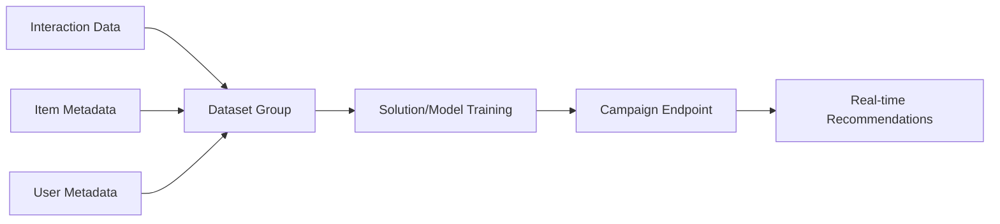

# How to Build a Recommendation Engine with AWS Personalize

Author: [nawazdhandala](https://github.com/nawazdhandala)

Tags: AWS, Personalize, Machine Learning, Recommendations

Description: Step-by-step guide to building a recommendation engine with AWS Personalize, covering data preparation, model training, and real-time recommendation APIs.

---

Building a recommendation engine from scratch means hiring ML engineers, setting up training infrastructure, and iterating on models for months. Or you could use AWS Personalize, which packages the same technology Amazon uses for product recommendations into a managed service. You bring the data, Personalize builds the model, and you get an API that returns personalized recommendations.

Let's walk through building a recommendation system end to end.

## How Personalize Works

Personalize needs three types of data:

1. **Interactions** - Who did what and when (user viewed item, user purchased item)
2. **Items** - Metadata about your items (category, price, genre)
3. **Users** - Metadata about your users (age group, membership tier)

You feed this data in, Personalize trains a model (called a "solution"), and you deploy it as a campaign that serves real-time recommendations.



## Preparing Your Data

Personalize expects CSV files in S3 with specific schemas. The interactions dataset is the most important one.

```csv
USER_ID,ITEM_ID,TIMESTAMP,EVENT_TYPE
user_001,item_123,1706745600,purchase
user_001,item_456,1706745300,view
user_002,item_123,1706744400,view
user_002,item_789,1706744100,purchase
```

Here's a Lambda that transforms your application data into the format Personalize expects.

```javascript
// lambda/prepare-data.js
const { S3Client, PutObjectCommand } = require('@aws-sdk/client-s3');
const { DynamoDBClient, ScanCommand } = require('@aws-sdk/client-dynamodb');

const s3Client = new S3Client({});
const dynamoClient = new DynamoDBClient({});

exports.handler = async () => {
  // Pull interaction events from your database
  const { Items } = await dynamoClient.send(new ScanCommand({
    TableName: 'UserEvents',
    FilterExpression: '#ts > :cutoff',
    ExpressionAttributeNames: { '#ts': 'timestamp' },
    ExpressionAttributeValues: {
      ':cutoff': { N: String(Date.now() / 1000 - 90 * 24 * 3600) }, // Last 90 days
    },
  }));

  // Convert to CSV format
  let csv = 'USER_ID,ITEM_ID,TIMESTAMP,EVENT_TYPE\n';
  for (const item of Items) {
    csv += `${item.userId.S},${item.itemId.S},${item.timestamp.N},${item.eventType.S}\n`;
  }

  // Upload to S3
  await s3Client.send(new PutObjectCommand({
    Bucket: process.env.DATA_BUCKET,
    Key: 'interactions/interactions.csv',
    Body: csv,
  }));

  console.log(`Exported ${Items.length} interactions`);
  return { count: Items.length };
};
```

Prepare your items dataset similarly.

```javascript
// Prepare items metadata
async function prepareItemsData() {
  // Pull product data
  const { Items } = await dynamoClient.send(new ScanCommand({
    TableName: 'Products',
  }));

  let csv = 'ITEM_ID,CATEGORY,PRICE,CREATION_TIMESTAMP\n';
  for (const item of Items) {
    csv += `${item.id.S},${item.category.S},${item.price.N},${item.createdAt.N}\n`;
  }

  await s3Client.send(new PutObjectCommand({
    Bucket: process.env.DATA_BUCKET,
    Key: 'items/items.csv',
    Body: csv,
  }));
}
```

## Creating the Dataset Group and Importing Data

Use the AWS SDK to set up the Personalize resources programmatically.

```javascript
// lambda/setup-personalize.js
const {
  PersonalizeClient,
  CreateDatasetGroupCommand,
  CreateSchemaCommand,
  CreateDatasetCommand,
  CreateDatasetImportJobCommand,
} = require('@aws-sdk/client-personalize');

const client = new PersonalizeClient({});

exports.handler = async () => {
  // Step 1: Create a dataset group
  const { datasetGroupArn } = await client.send(new CreateDatasetGroupCommand({
    name: 'product-recommendations',
  }));

  console.log(`Dataset group created: ${datasetGroupArn}`);

  // Step 2: Create the interactions schema
  const interactionsSchema = {
    type: 'record',
    name: 'Interactions',
    namespace: 'com.amazonaws.personalize.schema',
    fields: [
      { name: 'USER_ID', type: 'string' },
      { name: 'ITEM_ID', type: 'string' },
      { name: 'TIMESTAMP', type: 'long' },
      { name: 'EVENT_TYPE', type: 'string' },
    ],
    version: '1.0',
  };

  const { schemaArn } = await client.send(new CreateSchemaCommand({
    name: 'product-interactions-schema',
    schema: JSON.stringify(interactionsSchema),
  }));

  // Step 3: Create the dataset
  const { datasetArn } = await client.send(new CreateDatasetCommand({
    datasetGroupArn,
    datasetType: 'Interactions',
    name: 'product-interactions',
    schemaArn,
  }));

  // Step 4: Import the data from S3
  const { datasetImportJobArn } = await client.send(new CreateDatasetImportJobCommand({
    jobName: `import-${Date.now()}`,
    datasetArn,
    dataSource: {
      dataLocation: `s3://${process.env.DATA_BUCKET}/interactions/`,
    },
    roleArn: process.env.PERSONALIZE_ROLE_ARN,
  }));

  return { datasetGroupArn, datasetArn, datasetImportJobArn };
};
```

## Training the Model

Once data is imported, create a solution (the model). Personalize offers several recipe types:

- `aws-user-personalization` - Personalized recommendations per user
- `aws-similar-items` - Items similar to a given item
- `aws-popularity-count` - Most popular items (good baseline)

```javascript
// lambda/train-model.js
const {
  PersonalizeClient,
  CreateSolutionCommand,
  CreateSolutionVersionCommand,
} = require('@aws-sdk/client-personalize');

const client = new PersonalizeClient({});

exports.handler = async (event) => {
  const { datasetGroupArn } = event;

  // Create the solution with the user-personalization recipe
  const { solutionArn } = await client.send(new CreateSolutionCommand({
    name: 'product-recommendations-solution',
    datasetGroupArn,
    recipeArn: 'arn:aws:personalize:::recipe/aws-user-personalization',
    solutionConfig: {
      algorithmHyperParameters: {
        'hidden_dimension': '128',
        'bptt': '32',
      },
    },
  }));

  // Train a new version of the model
  const { solutionVersionArn } = await client.send(new CreateSolutionVersionCommand({
    solutionArn,
    trainingMode: 'FULL',
  }));

  // Training takes 30-60 minutes for small datasets
  console.log(`Training started: ${solutionVersionArn}`);
  return { solutionArn, solutionVersionArn };
};
```

## Deploying as a Campaign

After training completes, deploy the model as a campaign for real-time inference.

```javascript
// lambda/deploy-campaign.js
const {
  PersonalizeClient,
  CreateCampaignCommand,
} = require('@aws-sdk/client-personalize');

const client = new PersonalizeClient({});

exports.handler = async (event) => {
  const { solutionVersionArn } = event;

  const { campaignArn } = await client.send(new CreateCampaignCommand({
    name: 'product-recommendations-campaign',
    solutionVersionArn,
    minProvisionedTPS: 1, // Minimum transactions per second
  }));

  console.log(`Campaign created: ${campaignArn}`);
  return { campaignArn };
};
```

## Getting Recommendations

Now you can call the campaign to get personalized recommendations.

```javascript
// lambda/get-recommendations.js
const {
  PersonalizeRuntimeClient,
  GetRecommendationsCommand,
} = require('@aws-sdk/client-personalize-runtime');

const client = new PersonalizeRuntimeClient({});

exports.handler = async (event) => {
  const userId = event.queryStringParameters?.userId;
  const numResults = parseInt(event.queryStringParameters?.count || '10');

  const { itemList } = await client.send(new GetRecommendationsCommand({
    campaignArn: process.env.CAMPAIGN_ARN,
    userId,
    numResults,
    // Optional: filter recommendations
    filterArn: process.env.FILTER_ARN,
  }));

  // Enrich with item details from your database
  const recommendations = await Promise.all(
    itemList.map(async (item) => {
      const details = await getItemDetails(item.itemId);
      return {
        itemId: item.itemId,
        score: item.score,
        ...details,
      };
    })
  );

  return {
    statusCode: 200,
    body: JSON.stringify({ userId, recommendations }),
  };
};
```

## Real-Time Event Tracking

To keep recommendations fresh, send real-time events as users interact with your app.

```javascript
// Track user events in real time
const {
  PersonalizeEventsClient,
  PutEventsCommand,
} = require('@aws-sdk/client-personalize-events');

const client = new PersonalizeEventsClient({});

async function trackEvent(userId, sessionId, itemId, eventType) {
  await client.send(new PutEventsCommand({
    trackingId: process.env.TRACKING_ID,
    userId,
    sessionId,
    eventList: [{
      eventType,
      sentAt: new Date(),
      itemId,
    }],
  }));
}
```

## Cost Considerations

Personalize pricing has several components: data storage, training hours, and real-time inference. Training costs add up if you retrain frequently. For production workloads, retrain weekly or when you have enough new data to make a difference.

The campaign's `minProvisionedTPS` setting also affects cost. Start low and increase based on actual traffic.

## Summary

AWS Personalize lets you build recommendation engines without deep ML expertise. Prepare your interaction and item data, import it, train a model, deploy a campaign, and call the API. The hardest part is usually getting your data into the right format and having enough of it - Personalize works best with at least 1000 users and 1000 items with meaningful interaction history. For monitoring your recommendation system's performance, check out our guide on [building a logging and monitoring stack on AWS](https://oneuptime.com/blog/post/build-logging-and-monitoring-stack-on-aws/view) to track API latency and error rates.
