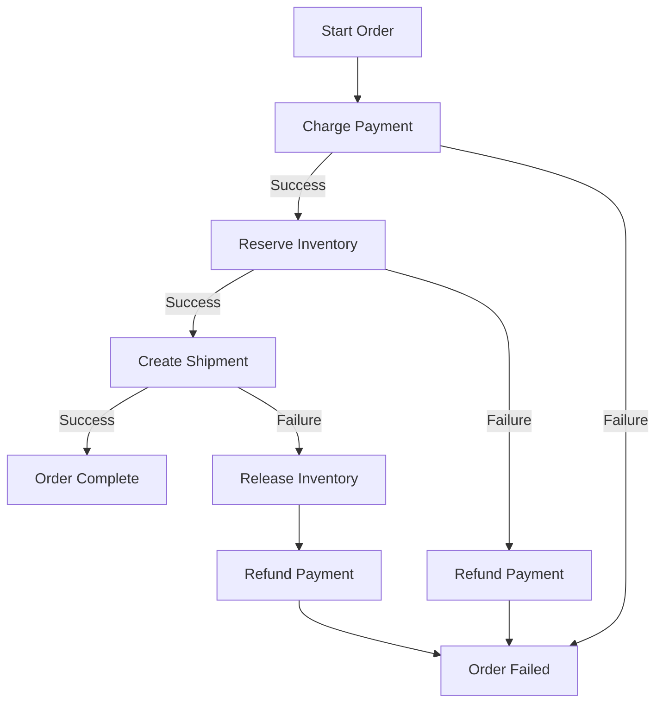

# How to Build Saga Orchestration with Step Functions

Author: [nawazdhandala](https://github.com/nawazdhandala)

Tags: AWS, Step Functions, Saga Pattern, Microservices, Distributed Transactions, Serverless

Description: Learn how to implement the saga orchestration pattern using AWS Step Functions for reliable distributed transactions

---

In a monolithic application, you wrap multiple database operations in a single transaction. Either everything succeeds or everything rolls back. Simple. But in a microservices architecture, each service owns its own database. There is no single transaction boundary that spans all services.

The saga pattern solves this. Instead of one big transaction, you break the operation into a series of local transactions across services. If any step fails, you execute compensating transactions to undo the previous steps. AWS Step Functions is the perfect tool for orchestrating this.

## The Saga Pattern Explained

Consider an e-commerce order flow that spans three services:

1. **Payment Service** - Charges the customer's card
2. **Inventory Service** - Reserves the items
3. **Shipping Service** - Creates a shipment

If the shipping service fails after payment has been charged and inventory reserved, you need to:

- Release the reserved inventory (compensating transaction)
- Refund the payment (compensating transaction)



## Building the Step Functions State Machine

Here is the complete state machine definition for an order saga:

```json
{
  "Comment": "Order Saga - Orchestrates payment, inventory, and shipping with compensations",
  "StartAt": "ChargePayment",
  "States": {
    "ChargePayment": {
      "Type": "Task",
      "Resource": "arn:aws:lambda:us-east-1:123456789012:function:charge-payment",
      "ResultPath": "$.paymentResult",
      "Catch": [
        {
          "ErrorEquals": ["States.ALL"],
          "Next": "PaymentFailed",
          "ResultPath": "$.error"
        }
      ],
      "Next": "ReserveInventory"
    },
    "ReserveInventory": {
      "Type": "Task",
      "Resource": "arn:aws:lambda:us-east-1:123456789012:function:reserve-inventory",
      "ResultPath": "$.inventoryResult",
      "Catch": [
        {
          "ErrorEquals": ["States.ALL"],
          "Next": "RefundPayment",
          "ResultPath": "$.error"
        }
      ],
      "Next": "CreateShipment"
    },
    "CreateShipment": {
      "Type": "Task",
      "Resource": "arn:aws:lambda:us-east-1:123456789012:function:create-shipment",
      "ResultPath": "$.shipmentResult",
      "Catch": [
        {
          "ErrorEquals": ["States.ALL"],
          "Next": "ReleaseInventory",
          "ResultPath": "$.error"
        }
      ],
      "Next": "OrderComplete"
    },
    "OrderComplete": {
      "Type": "Succeed"
    },
    "ReleaseInventory": {
      "Type": "Task",
      "Resource": "arn:aws:lambda:us-east-1:123456789012:function:release-inventory",
      "ResultPath": "$.releaseResult",
      "Next": "RefundPayment",
      "Catch": [
        {
          "ErrorEquals": ["States.ALL"],
          "Next": "CompensationFailed",
          "ResultPath": "$.compensationError"
        }
      ]
    },
    "RefundPayment": {
      "Type": "Task",
      "Resource": "arn:aws:lambda:us-east-1:123456789012:function:refund-payment",
      "ResultPath": "$.refundResult",
      "Next": "OrderFailed",
      "Catch": [
        {
          "ErrorEquals": ["States.ALL"],
          "Next": "CompensationFailed",
          "ResultPath": "$.compensationError"
        }
      ]
    },
    "PaymentFailed": {
      "Type": "Fail",
      "Error": "PaymentFailed",
      "Cause": "Payment could not be processed"
    },
    "OrderFailed": {
      "Type": "Fail",
      "Error": "OrderFailed",
      "Cause": "Order failed and compensations completed"
    },
    "CompensationFailed": {
      "Type": "Task",
      "Resource": "arn:aws:lambda:us-east-1:123456789012:function:alert-manual-intervention",
      "Next": "ManualInterventionRequired"
    },
    "ManualInterventionRequired": {
      "Type": "Fail",
      "Error": "CompensationFailed",
      "Cause": "Compensation failed - manual intervention required"
    }
  }
}
```

## The Lambda Functions

Each step in the saga is a Lambda function. Here are the implementations.

### Charge Payment

```python
# Charges the customer and returns the payment transaction ID
import boto3
import json
import uuid

def handler(event, context):
    order_id = event['orderId']
    amount = event['totalAmount']
    payment_method = event['paymentMethod']

    # Call your payment provider (Stripe, etc.)
    transaction_id = process_payment(payment_method, amount)

    # Store the transaction for potential refund
    dynamodb = boto3.resource('dynamodb')
    table = dynamodb.Table('saga-transactions')
    table.put_item(Item={
        'orderId': order_id,
        'step': 'payment',
        'transactionId': transaction_id,
        'amount': str(amount),
        'status': 'completed'
    })

    return {
        'transactionId': transaction_id,
        'amount': amount
    }

def process_payment(method, amount):
    # Your payment processing logic here
    return str(uuid.uuid4())
```

### Reserve Inventory

```python
# Reserves inventory items and records the reservation for potential rollback
import boto3

def handler(event, context):
    order_id = event['orderId']
    items = event['items']

    dynamodb = boto3.resource('dynamodb')
    inventory_table = dynamodb.Table('inventory')
    saga_table = dynamodb.Table('saga-transactions')

    reserved_items = []

    for item in items:
        # Attempt to decrement inventory
        response = inventory_table.update_item(
            Key={'productId': item['productId']},
            UpdateExpression='SET available = available - :qty',
            ConditionExpression='available >= :qty',
            ExpressionAttributeValues={':qty': item['quantity']},
            ReturnValues='UPDATED_NEW'
        )
        reserved_items.append(item)

    # Record the reservation
    saga_table.put_item(Item={
        'orderId': order_id,
        'step': 'inventory',
        'items': reserved_items,
        'status': 'reserved'
    })

    return {'reservedItems': reserved_items}
```

### Refund Payment (Compensating Transaction)

```python
# Compensating transaction: refunds a previously charged payment
import boto3

def handler(event, context):
    order_id = event['orderId']

    dynamodb = boto3.resource('dynamodb')
    table = dynamodb.Table('saga-transactions')

    # Look up the original payment transaction
    response = table.get_item(Key={
        'orderId': order_id,
        'step': 'payment'
    })

    transaction = response['Item']
    transaction_id = transaction['transactionId']
    amount = transaction['amount']

    # Process the refund through your payment provider
    process_refund(transaction_id, amount)

    # Update the saga record
    table.update_item(
        Key={'orderId': order_id, 'step': 'payment'},
        UpdateExpression='SET #s = :status',
        ExpressionAttributeNames={'#s': 'status'},
        ExpressionAttributeValues={':status': 'refunded'}
    )

    return {'refunded': True, 'transactionId': transaction_id}

def process_refund(transaction_id, amount):
    # Your refund processing logic here
    pass
```

### Release Inventory (Compensating Transaction)

```python
# Compensating transaction: releases previously reserved inventory
import boto3

def handler(event, context):
    order_id = event['orderId']

    dynamodb = boto3.resource('dynamodb')
    inventory_table = dynamodb.Table('inventory')
    saga_table = dynamodb.Table('saga-transactions')

    # Look up reserved items
    response = saga_table.get_item(Key={
        'orderId': order_id,
        'step': 'inventory'
    })

    reserved_items = response['Item']['items']

    # Return items to inventory
    for item in reserved_items:
        inventory_table.update_item(
            Key={'productId': item['productId']},
            UpdateExpression='SET available = available + :qty',
            ExpressionAttributeValues={':qty': item['quantity']}
        )

    # Update the saga record
    saga_table.update_item(
        Key={'orderId': order_id, 'step': 'inventory'},
        UpdateExpression='SET #s = :status',
        ExpressionAttributeNames={'#s': 'status'},
        ExpressionAttributeValues={':status': 'released'}
    )

    return {'released': True, 'items': reserved_items}
```

## Deploying the State Machine

```bash
# Create the Step Functions state machine for the order saga
aws stepfunctions create-state-machine \
  --name order-saga \
  --definition file://saga-definition.json \
  --role-arn arn:aws:iam::123456789012:role/step-functions-saga-role \
  --type STANDARD
```

The IAM role needs permission to invoke the Lambda functions:

```json
// IAM policy for the saga state machine to invoke all saga Lambda functions
{
  "Version": "2012-10-17",
  "Statement": [
    {
      "Effect": "Allow",
      "Action": "lambda:InvokeFunction",
      "Resource": [
        "arn:aws:lambda:us-east-1:123456789012:function:charge-payment",
        "arn:aws:lambda:us-east-1:123456789012:function:reserve-inventory",
        "arn:aws:lambda:us-east-1:123456789012:function:create-shipment",
        "arn:aws:lambda:us-east-1:123456789012:function:refund-payment",
        "arn:aws:lambda:us-east-1:123456789012:function:release-inventory",
        "arn:aws:lambda:us-east-1:123456789012:function:alert-manual-intervention"
      ]
    }
  ]
}
```

## Starting a Saga Execution

```bash
# Start a new order saga execution
aws stepfunctions start-execution \
  --state-machine-arn arn:aws:states:us-east-1:123456789012:stateMachine:order-saga \
  --name "order-$(date +%s)" \
  --input '{
    "orderId": "ORD-12345",
    "customerId": "CUST-678",
    "items": [
      {"productId": "PROD-A", "quantity": 2, "price": 29.99},
      {"productId": "PROD-B", "quantity": 1, "price": 49.99}
    ],
    "totalAmount": 109.97,
    "paymentMethod": "card_tok_abc123"
  }'
```

## Handling Compensation Failures

The trickiest part of the saga pattern is when a compensating transaction itself fails. If the refund fails, you cannot just ignore it. The state machine above handles this by routing to an `alert-manual-intervention` Lambda that notifies your operations team.

For critical sagas, make compensating transactions idempotent. This way, you can safely retry them. See our guide on [implementing idempotent Lambda functions](https://oneuptime.com/blog/post/2026-02-12-implement-idempotent-lambda-functions/view) for the pattern.

## Adding Timeouts

Each step should have a timeout to prevent the saga from hanging indefinitely:

```json
{
  "ChargePayment": {
    "Type": "Task",
    "Resource": "arn:aws:lambda:us-east-1:123456789012:function:charge-payment",
    "TimeoutSeconds": 30,
    "HeartbeatSeconds": 10,
    "Catch": [
      {
        "ErrorEquals": ["States.Timeout"],
        "Next": "PaymentFailed"
      },
      {
        "ErrorEquals": ["States.ALL"],
        "Next": "PaymentFailed"
      }
    ],
    "Next": "ReserveInventory"
  }
}
```

## Wrapping Up

The saga pattern with Step Functions gives you reliable distributed transactions without the complexity of two-phase commit. Step Functions handles the orchestration, error catching, and state management. Your Lambda functions focus on business logic and compensating actions. The visual workflow in the Step Functions console makes it easy to see exactly where a saga succeeded or failed.

For sagas that require human review before proceeding, check out our guide on [building human approval workflows with Step Functions](https://oneuptime.com/blog/post/2026-02-12-build-human-approval-workflows-with-step-functions/view).
