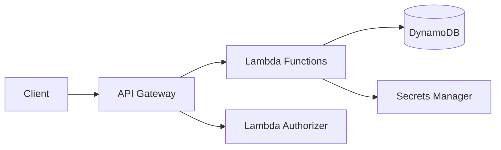

# How to Build a Serverless REST API on AWS

Author: [nawazdhandala](https://github.com/nawazdhandala)

Tags: AWS, Serverless, Lambda, API Gateway, DynamoDB

Description: Build a complete serverless REST API on AWS using API Gateway, Lambda, and DynamoDB with authentication, validation, error handling, and CI/CD deployment.

---

Building a REST API without managing any servers sounds too good to be true, but that's exactly what you get with AWS's serverless stack. API Gateway handles HTTP routing, Lambda runs your business logic, and DynamoDB stores your data. You pay only for what you use, scaling is automatic, and there are no servers to patch or maintain.

Let's build a complete CRUD API from scratch.

## Architecture

Here's the flow of a request through the system:



## Project Setup

We'll use the Serverless Framework to manage everything. It handles packaging, deployment, and infrastructure creation.

```bash
# Create the project
mkdir serverless-api
cd serverless-api
npm init -y

# Install dependencies
npm install uuid
npm install -D serverless serverless-offline
```

## Serverless Configuration

Define your entire API in `serverless.yml`. This configures the Lambda functions, API Gateway routes, DynamoDB table, and IAM permissions:

```yaml
# serverless.yml
service: serverless-rest-api

provider:
  name: aws
  runtime: nodejs20.x
  region: us-east-1
  stage: ${opt:stage, 'dev'}
  memorySize: 256
  timeout: 10
  environment:
    ITEMS_TABLE: ${self:service}-items-${self:provider.stage}
    STAGE: ${self:provider.stage}
  iam:
    role:
      statements:
        - Effect: Allow
          Action:
            - dynamodb:Query
            - dynamodb:Scan
            - dynamodb:GetItem
            - dynamodb:PutItem
            - dynamodb:UpdateItem
            - dynamodb:DeleteItem
          Resource:
            - !GetAtt ItemsTable.Arn
            - !Sub '${ItemsTable.Arn}/index/*'

functions:
  listItems:
    handler: src/handlers/items.list
    events:
      - httpApi:
          path: /items
          method: GET

  getItem:
    handler: src/handlers/items.get
    events:
      - httpApi:
          path: /items/{id}
          method: GET

  createItem:
    handler: src/handlers/items.create
    events:
      - httpApi:
          path: /items
          method: POST

  updateItem:
    handler: src/handlers/items.update
    events:
      - httpApi:
          path: /items/{id}
          method: PUT

  deleteItem:
    handler: src/handlers/items.remove
    events:
      - httpApi:
          path: /items/{id}
          method: DELETE

resources:
  Resources:
    ItemsTable:
      Type: AWS::DynamoDB::Table
      Properties:
        TableName: ${self:service}-items-${self:provider.stage}
        BillingMode: PAY_PER_REQUEST
        AttributeDefinitions:
          - AttributeName: id
            AttributeType: S
          - AttributeName: createdAt
            AttributeType: S
        KeySchema:
          - AttributeName: id
            KeyType: HASH
        GlobalSecondaryIndexes:
          - IndexName: createdAt-index
            KeySchema:
              - AttributeName: id
                KeyType: HASH
              - AttributeName: createdAt
                KeyType: RANGE
            Projection:
              ProjectionType: ALL

plugins:
  - serverless-offline
```

## Lambda Handler Functions

Create a shared response helper and DynamoDB client:

```javascript
// src/lib/response.js
// Helper to format API Gateway responses consistently

function success(data, statusCode = 200) {
  return {
    statusCode,
    headers: {
      'Content-Type': 'application/json',
      'Access-Control-Allow-Origin': '*',
    },
    body: JSON.stringify(data),
  };
}

function error(message, statusCode = 500) {
  console.error(`Error [${statusCode}]: ${message}`);
  return {
    statusCode,
    headers: {
      'Content-Type': 'application/json',
      'Access-Control-Allow-Origin': '*',
    },
    body: JSON.stringify({ error: message }),
  };
}

module.exports = { success, error };
```

```javascript
// src/lib/dynamodb.js
const { DynamoDBClient } = require('@aws-sdk/client-dynamodb');
const { DynamoDBDocumentClient } = require('@aws-sdk/lib-dynamodb');

const client = new DynamoDBClient({ region: process.env.AWS_REGION });
const docClient = DynamoDBDocumentClient.from(client, {
  marshallOptions: {
    removeUndefinedValues: true,
  },
});

module.exports = { docClient };
```

Now implement the CRUD handlers:

```javascript
// src/handlers/items.js
const { v4: uuidv4 } = require('uuid');
const {
  GetCommand,
  PutCommand,
  ScanCommand,
  UpdateCommand,
  DeleteCommand,
} = require('@aws-sdk/lib-dynamodb');
const { docClient } = require('../lib/dynamodb');
const { success, error } = require('../lib/response');

const TABLE = process.env.ITEMS_TABLE;

// List all items with optional pagination
module.exports.list = async (event) => {
  try {
    const limit = parseInt(event.queryStringParameters?.limit || '20');
    const lastKey = event.queryStringParameters?.lastKey;

    const params = {
      TableName: TABLE,
      Limit: limit,
    };

    if (lastKey) {
      params.ExclusiveStartKey = JSON.parse(
        Buffer.from(lastKey, 'base64').toString()
      );
    }

    const result = await docClient.send(new ScanCommand(params));

    const response = {
      data: result.Items,
      count: result.Count,
    };

    // Include pagination token if there are more results
    if (result.LastEvaluatedKey) {
      response.nextToken = Buffer.from(
        JSON.stringify(result.LastEvaluatedKey)
      ).toString('base64');
    }

    return success(response);
  } catch (err) {
    return error(`Failed to list items: ${err.message}`);
  }
};

// Get a single item by ID
module.exports.get = async (event) => {
  try {
    const { id } = event.pathParameters;

    const result = await docClient.send(
      new GetCommand({
        TableName: TABLE,
        Key: { id },
      })
    );

    if (!result.Item) {
      return error('Item not found', 404);
    }

    return success({ data: result.Item });
  } catch (err) {
    return error(`Failed to get item: ${err.message}`);
  }
};

// Create a new item
module.exports.create = async (event) => {
  try {
    const body = JSON.parse(event.body);

    if (!body.name) {
      return error('Name is required', 400);
    }

    const item = {
      id: uuidv4(),
      name: body.name,
      description: body.description || '',
      status: body.status || 'active',
      createdAt: new Date().toISOString(),
      updatedAt: new Date().toISOString(),
    };

    await docClient.send(
      new PutCommand({
        TableName: TABLE,
        Item: item,
      })
    );

    return success({ data: item }, 201);
  } catch (err) {
    return error(`Failed to create item: ${err.message}`);
  }
};

// Update an existing item
module.exports.update = async (event) => {
  try {
    const { id } = event.pathParameters;
    const body = JSON.parse(event.body);

    // Check if item exists
    const existing = await docClient.send(
      new GetCommand({ TableName: TABLE, Key: { id } })
    );

    if (!existing.Item) {
      return error('Item not found', 404);
    }

    const params = {
      TableName: TABLE,
      Key: { id },
      UpdateExpression:
        'SET #name = :name, description = :description, #status = :status, updatedAt = :updatedAt',
      ExpressionAttributeNames: {
        '#name': 'name',
        '#status': 'status',
      },
      ExpressionAttributeValues: {
        ':name': body.name || existing.Item.name,
        ':description': body.description || existing.Item.description,
        ':status': body.status || existing.Item.status,
        ':updatedAt': new Date().toISOString(),
      },
      ReturnValues: 'ALL_NEW',
    };

    const result = await docClient.send(new UpdateCommand(params));
    return success({ data: result.Attributes });
  } catch (err) {
    return error(`Failed to update item: ${err.message}`);
  }
};

// Delete an item
module.exports.remove = async (event) => {
  try {
    const { id } = event.pathParameters;

    await docClient.send(
      new DeleteCommand({
        TableName: TABLE,
        Key: { id },
      })
    );

    return success({ message: 'Item deleted' });
  } catch (err) {
    return error(`Failed to delete item: ${err.message}`);
  }
};
```

## Local Development

Test your API locally before deploying:

```bash
# Start the local server
npx serverless offline

# Test endpoints
curl http://localhost:3000/items
curl -X POST http://localhost:3000/items \
  -H "Content-Type: application/json" \
  -d '{"name": "Test Item", "description": "My first item"}'
```

## Deploying

```bash
# Deploy to dev
npx serverless deploy

# Deploy to production
npx serverless deploy --stage production

# Deploy a single function (faster for iterating)
npx serverless deploy function -f createItem
```

## Adding Authentication

Protect your API with a JWT authorizer:

```yaml
# Add to serverless.yml
provider:
  httpApi:
    authorizers:
      jwtAuthorizer:
        type: jwt
        identitySource: $request.header.Authorization
        issuerUrl: https://cognito-idp.us-east-1.amazonaws.com/YOUR_USER_POOL_ID
        audience:
          - YOUR_CLIENT_ID
```

## Monitoring

Lambda provides built-in metrics for invocations, errors, and duration. Set up CloudWatch alarms for error rates above your threshold. For comprehensive API monitoring including latency tracking and uptime checks, check out [OneUptime's monitoring capabilities](https://oneuptime.com/blog/post/aws-monitoring-tools-comparison/view).

## Summary

A serverless REST API on AWS is quick to build, cheap to run, and scales without intervention. The Serverless Framework handles the heavy lifting of packaging and deploying, and you can go from zero to a production API in under an hour. For APIs with unpredictable traffic patterns or limited budgets, serverless is hard to beat. If you need a traditional server-based approach instead, check out our guides on deploying [Express to Lambda](https://oneuptime.com/blog/post/2026-02-12-set-up-nodejs-rest-api-on-aws-with-express-and-lambda/view) or [Flask to Lambda](https://oneuptime.com/blog/post/2026-02-12-set-up-python-rest-api-on-aws-with-flask-and-lambda/view).
