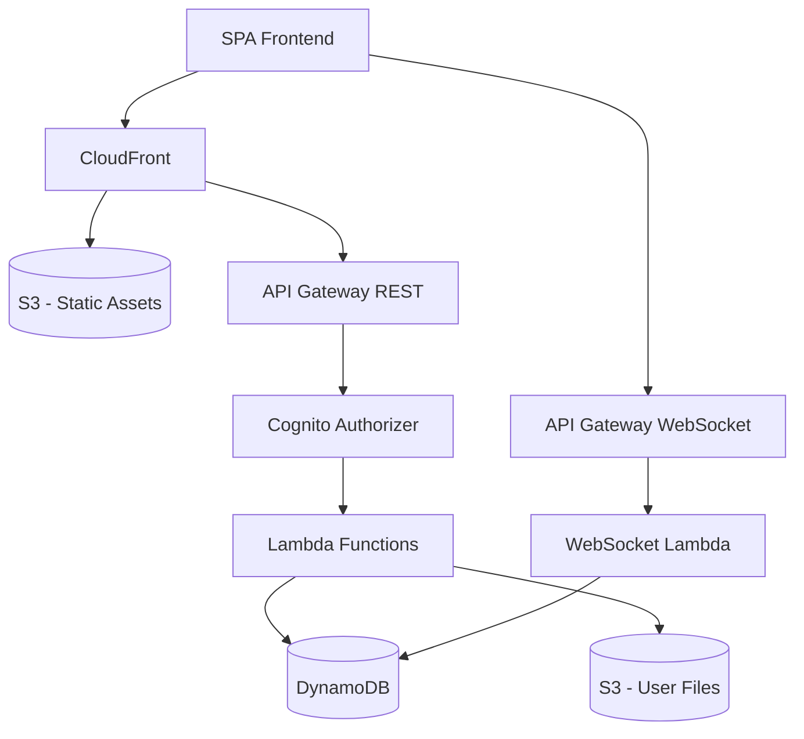

# How to Build a Single-Page Application (SPA) Backend on AWS

Author: [nawazdhandala](https://github.com/nawazdhandala)

Tags: AWS, SPA, API Gateway, Lambda, Cognito

Description: Build a complete backend for single-page applications on AWS with API Gateway, Lambda, Cognito authentication, DynamoDB, S3 file uploads, and WebSocket support.

---

Single-page applications need a backend that handles authentication, data storage, file uploads, and real-time updates. The frontend takes care of rendering, but it still needs a solid API behind it. AWS provides a fully serverless backend stack that pairs perfectly with SPAs built in React, Vue, Angular, or any other frontend framework. Let's build the complete backend infrastructure.

## Architecture

Here's what the full SPA backend looks like:



The SPA is served from S3 through CloudFront, APIs go through API Gateway to Lambda, authentication is handled by Cognito, and DynamoDB stores the application data.

## Authentication with Cognito

Every SPA needs authentication. Cognito handles user registration, login, password reset, and JWT token management.

Create the Cognito User Pool and app client:

```bash
# Create the user pool
aws cognito-idp create-user-pool \
  --pool-name spa-backend-users \
  --auto-verified-attributes email \
  --username-attributes email \
  --policies '{
    "PasswordPolicy": {
      "MinimumLength": 10,
      "RequireUppercase": true,
      "RequireLowercase": true,
      "RequireNumbers": true,
      "RequireSymbols": false
    }
  }' \
  --account-recovery-setting '{
    "RecoveryMechanisms": [{"Priority": 1, "Name": "verified_email"}]
  }'

# Create an app client (no secret for SPA clients)
aws cognito-idp create-user-pool-client \
  --user-pool-id YOUR_POOL_ID \
  --client-name spa-frontend \
  --no-generate-secret \
  --explicit-auth-flows ALLOW_USER_SRP_AUTH ALLOW_REFRESH_TOKEN_AUTH \
  --supported-identity-providers COGNITO \
  --allowed-o-auth-flows code \
  --allowed-o-auth-scopes openid email profile \
  --callback-urls '["http://localhost:3000/callback","https://yourapp.com/callback"]' \
  --logout-urls '["http://localhost:3000","https://yourapp.com"]'
```

Integrate Cognito in your SPA frontend:

```javascript
// auth/cognito.js
import {
  CognitoUserPool,
  CognitoUser,
  AuthenticationDetails,
} from 'amazon-cognito-identity-js';

const poolData = {
  UserPoolId: process.env.REACT_APP_USER_POOL_ID,
  ClientId: process.env.REACT_APP_CLIENT_ID,
};

const userPool = new CognitoUserPool(poolData);

export function signUp(email, password) {
  return new Promise((resolve, reject) => {
    userPool.signUp(email, password, [], null, (err, result) => {
      if (err) return reject(err);
      resolve(result.user);
    });
  });
}

export function signIn(email, password) {
  const user = new CognitoUser({ Username: email, Pool: userPool });
  const authDetails = new AuthenticationDetails({
    Username: email,
    Password: password,
  });

  return new Promise((resolve, reject) => {
    user.authenticateUser(authDetails, {
      onSuccess: (session) => {
        resolve({
          idToken: session.getIdToken().getJwtToken(),
          accessToken: session.getAccessToken().getJwtToken(),
          refreshToken: session.getRefreshToken().getToken(),
        });
      },
      onFailure: (err) => reject(err),
    });
  });
}

export function getCurrentSession() {
  const user = userPool.getCurrentUser();
  if (!user) return Promise.reject(new Error('No user'));

  return new Promise((resolve, reject) => {
    user.getSession((err, session) => {
      if (err) return reject(err);
      if (!session.isValid()) return reject(new Error('Session expired'));
      resolve({
        idToken: session.getIdToken().getJwtToken(),
        user: session.getIdToken().payload,
      });
    });
  });
}

export function signOut() {
  const user = userPool.getCurrentUser();
  if (user) user.signOut();
}
```

## API Gateway with JWT Authorizer

Create an HTTP API with Cognito-based authorization:

```bash
# Create the HTTP API
aws apigatewayv2 create-api \
  --name spa-backend-api \
  --protocol-type HTTP \
  --cors-configuration '{
    "AllowOrigins": ["http://localhost:3000", "https://yourapp.com"],
    "AllowMethods": ["GET", "POST", "PUT", "DELETE", "OPTIONS"],
    "AllowHeaders": ["Content-Type", "Authorization"],
    "MaxAge": 86400
  }'

# Create a JWT authorizer
aws apigatewayv2 create-authorizer \
  --api-id YOUR_API_ID \
  --authorizer-type JWT \
  --name cognito-auth \
  --identity-source '$request.header.Authorization' \
  --jwt-configuration '{
    "Audience": ["YOUR_CLIENT_ID"],
    "Issuer": "https://cognito-idp.us-east-1.amazonaws.com/YOUR_POOL_ID"
  }'
```

## Lambda API Functions

Create the backend API handlers. Here's a complete CRUD implementation:

```javascript
// handlers/items.js
const { DynamoDBClient } = require('@aws-sdk/client-dynamodb');
const {
  DynamoDBDocumentClient,
  GetCommand,
  PutCommand,
  QueryCommand,
  UpdateCommand,
  DeleteCommand,
} = require('@aws-sdk/lib-dynamodb');
const { v4: uuidv4 } = require('uuid');

const docClient = DynamoDBDocumentClient.from(new DynamoDBClient({}));
const TABLE = process.env.ITEMS_TABLE;

// Helper to extract user ID from the JWT claims
function getUserId(event) {
  return event.requestContext?.authorizer?.jwt?.claims?.sub;
}

// Helper to format responses
function respond(statusCode, body) {
  return {
    statusCode,
    headers: {
      'Content-Type': 'application/json',
      'Access-Control-Allow-Origin': '*',
    },
    body: JSON.stringify(body),
  };
}

// GET /items - list items for the authenticated user
module.exports.list = async (event) => {
  const userId = getUserId(event);
  const limit = parseInt(event.queryStringParameters?.limit || '20');

  try {
    const result = await docClient.send(new QueryCommand({
      TableName: TABLE,
      KeyConditionExpression: 'userId = :userId',
      ExpressionAttributeValues: { ':userId': userId },
      Limit: limit,
      ScanIndexForward: false, // newest first
    }));

    return respond(200, {
      data: result.Items,
      count: result.Count,
    });
  } catch (err) {
    console.error('List error:', err);
    return respond(500, { error: 'Failed to list items' });
  }
};

// POST /items - create a new item
module.exports.create = async (event) => {
  const userId = getUserId(event);
  const body = JSON.parse(event.body || '{}');

  if (!body.title) {
    return respond(400, { error: 'Title is required' });
  }

  const item = {
    userId,
    itemId: uuidv4(),
    title: body.title,
    description: body.description || '',
    status: 'active',
    createdAt: new Date().toISOString(),
    updatedAt: new Date().toISOString(),
  };

  try {
    await docClient.send(new PutCommand({
      TableName: TABLE,
      Item: item,
    }));

    return respond(201, { data: item });
  } catch (err) {
    console.error('Create error:', err);
    return respond(500, { error: 'Failed to create item' });
  }
};

// GET /items/{id} - get a single item
module.exports.get = async (event) => {
  const userId = getUserId(event);
  const { id } = event.pathParameters;

  try {
    const result = await docClient.send(new GetCommand({
      TableName: TABLE,
      Key: { userId, itemId: id },
    }));

    if (!result.Item) {
      return respond(404, { error: 'Item not found' });
    }

    return respond(200, { data: result.Item });
  } catch (err) {
    console.error('Get error:', err);
    return respond(500, { error: 'Failed to get item' });
  }
};

// PUT /items/{id} - update an item
module.exports.update = async (event) => {
  const userId = getUserId(event);
  const { id } = event.pathParameters;
  const body = JSON.parse(event.body || '{}');

  try {
    const result = await docClient.send(new UpdateCommand({
      TableName: TABLE,
      Key: { userId, itemId: id },
      UpdateExpression: 'SET title = :title, description = :desc, updatedAt = :now',
      ExpressionAttributeValues: {
        ':title': body.title,
        ':desc': body.description || '',
        ':now': new Date().toISOString(),
      },
      ConditionExpression: 'attribute_exists(userId)',
      ReturnValues: 'ALL_NEW',
    }));

    return respond(200, { data: result.Attributes });
  } catch (err) {
    if (err.name === 'ConditionalCheckFailedException') {
      return respond(404, { error: 'Item not found' });
    }
    console.error('Update error:', err);
    return respond(500, { error: 'Failed to update item' });
  }
};

// DELETE /items/{id} - delete an item
module.exports.remove = async (event) => {
  const userId = getUserId(event);
  const { id } = event.pathParameters;

  try {
    await docClient.send(new DeleteCommand({
      TableName: TABLE,
      Key: { userId, itemId: id },
      ConditionExpression: 'attribute_exists(userId)',
    }));

    return respond(200, { message: 'Item deleted' });
  } catch (err) {
    if (err.name === 'ConditionalCheckFailedException') {
      return respond(404, { error: 'Item not found' });
    }
    console.error('Delete error:', err);
    return respond(500, { error: 'Failed to delete item' });
  }
};
```

## File Uploads with Pre-Signed URLs

SPAs often need file upload capabilities. Use pre-signed S3 URLs so the frontend uploads directly to S3 without going through your API:

```javascript
// handlers/uploads.js
const { S3Client, PutObjectCommand } = require('@aws-sdk/client-s3');
const { getSignedUrl } = require('@aws-sdk/s3-request-presigner');
const { v4: uuidv4 } = require('uuid');

const s3 = new S3Client({});
const BUCKET = process.env.UPLOADS_BUCKET;

module.exports.getUploadUrl = async (event) => {
  const userId = event.requestContext?.authorizer?.jwt?.claims?.sub;
  const { filename, contentType } = JSON.parse(event.body);

  if (!filename || !contentType) {
    return {
      statusCode: 400,
      body: JSON.stringify({ error: 'filename and contentType required' }),
    };
  }

  // Generate a unique key with the user's ID prefix for isolation
  const extension = filename.split('.').pop();
  const key = `uploads/${userId}/${uuidv4()}.${extension}`;

  const command = new PutObjectCommand({
    Bucket: BUCKET,
    Key: key,
    ContentType: contentType,
    Metadata: { userId, originalFilename: filename },
  });

  // URL expires in 15 minutes
  const uploadUrl = await getSignedUrl(s3, command, { expiresIn: 900 });

  return {
    statusCode: 200,
    headers: {
      'Content-Type': 'application/json',
      'Access-Control-Allow-Origin': '*',
    },
    body: JSON.stringify({
      uploadUrl,
      key,
      expiresIn: 900,
    }),
  };
};
```

Use the pre-signed URL in your SPA:

```javascript
// Frontend upload helper
async function uploadFile(file) {
  // Get a pre-signed URL from your API
  const response = await fetch('/api/uploads', {
    method: 'POST',
    headers: {
      'Content-Type': 'application/json',
      'Authorization': `Bearer ${idToken}`,
    },
    body: JSON.stringify({
      filename: file.name,
      contentType: file.type,
    }),
  });

  const { uploadUrl, key } = await response.json();

  // Upload directly to S3 using the pre-signed URL
  await fetch(uploadUrl, {
    method: 'PUT',
    headers: { 'Content-Type': file.type },
    body: file,
  });

  return key;
}
```

## WebSocket Support for Real-Time Updates

API Gateway supports WebSocket APIs for real-time communication:

```javascript
// handlers/websocket.js
const { DynamoDBDocumentClient, PutCommand, DeleteCommand, ScanCommand } = require('@aws-sdk/lib-dynamodb');
const { ApiGatewayManagementApiClient, PostToConnectionCommand } = require('@aws-sdk/client-apigatewaymanagementapi');

const docClient = DynamoDBDocumentClient.from(/* ... */);
const CONNECTIONS_TABLE = process.env.CONNECTIONS_TABLE;

// Handle new WebSocket connections
module.exports.connect = async (event) => {
  const connectionId = event.requestContext.connectionId;
  const userId = event.requestContext.authorizer?.principalId;

  await docClient.send(new PutCommand({
    TableName: CONNECTIONS_TABLE,
    Item: {
      connectionId,
      userId,
      connectedAt: new Date().toISOString(),
    },
  }));

  return { statusCode: 200, body: 'Connected' };
};

// Handle disconnections
module.exports.disconnect = async (event) => {
  const connectionId = event.requestContext.connectionId;

  await docClient.send(new DeleteCommand({
    TableName: CONNECTIONS_TABLE,
    Key: { connectionId },
  }));

  return { statusCode: 200, body: 'Disconnected' };
};

// Broadcast a message to all connected clients
async function broadcast(apiUrl, message) {
  const api = new ApiGatewayManagementApiClient({ endpoint: apiUrl });
  const result = await docClient.send(new ScanCommand({
    TableName: CONNECTIONS_TABLE,
  }));

  const promises = result.Items.map(async (connection) => {
    try {
      await api.send(new PostToConnectionCommand({
        ConnectionId: connection.connectionId,
        Data: JSON.stringify(message),
      }));
    } catch (err) {
      if (err.statusCode === 410) {
        // Connection is stale, clean it up
        await docClient.send(new DeleteCommand({
          TableName: CONNECTIONS_TABLE,
          Key: { connectionId: connection.connectionId },
        }));
      }
    }
  });

  await Promise.all(promises);
}
```

## Frontend API Client

Create a typed API client for your SPA:

```javascript
// api/client.js
const API_URL = process.env.REACT_APP_API_URL;

class ApiClient {
  constructor() {
    this.token = null;
  }

  setToken(token) {
    this.token = token;
  }

  async request(method, path, body = null) {
    const options = {
      method,
      headers: {
        'Content-Type': 'application/json',
      },
    };

    if (this.token) {
      options.headers.Authorization = `Bearer ${this.token}`;
    }

    if (body) {
      options.body = JSON.stringify(body);
    }

    const response = await fetch(`${API_URL}${path}`, options);

    if (!response.ok) {
      const error = await response.json().catch(() => ({}));
      throw new Error(error.error || `API error: ${response.status}`);
    }

    if (response.status === 204) return null;
    return response.json();
  }

  // Item CRUD methods
  listItems(limit = 20) { return this.request('GET', `/items?limit=${limit}`); }
  getItem(id) { return this.request('GET', `/items/${id}`); }
  createItem(data) { return this.request('POST', '/items', data); }
  updateItem(id, data) { return this.request('PUT', `/items/${id}`, data); }
  deleteItem(id) { return this.request('DELETE', `/items/${id}`); }
}

export const api = new ApiClient();
```

## Monitoring

Track API latency, error rates, and Lambda execution metrics. For a complete SPA monitoring setup that includes frontend performance and backend health, check out [OneUptime](https://oneuptime.com/blog/post/2026-02-13-aws-monitoring-tools-comparison/view) for end-to-end observability.

## Summary

A serverless SPA backend on AWS gives you authentication, APIs, file storage, and real-time capabilities without managing any servers. Cognito handles auth, API Gateway routes requests, Lambda runs your logic, and DynamoDB stores your data. The whole thing scales automatically and costs nothing when idle. This architecture works for everything from side projects to production SaaS applications, and you can add features incrementally as your application grows. For the frontend hosting piece, check out our guide on [deploying React to S3 and CloudFront](https://oneuptime.com/blog/post/2026-02-12-deploy-react-app-to-aws-s3-and-cloudfront/view) or [building a static website with CI/CD](https://oneuptime.com/blog/post/2026-02-12-build-static-website-with-cicd-on-aws/view).
