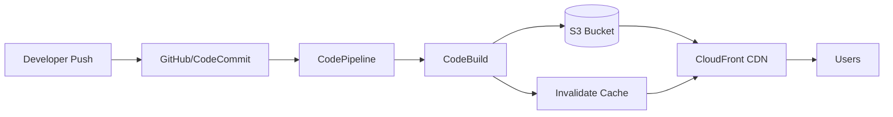

# How to Build a Static Website with CI/CD on AWS

Author: [nawazdhandala](https://github.com/nawazdhandala)

Tags: AWS, CI/CD, S3, CloudFront, CodePipeline

Description: Set up a complete static website hosting pipeline on AWS with S3, CloudFront, CodePipeline, and automated deployments triggered by Git pushes.

---

Static websites are the simplest thing to host, but setting up a proper deployment pipeline takes a bit of work. The end goal is push-to-deploy: you push code to your repository, and it automatically builds, tests, deploys to S3, and invalidates the CloudFront cache. No manual steps, no SSH, no FTP. Let's build this from scratch using AWS-native tools.

## Architecture



## Step 1: Set Up S3 and CloudFront

If you haven't set up static hosting yet, create the S3 bucket and CloudFront distribution.

Create a private S3 bucket:

```bash
# Create the bucket
aws s3 mb s3://my-website-production --region us-east-1

# Block public access
aws s3api put-public-access-block \
  --bucket my-website-production \
  --public-access-block-configuration \
    BlockPublicAcls=true,IgnorePublicAcls=true,BlockPublicPolicy=true,RestrictPublicBuckets=true
```

Create a CloudFront Origin Access Control and distribution:

```bash
# Create OAC
aws cloudfront create-origin-access-control \
  --origin-access-control-config '{
    "Name": "website-oac",
    "SigningProtocol": "sigv4",
    "SigningBehavior": "always",
    "OriginAccessControlOriginType": "s3"
  }'
```

Create the CloudFront distribution with SPA support (404/403 redirect to index.html):

```json
{
  "CallerReference": "website-dist",
  "Comment": "Static website with CI/CD",
  "DefaultCacheBehavior": {
    "TargetOriginId": "S3Origin",
    "ViewerProtocolPolicy": "redirect-to-https",
    "AllowedMethods": {"Quantity": 2, "Items": ["GET", "HEAD"]},
    "CachePolicyId": "658327ea-f89d-4fab-a63d-7e88639e58f6",
    "Compress": true
  },
  "Origins": {
    "Quantity": 1,
    "Items": [{
      "Id": "S3Origin",
      "DomainName": "my-website-production.s3.us-east-1.amazonaws.com",
      "S3OriginConfig": {"OriginAccessIdentity": ""},
      "OriginAccessControlId": "YOUR_OAC_ID"
    }]
  },
  "CustomErrorResponses": {
    "Quantity": 2,
    "Items": [
      {"ErrorCode": 403, "ResponseCode": 200, "ResponsePagePath": "/index.html", "ErrorCachingMinTTL": 0},
      {"ErrorCode": 404, "ResponseCode": 200, "ResponsePagePath": "/index.html", "ErrorCachingMinTTL": 0}
    ]
  },
  "DefaultRootObject": "index.html",
  "Enabled": true
}
```

Don't forget the S3 bucket policy that allows CloudFront to read objects:

```json
{
  "Version": "2012-10-17",
  "Statement": [{
    "Sid": "AllowCloudFront",
    "Effect": "Allow",
    "Principal": {"Service": "cloudfront.amazonaws.com"},
    "Action": "s3:GetObject",
    "Resource": "arn:aws:s3:::my-website-production/*",
    "Condition": {
      "StringEquals": {
        "AWS:SourceArn": "arn:aws:cloudfront::ACCOUNT_ID:distribution/DIST_ID"
      }
    }
  }]
}
```

## Step 2: CodeBuild Project

CodeBuild will build your static site. Create a `buildspec.yml` in your project root:

```yaml
# buildspec.yml
version: 0.2

env:
  variables:
    S3_BUCKET: "my-website-production"
    CLOUDFRONT_DIST_ID: "EXXXXXXXXXX"
    NODE_ENV: "production"

phases:
  install:
    runtime-versions:
      nodejs: 20
    commands:
      - echo "Installing dependencies..."
      - npm ci

  pre_build:
    commands:
      - echo "Running tests..."
      - npm test -- --passWithNoTests
      - echo "Running linter..."
      - npm run lint || true

  build:
    commands:
      - echo "Building static site..."
      - npm run build

  post_build:
    commands:
      - echo "Deploying to S3..."
      # Upload hashed assets with long cache
      - |
        aws s3 sync build/ s3://$S3_BUCKET \
          --delete \
          --cache-control "public, max-age=31536000, immutable" \
          --exclude "index.html" \
          --exclude "service-worker.js" \
          --exclude "manifest.json" \
          --exclude "*.map"
      # Upload HTML files with no cache
      - |
        aws s3 cp build/index.html s3://$S3_BUCKET/index.html \
          --cache-control "public, max-age=0, must-revalidate"
      # Invalidate CloudFront cache
      - |
        aws cloudfront create-invalidation \
          --distribution-id $CLOUDFRONT_DIST_ID \
          --paths "/index.html" "/manifest.json"
      - echo "Deployment complete!"

artifacts:
  files:
    - '**/*'
  base-directory: build

cache:
  paths:
    - node_modules/**/*
```

Create the CodeBuild project:

```bash
# Create an IAM role for CodeBuild
# (needs S3 write, CloudFront invalidation, and CloudWatch Logs)

aws codebuild create-project \
  --name static-website-build \
  --source '{
    "type": "GITHUB",
    "location": "https://github.com/youruser/your-website.git",
    "buildspec": "buildspec.yml"
  }' \
  --environment '{
    "type": "LINUX_CONTAINER",
    "computeType": "BUILD_GENERAL1_SMALL",
    "image": "aws/codebuild/amazonlinux2-x86_64-standard:5.0",
    "environmentVariables": [
      {"name": "S3_BUCKET", "value": "my-website-production"},
      {"name": "CLOUDFRONT_DIST_ID", "value": "EXXXXXXXXXX"}
    ]
  }' \
  --artifacts '{"type": "NO_ARTIFACTS"}' \
  --service-role arn:aws:iam::ACCOUNT_ID:role/codebuild-website-role \
  --cache '{"type": "LOCAL", "modes": ["LOCAL_SOURCE_CACHE", "LOCAL_CUSTOM_CACHE"]}'
```

## Step 3: CodePipeline

Create a pipeline that connects your repository to CodeBuild:

```bash
aws codepipeline create-pipeline --pipeline '{
  "name": "static-website-pipeline",
  "roleArn": "arn:aws:iam::ACCOUNT_ID:role/codepipeline-role",
  "stages": [
    {
      "name": "Source",
      "actions": [{
        "name": "SourceAction",
        "actionTypeId": {
          "category": "Source",
          "owner": "ThirdParty",
          "provider": "GitHub",
          "version": "1"
        },
        "configuration": {
          "Owner": "youruser",
          "Repo": "your-website",
          "Branch": "main",
          "OAuthToken": "YOUR_GITHUB_TOKEN"
        },
        "outputArtifacts": [{"name": "SourceOutput"}]
      }]
    },
    {
      "name": "Build",
      "actions": [{
        "name": "BuildAction",
        "actionTypeId": {
          "category": "Build",
          "owner": "AWS",
          "provider": "CodeBuild",
          "version": "1"
        },
        "configuration": {
          "ProjectName": "static-website-build"
        },
        "inputArtifacts": [{"name": "SourceOutput"}],
        "outputArtifacts": [{"name": "BuildOutput"}]
      }]
    }
  ],
  "artifactStore": {
    "type": "S3",
    "location": "my-pipeline-artifacts-bucket"
  }
}'
```

## Alternative: GitHub Actions

If you prefer GitHub Actions over CodePipeline, here's an equivalent workflow:

```yaml
# .github/workflows/deploy.yml
name: Deploy Static Website

on:
  push:
    branches: [main]

jobs:
  deploy:
    runs-on: ubuntu-latest
    steps:
      - uses: actions/checkout@v4

      - uses: actions/setup-node@v4
        with:
          node-version: '20'
          cache: 'npm'

      - name: Install dependencies
        run: npm ci

      - name: Run tests
        run: npm test -- --passWithNoTests

      - name: Build
        run: npm run build
        env:
          REACT_APP_API_URL: ${{ secrets.API_URL }}

      - name: Configure AWS credentials
        uses: aws-actions/configure-aws-credentials@v4
        with:
          aws-access-key-id: ${{ secrets.AWS_ACCESS_KEY_ID }}
          aws-secret-access-key: ${{ secrets.AWS_SECRET_ACCESS_KEY }}
          aws-region: us-east-1

      - name: Deploy to S3
        run: |
          aws s3 sync build/ s3://${{ secrets.S3_BUCKET }} \
            --delete \
            --cache-control "public, max-age=31536000, immutable" \
            --exclude "index.html" \
            --exclude "*.map"

          aws s3 cp build/index.html s3://${{ secrets.S3_BUCKET }}/index.html \
            --cache-control "public, max-age=0, must-revalidate"

      - name: Invalidate CloudFront
        run: |
          aws cloudfront create-invalidation \
            --distribution-id ${{ secrets.CF_DIST_ID }} \
            --paths "/index.html"
```

## Staging Environment

Set up a staging environment for previewing changes before production:

```bash
# Create staging bucket and distribution
aws s3 mb s3://my-website-staging

# Add a staging stage to your pipeline or create a separate pipeline
# for the 'staging' branch
```

Update your buildspec to handle multiple environments:

```yaml
# buildspec.yml with environment support
version: 0.2

env:
  variables:
    NODE_ENV: "production"

phases:
  install:
    runtime-versions:
      nodejs: 20
    commands:
      - npm ci

  build:
    commands:
      - npm run build

  post_build:
    commands:
      - |
        if [ "$DEPLOY_ENV" = "production" ]; then
          BUCKET="my-website-production"
          DIST_ID="EPROD_ID"
        else
          BUCKET="my-website-staging"
          DIST_ID="ESTAGING_ID"
        fi
      - aws s3 sync build/ s3://$BUCKET --delete --cache-control "public, max-age=31536000, immutable" --exclude "index.html"
      - aws s3 cp build/index.html s3://$BUCKET/index.html --cache-control "public, max-age=0, must-revalidate"
      - aws cloudfront create-invalidation --distribution-id $DIST_ID --paths "/index.html"
```

## Custom Domain and SSL

Add your custom domain with an ACM certificate:

```bash
# Request certificate (must be in us-east-1 for CloudFront)
aws acm request-certificate \
  --domain-name www.yourdomain.com \
  --subject-alternative-names yourdomain.com \
  --validation-method DNS \
  --region us-east-1

# After DNS validation, update your CloudFront distribution
# with the certificate ARN and custom domain names
```

## Monitoring

Track deployment success rates, build times, and website availability:

```bash
# Set up a CloudWatch alarm for 5xx errors on CloudFront
aws cloudwatch put-metric-alarm \
  --alarm-name "website-5xx-errors" \
  --metric-name 5xxErrorRate \
  --namespace AWS/CloudFront \
  --statistic Average \
  --period 300 \
  --threshold 5 \
  --comparison-operator GreaterThanThreshold \
  --dimensions Name=DistributionId,Value=YOUR_DIST_ID \
  --evaluation-periods 2 \
  --alarm-actions arn:aws:sns:us-east-1:ACCOUNT_ID:alerts
```

For comprehensive website monitoring including uptime checks and performance tracking, check out [OneUptime](https://oneuptime.com/blog/post/2026-02-13-aws-monitoring-tools-comparison/view).

## Summary

A static website with CI/CD on AWS gives you the best of both worlds: incredibly cheap and fast hosting through S3 and CloudFront, plus fully automated deployments. Whether you use CodePipeline or GitHub Actions for the CI/CD part, the key components are the same - build the site, sync to S3 with proper cache headers, and invalidate CloudFront. The whole setup takes about an hour, and after that, deploying changes is as simple as pushing to main.
