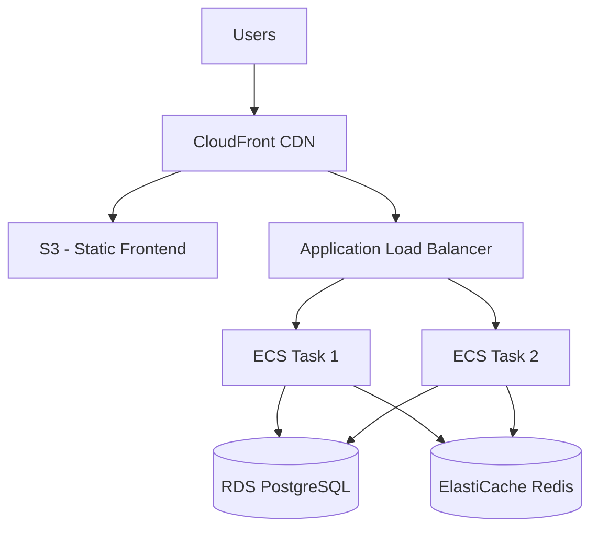

# How to Build a Three-Tier Web Application on AWS

Author: [nawazdhandala](https://github.com/nawazdhandala)

Tags: AWS, Architecture, VPC, ECS, RDS

Description: Design and deploy a three-tier web application on AWS with a presentation layer, application layer, and data layer using VPC, ALB, ECS, and RDS.

---

The three-tier architecture is one of the most proven patterns for building web applications. You've got a presentation tier (frontend), an application tier (backend logic), and a data tier (database). Each tier runs independently, scales independently, and can be updated independently. AWS provides all the building blocks to implement this cleanly.

Let's build a production-ready three-tier application from the ground up.

## Architecture Overview

Here's what we're building:



- **Presentation Tier**: React/Vue frontend hosted on S3 + CloudFront
- **Application Tier**: Node.js/Python API on ECS Fargate behind an ALB
- **Data Tier**: RDS PostgreSQL + ElastiCache Redis in private subnets

## Tier 1: Networking Foundation

Everything starts with a properly designed VPC. We need public subnets for the load balancer, private subnets for the application, and isolated subnets for the database.

Create the VPC with proper subnet separation:

```yaml
# vpc.yml - CloudFormation template
AWSTemplateFormatVersion: '2010-09-09'
Description: Three-tier VPC architecture

Parameters:
  Environment:
    Type: String
    Default: production

Resources:
  VPC:
    Type: AWS::EC2::VPC
    Properties:
      CidrBlock: 10.0.0.0/16
      EnableDnsHostnames: true
      EnableDnsSupport: true
      Tags:
        - Key: Name
          Value: !Sub '${Environment}-vpc'

  # Public subnets - for ALB
  PublicSubnetA:
    Type: AWS::EC2::Subnet
    Properties:
      VpcId: !Ref VPC
      CidrBlock: 10.0.1.0/24
      AvailabilityZone: !Select [0, !GetAZs '']
      MapPublicIpOnLaunch: true
      Tags:
        - Key: Name
          Value: !Sub '${Environment}-public-a'

  PublicSubnetB:
    Type: AWS::EC2::Subnet
    Properties:
      VpcId: !Ref VPC
      CidrBlock: 10.0.2.0/24
      AvailabilityZone: !Select [1, !GetAZs '']
      MapPublicIpOnLaunch: true
      Tags:
        - Key: Name
          Value: !Sub '${Environment}-public-b'

  # Private subnets - for application tier (ECS)
  PrivateSubnetA:
    Type: AWS::EC2::Subnet
    Properties:
      VpcId: !Ref VPC
      CidrBlock: 10.0.10.0/24
      AvailabilityZone: !Select [0, !GetAZs '']
      Tags:
        - Key: Name
          Value: !Sub '${Environment}-private-a'

  PrivateSubnetB:
    Type: AWS::EC2::Subnet
    Properties:
      VpcId: !Ref VPC
      CidrBlock: 10.0.11.0/24
      AvailabilityZone: !Select [1, !GetAZs '']
      Tags:
        - Key: Name
          Value: !Sub '${Environment}-private-b'

  # Isolated subnets - for data tier (RDS)
  DataSubnetA:
    Type: AWS::EC2::Subnet
    Properties:
      VpcId: !Ref VPC
      CidrBlock: 10.0.20.0/24
      AvailabilityZone: !Select [0, !GetAZs '']
      Tags:
        - Key: Name
          Value: !Sub '${Environment}-data-a'

  DataSubnetB:
    Type: AWS::EC2::Subnet
    Properties:
      VpcId: !Ref VPC
      CidrBlock: 10.0.21.0/24
      AvailabilityZone: !Select [1, !GetAZs '']
      Tags:
        - Key: Name
          Value: !Sub '${Environment}-data-b'

  # Internet Gateway for public subnets
  InternetGateway:
    Type: AWS::EC2::InternetGateway

  GatewayAttachment:
    Type: AWS::EC2::VPCGatewayAttachment
    Properties:
      VpcId: !Ref VPC
      InternetGatewayId: !Ref InternetGateway

  # NAT Gateway for private subnets
  NatEIP:
    Type: AWS::EC2::EIP
    Properties:
      Domain: vpc

  NatGateway:
    Type: AWS::EC2::NatGateway
    Properties:
      AllocationId: !GetAtt NatEIP.AllocationId
      SubnetId: !Ref PublicSubnetA
```

## Tier 2: Presentation Layer

The frontend is a static SPA (React, Vue, etc.) served from S3 through CloudFront.

Deploy the frontend:

```bash
# Create S3 bucket for the frontend
aws s3 mb s3://my-app-frontend-production

# Build and upload the React/Vue app
npm run build
aws s3 sync build/ s3://my-app-frontend-production \
  --delete \
  --cache-control "public, max-age=31536000, immutable" \
  --exclude "index.html"

aws s3 cp build/index.html s3://my-app-frontend-production/index.html \
  --cache-control "public, max-age=0, must-revalidate"
```

The frontend communicates with the application tier through the ALB. Configure your frontend to point API calls to the ALB's domain or a custom API subdomain.

For more details on the static hosting part, check out our guide on [deploying React to S3 and CloudFront](https://oneuptime.com/blog/post/2026-02-12-deploy-react-app-to-aws-s3-and-cloudfront/view).

## Tier 3: Application Layer

The application tier runs on ECS Fargate behind an Application Load Balancer.

Create security groups that enforce tier separation:

```bash
# ALB security group - accepts traffic from the internet
aws ec2 create-security-group \
  --group-name alb-sg \
  --description "ALB security group" \
  --vpc-id vpc-xxx

aws ec2 authorize-security-group-ingress \
  --group-id sg-ALB \
  --protocol tcp --port 443 --cidr 0.0.0.0/0

# Application security group - only accepts traffic from the ALB
aws ec2 create-security-group \
  --group-name app-sg \
  --description "Application tier security group" \
  --vpc-id vpc-xxx

aws ec2 authorize-security-group-ingress \
  --group-id sg-APP \
  --protocol tcp --port 8080 --source-group sg-ALB

# Database security group - only accepts traffic from the app tier
aws ec2 create-security-group \
  --group-name data-sg \
  --description "Data tier security group" \
  --vpc-id vpc-xxx

aws ec2 authorize-security-group-ingress \
  --group-id sg-DATA \
  --protocol tcp --port 5432 --source-group sg-APP

aws ec2 authorize-security-group-ingress \
  --group-id sg-DATA \
  --protocol tcp --port 6379 --source-group sg-APP
```

Deploy the application to ECS:

```json
{
  "family": "app-tier",
  "networkMode": "awsvpc",
  "requiresCompatibilities": ["FARGATE"],
  "cpu": "512",
  "memory": "1024",
  "containerDefinitions": [
    {
      "name": "api",
      "image": "ACCOUNT_ID.dkr.ecr.us-east-1.amazonaws.com/my-api:latest",
      "portMappings": [{"containerPort": 8080}],
      "environment": [
        {"name": "NODE_ENV", "value": "production"},
        {"name": "PORT", "value": "8080"}
      ],
      "secrets": [
        {"name": "DATABASE_URL", "valueFrom": "arn:aws:ssm:us-east-1:ACCOUNT_ID:parameter/app/db-url"},
        {"name": "REDIS_URL", "valueFrom": "arn:aws:ssm:us-east-1:ACCOUNT_ID:parameter/app/redis-url"}
      ],
      "logConfiguration": {
        "logDriver": "awslogs",
        "options": {
          "awslogs-group": "/ecs/app-tier",
          "awslogs-region": "us-east-1",
          "awslogs-stream-prefix": "api"
        }
      },
      "healthCheck": {
        "command": ["CMD-SHELL", "curl -f http://localhost:8080/health || exit 1"],
        "interval": 30,
        "timeout": 5,
        "retries": 3
      }
    }
  ]
}
```

## Tier 4: Data Layer

Set up RDS and ElastiCache in the isolated subnets.

Create the database subnet group and RDS instance:

```bash
# Create a DB subnet group
aws rds create-db-subnet-group \
  --db-subnet-group-name data-subnets \
  --db-subnet-group-description "Subnets for database tier" \
  --subnet-ids subnet-DATA-A subnet-DATA-B

# Create the RDS PostgreSQL instance
aws rds create-db-instance \
  --db-instance-identifier app-production-db \
  --db-instance-class db.t3.medium \
  --engine postgres \
  --engine-version 15 \
  --master-username appuser \
  --master-user-password YOUR_SECURE_PASSWORD \
  --allocated-storage 100 \
  --storage-type gp3 \
  --multi-az \
  --vpc-security-group-ids sg-DATA \
  --db-subnet-group-name data-subnets \
  --backup-retention-period 7 \
  --storage-encrypted \
  --deletion-protection
```

Create ElastiCache for session storage and caching:

```bash
# Create cache subnet group
aws elasticache create-cache-subnet-group \
  --cache-subnet-group-name data-cache-subnets \
  --cache-subnet-group-description "Subnets for cache tier" \
  --subnet-ids subnet-DATA-A subnet-DATA-B

# Create Redis cluster
aws elasticache create-replication-group \
  --replication-group-id app-cache \
  --replication-group-description "Application cache" \
  --engine redis \
  --cache-node-type cache.t3.micro \
  --num-cache-clusters 2 \
  --cache-subnet-group-name data-cache-subnets \
  --security-group-ids sg-DATA \
  --at-rest-encryption-enabled \
  --transit-encryption-enabled
```

## Auto-Scaling

Configure auto-scaling for the application tier:

```bash
# Register scalable target
aws application-autoscaling register-scalable-target \
  --service-namespace ecs \
  --resource-id service/my-cluster/app-service \
  --scalable-dimension ecs:service:DesiredCount \
  --min-capacity 2 \
  --max-capacity 20

# Scale on CPU utilization
aws application-autoscaling put-scaling-policy \
  --service-namespace ecs \
  --resource-id service/my-cluster/app-service \
  --scalable-dimension ecs:service:DesiredCount \
  --policy-name cpu-scaling \
  --policy-type TargetTrackingScaling \
  --target-tracking-scaling-policy-configuration '{
    "TargetValue": 70.0,
    "PredefinedMetricSpecification": {
      "PredefinedMetricType": "ECSServiceAverageCPUUtilization"
    }
  }'
```

## Monitoring

Each tier needs its own monitoring. Set up CloudWatch dashboards and alarms for:

- **Presentation**: CloudFront error rates and cache hit ratios
- **Application**: ECS CPU/memory, ALB response times, 5xx error rates
- **Data**: RDS connections, query latency, replication lag, Redis memory usage

For comprehensive monitoring across all three tiers, consider using [OneUptime](https://oneuptime.com/blog/post/aws-monitoring-tools-comparison/view) for unified observability and incident management.

## Summary

The three-tier architecture on AWS gives you a clear separation of concerns with independent scaling and security boundaries between each layer. The key principles are: keep tiers isolated with security groups, use private subnets for application and data layers, enable multi-AZ for high availability, and monitor each tier independently. This pattern scales from small applications to enterprise workloads, and the infrastructure can evolve as your needs change.
