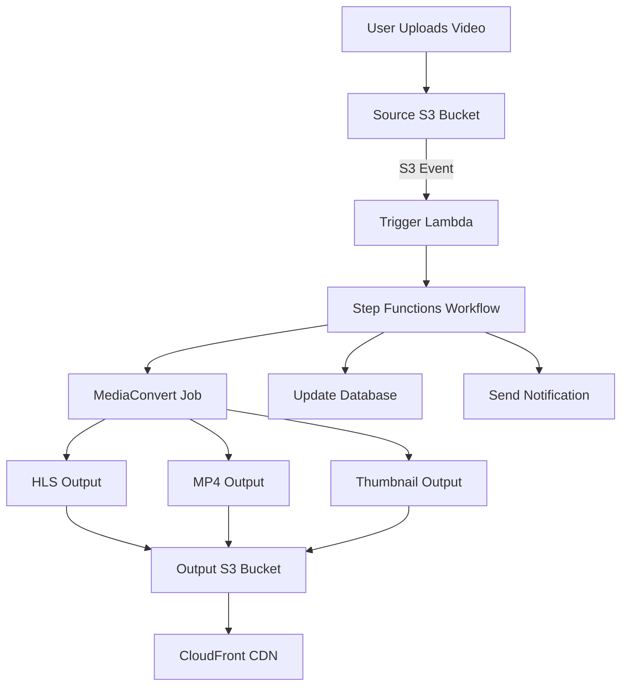

# How to Build a Video Processing Pipeline on AWS

Author: [nawazdhandala](https://github.com/nawazdhandala)

Tags: AWS, MediaConvert, S3, Lambda, Video Processing

Description: Build a scalable video processing pipeline on AWS using MediaConvert, S3, Lambda, and Step Functions to transcode, thumbnail, and deliver video content.

---

Video is the heaviest workload most applications deal with. A single uploaded video might need to be transcoded to multiple formats, have thumbnails generated, get quality-checked, and eventually served through a CDN. Doing this on your own infrastructure is a nightmare. AWS has purpose-built services that make it manageable.

Let's build a production-ready video processing pipeline using S3, Lambda, AWS Elemental MediaConvert, and Step Functions.

## Architecture Overview



## Setting Up MediaConvert

AWS Elemental MediaConvert is the core service here. It handles transcoding - converting video from one format and resolution to another. You submit jobs, and MediaConvert runs them on managed infrastructure.

First, you need a MediaConvert IAM role that lets the service access your S3 buckets.

```typescript
// CDK setup for MediaConvert role and buckets
import * as cdk from 'aws-cdk-lib';
import * as iam from 'aws-cdk-lib/aws-iam';
import * as s3 from 'aws-cdk-lib/aws-s3';

export class VideoPipelineStack extends cdk.Stack {
  constructor(scope: cdk.App, id: string) {
    super(scope, id);

    const sourceBucket = new s3.Bucket(this, 'VideoSourceBucket');
    const outputBucket = new s3.Bucket(this, 'VideoOutputBucket');

    // IAM role that MediaConvert uses to read/write S3
    const mediaConvertRole = new iam.Role(this, 'MediaConvertRole', {
      assumedBy: new iam.ServicePrincipal('mediaconvert.amazonaws.com'),
    });

    sourceBucket.grantRead(mediaConvertRole);
    outputBucket.grantWrite(mediaConvertRole);
  }
}
```

## The Trigger Lambda

When a video lands in S3, a Lambda function kicks off the processing workflow.

```javascript
// lambda/trigger.js
const { SFNClient, StartExecutionCommand } = require('@aws-sdk/client-sfn');

const sfnClient = new SFNClient({});

exports.handler = async (event) => {
  const record = event.Records[0];
  const bucket = record.s3.bucket.name;
  const key = decodeURIComponent(record.s3.object.key.replace(/\+/g, ' '));
  const size = record.s3.object.size;

  console.log(`New video uploaded: s3://${bucket}/${key} (${(size / 1024 / 1024).toFixed(1)} MB)`);

  // Extract metadata from the key (assumes uploads/user-id/filename.mp4)
  const parts = key.split('/');
  const userId = parts[1];
  const fileName = parts[parts.length - 1];
  const jobId = `${Date.now()}-${fileName.replace(/[^a-zA-Z0-9]/g, '-')}`;

  // Start the Step Functions workflow
  await sfnClient.send(new StartExecutionCommand({
    stateMachineArn: process.env.STATE_MACHINE_ARN,
    name: jobId,
    input: JSON.stringify({
      sourceBucket: bucket,
      sourceKey: key,
      userId,
      fileName,
      jobId,
    }),
  }));

  return { statusCode: 200, jobId };
};
```

## Submitting MediaConvert Jobs

The main processing step creates a MediaConvert job that transcodes the video into multiple formats.

```javascript
// lambda/transcode.js
const { MediaConvertClient, CreateJobCommand, DescribeEndpointsCommand } = require('@aws-sdk/client-mediaconvert');

let endpoint = null;

// MediaConvert requires a customer-specific endpoint
async function getEndpoint() {
  if (endpoint) return endpoint;
  const client = new MediaConvertClient({});
  const { Endpoints } = await client.send(new DescribeEndpointsCommand({}));
  endpoint = Endpoints[0].Url;
  return endpoint;
}

exports.handler = async (event) => {
  const { sourceBucket, sourceKey, jobId } = event;
  const mcEndpoint = await getEndpoint();
  const client = new MediaConvertClient({ endpoint: mcEndpoint });

  const inputPath = `s3://${sourceBucket}/${sourceKey}`;
  const outputPath = `s3://${process.env.OUTPUT_BUCKET}/processed/${jobId}/`;

  // Create the transcoding job
  const jobParams = {
    Role: process.env.MEDIACONVERT_ROLE_ARN,
    Settings: {
      Inputs: [{
        FileInput: inputPath,
        AudioSelectors: {
          'Audio Selector 1': { DefaultSelection: 'DEFAULT' },
        },
        VideoSelector: {},
      }],
      OutputGroups: [
        // HLS for adaptive streaming
        {
          Name: 'HLS',
          OutputGroupSettings: {
            Type: 'HLS_GROUP_SETTINGS',
            HlsGroupSettings: {
              Destination: `${outputPath}hls/`,
              SegmentLength: 6,
              MinSegmentLength: 2,
            },
          },
          Outputs: [
            // 1080p variant
            {
              VideoDescription: {
                Width: 1920,
                Height: 1080,
                CodecSettings: {
                  Codec: 'H_264',
                  H264Settings: {
                    RateControlMode: 'QVBR',
                    QvbrSettings: { QvbrQualityLevel: 8 },
                    MaxBitrate: 5000000,
                  },
                },
              },
              AudioDescriptions: [{
                CodecSettings: {
                  Codec: 'AAC',
                  AacSettings: { Bitrate: 128000, SampleRate: 48000 },
                },
              }],
              NameModifier: '_1080p',
            },
            // 720p variant
            {
              VideoDescription: {
                Width: 1280,
                Height: 720,
                CodecSettings: {
                  Codec: 'H_264',
                  H264Settings: {
                    RateControlMode: 'QVBR',
                    QvbrSettings: { QvbrQualityLevel: 7 },
                    MaxBitrate: 3000000,
                  },
                },
              },
              AudioDescriptions: [{
                CodecSettings: {
                  Codec: 'AAC',
                  AacSettings: { Bitrate: 96000, SampleRate: 48000 },
                },
              }],
              NameModifier: '_720p',
            },
          ],
        },
        // Thumbnail generation
        {
          Name: 'Thumbnails',
          OutputGroupSettings: {
            Type: 'FILE_GROUP_SETTINGS',
            FileGroupSettings: {
              Destination: `${outputPath}thumbnails/`,
            },
          },
          Outputs: [{
            ContainerSettings: { Container: 'RAW' },
            VideoDescription: {
              Width: 640,
              Height: 360,
              CodecSettings: {
                Codec: 'FRAME_CAPTURE',
                FrameCaptureSettings: {
                  FramerateNumerator: 1,
                  FramerateDenominator: 10, // Capture a frame every 10 seconds
                  MaxCaptures: 10,
                  Quality: 80,
                },
              },
            },
          }],
        },
      ],
    },
  };

  const response = await client.send(new CreateJobCommand(jobParams));

  return {
    ...event,
    mediaConvertJobId: response.Job.Id,
    outputPath,
  };
};
```

## Monitoring Job Progress

MediaConvert jobs are asynchronous. Use CloudWatch Events (EventBridge) to track when they complete.

```javascript
// lambda/job-complete.js - Triggered by EventBridge when MediaConvert finishes
exports.handler = async (event) => {
  const detail = event.detail;
  const status = detail.status;
  const jobId = detail.jobId;

  console.log(`MediaConvert job ${jobId} completed with status: ${status}`);

  if (status === 'COMPLETE') {
    const outputPaths = detail.outputGroupDetails.map(group => ({
      type: group.type,
      paths: group.outputDetails.map(d => d.outputFilePaths).flat(),
    }));

    return {
      status: 'SUCCESS',
      jobId,
      outputs: outputPaths,
    };
  }

  if (status === 'ERROR') {
    const errorMessage = detail.errorMessage || 'Unknown error';
    console.error(`Job failed: ${errorMessage}`);
    throw new Error(`MediaConvert job failed: ${errorMessage}`);
  }
};
```

## Serving Video with CloudFront

For HLS adaptive streaming, CloudFront needs to serve the manifest and segment files.

```typescript
// CloudFront distribution for video delivery
const distribution = new cloudfront.Distribution(this, 'VideoCDN', {
  defaultBehavior: {
    origin: new origins.S3Origin(outputBucket),
    viewerProtocolPolicy: cloudfront.ViewerProtocolPolicy.REDIRECT_TO_HTTPS,
    cachePolicy: new cloudfront.CachePolicy(this, 'VideoCachePolicy', {
      defaultTtl: cdk.Duration.days(30),
      maxTtl: cdk.Duration.days(365),
      enableAcceptEncodingGzip: true,
    }),
    responseHeadersPolicy: new cloudfront.ResponseHeadersPolicy(this, 'CorsPolicy', {
      corsBehavior: {
        accessControlAllowOrigins: ['*'],
        accessControlAllowMethods: ['GET', 'HEAD'],
        accessControlAllowHeaders: ['*'],
        originOverride: true,
      },
    }),
  },
});
```

## Cost Optimization

MediaConvert pricing is based on the duration of output video. A few ways to control costs:

- Use on-demand pricing for variable workloads, reserved for predictable ones
- Skip unnecessary output formats - don't generate 4K if nobody needs it
- Set quality-based variable bitrate (QVBR) instead of constant bitrate
- Use accelerated transcoding only for time-sensitive content

## Wrapping Up

A video processing pipeline on AWS combines S3 for storage, Lambda for orchestration, MediaConvert for the heavy transcoding work, and CloudFront for delivery. The event-driven approach means videos get processed automatically as they're uploaded, and MediaConvert's managed infrastructure means you don't have to think about encoding servers. For monitoring the health of your pipeline, consider setting up proper observability - our guide on [building a logging and monitoring stack on AWS](https://oneuptime.com/blog/post/build-logging-and-monitoring-stack-on-aws/view) can help with that.
