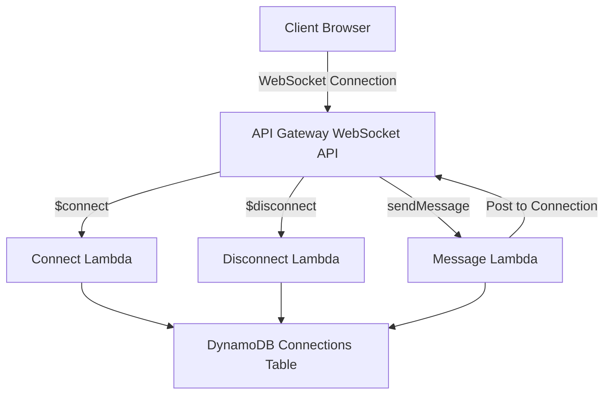

# How to Build a WebSocket Application on AWS

Author: [nawazdhandala](https://github.com/nawazdhandala)

Tags: AWS, WebSocket, API Gateway, Lambda, Serverless

Description: Learn how to build real-time WebSocket applications on AWS using API Gateway WebSocket APIs, Lambda functions, and DynamoDB for connection management.

---

Real-time communication is everywhere - chat apps, live dashboards, collaborative editors, stock tickers. If you've tried building these with traditional HTTP polling, you know it's a mess. WebSockets give you persistent, bidirectional connections, and AWS makes it surprisingly straightforward to run them at scale without managing servers.

In this guide, we'll build a complete WebSocket application on AWS using API Gateway's WebSocket API, Lambda for message handling, and DynamoDB for tracking connections.

## Why WebSockets on AWS?

HTTP request-response works fine for most things. But when you need the server to push data to clients without them asking for it, you need something better. Long polling wastes resources. Server-Sent Events only go one direction. WebSockets solve this by keeping a persistent connection open between client and server.

AWS API Gateway added WebSocket support a while back, and it's become a solid choice. You don't have to manage EC2 instances running a WebSocket server. API Gateway handles the connections, and Lambda runs your business logic on demand.

## Architecture Overview

Here's what we're building:



The flow is simple. When a client connects, API Gateway triggers the `$connect` route handler. We store the connection ID in DynamoDB. When messages come in, we look up all active connections and broadcast to them. On disconnect, we clean up.

## Setting Up the Infrastructure

Let's define the infrastructure with AWS CDK. If you prefer CloudFormation or Terraform, the concepts translate directly.

First, set up your CDK project and install the necessary packages.

```bash
# Initialize a new CDK project
mkdir websocket-app && cd websocket-app
cdk init app --language typescript
npm install @aws-cdk/aws-apigatewayv2 @aws-cdk/aws-lambda @aws-cdk/aws-dynamodb
```

Here's the CDK stack that creates the DynamoDB table and Lambda functions.

```typescript
// lib/websocket-stack.ts
import * as cdk from 'aws-cdk-lib';
import * as dynamodb from 'aws-cdk-lib/aws-dynamodb';
import * as lambda from 'aws-cdk-lib/aws-lambda';
import * as apigatewayv2 from 'aws-cdk-lib/aws-apigatewayv2';
import { WebSocketLambdaIntegration } from 'aws-cdk-lib/aws-apigatewayv2-integrations';

export class WebSocketStack extends cdk.Stack {
  constructor(scope: cdk.App, id: string) {
    super(scope, id);

    // DynamoDB table to track active connections
    const connectionsTable = new dynamodb.Table(this, 'ConnectionsTable', {
      partitionKey: { name: 'connectionId', type: dynamodb.AttributeType.STRING },
      removalPolicy: cdk.RemovalPolicy.DESTROY,
      billingMode: dynamodb.BillingMode.PAY_PER_REQUEST,
    });

    // Lambda for handling new connections
    const connectHandler = new lambda.Function(this, 'ConnectHandler', {
      runtime: lambda.Runtime.NODEJS_18_X,
      handler: 'connect.handler',
      code: lambda.Code.fromAsset('lambda'),
      environment: {
        TABLE_NAME: connectionsTable.tableName,
      },
    });

    // Lambda for handling disconnections
    const disconnectHandler = new lambda.Function(this, 'DisconnectHandler', {
      runtime: lambda.Runtime.NODEJS_18_X,
      handler: 'disconnect.handler',
      code: lambda.Code.fromAsset('lambda'),
      environment: {
        TABLE_NAME: connectionsTable.tableName,
      },
    });

    // Lambda for handling messages
    const messageHandler = new lambda.Function(this, 'MessageHandler', {
      runtime: lambda.Runtime.NODEJS_18_X,
      handler: 'message.handler',
      code: lambda.Code.fromAsset('lambda'),
      environment: {
        TABLE_NAME: connectionsTable.tableName,
      },
    });

    // Grant DynamoDB permissions
    connectionsTable.grantReadWriteData(connectHandler);
    connectionsTable.grantReadWriteData(disconnectHandler);
    connectionsTable.grantReadWriteData(messageHandler);

    // Create WebSocket API
    const webSocketApi = new apigatewayv2.WebSocketApi(this, 'WebSocketApi', {
      connectRouteOptions: {
        integration: new WebSocketLambdaIntegration('ConnectIntegration', connectHandler),
      },
      disconnectRouteOptions: {
        integration: new WebSocketLambdaIntegration('DisconnectIntegration', disconnectHandler),
      },
      defaultRouteOptions: {
        integration: new WebSocketLambdaIntegration('MessageIntegration', messageHandler),
      },
    });

    // Deploy the API to a stage
    const stage = new apigatewayv2.WebSocketStage(this, 'ProductionStage', {
      webSocketApi,
      stageName: 'production',
      autoDeploy: true,
    });

    // Grant the message handler permission to post back to connections
    webSocketApi.grantManageConnections(messageHandler);

    new cdk.CfnOutput(this, 'WebSocketURL', {
      value: stage.url,
    });
  }
}
```

## Writing the Lambda Handlers

Now let's write the three Lambda functions. The connect handler stores the connection ID when a client connects.

```javascript
// lambda/connect.js
const { DynamoDBClient, PutItemCommand } = require('@aws-sdk/client-dynamodb');

const client = new DynamoDBClient({});

exports.handler = async (event) => {
  const connectionId = event.requestContext.connectionId;

  // Store the connection ID in DynamoDB
  await client.send(new PutItemCommand({
    TableName: process.env.TABLE_NAME,
    Item: {
      connectionId: { S: connectionId },
      connectedAt: { S: new Date().toISOString() },
    },
  }));

  return { statusCode: 200, body: 'Connected' };
};
```

The disconnect handler removes the connection when a client disconnects.

```javascript
// lambda/disconnect.js
const { DynamoDBClient, DeleteItemCommand } = require('@aws-sdk/client-dynamodb');

const client = new DynamoDBClient({});

exports.handler = async (event) => {
  const connectionId = event.requestContext.connectionId;

  // Remove the connection from DynamoDB
  await client.send(new DeleteItemCommand({
    TableName: process.env.TABLE_NAME,
    Key: {
      connectionId: { S: connectionId },
    },
  }));

  return { statusCode: 200, body: 'Disconnected' };
};
```

The message handler is where the real work happens. It reads the incoming message, scans for all active connections, and broadcasts to each one.

```javascript
// lambda/message.js
const { DynamoDBClient, ScanCommand } = require('@aws-sdk/client-dynamodb');
const { ApiGatewayManagementApiClient, PostToConnectionCommand } = require('@aws-sdk/client-apigatewaymanagementapi');

const dynamoClient = new DynamoDBClient({});

exports.handler = async (event) => {
  const { domainName, stage } = event.requestContext;
  const endpoint = `https://${domainName}/${stage}`;

  // Create the management API client to send messages back
  const apiClient = new ApiGatewayManagementApiClient({ endpoint });

  const body = JSON.parse(event.body);
  const message = JSON.stringify({
    action: 'message',
    data: body.data,
    timestamp: new Date().toISOString(),
  });

  // Get all active connections
  const { Items: connections } = await dynamoClient.send(new ScanCommand({
    TableName: process.env.TABLE_NAME,
    ProjectionExpression: 'connectionId',
  }));

  // Broadcast to every connected client
  const sendPromises = connections.map(async (connection) => {
    const connectionId = connection.connectionId.S;
    try {
      await apiClient.send(new PostToConnectionCommand({
        ConnectionId: connectionId,
        Data: Buffer.from(message),
      }));
    } catch (err) {
      // If the connection is stale, remove it
      if (err.statusCode === 410) {
        const { DeleteItemCommand } = require('@aws-sdk/client-dynamodb');
        await dynamoClient.send(new DeleteItemCommand({
          TableName: process.env.TABLE_NAME,
          Key: { connectionId: { S: connectionId } },
        }));
      }
    }
  });

  await Promise.all(sendPromises);
  return { statusCode: 200, body: 'Message sent' };
};
```

## Testing with wscat

Once you deploy the stack, you can test using `wscat`, a simple WebSocket client.

```bash
# Install wscat globally
npm install -g wscat

# Connect to your WebSocket API (use the URL from CDK output)
wscat -c wss://your-api-id.execute-api.us-east-1.amazonaws.com/production

# Send a message
> {"action": "sendMessage", "data": "Hello from client 1!"}
```

Open a second terminal with another `wscat` connection and you'll see messages broadcast to both clients.

## Adding Authentication

In production, you'll want to authenticate WebSocket connections. API Gateway supports Lambda authorizers for WebSocket APIs.

```javascript
// lambda/authorizer.js
exports.handler = async (event) => {
  const token = event.queryStringParameters?.token;

  // Validate the token against your auth system
  const isValid = await validateToken(token);

  return {
    principalId: 'user',
    policyDocument: {
      Version: '2012-10-17',
      Statement: [{
        Action: 'execute-api:Invoke',
        Effect: isValid ? 'Allow' : 'Deny',
        Resource: event.methodArn,
      }],
    },
  };
};
```

Clients connect by passing the token as a query parameter: `wss://api-id.execute-api.region.amazonaws.com/production?token=your-jwt-token`.

## Scaling Considerations

The nice thing about this architecture is that it scales automatically. API Gateway handles up to 500 new connections per second by default (you can request increases). DynamoDB scales with on-demand billing. Lambda scales horizontally.

But there's a catch with the broadcast pattern. Scanning the entire DynamoDB table to get all connections gets expensive as you grow. For large-scale apps, consider these improvements:

- Use a Global Secondary Index to query connections by room or channel
- Replace the DynamoDB scan with ElastiCache Redis for faster lookups
- Use SNS or EventBridge to fan out messages instead of direct Lambda broadcasts

For monitoring your WebSocket application in production, you'll want proper observability. Check out our guide on [building a logging and monitoring stack on AWS](https://oneuptime.com/blog/post/build-logging-and-monitoring-stack-on-aws/view) for setting up CloudWatch metrics and alarms.

## Handling Connection Limits and Timeouts

API Gateway WebSocket connections have a 10-minute idle timeout and a 2-hour maximum connection duration. Your clients need to handle reconnection gracefully.

```javascript
// Client-side reconnection logic
function createWebSocket(url) {
  let ws = new WebSocket(url);
  let reconnectInterval = 1000;

  ws.onclose = () => {
    // Reconnect with exponential backoff
    setTimeout(() => {
      reconnectInterval = Math.min(reconnectInterval * 2, 30000);
      ws = createWebSocket(url);
    }, reconnectInterval);
  };

  ws.onopen = () => {
    // Reset backoff on successful connection
    reconnectInterval = 1000;
  };

  return ws;
}
```

## Wrapping Up

Building WebSocket applications on AWS doesn't require managing long-running servers anymore. API Gateway handles the connection lifecycle, Lambda processes messages, and DynamoDB keeps track of who's connected. The serverless model means you pay only for what you use, which is great for applications with variable traffic.

Start with this basic broadcast pattern, then layer on authentication, room-based messaging, and proper error handling as your application grows. The architecture scales naturally with demand, and you won't lose sleep over server management.
