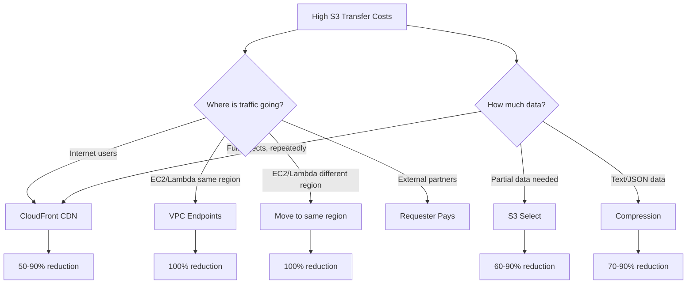

# How to Calculate and Reduce S3 Data Transfer Costs

Author: [nawazdhandala](https://github.com/nawazdhandala)

Tags: AWS, S3, Cost Optimization, Data Transfer, Cloud Costs

Description: A practical guide to understanding, calculating, and reducing S3 data transfer costs, including techniques like CloudFront, VPC endpoints, and same-region access.

---

S3 storage is cheap. S3 data transfer is where the bill gets painful. A terabyte of Standard storage costs about $23 per month, but transferring that same terabyte out to the internet costs $90. And if you're not paying attention to how your applications access S3, you could be paying transfer charges you don't need to. Let's break down exactly where the costs come from and how to reduce them.

## S3 Data Transfer Pricing Explained

Not all S3 data movement costs the same. Here's the breakdown:

| Transfer Type | Cost |
|---|---|
| Data in (upload to S3) | Free |
| Data out to internet (first 10TB/month) | $0.09/GB |
| Data out to internet (next 40TB) | $0.085/GB |
| Data out to internet (next 100TB) | $0.07/GB |
| Data out to CloudFront | Free |
| Data transfer between S3 and EC2 (same region) | Free |
| Data transfer between regions | $0.02/GB |
| Data transfer via VPC endpoint (same region) | Free |
| S3 Transfer Acceleration | $0.04-$0.08/GB additional |

The key insight: **same-region transfers between S3 and other AWS services are free**. Cross-region and internet transfers are not.

## Step 1: Calculate Your Current Costs

Use the AWS Cost Explorer to see your actual S3 data transfer spending.

```bash
# Get S3 data transfer costs for the last 30 days
aws ce get-cost-and-usage \
  --time-period Start=2026-01-12,End=2026-02-12 \
  --granularity MONTHLY \
  --metrics "BlendedCost" "UsageQuantity" \
  --filter '{
    "And": [
      {"Dimensions": {"Key": "SERVICE", "Values": ["Amazon Simple Storage Service"]}},
      {"Dimensions": {"Key": "USAGE_TYPE_GROUP", "Values": ["S3-API-Tier1", "S3-API-Tier2", "S3-Data-Transfer"]}}
    ]
  }' \
  --group-by Type=DIMENSION,Key=USAGE_TYPE
```

You can also get a more detailed view using CloudWatch metrics.

```python
import boto3
from datetime import datetime, timedelta

cloudwatch = boto3.client('cloudwatch')

# Get bytes downloaded metric per bucket
response = cloudwatch.get_metric_statistics(
    Namespace='AWS/S3',
    MetricName='BytesDownloaded',
    Dimensions=[
        {'Name': 'BucketName', 'Value': 'my-app-bucket'},
        {'Name': 'FilterId', 'Value': 'EntireBucket'}
    ],
    StartTime=datetime.utcnow() - timedelta(days=30),
    EndTime=datetime.utcnow(),
    Period=86400,  # Daily
    Statistics=['Sum']
)

total_bytes = sum(p['Sum'] for p in response['Datapoints'])
total_gb = total_bytes / (1024 ** 3)
estimated_cost = total_gb * 0.09  # $0.09/GB for first 10TB tier

print(f"Total downloaded: {total_gb:.2f} GB")
print(f"Estimated transfer cost: ${estimated_cost:.2f}")
```

## Step 2: Put CloudFront in Front of S3

This is the single most impactful optimization. Data transfer from S3 to CloudFront is free. CloudFront's data transfer to users is cheaper than S3 direct ($0.085/GB vs $0.09/GB for the first 10TB), and cached content doesn't even hit S3 at all.

```bash
# Create a CloudFront distribution for your S3 bucket
aws cloudfront create-distribution \
  --distribution-config '{
    "CallerReference": "cost-optimization-2026",
    "Origins": {
      "Quantity": 1,
      "Items": [{
        "Id": "s3-origin",
        "DomainName": "my-app-bucket.s3.us-east-1.amazonaws.com",
        "S3OriginConfig": {
          "OriginAccessIdentity": ""
        }
      }]
    },
    "DefaultCacheBehavior": {
      "TargetOriginId": "s3-origin",
      "ViewerProtocolPolicy": "redirect-to-https",
      "CachePolicyId": "658327ea-f89d-4fab-a63d-7e88639e58f6",
      "Compress": true
    },
    "Enabled": true,
    "PriceClass": "PriceClass_100"
  }'
```

For static assets, images, and any content that's read repeatedly, CloudFront caching alone can cut your transfer costs by 50-90%. See our detailed guide on [setting up S3 with CloudFront](https://oneuptime.com/blog/post/s3-cloudfront-cdn-backed-static-site/view).

## Step 3: Use VPC Endpoints for Same-Region Access

If your EC2 instances or Lambda functions access S3 over the internet, you're paying transfer charges unnecessarily. A VPC endpoint keeps the traffic within the AWS network at no cost.

```bash
# Create a Gateway VPC Endpoint for S3
aws ec2 create-vpc-endpoint \
  --vpc-id vpc-12345678 \
  --service-name com.amazonaws.us-east-1.s3 \
  --route-table-ids rtb-12345678
```

Once created, S3 traffic from resources in that VPC automatically routes through the endpoint. No code changes needed.

## Step 4: Keep Resources in the Same Region

Cross-region data transfer costs $0.02/GB. If your EC2 instances are in us-east-1 but your S3 bucket is in eu-west-1, every byte transferred costs money.

Run a quick check to find mismatches.

```python
import boto3

s3 = boto3.client('s3')
ec2_regions = set()

# Find which regions your EC2 instances are in
ec2 = boto3.client('ec2')
for region_info in ec2.describe_regions()['Regions']:
    regional_ec2 = boto3.client('ec2', region_name=region_info['RegionName'])
    try:
        instances = regional_ec2.describe_instances(
            Filters=[{'Name': 'instance-state-name', 'Values': ['running']}]
        )
        for reservation in instances['Reservations']:
            if reservation['Instances']:
                ec2_regions.add(region_info['RegionName'])
    except Exception:
        pass

# Find S3 bucket regions
for bucket in s3.list_buckets()['Buckets']:
    location = s3.get_bucket_location(Bucket=bucket['Name'])
    bucket_region = location['LocationConstraint'] or 'us-east-1'

    if bucket_region not in ec2_regions:
        print(f"MISMATCH: Bucket {bucket['Name']} is in {bucket_region}, "
              f"but no EC2 instances there")
```

## Step 5: Use S3 Select to Reduce Data Scanned

Instead of downloading entire objects and filtering client-side, use S3 Select to retrieve only the data you need. This reduces the amount of data transferred.

```python
import boto3

s3 = boto3.client('s3')

# Without S3 Select: download entire 10GB CSV
# response = s3.get_object(Bucket='my-bucket', Key='data/large-file.csv')
# Cost: 10GB x $0.09 = $0.90 per request

# With S3 Select: download only matching rows
response = s3.select_object_content(
    Bucket='my-bucket',
    Key='data/large-file.csv',
    ExpressionType='SQL',
    Expression="SELECT * FROM s3object WHERE status = 'active' AND region = 'us-east-1'",
    InputSerialization={'CSV': {'FileHeaderInfo': 'USE'}},
    OutputSerialization={'CSV': {}},
    RequestProgress={'Enabled': True}
)

# Only matching rows are transferred
for event in response['Payload']:
    if 'Records' in event:
        data = event['Records']['Payload'].decode('utf-8')
        # Process filtered data
```

## Step 6: Compress Data Before Storing

Compressed data means less bytes transferred. Gzip typically achieves 70-90% compression on text-based formats.

```python
import boto3
import gzip
import json

s3 = boto3.client('s3')

# Store data compressed
data = json.dumps(large_dataset).encode('utf-8')
compressed = gzip.compress(data)

compression_ratio = len(compressed) / len(data) * 100
print(f"Compression ratio: {compression_ratio:.1f}%")
# Typical: 10-30% of original size

s3.put_object(
    Bucket='my-bucket',
    Key='data/dataset.json.gz',
    Body=compressed,
    ContentEncoding='gzip',
    ContentType='application/json'
)
```

## Step 7: Use Requester Pays for Shared Data

If you're sharing datasets with external parties, let them pay for their own downloads. See our guide on [setting up Requester Pays buckets](https://oneuptime.com/blog/post/s3-requester-pays-buckets/view).

## Cost Reduction Strategy Overview



## Monitoring Transfer Costs Over Time

Set up a cost anomaly detector to catch unexpected spikes.

```python
import boto3

ce = boto3.client('ce')

# Create a cost anomaly monitor for S3
ce.create_anomaly_monitor(
    AnomalyMonitor={
        'MonitorName': 's3-transfer-cost-monitor',
        'MonitorType': 'DIMENSIONAL',
        'MonitorDimension': 'SERVICE'
    }
)
```

You can also build custom monitoring dashboards. For comprehensive monitoring across your AWS infrastructure, check out [OneUptime's monitoring platform](https://oneuptime.com/blog/post/aws-cloudwatch-monitoring/view).

## Real-World Cost Reduction Example

Here's a before/after for a typical web application serving 50TB of images per month:

**Before optimization:**
- 50TB internet transfer: 50,000 GB x $0.085 = $4,250/month
- 10M GET requests: $4/month
- Storage (2TB): $46/month
- **Total: $4,300/month**

**After optimization (CloudFront + compression):**
- 50TB through CloudFront (85% cache hit): 7,500 GB origin fetch (free to CloudFront)
- CloudFront transfer: 50,000 GB x $0.085 = $4,250 (similar price but with caching)
- With 85% cache hit, origin only serves 7,500 GB (free)
- CloudFront transfer for cached content is often lower due to compression
- Compression reduces actual transfer by ~60%: 50,000 GB becomes ~20,000 GB
- 20,000 GB x $0.085 = $1,700/month
- **Total: ~$1,750/month**

**Savings: $2,550/month (59%)**

The more cacheable your content is and the more you can compress, the bigger the savings.

## Quick Wins Checklist

1. Enable CloudFront for any public-facing S3 content
2. Create VPC endpoints in every VPC that accesses S3
3. Verify S3 buckets are in the same region as compute resources
4. Compress text-based objects (JSON, CSV, XML, logs)
5. Use S3 Select for filtered queries on large files
6. Set up cost anomaly detection for early warning
7. Review CloudWatch BytesDownloaded metrics monthly
8. Use Requester Pays for shared datasets
9. Enable CloudFront compression for web content
10. Consider S3 Intelligent-Tiering for variable access patterns

## Wrapping Up

S3 data transfer costs sneak up on you because they scale linearly with usage. The good news is that most of the optimization techniques are straightforward to implement. CloudFront alone typically cuts costs by half or more for web-facing content. VPC endpoints eliminate same-region transfer costs entirely. And compression reduces the actual bytes moving across the wire. Start with the biggest cost drivers - usually internet egress - and work your way down the list. Even modest optimizations can save thousands of dollars per month at scale.
