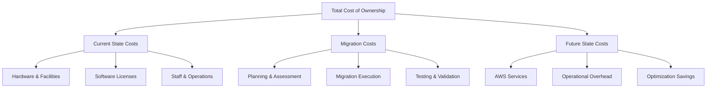

# How to Calculate TCO for AWS Migration

Author: [nawazdhandala](https://github.com/nawazdhandala)

Tags: AWS, Migration, TCO, Cost Optimization, Cloud Economics

Description: Learn how to calculate total cost of ownership for AWS migration including hidden costs, staffing, and long-term savings that most TCO analyses miss.

---

Every cloud migration starts with the same question: "How much will this actually cost?" The answer is almost never what people expect, because most TCO calculations leave out critical factors. Here is how to do it properly.

## Why TCO Matters

Total Cost of Ownership goes beyond the monthly AWS bill. It includes the cost of running your current infrastructure, the cost of the migration itself, and the ongoing cost of operating in the cloud. Skip any of these, and your business case falls apart three months after go-live.

## The Three Pillars of Migration TCO



## Pillar 1: Current State Costs

Most organizations dramatically undercount their on-premises costs. Here is what to include.

### Hardware Costs

Calculate the annualized cost of all physical infrastructure:

```
Server hardware (purchase price / expected lifespan)
Storage arrays and SAN infrastructure
Network equipment (switches, routers, firewalls)
Load balancers and other appliances
Spare parts inventory
Hardware maintenance contracts
```

### Facility Costs

Data center costs are often allocated across the organization, making them invisible to individual teams:

```
Data center space (per rack unit or square foot)
Power consumption (servers, cooling, lighting)
Cooling infrastructure maintenance
Physical security systems
Internet connectivity and cross-connects
Redundant power (UPS, generators, fuel)
```

### Software Licensing

This is where things get tricky. Many enterprise licenses are bundled or negotiated at the org level:

```
Operating system licenses
Database licenses (per core, per socket, or per user)
Virtualization platform licenses
Backup software licenses
Monitoring and management tools
Security software (antivirus, IDS/IPS)
```

### Staffing Costs

The biggest hidden cost. Include fully loaded compensation for:

```
System administrators
Network engineers
Database administrators
Storage administrators
Security team (portion dedicated to infrastructure)
Help desk (portion dedicated to infrastructure issues)
Management overhead
```

A useful formula for estimating staff allocation:

```python
# Calculate annual staffing cost allocated to infrastructure
def calculate_staff_cost(engineers, avg_salary, benefits_multiplier, infra_percent):
    """
    engineers: number of staff members
    avg_salary: average annual salary
    benefits_multiplier: typically 1.3 to 1.5 (30-50% benefits overhead)
    infra_percent: percentage of time spent on infrastructure tasks
    """
    fully_loaded = avg_salary * benefits_multiplier
    total = engineers * fully_loaded * (infra_percent / 100)
    return total

# Example: 5 engineers, $130k avg salary, 40% benefits, 60% on infra
annual_staff_cost = calculate_staff_cost(5, 130000, 1.4, 60)
print(f"Annual infrastructure staffing cost: ${annual_staff_cost:,.0f}")
# Output: Annual infrastructure staffing cost: $546,000
```

## Pillar 2: Migration Costs

This is the one-time investment to actually move to AWS. Underestimating this kills migration projects.

### Assessment and Planning

```
AWS Migration Assessment Service or consultant fees
Application portfolio analysis
Dependency mapping tools and labor
Architecture design and review
Security and compliance review
Training for operations team
```

### Migration Execution

```
Migration tooling (CloudEndure, DMS, etc.)
Temporary parallel running costs (on-prem + cloud)
Additional bandwidth during migration
Staff overtime or contractor costs
Application refactoring labor (if applicable)
Database migration specialist time
```

### Testing and Validation

Do not underestimate testing. It regularly takes 30-40% of the total migration effort.

```
Functional testing cycles
Performance testing and benchmarking
Security testing and penetration testing
User acceptance testing
Data validation and reconciliation
Disaster recovery testing in new environment
```

For a thorough look at testing strategies, check our post on [testing migrated applications on AWS](https://oneuptime.com/blog/post/test-migrated-applications-on-aws/view).

## Pillar 3: Future State Costs

### AWS Service Costs

Use the AWS Pricing Calculator for detailed estimates, but here are the major categories:

```python
# Rough monthly cost estimation framework
def estimate_monthly_aws(compute_instances, storage_gb, data_transfer_gb,
                          db_instances, misc_services_estimate):
    """
    Simplified monthly cost estimator.
    Real estimates should use the AWS Pricing Calculator.
    """
    # Rough averages - replace with actual pricing for your region/instance types
    compute = compute_instances * 150  # avg m5.xlarge on-demand
    storage = storage_gb * 0.023      # S3 standard
    transfer = data_transfer_gb * 0.09 # data out
    database = db_instances * 400      # avg RDS instance

    subtotal = compute + storage + transfer + database + misc_services_estimate

    # Add 15% buffer for unexpected costs
    total = subtotal * 1.15

    return {
        'compute': compute,
        'storage': storage,
        'transfer': transfer,
        'database': database,
        'misc': misc_services_estimate,
        'buffer': subtotal * 0.15,
        'total': total
    }

costs = estimate_monthly_aws(
    compute_instances=20,
    storage_gb=5000,
    data_transfer_gb=2000,
    db_instances=3,
    misc_services_estimate=500
)
for k, v in costs.items():
    print(f"{k}: ${v:,.2f}")
```

### Savings Opportunities

Factor in cost reductions you can realistically achieve:

**Reserved Instances / Savings Plans**: 30-60% savings on compute for 1-3 year commitments.

**Right-sizing**: Most organizations over-provision by 40-60%. AWS Compute Optimizer helps identify this.

**Auto-scaling**: Only pay for what you use during off-peak hours.

**Spot Instances**: 60-90% savings for fault-tolerant workloads.

**Storage tiering**: Automatically move infrequently accessed data to cheaper storage classes.

### Operational Cost Changes

Cloud changes your operational model. Some costs go up, others go down:

```
Costs that typically decrease:
- Hardware procurement and lifecycle management
- Data center facility costs
- Break-fix maintenance
- Capacity planning overhead

Costs that typically increase:
- Cloud-specific tooling and monitoring
- Training and certification
- Network connectivity (Direct Connect)
- Cloud security posture management
```

## Building the TCO Spreadsheet

Structure your analysis in a format stakeholders can understand:

| Category | Current Annual | Migration (One-Time) | Year 1 Cloud | Year 2 Cloud | Year 3 Cloud |
|----------|---------------|---------------------|-------------|-------------|-------------|
| Compute | $X | - | $Y | $Y-10% | $Y-20% |
| Storage | $X | - | $Y | $Y | $Y |
| Network | $X | - | $Y | $Y | $Y |
| Licensing | $X | - | $Y | $Y | $Y |
| Staffing | $X | $Z | $W | $W | $W |
| Facilities | $X | - | $0 | $0 | $0 |
| Migration | - | $Z | - | - | - |
| **Total** | **$Sum** | **$Sum** | **$Sum** | **$Sum** | **$Sum** |

Show the cumulative cost over 3-5 years to demonstrate the break-even point.

## Common Mistakes

**Comparing on-demand to on-prem**: Always include Reserved Instance or Savings Plan pricing. Nobody runs production workloads at on-demand rates long-term.

**Ignoring staff reallocation**: If your sysadmins move to cloud engineering roles, that is not a savings. It is a reallocation. Only count actual headcount reductions or avoided hires.

**Forgetting data transfer costs**: Egress charges add up fast, especially for data-heavy workloads.

**Not accounting for the learning curve**: Productivity dips during the first 6-12 months as teams learn AWS. Budget for it.

**Skipping the optimization phase**: Year 1 cloud costs are always higher than steady-state. Include post-migration optimization in your timeline. See our guide on [post-migration optimization](https://oneuptime.com/blog/post/implement-post-migration-optimization-on-aws/view) for details.

## Conclusion

An honest TCO analysis is the foundation of a successful migration business case. Include all current costs (especially the hidden ones), be realistic about migration effort, and show the optimization trajectory over time. A well-built TCO model does not just justify the migration - it becomes the roadmap for achieving the savings you promised.
