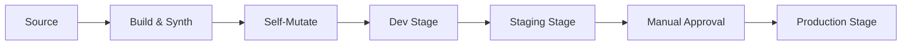

# How to Set Up CDK Pipelines for Automated Deployments

Author: [nawazdhandala](https://github.com/nawazdhandala)

Tags: AWS, CDK, CI/CD, DevOps

Description: Learn how to set up CDK Pipelines for fully automated, self-mutating deployment pipelines that deploy your CDK applications across multiple stages and accounts.

---

CDK Pipelines is a construct library that creates CI/CD pipelines for your CDK applications. The pipeline is itself defined in CDK, which means it can update itself when you push changes. This self-mutating behavior is the killer feature - push a change to your pipeline definition, and it automatically reconfigures itself before deploying your application changes.

No more going to the AWS console to update pipeline stages. No more separate pipeline-as-code repositories. Everything lives in your CDK app.

## How CDK Pipelines Work

The pipeline does three things in order. First, it pulls your source code and synthesizes CDK into CloudFormation templates. Second, it updates itself if the pipeline definition changed (the self-mutation step). Third, it deploys your application stacks through stages.



## Setting Up the Pipeline Stack

The pipeline lives in its own stack, separate from your application stacks.

```typescript
// lib/pipeline-stack.ts
// The pipeline stack defines the CI/CD pipeline itself
import * as cdk from 'aws-cdk-lib';
import { Construct } from 'constructs';
import {
  CodePipeline,
  CodePipelineSource,
  ShellStep,
  ManualApprovalStep,
} from 'aws-cdk-lib/pipelines';
import { DeployStage } from './deploy-stage';

export class PipelineStack extends cdk.Stack {
  constructor(scope: Construct, id: string, props?: cdk.StackProps) {
    super(scope, id, props);

    // Define the pipeline
    const pipeline = new CodePipeline(this, 'Pipeline', {
      pipelineName: 'MyAppPipeline',
      crossAccountKeys: true,  // Required for cross-account deployments

      // Source and build step
      synth: new ShellStep('Synth', {
        // Pull code from GitHub
        input: CodePipelineSource.gitHub('myorg/myrepo', 'main', {
          authentication: cdk.SecretValue.secretsManager('github-token'),
        }),
        // Build commands
        commands: [
          'npm ci',
          'npm run build',
          'npm run test',
          'npx cdk synth',
        ],
        // Primary output is the cdk.out directory
        primaryOutputDirectory: 'cdk.out',
      }),

      // Docker enabled for building container images
      dockerEnabledForSynth: true,
    });

    // Add deployment stages
    // Dev - deploys automatically
    pipeline.addStage(new DeployStage(this, 'Dev', {
      env: { account: '111111111111', region: 'us-east-1' },
      stageName: 'dev',
    }));

    // Staging - runs integration tests after deployment
    pipeline.addStage(new DeployStage(this, 'Staging', {
      env: { account: '222222222222', region: 'us-east-1' },
      stageName: 'staging',
    }), {
      post: [
        new ShellStep('IntegrationTests', {
          commands: [
            'npm ci',
            'npm run test:integration',
          ],
        }),
      ],
    });

    // Production - requires manual approval
    pipeline.addStage(new DeployStage(this, 'Production', {
      env: { account: '333333333333', region: 'us-west-2' },
      stageName: 'production',
    }), {
      pre: [
        new ManualApprovalStep('PromoteToProduction', {
          comment: 'Review staging deployment before promoting to production',
        }),
      ],
    });
  }
}
```

## Defining the Deploy Stage

A Stage groups related stacks that deploy together.

```typescript
// lib/deploy-stage.ts
// A deployment stage containing all application stacks
import * as cdk from 'aws-cdk-lib';
import { Construct } from 'constructs';
import { NetworkStack } from './network-stack';
import { DatabaseStack } from './database-stack';
import { ApplicationStack } from './application-stack';

interface DeployStageProps extends cdk.StageProps {
  stageName: string;
}

export class DeployStage extends cdk.Stage {
  constructor(scope: Construct, id: string, props: DeployStageProps) {
    super(scope, id, props);

    // Create all stacks for this stage
    const network = new NetworkStack(this, 'Network', {
      stageName: props.stageName,
    });

    const database = new DatabaseStack(this, 'Database', {
      stageName: props.stageName,
      vpc: network.vpc,
    });

    new ApplicationStack(this, 'Application', {
      stageName: props.stageName,
      vpc: network.vpc,
      database: database.cluster,
    });
  }
}
```

## The App Entry Point

The entry point instantiates the pipeline stack.

```typescript
// bin/app.ts
// Entry point - creates the pipeline stack
import * as cdk from 'aws-cdk-lib';
import { PipelineStack } from '../lib/pipeline-stack';

const app = new cdk.App();

// The pipeline stack deploys to the CI/CD account
new PipelineStack(app, 'Pipeline', {
  env: {
    account: '444444444444',  // CI/CD account
    region: 'us-east-1',
  },
});

app.synth();
```

## Using CodeCommit Instead of GitHub

If you use CodeCommit, the source configuration is slightly different.

```typescript
// Using CodeCommit as the source
import * as codecommit from 'aws-cdk-lib/aws-codecommit';

const repo = codecommit.Repository.fromRepositoryName(
  this, 'Repo', 'my-app-repo',
);

const pipeline = new CodePipeline(this, 'Pipeline', {
  synth: new ShellStep('Synth', {
    input: CodePipelineSource.codeCommit(repo, 'main'),
    commands: [
      'npm ci',
      'npm run build',
      'npx cdk synth',
    ],
  }),
});
```

## Adding Pre and Post Deployment Steps

You can add validation steps before and after each deployment stage.

```typescript
// Add security scanning before deployment
pipeline.addStage(new DeployStage(this, 'Staging', { /* ... */ }), {
  pre: [
    // Run before deployment
    new ShellStep('SecurityScan', {
      commands: [
        'npm ci',
        'npx cdk synth',
        'pip install cfn-nag',
        'cfn_nag_scan --input-path cdk.out/',
      ],
    }),
  ],
  post: [
    // Run after deployment
    new ShellStep('SmokeTest', {
      commands: [
        // Hit the health endpoint
        'curl -f https://staging.example.com/health',
      ],
    }),
    new ShellStep('LoadTest', {
      commands: [
        'npm ci',
        'npm run test:load -- --target staging',
      ],
    }),
  ],
});
```

## Notifications

Set up notifications for pipeline events.

```typescript
// Add SNS notifications for pipeline events
import * as sns from 'aws-cdk-lib/aws-sns';
import * as subscriptions from 'aws-cdk-lib/aws-sns-subscriptions';
import * as notifications from 'aws-cdk-lib/aws-codestarnotifications';

const topic = new sns.Topic(this, 'PipelineNotifications');
topic.addSubscription(
  new subscriptions.EmailSubscription('devops@example.com'),
);

// Notify on pipeline failures and manual approval needed
pipeline.buildPipeline();  // Must call this before accessing the internal pipeline

new notifications.NotificationRule(this, 'NotificationRule', {
  source: pipeline.pipeline,
  events: [
    'codepipeline-pipeline-pipeline-execution-failed',
    'codepipeline-pipeline-manual-approval-needed',
    'codepipeline-pipeline-pipeline-execution-succeeded',
  ],
  targets: [topic],
});
```

## Bootstrap Requirements

For cross-account deployments, bootstrap target accounts with trust to the pipeline account.

```bash
# Bootstrap the pipeline account
cdk bootstrap aws://444444444444/us-east-1

# Bootstrap target accounts with trust
cdk bootstrap aws://111111111111/us-east-1 --trust 444444444444
cdk bootstrap aws://222222222222/us-east-1 --trust 444444444444
cdk bootstrap aws://333333333333/us-west-2 --trust 444444444444
```

## Initial Deployment

The first deployment is done manually from your local machine. After that, the pipeline manages itself.

```bash
# Deploy the pipeline stack (first time only)
cdk deploy Pipeline

# After this, push to your main branch and the pipeline takes over
git add . && git commit -m "Initial pipeline setup" && git push
```

## Self-Mutation in Action

When you push a change that modifies the pipeline definition (like adding a new stage), the pipeline detects this during the self-mutation step. It updates itself first, then proceeds with the new pipeline configuration. You don't need to manually redeploy the pipeline stack.

This is what makes CDK Pipelines special compared to manually configured CodePipeline or third-party CI/CD tools. The pipeline and the application it deploys are defined in the same codebase and evolve together.

For the account setup required for cross-account pipelines, see the post on [deploying CDK apps to multiple accounts](https://oneuptime.com/blog/post/2026-02-12-deploy-cdk-apps-multiple-aws-accounts-regions/view). For writing the tests that run in your pipeline stages, check out [integration tests for CDK stacks](https://oneuptime.com/blog/post/2026-02-12-write-integration-tests-for-cdk-stacks/view).
