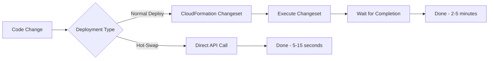

# How to Use CDK Watch for Hot-Swap Deployments

Author: [nawazdhandala](https://github.com/nawazdhandala)

Tags: AWS, CDK, Deployment, Development

Description: Speed up your AWS CDK development workflow with cdk watch and hot-swap deployments that bypass CloudFormation for near-instant Lambda and container updates.

---

If you've ever waited five minutes for CloudFormation to update a single Lambda function just because you changed one line of code, you know the pain. CDK's normal deploy process goes through CloudFormation every time, which means creating a changeset, waiting for it to execute, and watching progress bars crawl. For production, this thoroughness is exactly what you want. For development, it's agonizing.

CDK Watch and hot-swap deployments fix this by bypassing CloudFormation entirely for supported resource types. Instead of a full stack update, CDK directly updates the Lambda code, ECS task definition, or Step Functions state machine. The result is deployments that take seconds instead of minutes.

## Understanding Hot-Swap

Hot-swap deployments skip CloudFormation and directly update resources through AWS service APIs. Here's what that means in practice:



Hot-swap currently supports:
- Lambda function code and configuration
- ECS service task definitions
- Step Functions state machine definitions
- CodeBuild project source
- S3 bucket deployments
- AppSync resolvers and functions

Resources that aren't hot-swappable fall back to a normal CloudFormation deployment.

## Basic Hot-Swap Deploy

The simplest way to use hot-swap:

```bash
# Deploy with hot-swap enabled (skip CloudFormation where possible)
cdk deploy --hotswap

# Deploy a specific stack with hot-swap
cdk deploy MyStack --hotswap

# Hot-swap with fallback to full deploy for non-supported resources
cdk deploy --hotswap-fallback
```

The `--hotswap` flag tells CDK to use direct API calls for supported resources and skip everything else. The `--hotswap-fallback` variant will do a full CloudFormation deploy for resources that can't be hot-swapped, which is usually what you want.

## CDK Watch: Continuous Deployment

CDK Watch combines hot-swap with file watching. It monitors your source files and automatically deploys when something changes:

```bash
# Start watching for changes and auto-deploy
cdk watch

# Watch a specific stack
cdk watch MyApiStack

# Watch with full deployment fallback
cdk watch --hotswap-fallback
```

When you save a file, CDK Watch:
1. Detects the change
2. Synthesizes the CDK app
3. Identifies what changed
4. Hot-swaps supported resources
5. Falls back to full deploy for others

## Configuring cdk.json for Watch

Configure which files to watch and which to exclude in your `cdk.json`:

```json
{
  "app": "npx ts-node --prefer-ts-exts bin/my-app.ts",
  "watch": {
    "include": [
      "**"
    ],
    "exclude": [
      "README.md",
      "cdk*.json",
      "**/*.d.ts",
      "**/*.js",
      "tsconfig.json",
      "package*.json",
      "yarn.lock",
      "node_modules",
      "test",
      "cdk.out"
    ]
  }
}
```

The include/exclude patterns use glob syntax. You'll want to exclude compiled files, test files, and anything that doesn't affect your deployed resources.

## Lambda Hot-Swap in Action

Lambda functions are the most common hot-swap target. Here's a typical setup:

```typescript
// lib/api-stack.ts - Lambda function for hot-swap development
import * as cdk from 'aws-cdk-lib';
import * as lambda from 'aws-cdk-lib/aws-lambda';
import * as apigateway from 'aws-cdk-lib/aws-apigateway';
import { Construct } from 'constructs';

export class ApiStack extends cdk.Stack {
  constructor(scope: Construct, id: string, props?: cdk.StackProps) {
    super(scope, id, props);

    const handler = new lambda.Function(this, 'ApiHandler', {
      runtime: lambda.Runtime.NODEJS_20_X,
      handler: 'index.handler',
      code: lambda.Code.fromAsset('lambda/api'),
      environment: {
        TABLE_NAME: 'my-table',
        STAGE: 'dev',
      },
      timeout: cdk.Duration.seconds(30),
    });

    new apigateway.LambdaRestApi(this, 'Api', {
      handler: handler,
      proxy: true,
    });
  }
}
```

Now when you edit the Lambda code in `lambda/api/index.ts`, CDK Watch detects the change and updates just the Lambda function code. The API Gateway, IAM role, and other resources are untouched.

```typescript
// lambda/api/index.ts - Edit this and watch hot-swap in action
export const handler = async (event: any) => {
  // Change this response and save - CDK Watch will deploy in seconds
  return {
    statusCode: 200,
    headers: { 'Content-Type': 'application/json' },
    body: JSON.stringify({
      message: 'Hello from hot-swap!',
      timestamp: new Date().toISOString(),
      path: event.path,
    }),
  };
};
```

## Lambda Environment Variable Changes

Hot-swap also handles Lambda environment variable changes:

```typescript
// Changing environment variables triggers a hot-swap update
const handler = new lambda.Function(this, 'Handler', {
  runtime: lambda.Runtime.NODEJS_20_X,
  handler: 'index.handler',
  code: lambda.Code.fromAsset('lambda'),
  environment: {
    FEATURE_FLAG: 'true',       // Change this
    LOG_LEVEL: 'debug',         // Or this
    API_VERSION: 'v2',          // And CDK Watch updates instantly
  },
});
```

## ECS Hot-Swap

For ECS services, hot-swap updates the task definition and triggers a new deployment:

```typescript
// ECS task definition changes are hot-swappable
const taskDefinition = new ecs.FargateTaskDefinition(this, 'TaskDef', {
  cpu: 256,
  memoryLimitMiB: 512,
});

taskDefinition.addContainer('App', {
  image: ecs.ContainerImage.fromAsset('./docker/app'),
  portMappings: [{ containerPort: 3000 }],
  environment: {
    NODE_ENV: 'development',
  },
  logging: ecs.LogDrivers.awsLogs({
    streamPrefix: 'app',
  }),
});

new ecs.FargateService(this, 'Service', {
  cluster: cluster,
  taskDefinition: taskDefinition,
  desiredCount: 1,
});
```

When you change the Docker image (by editing files in `./docker/app`), CDK Watch rebuilds the image, pushes it to ECR, updates the task definition, and triggers a service deployment. It's not as fast as Lambda hot-swap since the container needs to start, but it's still much faster than a full CloudFormation update.

## Step Functions Hot-Swap

State machine definitions are also hot-swappable:

```typescript
// Step Functions definition changes deploy instantly with hot-swap
import * as sfn from 'aws-cdk-lib/aws-stepfunctions';
import * as tasks from 'aws-cdk-lib/aws-stepfunctions-tasks';

const definition = new tasks.LambdaInvoke(this, 'Process', {
  lambdaFunction: processFn,
  outputPath: '$.Payload',
})
.next(new sfn.Choice(this, 'Check Result')
  .when(sfn.Condition.stringEquals('$.status', 'success'),
    new sfn.Succeed(this, 'Done'))
  .otherwise(
    new sfn.Fail(this, 'Failed', { error: 'ProcessingFailed' }))
);

new sfn.StateMachine(this, 'Workflow', {
  definitionBody: sfn.DefinitionBody.fromChainable(definition),
});
```

## Development Workflow Tips

Here's a productive development setup using CDK Watch:

```bash
# Terminal 1: Start CDK Watch
cdk watch --hotswap-fallback

# Terminal 2: Tail CloudWatch Logs
aws logs tail /aws/lambda/my-function --follow --format short

# Terminal 3: Your editor
code .
```

This gives you a tight feedback loop: edit code, save, watch it deploy in seconds, and see the logs immediately.

## What Hot-Swap Can't Do

Hot-swap has important limitations you need to understand:

**It's for development only**. Hot-swapped resources are in a state that CloudFormation doesn't know about. The next full deploy will reconcile everything, but in the meantime your actual state might not match your template.

**IAM changes need full deploy**. If you change permissions, roles, or policies, those need CloudFormation. Hot-swap can't update IAM resources.

**New resources need full deploy**. If you add a new Lambda function or a new DynamoDB table, hot-swap can't help. It only updates existing resources.

**Infrastructure changes need full deploy**. VPC changes, subnet modifications, security group rules - all of these require CloudFormation.

## Using with Docker Lambda

For Docker-based Lambda functions, hot-swap rebuilds and pushes the container:

```typescript
// Docker Lambda functions work with hot-swap too
const dockerFunction = new lambda.DockerImageFunction(this, 'DockerFn', {
  code: lambda.DockerImageCode.fromImageAsset('./docker/processor', {
    cmd: ['index.handler'],
  }),
  timeout: cdk.Duration.minutes(5),
  memorySize: 1024,
});
```

Edit the Dockerfile or application code, and CDK Watch handles the rebuild and deploy.

## Performance Comparison

To give you a sense of the time savings:

- Lambda code change via CloudFormation: 30-120 seconds
- Lambda code change via hot-swap: 5-15 seconds
- ECS task definition via CloudFormation: 60-300 seconds
- ECS task definition via hot-swap: 30-60 seconds (plus container startup)

Over a day of active development, this adds up to hours of saved waiting time.

For production deployments where you want the full CloudFormation safety net, stick with regular `cdk deploy`. For development iteration speed, `cdk watch` is hard to beat. If you're building CDK projects, consider using [Projen for project management](https://oneuptime.com/blog/post/cdk-projen-project-management/view) to standardize your development workflow across teams.

## Wrapping Up

CDK Watch and hot-swap deployments transform the CDK development experience from "wait for CloudFormation" to "save and see the change." The setup is minimal - configure your watch patterns in `cdk.json` and run `cdk watch`. Just remember that hot-swap is strictly a development tool. Always use full deployments for staging and production where CloudFormation's safety guarantees matter.
