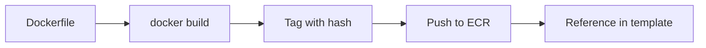

# How to Use CDK with Docker Assets

Author: [nawazdhandala](https://github.com/nawazdhandala)

Tags: AWS, CDK, Docker, ECS

Description: Learn how to use CDK Docker assets to build container images locally, push them to ECR automatically, and deploy them to ECS, Lambda, and other container services.

---

CDK Docker assets let you build container images as part of your CDK deployment. Point CDK at a Dockerfile, and it builds the image locally, pushes it to an ECR repository (which it creates automatically), and wires the image URI into your ECS task definitions, Lambda functions, or whatever service needs it.

No manual Docker builds. No separate ECR push scripts. No hardcoded image URIs. CDK handles the entire lifecycle.

## The Basics: ContainerImage.fromAsset

The most common way to use Docker assets is through `ContainerImage.fromAsset()`. It takes a path to a directory containing a Dockerfile.

```typescript
// Build a Docker image from a local Dockerfile and deploy to Fargate
import * as ecs from 'aws-cdk-lib/aws-ecs';
import * as ecsPatterns from 'aws-cdk-lib/aws-ecs-patterns';

const service = new ecsPatterns.ApplicationLoadBalancedFargateService(
  this, 'WebService',
  {
    taskImageOptions: {
      // CDK builds this Dockerfile, pushes to ECR, and references the image
      image: ecs.ContainerImage.fromAsset('./docker/web-app'),
      containerPort: 8080,
    },
    desiredCount: 2,
  },
);
```

Your project structure would look like this.

```
my-cdk-app/
  docker/
    web-app/
      Dockerfile
      package.json
      src/
        index.js
  lib/
    my-stack.ts
  bin/
    app.ts
```

And the Dockerfile is just a standard Docker file.

```dockerfile
# docker/web-app/Dockerfile
FROM node:20-alpine

WORKDIR /app
COPY package*.json ./
RUN npm ci --production
COPY src/ ./src/

EXPOSE 8080
CMD ["node", "src/index.js"]
```

## How Docker Assets Work Under the Hood

When you run `cdk deploy`, here's what happens with Docker assets.

1. CDK calculates a content hash of the Docker build directory
2. If the hash matches a previously built image, it skips the build
3. Otherwise, it runs `docker build` locally
4. The built image gets tagged and pushed to an ECR repository in your CDK bootstrap bucket
5. The synthesized CloudFormation template references the image by its ECR URI



## Customizing the Docker Build

You can pass build arguments, specify a different Dockerfile, set the target platform, and more.

```typescript
// Customizing the Docker build with build args and target
const image = ecs.ContainerImage.fromAsset('./docker/app', {
  // Use a specific Dockerfile
  file: 'Dockerfile.production',

  // Pass build arguments
  buildArgs: {
    NODE_ENV: 'production',
    APP_VERSION: '2.1.0',
    BUILD_DATE: new Date().toISOString(),
  },

  // Target a specific build stage (multi-stage builds)
  target: 'production',

  // Build for a specific platform
  platform: ecr_assets.Platform.LINUX_AMD64,

  // Exclude files from the build context
  exclude: [
    'node_modules',
    '.git',
    '*.test.js',
    'coverage',
    '.env',
  ],
});
```

Multi-stage Dockerfiles work great with the `target` option.

```dockerfile
# docker/app/Dockerfile.production
# Multi-stage build for smaller production images
FROM node:20-alpine AS builder
WORKDIR /app
COPY package*.json ./
RUN npm ci
COPY . .
RUN npm run build

FROM node:20-alpine AS production
WORKDIR /app
COPY --from=builder /app/dist ./dist
COPY --from=builder /app/node_modules ./node_modules
COPY package*.json ./
EXPOSE 8080
USER node
CMD ["node", "dist/index.js"]
```

## Docker Assets for Lambda

CDK can package Lambda functions as container images too.

```typescript
// Deploy a Lambda function from a Docker image
import * as lambda from 'aws-cdk-lib/aws-lambda';

const dockerFunction = new lambda.DockerImageFunction(this, 'DockerFunction', {
  code: lambda.DockerImageCode.fromImageAsset('./docker/lambda-handler', {
    // Build args for the Dockerfile
    buildArgs: {
      RUNTIME_VERSION: '3.12',
    },
  }),
  timeout: cdk.Duration.seconds(30),
  memorySize: 512,
  environment: {
    TABLE_NAME: table.tableName,
  },
});
```

The Dockerfile for a Lambda container image needs to use the AWS Lambda base image.

```dockerfile
# docker/lambda-handler/Dockerfile
FROM public.ecr.aws/lambda/python:3.12

# Install dependencies
COPY requirements.txt .
RUN pip install -r requirements.txt

# Copy function code
COPY handler.py .

# Set the handler
CMD ["handler.lambda_handler"]
```

## Multiple Containers in a Task

For ECS tasks with sidecars, you can use multiple Docker assets.

```typescript
// ECS task with multiple containers built from different Dockerfiles
const taskDefinition = new ecs.FargateTaskDefinition(this, 'TaskDef', {
  cpu: 1024,
  memoryLimitMiB: 2048,
});

// Main application container
const appContainer = taskDefinition.addContainer('App', {
  image: ecs.ContainerImage.fromAsset('./docker/app'),
  memoryLimitMiB: 1024,
  portMappings: [{ containerPort: 8080 }],
  logging: ecs.LogDrivers.awsLogs({ streamPrefix: 'app' }),
  essential: true,
});

// Nginx reverse proxy sidecar
taskDefinition.addContainer('Nginx', {
  image: ecs.ContainerImage.fromAsset('./docker/nginx'),
  memoryLimitMiB: 256,
  portMappings: [{ containerPort: 80 }],
  logging: ecs.LogDrivers.awsLogs({ streamPrefix: 'nginx' }),
});

// Monitoring sidecar
taskDefinition.addContainer('Monitoring', {
  image: ecs.ContainerImage.fromAsset('./docker/monitoring-agent'),
  memoryLimitMiB: 256,
  logging: ecs.LogDrivers.awsLogs({ streamPrefix: 'monitoring' }),
  environment: {
    APP_PORT: '8080',
  },
});
```

## Using Pre-Built Images from ECR

If your images are built separately (by a CI/CD pipeline, for example), reference them directly from ECR.

```typescript
// Reference a pre-built image from ECR
import * as ecr from 'aws-cdk-lib/aws-ecr';

const repository = ecr.Repository.fromRepositoryName(
  this, 'AppRepo', 'my-app-repo',
);

const service = new ecsPatterns.ApplicationLoadBalancedFargateService(
  this, 'Service',
  {
    taskImageOptions: {
      // Reference a specific tag from ECR
      image: ecs.ContainerImage.fromEcrRepository(repository, 'v2.1.0'),
      containerPort: 8080,
    },
  },
);
```

## Caching and Build Performance

Docker asset builds can be slow if you're not careful with Dockerfile layering. CDK caches based on the content hash of the build directory. If any file changes, the entire image rebuilds.

To speed things up, structure your Dockerfile to maximize layer caching.

```dockerfile
# Good layering - dependencies change less often than code
FROM node:20-alpine

WORKDIR /app

# Copy dependency files first (these change less often)
COPY package.json package-lock.json ./
RUN npm ci --production

# Copy application code last (this changes frequently)
COPY src/ ./src/

CMD ["node", "src/index.js"]
```

You can also use Docker BuildKit for faster builds.

```typescript
// Enable BuildKit for faster builds
const image = ecs.ContainerImage.fromAsset('./docker/app', {
  buildArgs: {
    DOCKER_BUILDKIT: '1',
  },
});
```

## Cross-Platform Builds

If you're developing on an ARM Mac (M1/M2/M3) but deploying to x86 Fargate or Lambda, you need to specify the target platform.

```typescript
// Build for x86 on an ARM machine
import * as ecr_assets from 'aws-cdk-lib/aws-ecr-assets';

const image = new ecr_assets.DockerImageAsset(this, 'AppImage', {
  directory: './docker/app',
  platform: ecr_assets.Platform.LINUX_AMD64,
});
```

Docker assets are one of CDK's most practical features. They eliminate the glue scripts between your container builds and your infrastructure definitions. For Lambda-specific asset bundling, check out the post on [CDK assets for bundling Lambda code](https://oneuptime.com/blog/post/cdk-assets-bundling-lambda-code/view). For deploying containers with L3 patterns, see [CDK L3 constructs for complete architectures](https://oneuptime.com/blog/post/cdk-l3-constructs-patterns-complete-architectures/view).
