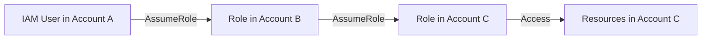

# How to Chain IAM Role Assumptions (Role Chaining)

Author: [nawazdhandala](https://github.com/nawazdhandala)

Tags: AWS, IAM, STS, Security, Multi-Account

Description: Learn how IAM role chaining works in AWS, including practical scenarios, limitations, session duration constraints, and best practices for multi-hop access patterns.

---

Role chaining is when you assume one role and then use those temporary credentials to assume another role. This comes up naturally in multi-account architectures - maybe you're a developer in Account A, you assume a hub role in Account B, and then from there you assume a role in Account C to access production data.

It's a powerful pattern, but it has some constraints that catch people off guard. Let's go through how it works, when to use it, and what to watch out for.

## What Is Role Chaining?

Role chaining means you assume a role, and then from that assumed-role session, you assume another role. Each "hop" creates a new set of temporary credentials from the previous set.



This is different from direct cross-account access, where the user in Account A assumes a role directly in Account C. With chaining, you go through an intermediate role.

## Why Chain Roles?

There are several legitimate reasons:

**Hub-and-spoke architecture.** You centralize users in one account (the hub) and create roles in each workload account (the spokes). Some designs require going through an intermediate security account before reaching production.

**Privilege escalation control.** You might require that users first assume a "gateway" role with limited permissions, and only from there can they assume a more privileged role. This creates an audit trail at each hop.

**Service-to-service access.** An application running with an EC2 instance profile might need to assume a different role in another account to access a shared resource.

## Basic Role Chaining

Here's how to chain roles from the CLI:

```bash
# Step 1: Assume the first role (hub role)
FIRST_ROLE=$(aws sts assume-role \
  --role-arn arn:aws:iam::222222222222:role/HubRole \
  --role-session-name first-hop \
  --output json)

# Extract credentials from the first hop
export AWS_ACCESS_KEY_ID=$(echo $FIRST_ROLE | jq -r '.Credentials.AccessKeyId')
export AWS_SECRET_ACCESS_KEY=$(echo $FIRST_ROLE | jq -r '.Credentials.SecretAccessKey')
export AWS_SESSION_TOKEN=$(echo $FIRST_ROLE | jq -r '.Credentials.SessionToken')

# Step 2: Assume the second role using the first role's credentials
SECOND_ROLE=$(aws sts assume-role \
  --role-arn arn:aws:iam::333333333333:role/ProductionRole \
  --role-session-name second-hop \
  --output json)

# Extract credentials from the second hop
export AWS_ACCESS_KEY_ID=$(echo $SECOND_ROLE | jq -r '.Credentials.AccessKeyId')
export AWS_SECRET_ACCESS_KEY=$(echo $SECOND_ROLE | jq -r '.Credentials.SecretAccessKey')
export AWS_SESSION_TOKEN=$(echo $SECOND_ROLE | jq -r '.Credentials.SessionToken')

# Now you're operating as the ProductionRole in Account C
aws s3 ls
```

## Using CLI Profiles for Chaining

CLI profiles make chaining much cleaner:

```ini
# ~/.aws/config
[profile hub]
role_arn = arn:aws:iam::222222222222:role/HubRole
source_profile = default
role_session_name = alice-hub

[profile production]
role_arn = arn:aws:iam::333333333333:role/ProductionRole
source_profile = hub
role_session_name = alice-production
```

The `production` profile's `source_profile` points to `hub`, not `default`. The CLI automatically chains the assumptions:

```bash
# CLI handles both role assumptions automatically
aws s3 ls --profile production
```

## The One-Hour Session Limit

Here's the biggest gotcha with role chaining: **chained role sessions are limited to a maximum of one hour.** This applies regardless of the role's configured maximum session duration.

If the HubRole has `MaxSessionDuration` of 12 hours, and you chain to ProductionRole which also has 12 hours, the ProductionRole session still maxes out at one hour.

```bash
# This will fail if duration is over 3600 for a chained session
aws sts assume-role \
  --role-arn arn:aws:iam::333333333333:role/ProductionRole \
  --role-session-name my-session \
  --duration-seconds 7200  # Fails - max is 3600 for chained roles
```

This is an AWS hard limit. You can't work around it by configuring the roles differently.

## Trust Policy Configuration

Each role in the chain needs the right trust policy. The hub role trusts Account A:

```json
{
    "Version": "2012-10-17",
    "Statement": [
        {
            "Effect": "Allow",
            "Principal": {
                "AWS": "arn:aws:iam::111111111111:root"
            },
            "Action": "sts:AssumeRole"
        }
    ]
}
```

The production role trusts the hub role, not Account A directly:

```json
{
    "Version": "2012-10-17",
    "Statement": [
        {
            "Effect": "Allow",
            "Principal": {
                "AWS": "arn:aws:iam::222222222222:role/HubRole"
            },
            "Action": "sts:AssumeRole"
        }
    ]
}
```

This is the security benefit of chaining - the production role doesn't need to trust every individual user in Account A. It trusts one specific role, and that role controls who can access it.

## Role Chaining in Code

Here's how to implement role chaining in Python:

```python
# Role chaining with boto3
import boto3

# Step 1: Assume the hub role
sts_client = boto3.client('sts')

hub_response = sts_client.assume_role(
    RoleArn='arn:aws:iam::222222222222:role/HubRole',
    RoleSessionName='hub-session'
)

hub_credentials = hub_response['Credentials']

# Step 2: Create an STS client with the hub role's credentials
hub_sts_client = boto3.client(
    'sts',
    aws_access_key_id=hub_credentials['AccessKeyId'],
    aws_secret_access_key=hub_credentials['SecretAccessKey'],
    aws_session_token=hub_credentials['SessionToken']
)

# Step 3: Assume the production role from the hub role
prod_response = hub_sts_client.assume_role(
    RoleArn='arn:aws:iam::333333333333:role/ProductionRole',
    RoleSessionName='prod-session',
    DurationSeconds=3600  # Maximum for chained roles
)

prod_credentials = prod_response['Credentials']

# Step 4: Use the production role's credentials
s3_client = boto3.client(
    's3',
    aws_access_key_id=prod_credentials['AccessKeyId'],
    aws_secret_access_key=prod_credentials['SecretAccessKey'],
    aws_session_token=prod_credentials['SessionToken']
)

buckets = s3_client.list_buckets()
```

## Session Tags in Chained Roles

Session tags from the first role don't automatically carry over to the second role. If you need tags in the final session, you have two options:

**Pass them explicitly** at each hop:

```bash
# Pass session tags at each step of the chain
aws sts assume-role \
  --role-arn arn:aws:iam::333333333333:role/ProductionRole \
  --role-session-name my-session \
  --tags Key=Team,Value=alpha Key=Environment,Value=prod
```

**Use transitive session tags** - mark certain tags as transitive on the first hop, and they persist through subsequent hops:

```bash
# Set transitive tags on the first role assumption
aws sts assume-role \
  --role-arn arn:aws:iam::222222222222:role/HubRole \
  --role-session-name hub-session \
  --tags Key=Team,Value=alpha \
  --transitive-tag-keys Team
```

Now the `Team` tag carries through to any role assumed from this session.

## CloudTrail and Auditing

Each role assumption in the chain creates a separate CloudTrail event. This means you can trace the complete path:

1. `AssumeRole` event in Account B's trail showing User from Account A assumed HubRole
2. `AssumeRole` event in Account C's trail showing HubRole from Account B assumed ProductionRole

The `sourceIdentity` field can help tie these together. Set it on the first assumption and it persists through the chain:

```bash
# Set source identity to track the original user through the chain
aws sts assume-role \
  --role-arn arn:aws:iam::222222222222:role/HubRole \
  --role-session-name hub-session \
  --source-identity alice
```

## Terraform Configuration

```hcl
# Hub role in Account B
resource "aws_iam_role" "hub" {
  name = "HubRole"

  assume_role_policy = jsonencode({
    Version = "2012-10-17"
    Statement = [
      {
        Effect = "Allow"
        Principal = {
          AWS = "arn:aws:iam::111111111111:root"
        }
        Action = "sts:AssumeRole"
      }
    ]
  })
}

# Production role in Account C - trusts the hub role
resource "aws_iam_role" "production" {
  provider = aws.account_c
  name     = "ProductionRole"

  assume_role_policy = jsonencode({
    Version = "2012-10-17"
    Statement = [
      {
        Effect = "Allow"
        Principal = {
          AWS = "arn:aws:iam::222222222222:role/HubRole"
        }
        Action = "sts:AssumeRole"
      }
    ]
  })
}

# Permission for hub role to assume production role
resource "aws_iam_role_policy" "hub_assume_prod" {
  name = "AssumeProductionRole"
  role = aws_iam_role.hub.id

  policy = jsonencode({
    Version = "2012-10-17"
    Statement = [
      {
        Effect   = "Allow"
        Action   = "sts:AssumeRole"
        Resource = "arn:aws:iam::333333333333:role/ProductionRole"
      }
    ]
  })
}
```

## When Not to Chain

Role chaining isn't always the right answer. If your user in Account A can directly assume a role in Account C, that's simpler and avoids the one-hour session limit. Chain when you genuinely need the intermediate step for security or architectural reasons. Don't chain just because it feels more "layered."

Also consider that each hop adds latency. In a Lambda function or time-sensitive application, two STS calls instead of one can matter.

## Wrapping Up

Role chaining enables sophisticated multi-account access patterns but comes with the one-hour session limit and added complexity. Use it when you need hub-and-spoke architectures or intermediate security checkpoints. Use CLI profiles to simplify the experience, set transitive tags and source identity for auditability, and always prefer direct role assumption when chaining isn't strictly necessary. For the basics of role assumption, see our guide on [assuming IAM roles using AWS STS](https://oneuptime.com/blog/post/2026-02-12-assume-an-iam-role-using-aws-sts/view).
