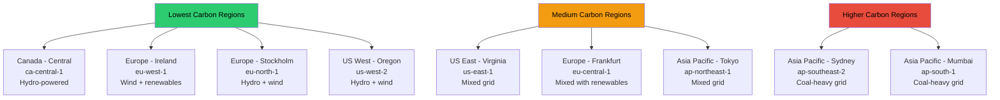
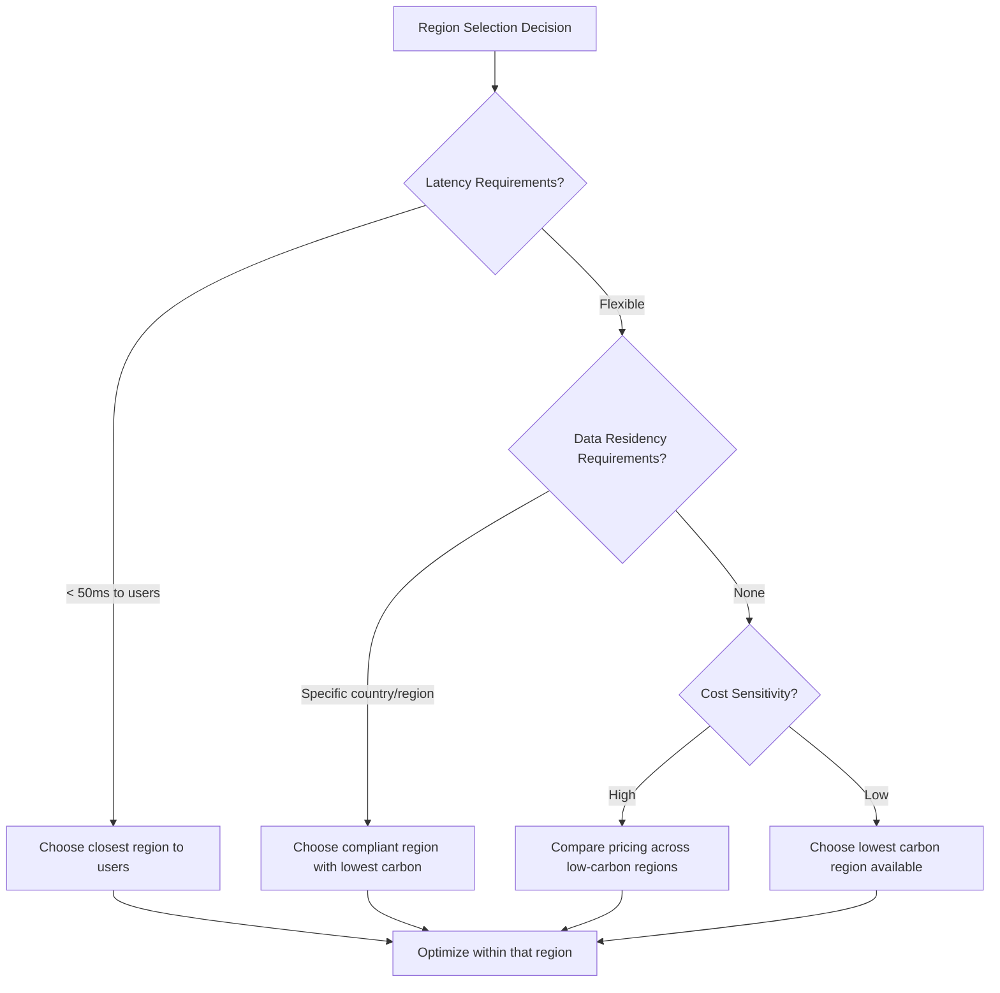

# How to Choose AWS Regions for Lower Carbon Footprint

Author: [nawazdhandala](https://github.com/nawazdhandala)

Tags: AWS, Sustainability, Carbon Footprint, Region Selection, Green Computing, Cloud Architecture

Description: A data-driven guide to selecting AWS regions based on carbon intensity to minimize the environmental impact of your cloud workloads.

---

Not all AWS regions are created equal when it comes to carbon emissions. A workload running in a region powered by hydroelectric dams produces a fraction of the carbon compared to the same workload in a region relying on coal-fired power plants. The difference can be 10x or more.

If your organization has sustainability goals, or you simply want to reduce your environmental impact without sacrificing performance, region selection is one of the highest-leverage decisions you can make. This guide gives you the data and framework to make that choice.

## Why Region Selection Matters for Carbon

The carbon intensity of electricity varies enormously depending on the energy sources in the local grid. Here is a rough comparison:

| Energy Source | Carbon Intensity (gCO2/kWh) |
|--------------|----------------------------|
| Coal | 820-1200 |
| Natural Gas | 350-500 |
| Solar | 20-50 |
| Wind | 7-15 |
| Nuclear | 5-12 |
| Hydroelectric | 4-14 |

An AWS region located in an area with abundant hydroelectric or wind power will have dramatically lower carbon intensity than one in a coal-heavy area. Since your workloads consume electricity, the source of that electricity determines your carbon footprint.

## AWS Region Carbon Intensity Rankings

AWS does not publish exact carbon intensity numbers per region, but we can estimate them based on the local electricity grid data and what AWS has disclosed about their renewable energy projects.



### Tier 1: Lowest Carbon (Recommended)

**ca-central-1 (Canada - Central)** - Quebec's electricity grid is over 95% hydroelectric. This is consistently one of the cleanest regions.

**eu-north-1 (Europe - Stockholm)** - Sweden's grid is dominated by hydro and nuclear, with growing wind capacity. Extremely low carbon intensity.

**eu-west-1 (Europe - Ireland)** - Ireland has invested heavily in wind energy. AWS's Dublin region benefits from this plus AWS's own renewable energy purchases.

**us-west-2 (US West - Oregon)** - The Pacific Northwest grid has significant hydroelectric capacity from the Columbia River system. AWS has also invested in wind and solar farms in the region.

### Tier 2: Moderate Carbon

**us-east-1 (US East - Virginia)** - The most popular AWS region. Virginia's grid is a mix of natural gas, nuclear, and growing renewable capacity. AWS has significant solar farm investments here, but the grid is still mixed.

**eu-central-1 (Europe - Frankfurt)** - Germany's grid includes significant renewable capacity but also coal and natural gas. It varies seasonally.

**ap-northeast-1 (Asia Pacific - Tokyo)** - Japan's grid relies heavily on natural gas and some nuclear (post-Fukushima recovery). Moderate carbon intensity.

### Tier 3: Higher Carbon

**ap-southeast-2 (Asia Pacific - Sydney)** - Australia's grid still relies heavily on coal, though this is improving with solar and wind investments.

**ap-south-1 (Asia Pacific - Mumbai)** - India's grid is coal-heavy, resulting in high carbon intensity.

## Building a Region Selection Framework

Carbon is not the only factor in region selection. You need to balance it against latency, compliance, cost, and service availability.



### Step 1: Define Your Constraints

Start by listing non-negotiable requirements:

```python
# Region selection criteria framework
region_criteria = {
    "latency_requirements": {
        "target_users": ["North America", "Europe"],
        "max_latency_ms": 100,
        "eligible_regions": [
            "us-east-1", "us-east-2", "us-west-1", "us-west-2",
            "ca-central-1", "eu-west-1", "eu-west-2", "eu-central-1",
            "eu-north-1"
        ]
    },
    "compliance_requirements": {
        "data_residency": None,  # No restriction
        "certifications_needed": ["SOC2", "ISO27001"],
        # All AWS regions meet these
    },
    "service_requirements": [
        "Amazon EKS",
        "Amazon Aurora",
        "AWS Lambda",
        # Verify these are available in candidate regions
    ]
}
```

### Step 2: Score Candidate Regions

Once you have your eligible regions, score them on carbon intensity:

```python
# Approximate carbon intensity scores for common AWS regions
# Lower score = lower carbon (scale of 1-10)
carbon_scores = {
    "ca-central-1": 1,     # Quebec hydro
    "eu-north-1": 1,       # Swedish hydro + wind
    "eu-west-1": 2,        # Irish wind
    "us-west-2": 2,        # Oregon hydro
    "eu-west-2": 3,        # UK mixed with offshore wind
    "us-west-1": 4,        # California mixed
    "eu-central-1": 4,     # Germany mixed
    "us-east-1": 5,        # Virginia mixed
    "us-east-2": 5,        # Ohio mixed
    "ap-northeast-1": 6,   # Japan LNG + nuclear
    "ap-southeast-1": 7,   # Singapore gas
    "ap-southeast-2": 8,   # Australia coal-heavy
    "ap-south-1": 9,       # India coal-heavy
}

# Filter by eligible regions and sort by carbon score
eligible = region_criteria["latency_requirements"]["eligible_regions"]
ranked = sorted(
    [(r, carbon_scores[r]) for r in eligible if r in carbon_scores],
    key=lambda x: x[1]
)

print("Regions ranked by carbon intensity (lowest first):")
for region, score in ranked:
    print(f"  {region}: {score}/10")
```

### Step 3: Validate Latency

Use CloudPing or your own measurements to confirm latency from your user base to candidate regions:

```bash
# Measure latency to multiple AWS regions from your location
# Using the AWS EC2 IMDS from an existing instance, or curl from anywhere
for region in ca-central-1 eu-north-1 us-west-2 eu-west-1 us-east-1; do
  latency=$(curl -s -o /dev/null -w "%{time_total}" \
    "https://ec2.${region}.amazonaws.com/ping" 2>/dev/null)
  echo "Region: ${region} - Latency: ${latency}s"
done
```

### Step 4: Compare Costs

Pricing varies by region. Check that the cost difference does not outweigh the sustainability benefits:

```bash
# Compare EC2 pricing across candidate regions
aws pricing get-products \
  --service-code AmazonEC2 \
  --filters \
    "Type=TERM_MATCH,Field=instanceType,Value=m6g.xlarge" \
    "Type=TERM_MATCH,Field=operatingSystem,Value=Linux" \
    "Type=TERM_MATCH,Field=tenancy,Value=Shared" \
    "Type=TERM_MATCH,Field=preInstalledSw,Value=NA" \
  --region us-east-1
```

In many cases, low-carbon regions like Canada Central and Oregon are also among the cheaper regions. You often do not have to pay more for sustainability.

## Multi-Region Strategies for Sustainability

If your application spans multiple regions, you can route traffic intelligently to favor lower-carbon regions:

### Weighted DNS Routing

Use Route 53 to send a higher proportion of traffic to your greenest region:

```bash
# Route 53 weighted routing - send 70% to low-carbon region
aws route53 change-resource-record-sets \
  --hosted-zone-id Z1234567890 \
  --change-batch '{
    "Changes": [
      {
        "Action": "UPSERT",
        "ResourceRecordSet": {
          "Name": "api.example.com",
          "Type": "A",
          "SetIdentifier": "green-region",
          "Weight": 70,
          "AliasTarget": {
            "HostedZoneId": "Z2ABCDEF123456",
            "DNSName": "alb-ca-central.example.com",
            "EvaluateTargetHealth": true
          }
        }
      },
      {
        "Action": "UPSERT",
        "ResourceRecordSet": {
          "Name": "api.example.com",
          "Type": "A",
          "SetIdentifier": "standard-region",
          "Weight": 30,
          "AliasTarget": {
            "HostedZoneId": "Z3GHIJKL789012",
            "DNSName": "alb-us-east.example.com",
            "EvaluateTargetHealth": true
          }
        }
      }
    ]
  }'
```

### Batch Processing in Green Regions

For workloads that are not latency-sensitive (batch processing, ETL, ML training), always run them in your greenest available region:

```python
# Route batch jobs to the lowest-carbon region
import boto3

def submit_batch_job(job_name, job_definition, job_queue_prefix):
    """Submit a batch job to the greenest available region"""

    # Ordered by carbon intensity (lowest first)
    preferred_regions = ['ca-central-1', 'eu-north-1', 'us-west-2']

    for region in preferred_regions:
        try:
            batch = boto3.client('batch', region_name=region)
            response = batch.submit_job(
                jobName=job_name,
                jobQueue=f"{job_queue_prefix}-{region}",
                jobDefinition=job_definition
            )
            print(f"Job submitted to {region}: {response['jobId']}")
            return response
        except Exception as e:
            print(f"Failed to submit to {region}: {e}")
            continue

    raise Exception("No available region for batch job")
```

## Tracking Region-Level Carbon Impact

Use the AWS Customer Carbon Footprint Tool to track emissions by region. If you see that one region dominates your emissions, that is your signal to investigate migration. For detailed instructions, see our guide on [using the AWS Customer Carbon Footprint Tool](https://oneuptime.com/blog/post/2026-02-12-use-aws-customer-carbon-footprint-tool/view).

For continuous monitoring of your multi-region infrastructure alongside sustainability metrics, [OneUptime](https://oneuptime.com) provides unified observability across all your AWS regions.

## The Grid Is Getting Greener

An important context: electricity grids worldwide are getting cleaner as more renewable capacity comes online. AWS has a goal of powering its operations with 100% renewable energy. As this happens, the carbon difference between regions will narrow.

But that transition is not complete yet, and it will not be for years. Making region-aware decisions today has real impact.

## Wrapping Up

Choosing the right AWS region for carbon efficiency is one of the simplest and highest-impact sustainability decisions you can make. The best regions - Canada Central, Stockholm, Ireland, and Oregon - offer low carbon intensity without significant cost or performance penalties for many workloads.

The framework is straightforward: define your constraints (latency, compliance, services), score eligible regions on carbon intensity, validate that latency and cost work, and pick the greenest option that meets your needs. For non-latency-sensitive workloads, always default to your greenest region.

Combined with other optimization strategies like [right-sizing and using Graviton processors](https://oneuptime.com/blog/post/2026-02-12-optimize-aws-workloads-for-sustainability/view), smart region selection can reduce your cloud carbon footprint by 50% or more without changing a line of application code.
