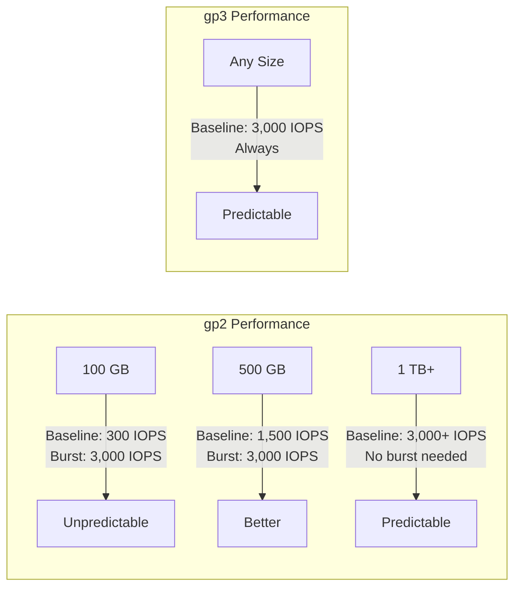
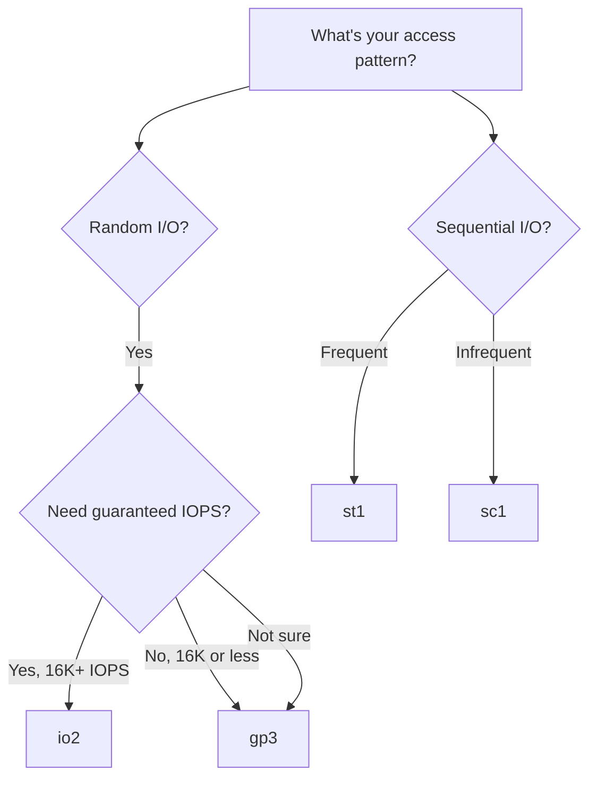

# How to Choose Between EBS Volume Types (gp3, io2, st1, sc1)

Author: [nawazdhandala](https://github.com/nawazdhandala)

Tags: AWS, EC2, EBS, Storage, Performance, Cost Optimization

Description: A practical comparison of EBS volume types including gp3, gp2, io2, io1, st1, and sc1, with guidance on matching each type to the right workload.

---

AWS offers six EBS volume types, and picking the right one makes a real difference in both performance and cost. The wrong choice can mean paying 10x more than you need to, or getting 10x less performance than you expected. Each type is designed for specific access patterns, and understanding those patterns is the key to choosing well.

## The Quick Answer

If you're in a hurry:

- **Most workloads**: gp3. It's the best general purpose option.
- **Databases needing guaranteed IOPS**: io2 or io2 Block Express.
- **Big data, streaming, logs**: st1.
- **Archival, infrequent access**: sc1.

Now let's dig into why.

## Volume Types at a Glance

| Type | Category | Max IOPS | Max Throughput | Price (GB/month) | Best For |
|------|----------|----------|---------------|-------------------|----------|
| gp3 | SSD | 16,000 | 1,000 MB/s | $0.08 | Most workloads |
| gp2 | SSD | 16,000 | 250 MB/s | $0.10 | Legacy (prefer gp3) |
| io2 | SSD | 64,000 | 1,000 MB/s | $0.125 + IOPS | Databases, latency-critical |
| io2 Block Express | SSD | 256,000 | 4,000 MB/s | $0.125 + IOPS | Extreme performance |
| io1 | SSD | 64,000 | 1,000 MB/s | $0.125 + IOPS | Legacy (prefer io2) |
| st1 | HDD | 500 | 500 MB/s | $0.045 | Sequential read/write |
| sc1 | HDD | 250 | 250 MB/s | $0.015 | Cold storage |

## gp3: The Default Choice

gp3 is the newest general purpose SSD type and should be your go-to for most workloads. Here's why:

**Baseline performance without gimmicks.** Every gp3 volume gets 3,000 IOPS and 125 MB/s throughput included in the price, regardless of size. A 1 GB volume and a 1 TB volume both get the same baseline.

**Independent scaling of IOPS and throughput.** Need more IOPS? Add them. Need more throughput? Add that. You pay for exactly what you configure.

**20% cheaper than gp2.** Same (or better) performance at a lower price per GB. There's almost no reason to use gp2 anymore.

```bash
# Create a gp3 volume with custom performance settings
aws ec2 create-volume \
    --volume-type gp3 \
    --size 200 \
    --iops 6000 \
    --throughput 400 \
    --availability-zone us-east-1a \
    --encrypted
```

**gp3 pricing example (200 GB, 6,000 IOPS, 400 MB/s):**
- Storage: 200 GB x $0.08 = $16.00/month
- Additional IOPS: (6,000 - 3,000) x $0.005 = $15.00/month
- Additional throughput: (400 - 125) x $0.04 = $11.00/month
- **Total: $42.00/month**

## gp2: The Legacy General Purpose

gp2 ties performance to volume size: you get 3 IOPS per GB, with a minimum of 100 IOPS and a burst capability up to 3,000 IOPS for volumes under 1 TB.

The burst model is the problem. Small gp2 volumes (under 1 TB) rely on burst credits for decent IOPS. When credits run out, you're stuck at the baseline (e.g., 300 IOPS for a 100 GB volume). This creates unpredictable performance.



**Migration tip**: Switch all your gp2 volumes to gp3 online with no downtime. See our guide on [resizing EBS volumes without downtime](https://oneuptime.com/blog/post/resize-ebs-volume-without-downtime/view).

```bash
# Migrate from gp2 to gp3 (no downtime)
aws ec2 modify-volume \
    --volume-id vol-0123456789abcdef0 \
    --volume-type gp3
```

## io2: For Databases and Latency-Critical Workloads

io2 volumes provide provisioned IOPS with guaranteed performance. You specify exactly how many IOPS you want, and you get them consistently.

**When to use io2:**
- Production databases (PostgreSQL, MySQL, Oracle, SQL Server)
- Applications requiring sub-millisecond latency
- Workloads needing more than 16,000 IOPS per volume
- Multi-Attach scenarios (attaching one volume to multiple instances)

**io2 vs gp3 for databases:**

The real question is whether you need guaranteed IOPS or whether gp3's 16,000 IOPS ceiling is enough. For many databases, gp3 at 16,000 IOPS is plenty and costs much less:

- **gp3 at 16,000 IOPS, 200 GB**: $16 + (13,000 x $0.005) = $81/month
- **io2 at 16,000 IOPS, 200 GB**: $25 + (16,000 x $0.065) = $1,065/month

io2 costs roughly 13x more for the same IOPS. The premium buys you:
- 99.999% durability (vs 99.8-99.9% for gp3)
- Multi-Attach capability
- More consistent latency
- Up to 64,000 IOPS per volume

```bash
# Create an io2 volume for a production database
aws ec2 create-volume \
    --volume-type io2 \
    --size 500 \
    --iops 32000 \
    --availability-zone us-east-1a \
    --encrypted
```

### io2 Block Express

For instances that support it (R5b, X2idn, etc.), io2 Block Express pushes the limits further: up to 256,000 IOPS and 4,000 MB/s throughput per volume. This is for the most demanding database workloads.

## st1: Throughput-Optimized HDD

st1 is an HDD type designed for sequential access patterns. It's much cheaper than SSD but has a completely different performance profile.

**When to use st1:**
- Big data and data warehouse workloads (EMR, Hadoop)
- Log processing
- Streaming data (Kafka, Kinesis)
- Any workload that reads/writes large amounts of data sequentially

**When NOT to use st1:**
- Random I/O workloads (databases, boot volumes)
- Anything needing low latency (HDD latency is much higher than SSD)
- Boot volumes (st1 can't be used as root volumes)

```bash
# Create an st1 volume for log storage
aws ec2 create-volume \
    --volume-type st1 \
    --size 2000 \
    --availability-zone us-east-1a \
    --encrypted
```

st1 throughput scales with size: 40 MB/s per TB, up to 500 MB/s. A 2 TB volume gives you 80 MB/s baseline with burst to 250 MB/s.

**Cost comparison for 2 TB:**
- gp3: 2,000 x $0.08 = $160/month
- st1: 2,000 x $0.045 = $90/month

For sequential workloads, st1 saves 44% and might actually deliver better throughput for your use case.

## sc1: Cold HDD

sc1 is the cheapest EBS volume type, designed for data you rarely access.

**When to use sc1:**
- Archival data that needs to stay on block storage
- Infrequently accessed file shares
- Backup storage where cost matters more than speed

```bash
# Create an sc1 volume for archival storage
aws ec2 create-volume \
    --volume-type sc1 \
    --size 5000 \
    --availability-zone us-east-1a
```

sc1 offers just 12 MB/s per TB baseline throughput. For 5 TB, that's 60 MB/s. If you need even cheaper storage and don't require block-level access, consider S3 instead.

## Decision Flowchart



## Comparing Costs for Common Scenarios

### Web Server (100 GB, moderate I/O)

| Type | Monthly Cost | IOPS | Throughput |
|------|-------------|------|------------|
| gp3 | $8.00 | 3,000 | 125 MB/s |
| gp2 | $10.00 | 300 (burst 3,000) | 128 MB/s |
| io2 (3,000 IOPS) | $207.50 | 3,000 | 125 MB/s |

Winner: gp3, by a large margin.

### Production Database (500 GB, 10,000 IOPS)

| Type | Monthly Cost | IOPS | Notes |
|------|-------------|------|-------|
| gp3 | $75.00 | 10,000 | Good for most databases |
| io2 | $712.50 | 10,000 | Guaranteed, higher durability |

Winner: gp3 unless you need io2's guarantees.

### Data Processing (5 TB, sequential)

| Type | Monthly Cost | Throughput |
|------|-------------|------------|
| gp3 | $400.00 | 125 MB/s (or pay for more) |
| st1 | $225.00 | 200 MB/s baseline |

Winner: st1 for sequential workloads.

## Monitoring and Optimization

After selecting a volume type, monitor its performance to verify your choice:

```bash
# Monitor key CloudWatch metrics for your volumes
# BurstBalance - for gp2/st1/sc1, shows remaining burst credits
# VolumeReadOps/VolumeWriteOps - actual IOPS
# VolumeReadBytes/VolumeWriteBytes - actual throughput
# VolumeQueueLength - I/O requests waiting (high = bottleneck)

aws cloudwatch get-metric-statistics \
    --namespace AWS/EBS \
    --metric-name VolumeQueueLength \
    --dimensions Name=VolumeId,Value=vol-0123456789abcdef0 \
    --start-time 2026-02-11T00:00:00Z \
    --end-time 2026-02-12T00:00:00Z \
    --period 3600 \
    --statistics Average
```

Use [OneUptime](https://oneuptime.com) to build dashboards that track I/O performance across your entire fleet and alert when volumes are undersized or burst credits are depleting.

## Key Takeaways

1. **Start with gp3.** It's the right answer for 80% of workloads.
2. **Use io2 only when you need it.** The cost premium is substantial, so make sure you're getting value from it.
3. **Don't forget HDD types.** For sequential workloads, st1 costs less and can outperform SSD in throughput.
4. **Migrate from gp2 to gp3.** It's a free performance upgrade with lower cost.
5. **Match the volume to the workload, not the other way around.** A 10 TB gp3 volume for archival data wastes money. A 100 GB sc1 volume for a database wastes time.

The right volume type saves money and improves performance. The wrong one does neither. Take the time to understand your workload's I/O patterns, and the choice becomes obvious.
