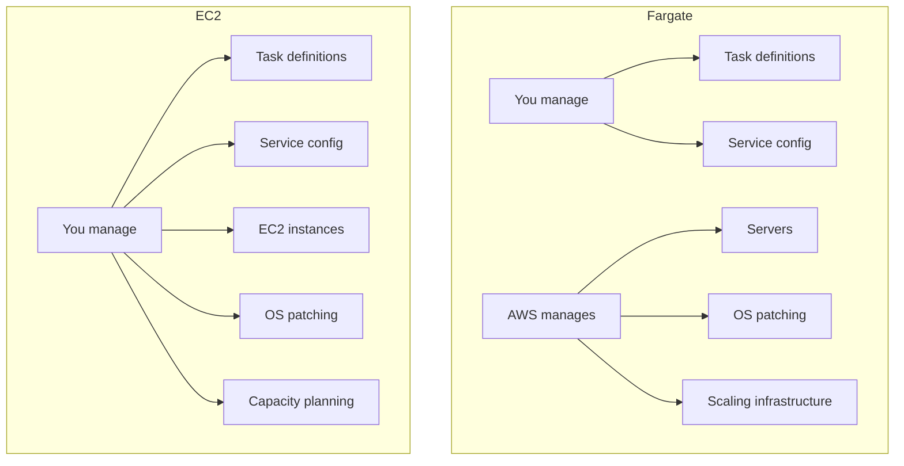

# How to Choose Between ECS Fargate and EC2 Launch Type

Author: [nawazdhandala](https://github.com/nawazdhandala)

Tags: AWS, ECS, Fargate, EC2, Containers

Description: A practical comparison of ECS Fargate and EC2 launch types, covering cost, performance, operational complexity, and use cases to help you make the right choice for your workload.

---

One of the first decisions you'll face with ECS is whether to use Fargate or EC2 for your compute. Both run your containers, both integrate with the same ECS features (services, task definitions, load balancers), but they differ significantly in how you manage infrastructure, what you pay, and what flexibility you get.

There's no universally right answer. Let's break down the differences so you can pick the one that fits your situation.

## The Core Difference

With **Fargate**, you define how much CPU and memory your container needs, and AWS handles everything else. You don't see or manage the underlying servers. Each task gets its own isolated environment.

With **EC2**, you manage a fleet of EC2 instances. ECS schedules your containers onto these instances. You control the instance types, the operating system, and how containers are packed onto hosts.



## Cost Comparison

This is usually the deciding factor, so let's dig into the numbers.

### Fargate Pricing

Fargate charges per vCPU-second and per GB-second of memory your task uses. As of 2026, roughly:

- vCPU per hour: ~$0.04048
- GB memory per hour: ~$0.004445

A task with 0.5 vCPU and 1 GB memory running 24/7 costs about $29/month.

### EC2 Pricing

With EC2, you pay for the instances regardless of how many containers you run on them. A t3.large (2 vCPU, 8 GB) costs about $60/month on-demand, but:

- With 1-year reserved instances: ~$38/month (37% savings)
- With 3-year reserved instances: ~$24/month (60% savings)
- With spot instances: ~$18/month (70% savings)

The key math: if you can pack 4-6 containers onto a t3.large (which has 2 vCPU and 8 GB), the per-container cost on EC2 is much lower than Fargate.

### Cost Summary Table

Here's what running a small service (3 tasks, 0.5 vCPU, 1 GB each) looks like per month:

| Option | Monthly Cost | Operational Effort |
|--------|-------------|-------------------|
| Fargate | ~$87 | Minimal |
| Fargate Spot | ~$61 | Minimal (handle interruptions) |
| EC2 On-Demand (1x t3.large) | ~$60 | Moderate |
| EC2 Reserved (1x t3.large, 1yr) | ~$38 | Moderate |
| EC2 Spot (1x t3.large) | ~$18 | Higher (handle interruptions + manage instances) |

At small scale, the difference doesn't matter much. At 100+ tasks running 24/7, the gap becomes significant.

## Operational Complexity

### Fargate - Simpler Operations

What you don't have to deal with:

- No AMI updates or OS patching
- No instance scaling decisions
- No capacity planning
- No container-to-instance bin-packing optimization
- No SSH access needed (which is also a security benefit)

What you still handle:

- Task definitions and service configuration
- Application-level scaling
- Container image management
- Application monitoring and logging

### EC2 - More Control, More Work

What you take on:

- AMI updates and OS patches (ECS-optimized AMI updates monthly)
- Auto Scaling Group configuration and tuning
- Capacity provider management
- Instance health monitoring
- Draining instances during updates
- Security hardening of the host OS

What you gain:

- SSH access to instances for debugging
- Custom AMIs with pre-loaded software
- Full control over instance types
- Docker volume mount options
- Ability to run privileged containers
- Access to instance metadata and host networking

## Performance Considerations

### Startup Time

Fargate tasks typically take 30-60 seconds to start. The infrastructure needs to be provisioned, the image needs to be pulled, and the container needs to start. If your images are large (1 GB+), it can take longer.

EC2 tasks start faster (5-15 seconds) when an instance with available capacity already exists, because the instance is already running and often has the image cached. But if a new instance needs to launch, add 2-3 minutes for that.

### Resource Ceiling

Fargate maxes out at 4 vCPU and 30 GB memory per task. For most workloads that's plenty, but if you need a task with 16 GB of RAM for in-memory processing or GPU access, EC2 is your only option.

EC2 gives you access to the full range of instance types, including:
- Compute-optimized (c5, c6g) for CPU-heavy workloads
- Memory-optimized (r5, r6g) for large in-memory datasets
- GPU instances (p3, g4) for ML inference
- Storage-optimized (i3, d2) for data-intensive workloads

### Networking

Fargate tasks using `awsvpc` mode each get their own ENI (elastic network interface). This provides great isolation but means each task consumes one IP address from your subnet. For large clusters, subnet sizing matters.

EC2 tasks can use `bridge` networking mode, where multiple containers share the host's IP address with dynamic port mapping. This uses fewer IP addresses and works well with ALBs.

## Security

Fargate has a slight edge in security by default:

- No SSH access means no one can log into the host
- Each task runs in its own micro-VM (using Firecracker)
- You can't run privileged containers (which is a feature, not a bug)
- The host OS is managed and patched by AWS

EC2 requires more security attention:

- You need to patch the host OS regularly
- SSH key management
- Instance security group management
- Shared host means containers can potentially see each other's resources if not properly isolated

## When to Use Fargate

Fargate is the right choice when:

- You're a small team and want to minimize operational burden
- Your workload is spiky or unpredictable (pay-per-use is efficient)
- You're running a moderate number of tasks (under ~50 at steady state)
- You don't need GPU or specialized instance types
- Security isolation between tasks is important
- You want to get to production as quickly as possible

## When to Use EC2

EC2 is the right choice when:

- You're running at scale where reserved/spot pricing makes a big difference
- You need GPU instances for ML workloads
- You need instance types with specific CPU/memory ratios
- You need privileged containers or host access
- Your containers need to access the host filesystem or Docker socket
- Startup time is critical and you want cached images
- You have a platform team that can manage the infrastructure

## The Hybrid Approach

You don't have to pick one. A single ECS cluster can use both Fargate and EC2 through capacity providers.

```bash
# Cluster with both Fargate and EC2 capacity providers
aws ecs create-cluster \
  --cluster-name hybrid-cluster \
  --capacity-providers FARGATE FARGATE_SPOT ec2-on-demand ec2-spot \
  --default-capacity-provider-strategy \
    capacityProvider=FARGATE,weight=1,base=0

# Run specific services on the best-fit launch type
# Web frontends on Fargate (simple, auto-scaling)
aws ecs create-service \
  --cluster hybrid-cluster \
  --service-name web-frontend \
  --task-definition web:1 \
  --desired-count 3 \
  --capacity-provider-strategy capacityProvider=FARGATE,weight=1

# ML inference on EC2 with GPUs
aws ecs create-service \
  --cluster hybrid-cluster \
  --service-name ml-inference \
  --task-definition ml-model:1 \
  --desired-count 2 \
  --capacity-provider-strategy capacityProvider=ec2-gpu,weight=1

# Batch processing on Fargate Spot (cheap, interruptible is fine)
aws ecs run-task \
  --cluster hybrid-cluster \
  --task-definition batch-job:1 \
  --capacity-provider-strategy capacityProvider=FARGATE_SPOT,weight=1
```

## Decision Framework

Here's a quick decision tree:

1. Do you need GPUs or specialized instance types? -> **EC2**
2. Are you running 100+ tasks 24/7? -> **EC2** (with reserved/spot pricing)
3. Is operational simplicity your top priority? -> **Fargate**
4. Is your workload spiky or unpredictable? -> **Fargate**
5. Do you need fast container startup times? -> **EC2** (with warm pool)
6. Not sure? -> **Start with Fargate**, migrate to EC2 if costs become a concern

## Wrapping Up

Start with Fargate unless you have a clear reason to use EC2. It's simpler, and you can always move to EC2 later. The ECS task definition and service configuration are nearly identical between the two, so switching isn't a massive undertaking. For most workloads at moderate scale, the Fargate premium over EC2 is worth the operational simplicity. But at larger scales, the cost savings from EC2 spot and reserved instances can be substantial enough to justify the extra management overhead.
