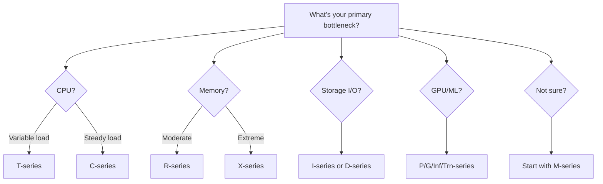

# How to Choose the Right EC2 Instance Type for Your Workload

Author: [nawazdhandala](https://github.com/nawazdhandala)

Tags: AWS, EC2, Instance Types, Cloud Computing, Performance Optimization

Description: Learn how to pick the best EC2 instance type for your application by understanding instance families, sizing, and matching resources to workload characteristics.

---

AWS offers hundreds of EC2 instance types, and picking the wrong one can mean you're either wasting money on resources you don't need or starving your application of the CPU, memory, or network bandwidth it requires. The good news is that once you understand the naming convention and the major instance families, the choice gets much simpler.

This guide breaks down EC2 instance families, explains when to use each one, and gives you a practical framework for making the right call.

## Understanding the Instance Naming Convention

Every EC2 instance type follows a specific naming pattern. Let's decode it:

```
m7g.2xlarge
│││  │
││└── Generation (7 = seventh generation)
│└─── Family modifier (g = Graviton/ARM processor)
│      Other modifiers: i = Intel, a = AMD, n = enhanced networking
└──── Family (m = general purpose)
      Size: nano, micro, small, medium, large, xlarge, 2xlarge, etc.
```

The generation number matters. Higher generations are almost always better price-performance. If you're choosing between m5.large and m7g.large, go with m7g unless you have a specific reason to stay on the older generation.

## Instance Family Overview

### General Purpose (T, M)

**T-series (t3, t3a, t4g)** are burstable instances. They give you a baseline level of CPU and let you burst above it when needed. They're perfect for workloads with variable CPU usage - things like small web servers, development environments, and microservices that mostly idle but occasionally spike.

The "burst" model works on CPU credits. You accumulate credits when you're below baseline, and spend them when you burst. If you consistently max out CPU, you'll run out of credits and get throttled. For sustained high CPU, look at M-series instead.

**M-series (m5, m6i, m7g)** are the workhorse general purpose instances. Fixed CPU performance (no bursting), balanced ratio of compute, memory, and networking. Use these when:

- Your application needs consistent CPU performance
- You're not sure what you need (M-series is the safe default)
- You're running production workloads that don't fit neatly into compute or memory-optimized categories

### Compute Optimized (C)

**C-series (c5, c6i, c7g)** instances have a higher ratio of CPU to memory. They're built for:

- Batch processing jobs
- High-performance web servers
- Scientific modeling
- Machine learning inference
- Gaming servers
- Video encoding

If your application is CPU-bound and doesn't need tons of memory, C-series gives you more compute power per dollar than M-series.

### Memory Optimized (R, X, z)

**R-series (r5, r6i, r7g)** instances have more memory relative to CPU. They're the right fit for:

- In-memory databases (Redis, Memcached)
- Real-time big data analytics
- Large application caches
- Databases with heavy read workloads

**X-series (x2idn, x2iedn)** take it further with massive amounts of memory - up to 4 TB of RAM. These are for enterprise-grade SAP HANA deployments, in-memory databases at scale, and similar workloads.

### Storage Optimized (I, D, H)

**I-series (i3, i4i)** instances come with high-speed local NVMe storage. Use them when you need very high random I/O performance - things like NoSQL databases (Cassandra, MongoDB), data warehousing, and distributed file systems.

**D-series (d3, d3en)** are designed for MapReduce, HDFS, and distributed file systems that need high sequential read/write throughput on local storage.

### Accelerated Computing (P, G, Inf, Trn)

**P-series (p4d, p5)** are GPU instances for machine learning training and HPC. **G-series (g5, g6)** are GPU instances better suited for graphics rendering and ML inference. **Inf and Trn** instances use custom AWS chips (Inferentia and Trainium) designed specifically for ML workloads at a lower cost than GPU instances.

## A Practical Decision Framework

Here's a simple way to think through instance selection:



## Sizing Your Instance

Once you've picked a family, you need to pick a size. Here's the general progression for an M7g instance:

| Size | vCPUs | Memory (GiB) | Network (Gbps) |
|------|-------|-------------|-----------------|
| medium | 1 | 4 | Up to 12.5 |
| large | 2 | 8 | Up to 12.5 |
| xlarge | 4 | 16 | Up to 12.5 |
| 2xlarge | 8 | 32 | Up to 15 |
| 4xlarge | 16 | 64 | Up to 25 |

Each step up roughly doubles everything. The price doubles too, so there's no discount for going bigger - but there's no penalty either.

### Right-Sizing Strategy

Don't try to guess the perfect size upfront. Here's what actually works:

1. **Start slightly larger than you think you need.** It's much easier to scale down than to deal with performance problems in production.

2. **Monitor for 2-4 weeks.** Look at CPU utilization, memory usage, network throughput, and disk I/O. You can use CloudWatch metrics or set up monitoring with [OneUptime](https://oneuptime.com) to get a clear picture.

3. **Scale down if utilization is consistently low.** If your CPU averages under 20% and memory usage stays under 40%, you're probably oversized.

4. **Use AWS Compute Optimizer.** After running for a few days, Compute Optimizer analyzes your usage patterns and recommends the right instance type and size.

You can change your instance type without losing data - just stop the instance, change the type, and start it again. See our guide on [resizing EC2 instances](https://oneuptime.com/blog/post/2026-02-12-resize-ec2-instance-change-instance-type/view) for the step-by-step process.

## Graviton vs Intel vs AMD

AWS offers most instance types with three processor options:

- **Graviton (g suffix)** - ARM-based, designed by AWS. Best price-performance in most cases. About 20-40% cheaper than Intel equivalents.
- **Intel (i suffix or no suffix)** - Broadest software compatibility. Required if your software only runs on x86.
- **AMD (a suffix)** - x86 compatible, usually 10% cheaper than Intel. Good middle ground.

If your application runs on Linux and doesn't depend on x86-specific instructions, Graviton instances are almost always the best choice. Most modern languages and frameworks (Node.js, Python, Java, Go, .NET 6+) work perfectly on ARM.

## Pricing Models

The instance type is only half the equation. How you pay matters just as much:

**On-Demand**: Full price, no commitment. Good for unpredictable workloads or short-term needs.

**Savings Plans**: Commit to a consistent amount of compute usage (measured in $/hour) for 1 or 3 years. Saves 30-60%.

**Reserved Instances**: Commit to a specific instance type in a specific region for 1 or 3 years. Similar savings to Savings Plans but less flexible.

**Spot Instances**: Use spare AWS capacity at up to 90% discount. AWS can take the instance back with 2 minutes notice. Great for fault-tolerant batch jobs, CI/CD workloads, and stateless workers.

## Practical Examples

**Small web application (Django/Rails)**: Start with t3.small or t3.medium. If CPU credits run out regularly, switch to m7g.medium.

**Production API server**: m7g.large or m7g.xlarge. General purpose gives you headroom for unexpected spikes without overpaying.

**Redis cache**: r7g.large or r7g.xlarge. You're paying for memory here, so memory-optimized is the right fit.

**ML training**: p4d.24xlarge for serious training. For experimentation, g5.xlarge offers a GPU at a more reasonable price point.

**Batch processing pipeline**: c7g instances for CPU-heavy work, or spot instances to keep costs down since batch jobs are usually fault-tolerant.

## Common Mistakes

**Over-provisioning from the start.** Running a c5.4xlarge for a blog that serves 100 visitors a day is just burning money.

**Ignoring Graviton.** If your stack supports ARM (most do), you're leaving 20-40% savings on the table.

**Using burstable instances for steady workloads.** T-series instances are cheap until you run out of burst credits and your CPU gets throttled to baseline. Check your CPU credit balance in CloudWatch.

**Never reviewing instance utilization.** Set a quarterly reminder to review what you're running and whether it still makes sense. Workload patterns change, new instance types launch, and what was optimal six months ago might not be today.

Choosing the right instance type isn't a one-time decision - it's something you should revisit as your application evolves and as AWS releases new options.
