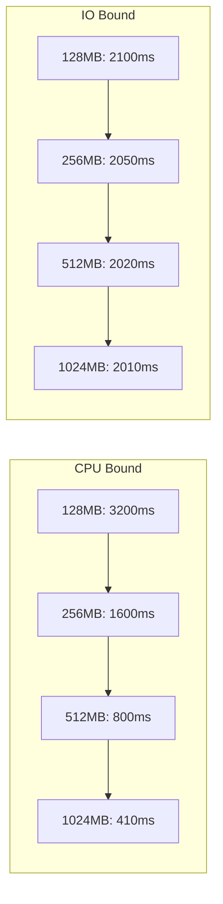

# How to Choose the Right Lambda Memory Size for Performance

Author: [nawazdhandala](https://github.com/nawazdhandala)

Tags: AWS, Lambda, Performance, Optimization, Serverless

Description: A data-driven guide to selecting the optimal Lambda memory size by understanding the memory-CPU-cost relationship and profiling your functions.

---

Picking the right memory size for a Lambda function is part science, part experimentation. Too little memory and your function runs slowly, times out, or crashes. Too much and you're throwing money away on resources you don't use. The sweet spot is where you get the performance you need at the lowest cost - and finding it requires understanding how Lambda's resource allocation actually works.

## The Memory-CPU Curve

Lambda doesn't let you configure CPU independently. CPU scales linearly with memory:

```
CPU allocation = (memory_mb / 1769) vCPUs
```

At 1,769 MB, you get exactly one full vCPU. Below that, you get a fraction. Above it, you get more than one - but only multi-threaded code can take advantage of multiple vCPUs.

This creates an interesting dynamic. For CPU-bound functions, the relationship between memory and duration is nearly inverse. Double the memory, halve the duration. For I/O-bound functions (waiting on API calls, database queries), more CPU doesn't help much because the function spends most of its time waiting.

## Step 1: Identify Your Bottleneck

Before tuning memory, figure out what's slow. Run your function and check the CloudWatch logs:

```bash
# Get the last 10 invocation reports
aws logs filter-log-events \
  --log-group-name "/aws/lambda/my-function" \
  --filter-pattern "REPORT" \
  --limit 10 \
  --query "events[].message" \
  --output text
```

Each REPORT line tells you:

```
REPORT RequestId: abc-123
  Duration: 1523.45 ms
  Billed Duration: 1524 ms
  Memory Size: 256 MB
  Max Memory Used: 112 MB
  Init Duration: 845.32 ms
```

Look at three things:

1. **Duration vs Init Duration** - If init duration is a large portion of total duration, you have a cold start problem (different from a memory problem)
2. **Max Memory Used vs Memory Size** - If you're using 112 MB out of 256 MB, you have headroom
3. **Duration consistency** - If duration varies wildly, you might have an I/O bottleneck

## Step 2: Run a Manual Benchmark

Test your function at multiple memory levels and record the results. Here's a script that does this:

```bash
#!/bin/bash
# benchmark.sh - Test a Lambda function at different memory sizes

FUNCTION_NAME="my-function"
PAYLOAD='{"test": "benchmark"}'
ITERATIONS=10

MEMORY_SIZES=(128 256 512 1024 1769 2048 3008)

echo "Memory(MB),AvgDuration(ms),MaxMemUsed(MB),EstCostPerInvoke"

for MEM in "${MEMORY_SIZES[@]}"; do
    # Update memory
    aws lambda update-function-configuration \
        --function-name $FUNCTION_NAME \
        --memory-size $MEM > /dev/null 2>&1

    # Wait for update
    aws lambda wait function-updated --function-name $FUNCTION_NAME

    # Warm up (discard first invocation - cold start)
    aws lambda invoke --function-name $FUNCTION_NAME \
        --payload "$PAYLOAD" \
        --cli-binary-format raw-in-base64-out \
        /dev/null > /dev/null 2>&1

    TOTAL_DURATION=0
    MAX_MEM=0

    for i in $(seq 1 $ITERATIONS); do
        # Invoke the function
        RESULT=$(aws lambda invoke --function-name $FUNCTION_NAME \
            --payload "$PAYLOAD" \
            --cli-binary-format raw-in-base64-out \
            --log-type Tail \
            --query "LogResult" --output text /dev/null)

        # Decode and parse the REPORT line
        REPORT=$(echo "$RESULT" | base64 -d | grep "REPORT")
        DURATION=$(echo "$REPORT" | grep -oP 'Duration: \K[\d.]+')
        MEM_USED=$(echo "$REPORT" | grep -oP 'Max Memory Used: \K[\d]+')

        TOTAL_DURATION=$(echo "$TOTAL_DURATION + $DURATION" | bc)

        if [ "$MEM_USED" -gt "$MAX_MEM" ]; then
            MAX_MEM=$MEM_USED
        fi
    done

    AVG_DURATION=$(echo "scale=2; $TOTAL_DURATION / $ITERATIONS" | bc)
    # Cost = (memory_gb * duration_seconds) * price_per_gb_second
    COST=$(echo "scale=10; ($MEM / 1024) * ($AVG_DURATION / 1000) * 0.0000166667" | bc)

    echo "$MEM,$AVG_DURATION,$MAX_MEM,$COST"
done
```

A typical result might look like:

```
Memory(MB),AvgDuration(ms),MaxMemUsed(MB),EstCostPerInvoke
128,3245.50,98,0.0000683245
256,1622.75,98,0.0000683245
512,811.38,98,0.0000683245
1024,412.25,98,0.0000693050
1769,245.50,98,0.0000713250
2048,243.80,98,0.0000821450
3008,242.15,98,0.0001197950
```

In this example, the function is CPU-bound up to about 1024 MB (duration halves as memory doubles). Above 1769 MB, additional memory doesn't help (duration plateaus). The cost sweet spot is around 512-1024 MB.

## Step 3: Analyze the Results

Plot the data (or just eyeball the table) and look for these patterns:

**CPU-bound function**: Duration decreases linearly as memory increases. More CPU helps directly. The optimal point is where the curve starts to flatten.

**I/O-bound function**: Duration barely changes with more memory. The function is waiting on network calls, not computing. Use the minimum memory that avoids OOM errors.

**Memory-bound function**: The function needs the RAM itself (processing large files, in-memory caching). Set memory based on actual usage plus a buffer, regardless of duration.



## Step 4: Consider Cold Starts

Memory also affects cold start duration. Higher memory allocations get slightly faster cold starts because more CPU is available during initialization. If cold starts are a concern, factor that in.

Check cold start durations:

```bash
# Filter for invocations with Init Duration (cold starts)
aws logs filter-log-events \
  --log-group-name "/aws/lambda/my-function" \
  --filter-pattern "Init Duration" \
  --limit 20 \
  --query "events[].message" \
  --output text
```

## Common Recommendations by Workload

Based on testing hundreds of Lambda functions, here are starting points:

### Simple API Handlers (DynamoDB CRUD)
- **Memory**: 256-512 MB
- **Timeout**: 10 seconds
- **Why**: Mostly I/O-bound. Enough CPU to parse JSON and format responses quickly.

### Data Transformation (JSON/CSV processing)
- **Memory**: 1024-2048 MB
- **Timeout**: 60 seconds
- **Why**: CPU-bound. More memory directly reduces processing time.

### Image Processing (thumbnails, resizing)
- **Memory**: 2048-3008 MB
- **Timeout**: 30 seconds
- **Why**: Both CPU and memory intensive. Libraries like Pillow and Sharp need room.

### Machine Learning Inference
- **Memory**: 3008-10240 MB
- **Timeout**: 60 seconds
- **Why**: Model loading is memory-intensive. Inference benefits from multiple vCPUs.

### File Processing (S3 downloads, parsing)
- **Memory**: 1024-3008 MB depending on file size
- **Timeout**: 300 seconds
- **Why**: Files load into memory. The function also needs enough time for large files.

### Queue Processors (SQS, SNS)
- **Memory**: 256-512 MB
- **Timeout**: Match SQS visibility timeout
- **Why**: Usually simple processing with some I/O. Keep costs low at scale.

## The 1769 MB Threshold

There's a special significance to 1,769 MB. That's where you get exactly one full vCPU. Below this number, your function shares a CPU core and gets throttled. Above it, you get dedicated CPU cores.

For CPU-bound workloads, jumping from just below 1769 MB to 1769 MB can sometimes give a disproportionate performance boost. Test around this boundary.

## Multi-Threading Above 1769 MB

Above 1,769 MB, Lambda provides multiple vCPU cores. But your code needs to be multi-threaded to benefit. Single-threaded code won't get faster past 1,769 MB.

For Python, use concurrent.futures:

```python
import concurrent.futures

def process_item(item):
    # CPU-intensive work
    return heavy_computation(item)

def lambda_handler(event, context):
    items = event['items']

    # Use ThreadPoolExecutor for I/O-bound work
    # Use ProcessPoolExecutor for CPU-bound work
    with concurrent.futures.ThreadPoolExecutor(max_workers=4) as executor:
        results = list(executor.map(process_item, items))

    return {'processed': len(results)}
```

For Node.js, use worker threads or Promise.all for concurrent I/O:

```javascript
export const handler = async (event) => {
    const items = event.items;

    // Process items concurrently
    const results = await Promise.all(
        items.map(item => processItem(item))
    );

    return { processed: results.length };
};
```

## Automating the Optimization

For a more automated approach to finding the optimal memory size, AWS Lambda Power Tuning is an open-source tool that runs your function at different memory levels and produces a cost/performance visualization. Check out our dedicated guide on [Lambda Power Tuning](https://oneuptime.com/blog/post/aws-lambda-power-tuning-optimize-cost-performance/view).

## Wrapping Up

Choosing the right Lambda memory size isn't guesswork - it's a measurable optimization. Profile your function at multiple memory levels, identify whether it's CPU-bound or I/O-bound, and pick the sweet spot where cost and performance meet. Then revisit the setting periodically as your function's workload evolves.

For reducing cold start latency specifically, see our posts on [reducing Lambda cold start times](https://oneuptime.com/blog/post/reduce-lambda-cold-start-times/view) and [Lambda SnapStart for Java](https://oneuptime.com/blog/post/lambda-snapstart-java-functions/view).
