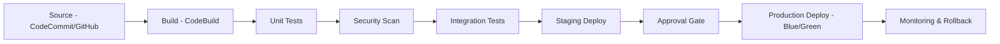

# How to Implement CI/CD Best Practices on AWS

Author: [nawazdhandala](https://github.com/nawazdhandala)

Tags: AWS, CI/CD, CodePipeline, DevOps, Best Practices

Description: Learn how to build secure, reliable CI/CD pipelines on AWS using CodePipeline, CodeBuild, and CodeDeploy with automated testing, security scanning, and safe deployments.

---

A well-built CI/CD pipeline is the backbone of modern software delivery. It's the difference between deploying confidently multiple times a day and holding your breath every time someone pushes to production. On AWS, you've got a full suite of CI/CD tools - CodePipeline, CodeBuild, CodeDeploy - and they integrate tightly with the rest of the AWS ecosystem. But having the tools isn't enough. You need to use them right.

Let's build a CI/CD pipeline that's fast, secure, and reliable.

## Pipeline Architecture

A production-ready pipeline should include multiple stages with gates between them.



## Setting Up CodePipeline

This Terraform configuration creates a multi-stage pipeline with proper IAM permissions.

```hcl
resource "aws_codepipeline" "app" {
  name     = "app-pipeline"
  role_arn = aws_iam_role.pipeline.arn

  artifact_store {
    location = aws_s3_bucket.pipeline_artifacts.id
    type     = "S3"

    encryption_key {
      id   = aws_kms_key.pipeline.arn
      type = "KMS"
    }
  }

  # Source Stage
  stage {
    name = "Source"
    action {
      name             = "Source"
      category         = "Source"
      owner            = "AWS"
      provider         = "CodeStarSourceConnection"
      version          = "1"
      output_artifacts = ["source_output"]
      configuration = {
        ConnectionArn    = aws_codestarconnections_connection.github.arn
        FullRepositoryId = "myorg/myapp"
        BranchName       = "main"
      }
    }
  }

  # Build and Test Stage
  stage {
    name = "Build"
    action {
      name             = "BuildAndTest"
      category         = "Build"
      owner            = "AWS"
      provider         = "CodeBuild"
      version          = "1"
      input_artifacts  = ["source_output"]
      output_artifacts = ["build_output"]
      configuration = {
        ProjectName = aws_codebuild_project.build.name
      }
    }
  }

  # Security Scan Stage
  stage {
    name = "SecurityScan"
    action {
      name            = "SecurityScan"
      category        = "Build"
      owner           = "AWS"
      provider        = "CodeBuild"
      version         = "1"
      input_artifacts = ["build_output"]
      configuration = {
        ProjectName = aws_codebuild_project.security_scan.name
      }
    }
  }

  # Deploy to Staging
  stage {
    name = "Staging"
    action {
      name            = "DeployStaging"
      category        = "Deploy"
      owner           = "AWS"
      provider        = "CodeDeploy"
      version         = "1"
      input_artifacts = ["build_output"]
      configuration = {
        ApplicationName     = aws_codedeploy_app.app.name
        DeploymentGroupName = aws_codedeploy_deployment_group.staging.deployment_group_name
      }
    }
  }

  # Manual Approval
  stage {
    name = "Approval"
    action {
      name     = "ManualApproval"
      category = "Approval"
      owner    = "AWS"
      provider = "Manual"
      version  = "1"
      configuration = {
        NotificationArn = aws_sns_topic.pipeline_approvals.arn
        CustomData      = "Review staging deployment before production"
      }
    }
  }

  # Deploy to Production
  stage {
    name = "Production"
    action {
      name            = "DeployProduction"
      category        = "Deploy"
      owner           = "AWS"
      provider        = "CodeDeploy"
      version         = "1"
      input_artifacts = ["build_output"]
      configuration = {
        ApplicationName     = aws_codedeploy_app.app.name
        DeploymentGroupName = aws_codedeploy_deployment_group.production.deployment_group_name
      }
    }
  }
}
```

## CodeBuild Configuration

Your buildspec file defines what happens during the build. Include testing, linting, and artifact creation.

This buildspec runs a full build and test cycle for a Node.js application.

```yaml
# buildspec.yml
version: 0.2

env:
  variables:
    NODE_ENV: "test"
  parameter-store:
    NPM_TOKEN: "/cicd/npm-token"

phases:
  install:
    runtime-versions:
      nodejs: 20
    commands:
      - npm ci  # Clean install for reproducible builds

  pre_build:
    commands:
      # Run linting
      - npm run lint
      # Run type checking
      - npm run typecheck

  build:
    commands:
      # Run unit tests with coverage
      - npm test -- --coverage --ci
      # Build the application
      - npm run build
      # Run integration tests
      - npm run test:integration

  post_build:
    commands:
      # Generate deployment artifact
      - echo "Build completed on $(date)"

artifacts:
  files:
    - dist/**/*
    - appspec.yml
    - scripts/**/*
  discard-paths: no

reports:
  test-results:
    files:
      - 'junit-results.xml'
    file-format: JunitXml
  coverage:
    files:
      - 'coverage/clover.xml'
    file-format: CloverXml

cache:
  paths:
    - 'node_modules/**/*'
```

## Security Scanning in the Pipeline

Integrate security scanning directly into your pipeline. This catches vulnerabilities before they reach production.

This buildspec runs security scans on the build output.

```yaml
# buildspec-security.yml
version: 0.2

phases:
  install:
    commands:
      - pip install safety bandit checkov

  build:
    commands:
      # Scan dependencies for known vulnerabilities
      - echo "Scanning dependencies..."
      - npm audit --audit-level=high

      # Scan Docker images if applicable
      - |
        if [ -f Dockerfile ]; then
          echo "Scanning Docker image..."
          docker build -t scan-target .
          # Use ECR scanning or Trivy
          docker run --rm aquasec/trivy image --exit-code 1 --severity HIGH,CRITICAL scan-target
        fi

      # Scan Infrastructure as Code templates
      - |
        if [ -d terraform/ ]; then
          echo "Scanning Terraform configurations..."
          checkov -d terraform/ --framework terraform --check HIGH
        fi

      # Check for hardcoded secrets
      - echo "Checking for secrets..."
      - pip install detect-secrets
      - detect-secrets scan --all-files --exclude-files '\.lock$'

  post_build:
    commands:
      - echo "Security scan completed"
```

## Blue/Green Deployments with CodeDeploy

Blue/green deployments let you deploy with zero downtime and instant rollback capability.

```hcl
resource "aws_codedeploy_deployment_group" "production" {
  app_name               = aws_codedeploy_app.app.name
  deployment_group_name  = "production"
  service_role_arn       = aws_iam_role.codedeploy.arn
  deployment_config_name = "CodeDeployDefault.ECSAllAtOnce"

  ecs_service {
    cluster_name = aws_ecs_cluster.production.name
    service_name = aws_ecs_service.app.name
  }

  # Blue/green deployment configuration
  blue_green_deployment_config {
    deployment_ready_option {
      action_on_timeout = "CONTINUE_DEPLOYMENT"
      wait_time_in_minutes = 5
    }

    terminate_blue_instances_on_deployment_success {
      action                           = "TERMINATE"
      termination_wait_time_in_minutes = 60  # Keep old version for 1 hour
    }
  }

  deployment_style {
    deployment_option = "WITH_TRAFFIC_CONTROL"
    deployment_type   = "BLUE_GREEN"
  }

  load_balancer_info {
    target_group_pair_info {
      prod_traffic_route {
        listener_arns = [aws_lb_listener.production.arn]
      }

      target_group {
        name = aws_lb_target_group.blue.name
      }

      target_group {
        name = aws_lb_target_group.green.name
      }

      test_traffic_route {
        listener_arns = [aws_lb_listener.test.arn]
      }
    }
  }

  # Automatic rollback on deployment failure or alarm trigger
  auto_rollback_configuration {
    enabled = true
    events  = ["DEPLOYMENT_FAILURE", "DEPLOYMENT_STOP_ON_ALARM"]
  }

  # CloudWatch alarms that trigger rollback
  alarm_configuration {
    alarms  = ["app-error-rate-high", "app-latency-high"]
    enabled = true
  }
}
```

## Pipeline Notifications

Keep your team informed about pipeline status without drowning them in notifications.

```python
import boto3
import json
import os

def notify_pipeline_event(event, context):
    """Process CodePipeline events and send relevant notifications to Slack."""
    detail = event['detail']
    pipeline = detail['pipeline']
    state = detail['state']
    stage = detail.get('stage', 'Unknown')

    # Only notify on important events
    if state in ['FAILED', 'SUCCEEDED'] and stage in ['Production', 'SecurityScan']:
        color = '#36a64f' if state == 'SUCCEEDED' else '#ff0000'
        emoji = 'white_check_mark' if state == 'SUCCEEDED' else 'x'

        message = {
            'blocks': [
                {
                    'type': 'section',
                    'text': {
                        'type': 'mrkdwn',
                        'text': f":{emoji}: Pipeline *{pipeline}* - Stage *{stage}* {state}"
                    }
                }
            ]
        }

        # Add execution link for failures
        if state == 'FAILED':
            execution_id = detail.get('execution-id', '')
            region = os.environ.get('AWS_REGION', 'us-east-1')
            link = f"https://{region}.console.aws.amazon.com/codesuite/codepipeline/pipelines/{pipeline}/executions/{execution_id}"
            message['blocks'].append({
                'type': 'section',
                'text': {
                    'type': 'mrkdwn',
                    'text': f"<{link}|View execution details>"
                }
            })

        # Send to Slack webhook
        import urllib.request
        webhook_url = os.environ['SLACK_WEBHOOK_URL']
        req = urllib.request.Request(
            webhook_url,
            data=json.dumps(message).encode(),
            headers={'Content-Type': 'application/json'}
        )
        urllib.request.urlopen(req)

    return {'statusCode': 200}
```

## Pipeline Security

Your CI/CD pipeline has access to production. Treat it with the same security rigor as production itself.

```hcl
# Pipeline IAM role with minimal permissions
resource "aws_iam_role" "pipeline" {
  name = "codepipeline-role"

  assume_role_policy = jsonencode({
    Version = "2012-10-17"
    Statement = [
      {
        Effect = "Allow"
        Principal = {
          Service = "codepipeline.amazonaws.com"
        }
        Action = "sts:AssumeRole"
      }
    ]
  })
}

# CodeBuild role - scope down to specific resources
resource "aws_iam_role" "codebuild" {
  name = "codebuild-role"

  assume_role_policy = jsonencode({
    Version = "2012-10-17"
    Statement = [
      {
        Effect = "Allow"
        Principal = {
          Service = "codebuild.amazonaws.com"
        }
        Action = "sts:AssumeRole"
      }
    ]
  })
}

# CodeBuild project in a VPC for isolation
resource "aws_codebuild_project" "build" {
  name         = "app-build"
  service_role = aws_iam_role.codebuild.arn

  source {
    type      = "CODEPIPELINE"
    buildspec = "buildspec.yml"
  }

  artifacts {
    type = "CODEPIPELINE"
  }

  environment {
    compute_type    = "BUILD_GENERAL1_MEDIUM"
    image           = "aws/codebuild/amazonlinux2-x86_64-standard:5.0"
    type            = "LINUX_CONTAINER"
    privileged_mode = false  # Only enable if building Docker images

    environment_variable {
      name  = "ENV"
      value = "build"
    }
  }

  # Run builds in a VPC for network isolation
  vpc_config {
    vpc_id             = aws_vpc.main.id
    subnets            = [aws_subnet.build_a.id, aws_subnet.build_b.id]
    security_group_ids = [aws_security_group.codebuild.id]
  }

  logs_config {
    cloudwatch_logs {
      group_name  = "/aws/codebuild/app-build"
      stream_name = ""
    }
  }
}
```

## Wrapping Up

A good CI/CD pipeline should make deployments boring - predictable, reliable, and safe. Build in automated testing at every stage, add security scanning before production, use blue/green deployments for zero-downtime releases, and set up automatic rollbacks when things go wrong.

The pipeline itself is a production system. Secure it, monitor it, and treat changes to the pipeline with the same rigor as changes to your application code.

For related topics, check out our guides on [infrastructure as code best practices on AWS](https://oneuptime.com/blog/post/2026-02-12-infrastructure-as-code-best-practices-aws/view) and [container security best practices on AWS](https://oneuptime.com/blog/post/2026-02-12-container-security-best-practices-aws/view).
