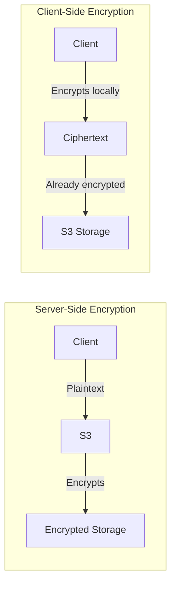

# How to Use Client-Side Encryption for S3 Objects

Author: [nawazdhandala](https://github.com/nawazdhandala)

Tags: AWS, S3, Encryption, Security, Client-Side

Description: Learn how to implement client-side encryption for S3 objects so your data is encrypted before it ever leaves your application, giving you full control over encryption keys.

---

Server-side encryption means AWS handles the crypto, and you trust them with the keys (or at least with access to them). Client-side encryption flips that model - your application encrypts data before uploading it to S3, and decrypts it after downloading. AWS never sees the plaintext data. If you're in a zero-trust mindset or have regulatory requirements that mandate client-controlled encryption, this is the approach you need.

## When Client-Side Encryption Makes Sense

Client-side encryption adds complexity, so it's not always the right choice. Here's when it makes sense:

- **You can't trust the cloud provider** with plaintext data (regulatory or organizational policy)
- **End-to-end encryption** is required, where data is encrypted in transit and at rest with keys you control
- **Multi-cloud storage** where you want consistent encryption regardless of provider
- **Sensitive PII or financial data** where you want defense in depth beyond server-side encryption

If server-side encryption meets your requirements, it's simpler. See our posts on [SSE-S3](https://oneuptime.com/blog/post/2026-02-12-server-side-encryption-s3-managed-keys-sse-s3/view) and [SSE-KMS](https://oneuptime.com/blog/post/2026-02-12-server-side-encryption-aws-kms-sse-kms/view) first.

## Option 1: Client-Side Encryption with KMS-Managed Keys

The AWS SDK provides an S3 encryption client that handles client-side encryption using KMS keys. KMS generates and manages the data encryption keys, but the actual encryption/decryption happens on your machine.

Install the required package first.

```bash
pip install boto3 amazon-s3-encryption-sdk
```

Here's how to use it.

```python
from s3_encryption_sdk import EncryptionSDKClient
from s3_encryption_sdk.materials_providers.kms import KMSMasterKeyProvider
import boto3

# Create a KMS master key provider
kms_key_id = 'arn:aws:kms:us-east-1:123456789012:key/your-key-id'
kms_provider = KMSMasterKeyProvider(key_id=kms_key_id)

# Create the encryption client
encryption_client = EncryptionSDKClient(kms_provider)

# Encrypt and upload
plaintext_data = b'This is sensitive financial data that should never be seen by AWS'

encryption_client.put_object(
    Bucket='my-encrypted-bucket',
    Key='sensitive/financial-record.dat',
    Body=plaintext_data
)

# Download and decrypt
response = encryption_client.get_object(
    Bucket='my-encrypted-bucket',
    Key='sensitive/financial-record.dat'
)

decrypted_data = response['Body'].read()
print(f"Decrypted: {decrypted_data.decode()}")
```

## Option 2: Client-Side Encryption with Your Own Keys

If you want full control over the key material, you can manage your own symmetric keys. This is the most secure option because the keys never touch AWS infrastructure.

```python
import boto3
import os
from cryptography.hazmat.primitives.ciphers.aead import AESGCM
from cryptography.hazmat.primitives import hashes
from cryptography.hazmat.primitives.kdf.pbkdf2 import PBKDF2HMAC
import base64
import json

class ClientSideEncryptor:
    """
    Handles client-side encryption for S3 objects using AES-256-GCM.
    Keys never leave your application.
    """

    def __init__(self, master_key: bytes):
        """
        Initialize with a 256-bit master key.
        In production, load this from a secure key store.
        """
        self.master_key = master_key
        self.s3 = boto3.client('s3')

    def encrypt_and_upload(self, bucket: str, key: str, plaintext: bytes):
        """Encrypt data locally and upload the ciphertext to S3."""
        # Generate a unique data key for this object
        data_key = os.urandom(32)  # 256-bit key
        nonce = os.urandom(12)     # 96-bit nonce for GCM

        # Encrypt the object data with the data key
        aesgcm = AESGCM(data_key)
        ciphertext = aesgcm.encrypt(nonce, plaintext, None)

        # Encrypt the data key with the master key
        master_aesgcm = AESGCM(self.master_key)
        master_nonce = os.urandom(12)
        encrypted_data_key = master_aesgcm.encrypt(
            master_nonce, data_key, None
        )

        # Store encryption metadata as S3 object metadata
        metadata = {
            'x-amz-cse-nonce': base64.b64encode(nonce).decode(),
            'x-amz-cse-key': base64.b64encode(encrypted_data_key).decode(),
            'x-amz-cse-key-nonce': base64.b64encode(master_nonce).decode(),
            'x-amz-cse-algorithm': 'AES-256-GCM'
        }

        # Upload encrypted data
        self.s3.put_object(
            Bucket=bucket,
            Key=key,
            Body=ciphertext,
            Metadata=metadata
        )

        print(f"Uploaded encrypted object: s3://{bucket}/{key}")

    def download_and_decrypt(self, bucket: str, key: str) -> bytes:
        """Download and decrypt an object from S3."""
        response = self.s3.get_object(Bucket=bucket, Key=key)

        # Read encryption metadata
        metadata = response['Metadata']
        nonce = base64.b64decode(metadata['x-amz-cse-nonce'])
        encrypted_data_key = base64.b64decode(metadata['x-amz-cse-key'])
        master_nonce = base64.b64decode(metadata['x-amz-cse-key-nonce'])

        # Decrypt the data key using the master key
        master_aesgcm = AESGCM(self.master_key)
        data_key = master_aesgcm.decrypt(
            master_nonce, encrypted_data_key, None
        )

        # Decrypt the object data
        ciphertext = response['Body'].read()
        aesgcm = AESGCM(data_key)
        plaintext = aesgcm.decrypt(nonce, ciphertext, None)

        return plaintext


# Usage example
if __name__ == '__main__':
    # In production, load this from AWS Secrets Manager,
    # HashiCorp Vault, or a hardware security module
    master_key = os.urandom(32)

    encryptor = ClientSideEncryptor(master_key)

    # Encrypt and upload
    data = b'Patient record: John Doe, DOB: 1985-03-15, Diagnosis: ...'
    encryptor.encrypt_and_upload(
        'my-encrypted-bucket',
        'medical-records/patient-001.enc',
        data
    )

    # Download and decrypt
    decrypted = encryptor.download_and_decrypt(
        'my-encrypted-bucket',
        'medical-records/patient-001.enc'
    )
    print(f"Decrypted data: {decrypted.decode()}")
```

## Option 3: Envelope Encryption Pattern

The envelope encryption pattern combines the best of both worlds - KMS manages the master key, but encryption happens client-side.

```python
import boto3
import os
from cryptography.hazmat.primitives.ciphers.aead import AESGCM
import base64

class EnvelopeEncryptor:
    """
    Uses KMS for key management but encrypts locally.
    KMS never sees your plaintext data.
    """

    def __init__(self, kms_key_id: str):
        self.kms = boto3.client('kms')
        self.s3 = boto3.client('s3')
        self.kms_key_id = kms_key_id

    def encrypt_and_upload(self, bucket: str, key: str, plaintext: bytes):
        # Ask KMS to generate a data key
        # KMS returns both plaintext and encrypted versions
        key_response = self.kms.generate_data_key(
            KeyId=self.kms_key_id,
            KeySpec='AES_256'
        )

        plaintext_key = key_response['Plaintext']  # Use this for encryption
        encrypted_key = key_response['CiphertextBlob']  # Store this

        # Encrypt locally with the plaintext key
        nonce = os.urandom(12)
        aesgcm = AESGCM(plaintext_key)
        ciphertext = aesgcm.encrypt(nonce, plaintext, None)

        # Wipe the plaintext key from memory
        plaintext_key = None

        # Upload with the encrypted key in metadata
        self.s3.put_object(
            Bucket=bucket,
            Key=key,
            Body=ciphertext,
            Metadata={
                'x-amz-cse-nonce': base64.b64encode(nonce).decode(),
                'x-amz-cse-encrypted-key': base64.b64encode(encrypted_key).decode(),
                'x-amz-cse-algorithm': 'AES-256-GCM'
            }
        )

    def download_and_decrypt(self, bucket: str, key: str) -> bytes:
        response = self.s3.get_object(Bucket=bucket, Key=key)
        metadata = response['Metadata']

        # Get the encrypted data key and ask KMS to decrypt it
        encrypted_key = base64.b64decode(metadata['x-amz-cse-encrypted-key'])
        nonce = base64.b64decode(metadata['x-amz-cse-nonce'])

        # KMS decrypts the data key - CloudTrail logs this
        key_response = self.kms.decrypt(CiphertextBlob=encrypted_key)
        plaintext_key = key_response['Plaintext']

        # Decrypt locally
        ciphertext = response['Body'].read()
        aesgcm = AESGCM(plaintext_key)
        plaintext = aesgcm.decrypt(nonce, ciphertext, None)

        return plaintext
```

## Encryption Flow Comparison



## Important Considerations

### Key Management Is Your Responsibility

With client-side encryption, losing your keys means losing your data. Period. There's no AWS support ticket that can help you. Implement a solid key management strategy:

- Store master keys in a hardware security module (HSM) or a secrets manager
- Implement key rotation procedures
- Back up keys securely and test restoration regularly
- Document your key hierarchy

### Performance Impact

Client-side encryption adds CPU overhead to your application. For small objects, it's negligible. For large files or high-throughput workloads, you might notice it. Benchmark your specific use case.

### S3 Features That Don't Work

Because S3 can't read your encrypted data, several features won't work:

- S3 Select and Athena queries
- S3 Object Lambda transformations
- Server-side copy operations (you'll need to download, decrypt, encrypt, re-upload)
- Content-based lifecycle rules

### Versioning and Encryption

Each object version should use its own unique data key and nonce. Never reuse nonces with the same key - that completely breaks GCM security.

## Testing Your Implementation

Always verify that your encrypted data is actually encrypted in S3.

```python
import boto3

s3 = boto3.client('s3')

# Download raw bytes without decryption
response = s3.get_object(
    Bucket='my-encrypted-bucket',
    Key='medical-records/patient-001.enc'
)

raw_data = response['Body'].read()

# This should NOT be readable as text
try:
    text = raw_data.decode('utf-8')
    print("WARNING: Data appears to be plaintext!")
except UnicodeDecodeError:
    print("GOOD: Data is encrypted (not valid UTF-8)")
```

## Wrapping Up

Client-side encryption gives you the strongest data protection guarantee - your plaintext never leaves your application. The trade-off is complexity. You're responsible for key management, key rotation, and making sure your encryption implementation is correct. For most workloads, SSE-KMS provides enough control. But when you truly need zero-trust encryption where even the cloud provider can't access your data, client-side encryption is the way to go.
