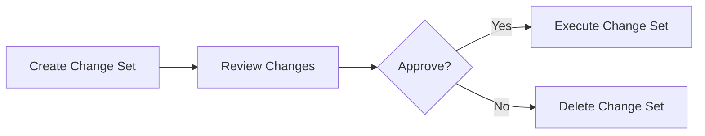

# How to Use CloudFormation Change Sets for Safe Updates

Author: [nawazdhandala](https://github.com/nawazdhandala)

Tags: AWS, CloudFormation, Infrastructure as Code, DevOps

Description: Learn how to use CloudFormation Change Sets to preview infrastructure changes before executing them, preventing unexpected modifications and downtime.

---

Updating a CloudFormation stack without knowing what will change is like merging a pull request without reading the diff. Change sets show you exactly what CloudFormation plans to do - which resources will be added, modified, or replaced - before you commit to the update. They're your safety net for production infrastructure.

## What Are Change Sets?

A change set is a preview of the changes CloudFormation will make to your stack. It compares your new template (or new parameter values) against the current stack and produces a detailed summary. You review the summary, and only then decide whether to execute the update.



## Why Change Sets Matter

Without change sets, you run `update-stack` and hope for the best. The problems:

- Some property changes trigger resource **replacement** (delete and recreate), which can cause data loss
- You might not realize a security group change opens a port you didn't intend
- Template typos can destroy production resources
- Parameter changes might have wider impact than expected

Change sets eliminate the surprise factor.

## Creating a Change Set

```bash
# Create a change set to preview an update
aws cloudformation create-change-set \
  --stack-name my-app-prod \
  --template-body file://template.yaml \
  --change-set-name update-instance-type \
  --parameters \
    ParameterKey=Environment,ParameterValue=prod \
    ParameterKey=InstanceType,ParameterValue=t3.large \
  --capabilities CAPABILITY_IAM

# Wait for the change set to be created
aws cloudformation wait change-set-create-complete \
  --stack-name my-app-prod \
  --change-set-name update-instance-type
```

The change set name should describe what the update does. It helps when you have multiple change sets pending.

## Reviewing the Change Set

```bash
# Describe the change set to see what will change
aws cloudformation describe-change-set \
  --stack-name my-app-prod \
  --change-set-name update-instance-type
```

The output shows each resource that will be affected:

```json
{
  "Changes": [
    {
      "Type": "Resource",
      "ResourceChange": {
        "Action": "Modify",
        "LogicalResourceId": "WebServer",
        "ResourceType": "AWS::EC2::Instance",
        "Replacement": "True",
        "Details": [
          {
            "Target": {
              "Attribute": "Properties",
              "Name": "InstanceType"
            },
            "ChangeSource": "DirectModification"
          }
        ]
      }
    }
  ]
}
```

The critical fields:

| Field | Meaning |
|---|---|
| `Action` | Add, Modify, or Remove |
| `Replacement` | True, False, or Conditional |
| `LogicalResourceId` | Which resource is affected |
| `Details` | What specifically is changing |

**Pay close attention to Replacement.** When `Replacement` is `True`, CloudFormation will delete the existing resource and create a new one. For an EC2 instance, that means a new instance with a new IP. For an RDS database, that means data loss unless you have backups.

## A Friendlier View

The JSON output is dense. Use `--query` to get a cleaner summary:

```bash
# Get a concise summary of changes
aws cloudformation describe-change-set \
  --stack-name my-app-prod \
  --change-set-name update-instance-type \
  --query 'Changes[*].ResourceChange.{Action:Action,Resource:LogicalResourceId,Type:ResourceType,Replacement:Replacement}' \
  --output table
```

This produces something like:

```
------------------------------------------------------------
|                    DescribeChangeSet                      |
+--------+------------------+------------------------+-----+
| Action | Replacement      | Resource               | Type|
+--------+------------------+------------------------+-----+
| Modify | True             | WebServer              | ... |
| Modify | False            | AppSecurityGroup       | ... |
| Add    | N/A              | MonitoringAlarm        | ... |
+--------+------------------+------------------------+-----+
```

## Executing or Deleting

If the changes look good:

```bash
# Execute the change set - applies the changes to the stack
aws cloudformation execute-change-set \
  --stack-name my-app-prod \
  --change-set-name update-instance-type

# Wait for the update to complete
aws cloudformation wait stack-update-complete \
  --stack-name my-app-prod
```

If something doesn't look right:

```bash
# Delete the change set without applying changes
aws cloudformation delete-change-set \
  --stack-name my-app-prod \
  --change-set-name update-instance-type
```

Deleting a change set has zero impact on the running stack. It's purely a preview artifact.

## Change Sets for New Stacks

You can also use change sets when creating a stack for the first time:

```bash
# Create a change set for a brand-new stack
aws cloudformation create-change-set \
  --stack-name my-new-stack \
  --template-body file://template.yaml \
  --change-set-name initial-creation \
  --change-set-type CREATE \
  --capabilities CAPABILITY_IAM
```

Note the `--change-set-type CREATE` flag. This lets you review all the resources that will be created before anything is provisioned.

## How deploy Uses Change Sets Internally

When you use `aws cloudformation deploy`, it actually creates and executes a change set behind the scenes:

```bash
# deploy creates a change set internally and executes it
aws cloudformation deploy \
  --stack-name my-app-prod \
  --template-file template.yaml \
  --parameter-overrides InstanceType=t3.large

# This is roughly equivalent to:
# 1. create-change-set
# 2. wait change-set-create-complete
# 3. execute-change-set
# 4. wait stack-update-complete
```

The difference is that `deploy` doesn't give you a chance to review before executing. For production updates, creating change sets manually is safer.

## Change Set Scenarios

### Scenario 1: Updating a property that causes replacement

```yaml
# Changing the BucketName causes S3 bucket replacement
# OLD:
BucketName: my-app-data-v1

# NEW:
BucketName: my-app-data-v2
```

The change set will show `Replacement: True`. This means the old bucket (and all its contents) will be deleted and a new empty bucket created. You probably don't want this.

### Scenario 2: Adding a new resource

```yaml
# Adding a new alarm doesn't affect existing resources
Resources:
  # ... existing resources unchanged ...

  # New resource
  CPUAlarm:
    Type: AWS::CloudWatch::Alarm
    Properties:
      AlarmName: high-cpu
      MetricName: CPUUtilization
      # ...
```

The change set shows `Action: Add` with no replacements. Safe to execute.

### Scenario 3: Changing tags only

```yaml
# Modifying tags is usually a non-disruptive change
Tags:
  - Key: CostCenter
    Value: engineering  # changed from "ops"
```

The change set shows `Replacement: False`. Tags are modified in-place.

## Automating Change Set Review in CI/CD

Here's a script that creates a change set and waits for human approval:

```bash
#!/bin/bash
# create-and-review-changeset.sh
set -euo pipefail

STACK_NAME="$1"
TEMPLATE_FILE="$2"
CHANGESET_NAME="deploy-$(date +%Y%m%d-%H%M%S)"

echo "Creating change set: $CHANGESET_NAME"
aws cloudformation create-change-set \
  --stack-name "$STACK_NAME" \
  --template-body "file://$TEMPLATE_FILE" \
  --change-set-name "$CHANGESET_NAME" \
  --capabilities CAPABILITY_IAM

echo "Waiting for change set to be ready..."
aws cloudformation wait change-set-create-complete \
  --stack-name "$STACK_NAME" \
  --change-set-name "$CHANGESET_NAME" 2>/dev/null || true

# Check status
STATUS=$(aws cloudformation describe-change-set \
  --stack-name "$STACK_NAME" \
  --change-set-name "$CHANGESET_NAME" \
  --query 'Status' --output text)

if [ "$STATUS" = "FAILED" ]; then
  REASON=$(aws cloudformation describe-change-set \
    --stack-name "$STACK_NAME" \
    --change-set-name "$CHANGESET_NAME" \
    --query 'StatusReason' --output text)
  echo "Change set failed: $REASON"
  # "No changes" is reported as a failure
  if [[ "$REASON" == *"didn't contain changes"* ]]; then
    echo "No changes to deploy."
  fi
  aws cloudformation delete-change-set \
    --stack-name "$STACK_NAME" \
    --change-set-name "$CHANGESET_NAME"
  exit 0
fi

# Show the changes
echo ""
echo "=== Proposed Changes ==="
aws cloudformation describe-change-set \
  --stack-name "$STACK_NAME" \
  --change-set-name "$CHANGESET_NAME" \
  --query 'Changes[*].ResourceChange.{Action:Action,Resource:LogicalResourceId,Type:ResourceType,Replace:Replacement}' \
  --output table

echo ""
echo "Change set ready: $CHANGESET_NAME"
echo "To execute: aws cloudformation execute-change-set --stack-name $STACK_NAME --change-set-name $CHANGESET_NAME"
echo "To cancel:  aws cloudformation delete-change-set --stack-name $STACK_NAME --change-set-name $CHANGESET_NAME"
```

## Best Practices

**Always use change sets for production.** No exceptions. Even a "small" change can have unexpected side effects.

**Look for Replacement: True.** That's where the risk is. Resource replacement means downtime and potential data loss.

**Name change sets descriptively.** `fix-security-group-rules` is better than `changeset-1`. You might have several pending.

**Use change sets in CI/CD pipelines.** Create the change set in the build stage, review it (manually or automated), and execute in the deploy stage.

**Check for no-op change sets.** If there are no changes, the change set creation will fail with "The submitted information didn't contain changes." Handle this gracefully in scripts.

**Clean up old change sets.** Unexecuted change sets stick around. Delete them when you're done to keep things tidy.

Change sets are one of the most important CloudFormation features for production safety. Combined with [drift detection](https://oneuptime.com/blog/post/detect-fix-cloudformation-drift/view) and [update rollback handling](https://oneuptime.com/blog/post/cloudformation-stack-update-rollbacks/view), they give you a solid safety net for infrastructure updates.
