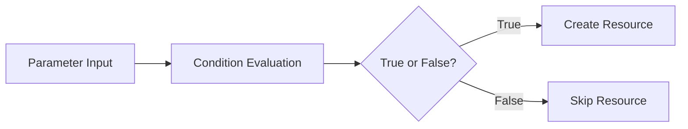

# How to Use CloudFormation Conditions for Conditional Resources

Author: [nawazdhandala](https://github.com/nawazdhandala)

Tags: AWS, CloudFormation, Infrastructure as Code, DevOps

Description: Learn how to use CloudFormation Conditions to conditionally create resources, set properties, and control template behavior based on parameters.

---

Not every resource belongs in every environment. Your production stack needs a NAT Gateway and Multi-AZ database. Your dev stack doesn't. You could maintain separate templates, but that's a maintenance nightmare. CloudFormation Conditions let you use one template and selectively include or exclude resources based on input parameters.

## How Conditions Work

Conditions are boolean expressions that you define in the `Conditions` section of your template. You then reference those conditions in resource definitions, resource properties, and outputs to control what gets created and how.

The flow looks like this:



## Defining Conditions

Conditions go in their own section and use condition functions to evaluate to true or false:

```yaml
# Define conditions based on parameter values
Parameters:
  Environment:
    Type: String
    AllowedValues: [dev, staging, prod]

  EnableMonitoring:
    Type: String
    Default: 'false'
    AllowedValues: ['true', 'false']

Conditions:
  IsProduction: !Equals [!Ref Environment, prod]
  IsNotDev: !Not [!Equals [!Ref Environment, dev]]
  ShouldMonitor: !Equals [!Ref EnableMonitoring, 'true']
  ProdWithMonitoring: !And
    - !Condition IsProduction
    - !Condition ShouldMonitor
```

The available condition functions are:

| Function | Description | Example |
|---|---|---|
| `Fn::Equals` | Compares two values | `!Equals [!Ref Env, prod]` |
| `Fn::If` | Ternary - returns one of two values | `!If [IsProd, big, small]` |
| `Fn::Not` | Negates a condition | `!Not [!Equals [!Ref Env, dev]]` |
| `Fn::And` | All must be true | `!And [Cond1, Cond2]` |
| `Fn::Or` | At least one must be true | `!Or [Cond1, Cond2]` |

## Conditionally Creating Resources

To make an entire resource conditional, add the `Condition` key at the resource level:

```yaml
# Only create the NAT Gateway in production
Parameters:
  Environment:
    Type: String
    AllowedValues: [dev, staging, prod]

Conditions:
  IsProduction: !Equals [!Ref Environment, prod]

Resources:
  # This resource is always created
  PublicSubnet:
    Type: AWS::EC2::Subnet
    Properties:
      VpcId: !Ref VPC
      CidrBlock: 10.0.1.0/24

  # This resource only exists in production
  NATGateway:
    Type: AWS::EC2::NatGateway
    Condition: IsProduction
    Properties:
      AllocationId: !GetAtt ElasticIP.AllocationId
      SubnetId: !Ref PublicSubnet

  # This EIP also only exists in production
  ElasticIP:
    Type: AWS::EC2::EIP
    Condition: IsProduction
    Properties:
      Domain: vpc
```

When `Environment` is `dev` or `staging`, the NAT Gateway and Elastic IP simply don't get created. No errors, no empty resources - they're just absent from the stack.

## Conditional Resource Properties

Sometimes you want the resource to always exist but with different properties. Use `!If` inside the `Properties` section:

```yaml
# Same database resource, different config based on environment
Conditions:
  IsProduction: !Equals [!Ref Environment, prod]

Resources:
  Database:
    Type: AWS::RDS::DBInstance
    Properties:
      DBInstanceClass: !If [IsProduction, db.r5.large, db.t3.micro]
      AllocatedStorage: !If [IsProduction, 100, 20]
      MultiAZ: !If [IsProduction, true, false]
      StorageEncrypted: !If [IsProduction, true, false]
      BackupRetentionPeriod: !If [IsProduction, 30, 1]
      Engine: postgres
      MasterUsername: admin
      MasterUserPassword: '{{resolve:ssm-secure:/myapp/db-password}}'
```

This is one of the most useful patterns. You get environment-appropriate sizing from a single template.

## Conditional Outputs

Outputs can also be conditional:

```yaml
# Only output the NAT Gateway ID if it was created
Outputs:
  NATGatewayId:
    Condition: IsProduction
    Description: NAT Gateway ID (production only)
    Value: !Ref NATGateway

  DatabaseEndpoint:
    Description: Database connection endpoint
    Value: !GetAtt Database.Endpoint.Address
```

If the condition is false, the output simply doesn't appear in the stack's outputs.

## A Complete Example

Here's a realistic template that uses conditions to deploy a web application differently per environment:

```yaml
# Full template with conditional resources for multi-env deployment
AWSTemplateFormatVersion: '2010-09-09'
Description: Web application with environment-conditional resources

Parameters:
  Environment:
    Type: String
    AllowedValues: [dev, staging, prod]
    Description: Target environment

  VpcId:
    Type: AWS::EC2::VPC::Id

  SubnetIds:
    Type: List<AWS::EC2::Subnet::Id>

Conditions:
  IsProduction: !Equals [!Ref Environment, prod]
  IsNotDev: !Not [!Equals [!Ref Environment, dev]]

Resources:
  # Always created - the application load balancer
  LoadBalancer:
    Type: AWS::ElasticLoadBalancingV2::LoadBalancer
    Properties:
      Name: !Sub '${Environment}-app-alb'
      Subnets: !Ref SubnetIds
      SecurityGroups:
        - !Ref ALBSecurityGroup

  ALBSecurityGroup:
    Type: AWS::EC2::SecurityGroup
    Properties:
      GroupDescription: ALB security group
      VpcId: !Ref VpcId
      SecurityGroupIngress:
        - IpProtocol: tcp
          FromPort: 443
          ToPort: 443
          CidrIp: 0.0.0.0/0

  # Only in staging and production - WAF protection
  WebACL:
    Type: AWS::WAFv2::WebACL
    Condition: IsNotDev
    Properties:
      Name: !Sub '${Environment}-web-acl'
      Scope: REGIONAL
      DefaultAction:
        Allow: {}
      VisibilityConfig:
        SampledRequestsEnabled: true
        CloudWatchMetricsEnabled: true
        MetricName: !Sub '${Environment}-web-acl'
      Rules:
        - Name: RateLimit
          Priority: 1
          Action:
            Block: {}
          Statement:
            RateBasedStatement:
              Limit: 2000
              AggregateKeyType: IP
          VisibilityConfig:
            SampledRequestsEnabled: true
            CloudWatchMetricsEnabled: true
            MetricName: RateLimit

  # Only in production - CloudWatch alarm for monitoring
  HighLatencyAlarm:
    Type: AWS::CloudWatch::Alarm
    Condition: IsProduction
    Properties:
      AlarmName: !Sub '${Environment}-high-latency'
      AlarmDescription: Alarm when ALB latency exceeds 2 seconds
      MetricName: TargetResponseTime
      Namespace: AWS/ApplicationELB
      Statistic: Average
      Period: 300
      EvaluationPeriods: 2
      Threshold: 2
      ComparisonOperator: GreaterThanThreshold
      Dimensions:
        - Name: LoadBalancer
          Value: !GetAtt LoadBalancer.LoadBalancerFullName

  # Only in production - SNS topic for alarm notifications
  AlarmTopic:
    Type: AWS::SNS::Topic
    Condition: IsProduction
    Properties:
      TopicName: !Sub '${Environment}-alarms'

Outputs:
  LoadBalancerDNS:
    Description: ALB DNS name
    Value: !GetAtt LoadBalancer.DNSName

  WebACLArn:
    Condition: IsNotDev
    Description: WAF Web ACL ARN
    Value: !GetAtt WebACL.Arn

  AlarmTopicArn:
    Condition: IsProduction
    Description: SNS topic for alarms
    Value: !Ref AlarmTopic
```

## Referencing Conditional Resources

Here's a gotcha - if resource A depends on conditional resource B, you need to handle the case where B doesn't exist:

```yaml
# Safely reference a conditional resource
Conditions:
  CreateBucket: !Equals [!Ref CreateStorage, 'true']

Resources:
  MyBucket:
    Type: AWS::S3::Bucket
    Condition: CreateBucket

  # This policy references the conditional bucket
  BucketPolicy:
    Type: AWS::S3::BucketPolicy
    Condition: CreateBucket  # Must also be conditional
    Properties:
      Bucket: !Ref MyBucket
      PolicyDocument:
        Version: '2012-10-17'
        Statement:
          - Effect: Deny
            Principal: '*'
            Action: 's3:*'
            Resource: !Sub '${MyBucket.Arn}/*'
            Condition:
              Bool:
                aws:SecureTransport: 'false'
```

If a resource references a conditional resource, it must itself be conditional (or use `!If` to provide an alternative value).

## Nested Conditions

You can build complex logic by combining conditions:

```yaml
# Compose conditions for complex logic
Conditions:
  IsProduction: !Equals [!Ref Environment, prod]
  IsUSRegion: !Or
    - !Equals [!Ref 'AWS::Region', us-east-1]
    - !Equals [!Ref 'AWS::Region', us-west-2]
  ProdInUS: !And
    - !Condition IsProduction
    - !Condition IsUSRegion
```

Keep it readable though. If your conditions are getting deeply nested, you might be better off splitting into separate templates using [nested stacks](https://oneuptime.com/blog/post/2026-02-12-cloudformation-nested-stacks/view).

## Best Practices

**Name conditions clearly.** `IsProduction` and `ShouldCreateNATGateway` are good. `Cond1` and `MyCondition` are not.

**Keep conditions simple.** If you need more than two levels of nesting, reconsider your approach.

**Test both paths.** Deploy the template with conditions evaluating to both true and false. It's easy to miss a broken reference that only manifests when a condition flips.

**Combine with mappings.** Use [mappings](https://oneuptime.com/blog/post/2026-02-12-cloudformation-mappings-region-specific-values/view) for property values and conditions for resource existence. They complement each other well.

**Document the behavior.** Add a comment or description explaining what each condition controls. Someone reading the template months from now needs to understand the logic.

Conditions are one of the features that make CloudFormation templates truly reusable. Master them and you'll rarely need to maintain separate templates per environment.
