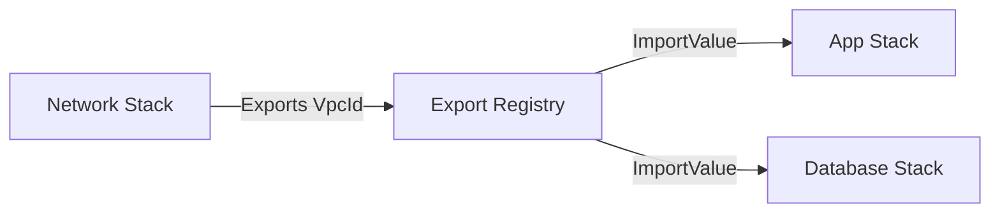

# How to Use CloudFormation Fn::ImportValue for Stack Dependencies

Author: [nawazdhandala](https://github.com/nawazdhandala)

Tags: AWS, CloudFormation, Infrastructure as Code, DevOps

Description: Learn how to use Fn::ImportValue to create dependencies between CloudFormation stacks and share resources across your infrastructure.

---

As your CloudFormation deployments grow, you'll naturally split things into multiple stacks. The networking team manages VPCs. The platform team manages shared services. Application teams manage their own stacks. These stacks need to reference each other's resources, and `Fn::ImportValue` is how you make that happen.

## How Cross-Stack References Work

The flow is straightforward:

1. Stack A creates a resource and exports a value in its `Outputs` section
2. Stack B uses `Fn::ImportValue` to read that exported value



The export goes into a regional registry. Any stack in the same account and region can import it.

## Setting Up Exports

First, the exporting stack needs an `Output` with an `Export` block:

```yaml
# network-stack.yaml - Exports VPC and subnet information
AWSTemplateFormatVersion: '2010-09-09'
Description: Shared network infrastructure

Resources:
  VPC:
    Type: AWS::EC2::VPC
    Properties:
      CidrBlock: 10.0.0.0/16
      EnableDnsHostnames: true
      Tags:
        - Key: Name
          Value: shared-vpc

  PrivateSubnet1:
    Type: AWS::EC2::Subnet
    Properties:
      VpcId: !Ref VPC
      CidrBlock: 10.0.10.0/24
      AvailabilityZone: !Select [0, !GetAZs '']

  PrivateSubnet2:
    Type: AWS::EC2::Subnet
    Properties:
      VpcId: !Ref VPC
      CidrBlock: 10.0.11.0/24
      AvailabilityZone: !Select [1, !GetAZs '']

# These outputs are available to other stacks
Outputs:
  VpcId:
    Description: Shared VPC ID
    Value: !Ref VPC
    Export:
      Name: SharedNetwork-VpcId

  PrivateSubnets:
    Description: Private subnet IDs (comma-separated)
    Value: !Join [',', [!Ref PrivateSubnet1, !Ref PrivateSubnet2]]
    Export:
      Name: SharedNetwork-PrivateSubnets

  VpcCidr:
    Description: VPC CIDR block
    Value: !GetAtt VPC.CidrBlock
    Export:
      Name: SharedNetwork-VpcCidr
```

## Using Fn::ImportValue

In the consuming stack, reference exports by name:

```yaml
# app-stack.yaml - Imports network values
AWSTemplateFormatVersion: '2010-09-09'
Description: Application stack using shared network

Resources:
  AppSecurityGroup:
    Type: AWS::EC2::SecurityGroup
    Properties:
      GroupDescription: Application security group
      VpcId: !ImportValue SharedNetwork-VpcId
      SecurityGroupIngress:
        - IpProtocol: tcp
          FromPort: 8080
          ToPort: 8080
          CidrIp: !ImportValue SharedNetwork-VpcCidr

  AppInstance:
    Type: AWS::EC2::Instance
    Properties:
      InstanceType: t3.micro
      # Split the imported comma-separated list and pick the first subnet
      SubnetId: !Select
        - 0
        - !Split [',', !ImportValue SharedNetwork-PrivateSubnets]
      SecurityGroupIds:
        - !Ref AppSecurityGroup
```

## Dynamic Export Names

Hard-coding export names works, but parameterizing them is more flexible:

```yaml
# Exporting stack uses stack name as prefix
Outputs:
  VpcId:
    Value: !Ref VPC
    Export:
      Name: !Sub '${AWS::StackName}-VpcId'
```

```yaml
# Importing stack accepts the source stack name as a parameter
Parameters:
  NetworkStackName:
    Type: String
    Default: network-prod
    Description: Name of the network stack to import from

Resources:
  SecurityGroup:
    Type: AWS::EC2::SecurityGroup
    Properties:
      GroupDescription: App SG
      VpcId: !ImportValue
        !Sub '${NetworkStackName}-VpcId'
```

This way, the app stack can point to different network stacks by changing a single parameter. Your dev app stack imports from `network-dev`, and production imports from `network-prod`.

## Real-World Multi-Stack Architecture

Here's a three-stack setup with a network layer, a data layer, and an application layer.

The data stack imports from network and exports database endpoints:

```yaml
# data-stack.yaml - Database layer
AWSTemplateFormatVersion: '2010-09-09'
Description: Data layer - databases and caches

Parameters:
  NetworkStackName:
    Type: String
  Environment:
    Type: String

Resources:
  DBSubnetGroup:
    Type: AWS::RDS::DBSubnetGroup
    Properties:
      DBSubnetGroupDescription: Database subnets
      SubnetIds: !Split [',', !ImportValue !Sub '${NetworkStackName}-PrivateSubnets']

  DBSecurityGroup:
    Type: AWS::EC2::SecurityGroup
    Properties:
      GroupDescription: Database security group
      VpcId: !ImportValue !Sub '${NetworkStackName}-VpcId'
      SecurityGroupIngress:
        - IpProtocol: tcp
          FromPort: 5432
          ToPort: 5432
          CidrIp: !ImportValue !Sub '${NetworkStackName}-VpcCidr'

  Database:
    Type: AWS::RDS::DBInstance
    Properties:
      DBInstanceClass: db.t3.micro
      Engine: postgres
      MasterUsername: admin
      MasterUserPassword: '{{resolve:ssm-secure:/myapp/db-password}}'
      DBSubnetGroupName: !Ref DBSubnetGroup
      VPCSecurityGroups:
        - !Ref DBSecurityGroup

Outputs:
  DatabaseEndpoint:
    Value: !GetAtt Database.Endpoint.Address
    Export:
      Name: !Sub '${AWS::StackName}-DatabaseEndpoint'

  DatabasePort:
    Value: !GetAtt Database.Endpoint.Port
    Export:
      Name: !Sub '${AWS::StackName}-DatabasePort'

  DatabaseSecurityGroup:
    Value: !Ref DBSecurityGroup
    Export:
      Name: !Sub '${AWS::StackName}-DatabaseSG'
```

The application stack imports from both:

```yaml
# app-stack.yaml - Application layer
AWSTemplateFormatVersion: '2010-09-09'
Description: Application layer

Parameters:
  NetworkStackName:
    Type: String
  DataStackName:
    Type: String

Resources:
  AppFunction:
    Type: AWS::Lambda::Function
    Properties:
      FunctionName: my-api
      Runtime: python3.12
      Handler: index.handler
      Code:
        ZipFile: |
          def handler(event, context):
              return {"statusCode": 200}
      Role: !GetAtt AppRole.Arn
      VpcConfig:
        SecurityGroupIds:
          - !Ref AppSecurityGroup
        SubnetIds: !Split [',', !ImportValue !Sub '${NetworkStackName}-PrivateSubnets']
      Environment:
        Variables:
          DB_HOST: !ImportValue !Sub '${DataStackName}-DatabaseEndpoint'
          DB_PORT: !ImportValue !Sub '${DataStackName}-DatabasePort'

  AppSecurityGroup:
    Type: AWS::EC2::SecurityGroup
    Properties:
      GroupDescription: App security group
      VpcId: !ImportValue !Sub '${NetworkStackName}-VpcId'

  AppRole:
    Type: AWS::IAM::Role
    Properties:
      AssumeRolePolicyDocument:
        Version: '2012-10-17'
        Statement:
          - Effect: Allow
            Principal:
              Service: lambda.amazonaws.com
            Action: sts:AssumeRole
      ManagedPolicyArns:
        - arn:aws:iam::aws:policy/service-role/AWSLambdaVPCAccessExecutionRole
```

Deploy them in order:

```bash
# Deploy in dependency order
aws cloudformation deploy \
  --stack-name network-prod \
  --template-file network-stack.yaml

aws cloudformation deploy \
  --stack-name data-prod \
  --template-file data-stack.yaml \
  --parameter-overrides NetworkStackName=network-prod Environment=prod

aws cloudformation deploy \
  --stack-name app-prod \
  --template-file app-stack.yaml \
  --parameter-overrides NetworkStackName=network-prod DataStackName=data-prod \
  --capabilities CAPABILITY_IAM
```

## The Dependency Lock Problem

The biggest gotcha with `ImportValue` is the dependency lock. Once stack B imports a value from stack A, you cannot:

- Delete stack A
- Remove the export from stack A
- Change the exported value in stack A

Until all importing stacks are updated to stop using that import.

```bash
# This will FAIL if any other stack imports from network-prod
aws cloudformation delete-stack --stack-name network-prod
# Error: Export SharedNetwork-VpcId cannot be deleted as it is in use by app-prod
```

To check what's importing your exports:

```bash
# See which stacks import a specific export
aws cloudformation list-imports --export-name SharedNetwork-VpcId
```

## Alternatives to ImportValue

If the dependency lock is too rigid, consider these alternatives:

**SSM Parameter Store**: Write values to SSM from one stack, read from another. No hard dependency.

```yaml
# Writing to SSM (in network stack)
Resources:
  VpcIdParam:
    Type: AWS::SSM::Parameter
    Properties:
      Name: /infrastructure/vpc-id
      Type: String
      Value: !Ref VPC

# Reading from SSM (in app stack, using dynamic reference)
Resources:
  SecurityGroup:
    Type: AWS::EC2::SecurityGroup
    Properties:
      VpcId: '{{resolve:ssm:/infrastructure/vpc-id}}'
```

**Parameter passing**: Pass values explicitly through deployment scripts. More manual but no coupling.

**Nested stacks**: If the stacks should deploy together, [nested stacks](https://oneuptime.com/blog/post/cloudformation-nested-stacks/view) share data through parent-child parameter passing without exports.

## Best Practices

**Use consistent naming conventions.** `${StackName}-ResourceType` works well. Document the convention so everyone follows it.

**Plan for updates.** Before removing or renaming an export, update all importing stacks first. Use `list-imports` to find them.

**Don't over-export.** Only export values that other stacks actually need. Every export is a coupling point.

**Use SSM for frequently changing values.** If a value changes often and you don't want the dependency lock, SSM is the better choice.

**Document your exports.** Always include a `Description` on exports. Other teams need to understand what the value represents and how to use it.

Cross-stack references with `Fn::ImportValue` let you build modular, maintainable infrastructure. Just be aware of the dependency implications and choose the right sharing mechanism for each situation. For more on structuring multi-stack architectures, check out our post on [CloudFormation outputs and exports](https://oneuptime.com/blog/post/cloudformation-outputs-export-values/view).
