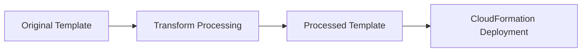

# How to Use CloudFormation Macros and Transforms

Author: [nawazdhandala](https://github.com/nawazdhandala)

Tags: AWS, CloudFormation, Infrastructure as Code, Lambda, DevOps

Description: Learn how to use CloudFormation macros and transforms to extend template syntax, generate repetitive resources, and add custom logic to your templates.

---

CloudFormation templates are declarative - you describe what you want, not how to build it. That's usually a strength, but it means there's no way to loop, generate repetitive resources, or add custom logic. Macros and transforms break through that limitation by letting you preprocess templates with custom code before CloudFormation evaluates them.

## What Are Transforms?

A transform is a processing step that modifies your template before CloudFormation deploys it. AWS provides built-in transforms like `AWS::Serverless` (SAM) and `AWS::Include`. You can also create custom transforms using macros.



## What Are Macros?

A macro is a custom transform backed by a Lambda function. When CloudFormation encounters a macro reference in your template, it sends the template (or a fragment of it) to the Lambda function. The function processes it and returns the modified template. CloudFormation then deploys the result.

## Built-In Transforms

### AWS::Include

The `AWS::Include` transform lets you include template snippets from S3. We cover this in detail in our [AWS::Include guide](https://oneuptime.com/blog/post/aws-include-transform-cloudformation/view).

### AWS::Serverless (SAM)

The SAM transform expands simplified serverless resource types into full CloudFormation resources. See our [SAM transform guide](https://oneuptime.com/blog/post/cloudformation-sam-transform-serverless/view) for details.

## Creating a Custom Macro

Let's build a macro that generates numbered resources - something CloudFormation can't do natively.

### Step 1: Create the Lambda function

The Lambda function receives the template fragment, processes it, and returns the modified version:

```yaml
# macro-stack.yaml - Deploys the macro
AWSTemplateFormatVersion: '2010-09-09'
Description: CloudFormation macro for resource multiplication

Resources:
  MacroFunction:
    Type: AWS::Lambda::Function
    Properties:
      FunctionName: cfn-resource-multiplier
      Runtime: python3.12
      Handler: index.handler
      Timeout: 60
      Role: !GetAtt MacroRole.Arn
      Code:
        ZipFile: |
          import copy
          import json

          def handler(event, context):
              """
              Multiplies a resource definition based on a Count property.
              Usage in template:
                Type: ResourceMultiplier::Repeat
                Count: 3
                Properties:
                  Type: AWS::SQS::Queue
                  Properties:
                    QueueName: my-queue-{i}
              """
              print(json.dumps(event))
              fragment = event['fragment']
              status = 'success'

              try:
                  new_fragment = process_template(fragment)
              except Exception as e:
                  print(f"Error: {e}")
                  status = 'failure'
                  new_fragment = fragment

              return {
                  'requestId': event['requestId'],
                  'status': status,
                  'fragment': new_fragment
              }

          def process_template(fragment):
              if 'Resources' not in fragment:
                  return fragment

              new_resources = {}
              for name, resource in fragment['Resources'].items():
                  if resource.get('Type', '').startswith('ResourceMultiplier'):
                      count = resource.get('Count', 1)
                      inner_resource = {
                          'Type': resource['Properties']['Type'],
                          'Properties': resource['Properties'].get('Properties', {})
                      }
                      for i in range(count):
                          new_name = f"{name}{i}"
                          new_res = copy.deepcopy(inner_resource)
                          # Replace {i} placeholders in string values
                          new_res = replace_placeholder(new_res, '{i}', str(i))
                          new_resources[new_name] = new_res
                  else:
                      new_resources[name] = resource

              fragment['Resources'] = new_resources
              return fragment

          def replace_placeholder(obj, placeholder, value):
              if isinstance(obj, str):
                  return obj.replace(placeholder, value)
              elif isinstance(obj, dict):
                  return {k: replace_placeholder(v, placeholder, value) for k, v in obj.items()}
              elif isinstance(obj, list):
                  return [replace_placeholder(item, placeholder, value) for item in obj]
              return obj

  MacroRole:
    Type: AWS::IAM::Role
    Properties:
      AssumeRolePolicyDocument:
        Version: '2012-10-17'
        Statement:
          - Effect: Allow
            Principal:
              Service: lambda.amazonaws.com
            Action: sts:AssumeRole
      ManagedPolicyArns:
        - arn:aws:iam::aws:policy/service-role/AWSLambdaBasicExecutionRole

  ResourceMultiplier:
    Type: AWS::CloudFormation::Macro
    Properties:
      Name: ResourceMultiplier
      FunctionName: !GetAtt MacroFunction.Arn
```

### Step 2: Deploy the macro stack

```bash
# Deploy the macro
aws cloudformation deploy \
  --stack-name resource-multiplier-macro \
  --template-file macro-stack.yaml \
  --capabilities CAPABILITY_IAM
```

### Step 3: Use the macro in templates

```yaml
# template-using-macro.yaml - Uses the custom macro
AWSTemplateFormatVersion: '2010-09-09'
Transform: ResourceMultiplier
Description: Template that uses the resource multiplier macro

Resources:
  # This will be expanded into Queue0, Queue1, Queue2
  Queue:
    Type: ResourceMultiplier::Repeat
    Count: 3
    Properties:
      Type: AWS::SQS::Queue
      Properties:
        QueueName: !Sub 'processing-queue-{i}'
        VisibilityTimeout: 300

  # Regular resources work normally alongside macros
  DeadLetterQueue:
    Type: AWS::SQS::Queue
    Properties:
      QueueName: dead-letter-queue
```

After macro processing, this template becomes:

```yaml
Resources:
  Queue0:
    Type: AWS::SQS::Queue
    Properties:
      QueueName: processing-queue-0
      VisibilityTimeout: 300
  Queue1:
    Type: AWS::SQS::Queue
    Properties:
      QueueName: processing-queue-1
      VisibilityTimeout: 300
  Queue2:
    Type: AWS::SQS::Queue
    Properties:
      QueueName: processing-queue-2
      VisibilityTimeout: 300
  DeadLetterQueue:
    Type: AWS::SQS::Queue
    Properties:
      QueueName: dead-letter-queue
```

## Template-Level vs Resource-Level Transforms

**Template-level transforms** apply to the entire template:

```yaml
# Template-level - processes the whole template
AWSTemplateFormatVersion: '2010-09-09'
Transform: MyMacro
# Or multiple transforms:
Transform:
  - MyMacro1
  - MyMacro2
```

**Resource-level transforms** apply to a specific resource using `Fn::Transform`:

```yaml
# Resource-level - processes just this resource
Resources:
  MyResource:
    Type: AWS::CloudFormation::WaitConditionHandle
    Fn::Transform:
      Name: MyMacro
      Parameters:
        SomeParam: SomeValue
```

## The Macro Lambda Event

The Lambda function receives an event with this structure:

```json
{
  "region": "us-east-1",
  "accountId": "123456789012",
  "fragment": { },
  "transformId": "123456789012::MyMacro",
  "params": { },
  "requestId": "abc123",
  "templateParameterValues": { }
}
```

Key fields:

- `fragment`: The template or template fragment to process
- `params`: Parameters passed via `Fn::Transform`
- `templateParameterValues`: The resolved parameter values from the template
- `requestId`: Must be returned in the response

The response must include:

```json
{
  "requestId": "abc123",
  "status": "success",
  "fragment": { }
}
```

## A Practical Macro: Auto-Tagging

Here's a macro that automatically adds standard tags to all taggable resources:

```python
# auto_tagger.py - Lambda function for the auto-tagging macro
import json

STANDARD_TAGS = [
    {'Key': 'ManagedBy', 'Value': 'CloudFormation'},
    {'Key': 'Team', 'Value': 'Platform'},
]

# Resource types that support Tags
TAGGABLE_TYPES = {
    'AWS::EC2::Instance', 'AWS::EC2::SecurityGroup', 'AWS::EC2::VPC',
    'AWS::EC2::Subnet', 'AWS::S3::Bucket', 'AWS::RDS::DBInstance',
    'AWS::Lambda::Function', 'AWS::SNS::Topic', 'AWS::SQS::Queue',
    'AWS::DynamoDB::Table', 'AWS::ECS::Cluster', 'AWS::ECS::Service',
}

def handler(event, context):
    fragment = event['fragment']
    params = event.get('params', {})

    # Add environment tag if provided
    env = params.get('Environment', 'unknown')
    tags_to_add = STANDARD_TAGS + [{'Key': 'Environment', 'Value': env}]

    if 'Resources' in fragment:
        for name, resource in fragment['Resources'].items():
            resource_type = resource.get('Type', '')
            if resource_type in TAGGABLE_TYPES:
                props = resource.setdefault('Properties', {})
                existing_tags = props.get('Tags', [])
                # Don't overwrite existing tags with same key
                existing_keys = {t['Key'] for t in existing_tags}
                for tag in tags_to_add:
                    if tag['Key'] not in existing_keys:
                        existing_tags.append(tag)
                props['Tags'] = existing_tags

    return {
        'requestId': event['requestId'],
        'status': 'success',
        'fragment': fragment
    }
```

Use it in templates:

```yaml
# All resources get standard tags automatically
AWSTemplateFormatVersion: '2010-09-09'
Transform: AutoTagger

Resources:
  MyBucket:
    Type: AWS::S3::Bucket
    # Tags will be added automatically by the macro

  MyQueue:
    Type: AWS::SQS::Queue
    Properties:
      Tags:
        - Key: Purpose
          Value: processing
        # Standard tags added by macro won't overwrite this
```

## Testing Macros

Test your macro Lambda function locally before deploying:

```python
# test_macro.py - Unit test for the macro
import json
from auto_tagger import handler

def test_auto_tagger():
    event = {
        'requestId': 'test-123',
        'fragment': {
            'Resources': {
                'MyBucket': {
                    'Type': 'AWS::S3::Bucket',
                    'Properties': {}
                }
            }
        },
        'params': {'Environment': 'prod'},
        'templateParameterValues': {}
    }

    result = handler(event, None)
    assert result['status'] == 'success'

    bucket_tags = result['fragment']['Resources']['MyBucket']['Properties']['Tags']
    tag_keys = [t['Key'] for t in bucket_tags]
    assert 'ManagedBy' in tag_keys
    assert 'Environment' in tag_keys
    print("Test passed!")
    print(json.dumps(result['fragment'], indent=2))

test_auto_tagger()
```

## Debugging Macros

When a macro fails, CloudFormation shows a generic error. Check the Lambda function's CloudWatch logs for the actual error:

```bash
# Check the macro Lambda's logs
aws logs tail /aws/lambda/cfn-resource-multiplier --follow
```

You can also preview the processed template using a change set:

```bash
# Create a change set to see the processed template
aws cloudformation create-change-set \
  --stack-name test-macro \
  --template-body file://template-with-macro.yaml \
  --change-set-name preview

# The processed template is in the change set
aws cloudformation get-template \
  --stack-name test-macro \
  --change-set-name preview \
  --template-stage Processed
```

## Best Practices

**Keep macros simple.** Complex logic in macros is hard to debug and test. If your macro is doing too much, consider splitting it.

**Test thoroughly.** Macro bugs are painful because they surface during CloudFormation deployment, which is slow. Unit test your Lambda functions extensively.

**Version your macros.** Use Lambda aliases or versions so you can roll back a macro without affecting stacks that are in a good state.

**Log everything.** Print the input and output in your Lambda function. You'll need it for debugging.

**Use macros sparingly.** They add complexity and a processing step. Only use them when built-in CloudFormation features can't achieve what you need.

**Document your macros.** Anyone reading a template that uses your macro needs to understand what it does. Include documentation or link to it.

Macros and transforms extend CloudFormation beyond its declarative limits. They're the escape hatch for when you need loops, conditional generation, or custom preprocessing logic.
