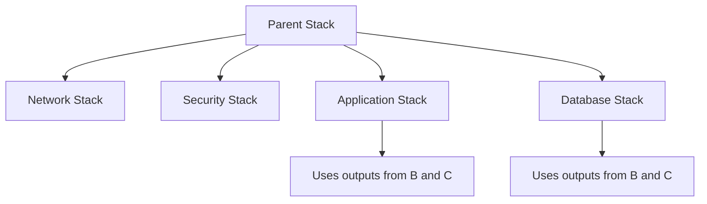

# How to Use CloudFormation Nested Stacks

Author: [nawazdhandala](https://github.com/nawazdhandala)

Tags: AWS, CloudFormation, Infrastructure as Code, DevOps

Description: Learn how to organize large CloudFormation deployments using nested stacks for modularity, reusability, and easier maintenance.

---

CloudFormation templates get big fast. Once you're managing VPCs, subnets, security groups, load balancers, databases, and application servers in a single template, you're looking at hundreds of lines that are painful to read and risky to modify. Nested stacks let you break that monolith into manageable pieces.

## What Are Nested Stacks?

A nested stack is a CloudFormation stack created as a resource within another stack. The parent stack includes child stacks using the `AWS::CloudFormation::Stack` resource type, passing parameters down and receiving outputs back.

The architecture looks like this:



## Why Nested Stacks?

**Template size limits.** A single CloudFormation template can't exceed 1 MB (when stored in S3) or 51,200 bytes (when passed directly). Nested stacks let you spread across multiple templates.

**Modularity.** Each child stack handles one concern. The networking team manages the VPC template, the security team manages the IAM template, and the application team manages their piece.

**Reusability.** A well-designed child stack template can be used across multiple parent stacks. Your VPC template works for the production app, the staging app, and the analytics platform.

**Easier updates.** Changing one nested stack doesn't require re-reading the entire 2000-line template.

## Setting Up Nested Stacks

Child stack templates must be stored in S3. The parent references them by URL.

First, create a child template for networking:

```yaml
# templates/network.yaml - Child stack for VPC and subnets
AWSTemplateFormatVersion: '2010-09-09'
Description: Network infrastructure - VPC and subnets

Parameters:
  Environment:
    Type: String
  VPCCidr:
    Type: String
    Default: 10.0.0.0/16

Resources:
  VPC:
    Type: AWS::EC2::VPC
    Properties:
      CidrBlock: !Ref VPCCidr
      EnableDnsHostnames: true
      EnableDnsSupport: true
      Tags:
        - Key: Name
          Value: !Sub '${Environment}-vpc'

  PublicSubnet1:
    Type: AWS::EC2::Subnet
    Properties:
      VpcId: !Ref VPC
      CidrBlock: 10.0.1.0/24
      AvailabilityZone: !Select [0, !GetAZs '']
      MapPublicIpOnLaunch: true

  PublicSubnet2:
    Type: AWS::EC2::Subnet
    Properties:
      VpcId: !Ref VPC
      CidrBlock: 10.0.2.0/24
      AvailabilityZone: !Select [1, !GetAZs '']
      MapPublicIpOnLaunch: true

  InternetGateway:
    Type: AWS::EC2::InternetGateway

  GatewayAttachment:
    Type: AWS::EC2::VPCGatewayAttachment
    Properties:
      VpcId: !Ref VPC
      InternetGatewayId: !Ref InternetGateway

Outputs:
  VpcId:
    Value: !Ref VPC
  PublicSubnet1Id:
    Value: !Ref PublicSubnet1
  PublicSubnet2Id:
    Value: !Ref PublicSubnet2
```

Then a child template for the application:

```yaml
# templates/application.yaml - Child stack for application resources
AWSTemplateFormatVersion: '2010-09-09'
Description: Application infrastructure

Parameters:
  Environment:
    Type: String
  VpcId:
    Type: String
  SubnetIds:
    Type: CommaDelimitedList
  InstanceType:
    Type: String
    Default: t3.micro

Resources:
  ALB:
    Type: AWS::ElasticLoadBalancingV2::LoadBalancer
    Properties:
      Name: !Sub '${Environment}-app-alb'
      Subnets: !Ref SubnetIds
      SecurityGroups:
        - !Ref ALBSecurityGroup

  ALBSecurityGroup:
    Type: AWS::EC2::SecurityGroup
    Properties:
      GroupDescription: ALB security group
      VpcId: !Ref VpcId
      SecurityGroupIngress:
        - IpProtocol: tcp
          FromPort: 443
          ToPort: 443
          CidrIp: 0.0.0.0/0

Outputs:
  ALBDnsName:
    Value: !GetAtt ALB.DNSName
  ALBArn:
    Value: !Ref ALB
```

## The Parent Stack

The parent stack ties everything together:

```yaml
# main.yaml - Parent stack that orchestrates nested stacks
AWSTemplateFormatVersion: '2010-09-09'
Description: Main stack with nested network and application stacks

Parameters:
  Environment:
    Type: String
    AllowedValues: [dev, staging, prod]
  TemplatesBucket:
    Type: String
    Description: S3 bucket containing child templates

Resources:
  NetworkStack:
    Type: AWS::CloudFormation::Stack
    Properties:
      TemplateURL: !Sub 'https://${TemplatesBucket}.s3.amazonaws.com/templates/network.yaml'
      Parameters:
        Environment: !Ref Environment

  ApplicationStack:
    Type: AWS::CloudFormation::Stack
    DependsOn: NetworkStack
    Properties:
      TemplateURL: !Sub 'https://${TemplatesBucket}.s3.amazonaws.com/templates/application.yaml'
      Parameters:
        Environment: !Ref Environment
        VpcId: !GetAtt NetworkStack.Outputs.VpcId
        SubnetIds: !Join
          - ','
          - - !GetAtt NetworkStack.Outputs.PublicSubnet1Id
            - !GetAtt NetworkStack.Outputs.PublicSubnet2Id

Outputs:
  ALBEndpoint:
    Description: Application Load Balancer DNS
    Value: !GetAtt ApplicationStack.Outputs.ALBDnsName
```

Key points:

- `TemplateURL` points to the child template in S3
- `Parameters` passes values down to the child stack
- `!GetAtt NestedStack.Outputs.OutputName` reads outputs from child stacks
- `DependsOn` explicitly orders stack creation (though CloudFormation usually infers this from references)

## Deploying Nested Stacks

Upload templates to S3 first, then deploy the parent:

```bash
# Upload all child templates to S3
aws s3 sync ./templates s3://my-templates-bucket/templates/

# Deploy the parent stack
aws cloudformation deploy \
  --stack-name my-app-prod \
  --template-file main.yaml \
  --parameter-overrides \
    Environment=prod \
    TemplatesBucket=my-templates-bucket \
  --capabilities CAPABILITY_IAM
```

Or use `aws cloudformation package` to automate the upload:

```bash
# Package uploads local references to S3 and rewrites URLs
aws cloudformation package \
  --template-file main.yaml \
  --s3-bucket my-templates-bucket \
  --output-template-file packaged-main.yaml

# Deploy the packaged template
aws cloudformation deploy \
  --stack-name my-app-prod \
  --template-file packaged-main.yaml \
  --parameter-overrides Environment=prod \
  --capabilities CAPABILITY_IAM
```

## Passing Data Between Nested Stacks

The parent stack acts as the router. Child stacks expose outputs, and the parent passes them as parameters to other child stacks:

```yaml
# Parent passes database endpoint to application stack
Resources:
  DatabaseStack:
    Type: AWS::CloudFormation::Stack
    Properties:
      TemplateURL: !Sub 'https://${Bucket}.s3.amazonaws.com/database.yaml'
      Parameters:
        VpcId: !GetAtt NetworkStack.Outputs.VpcId

  ApplicationStack:
    Type: AWS::CloudFormation::Stack
    Properties:
      TemplateURL: !Sub 'https://${Bucket}.s3.amazonaws.com/application.yaml'
      Parameters:
        DatabaseEndpoint: !GetAtt DatabaseStack.Outputs.Endpoint
        DatabasePort: !GetAtt DatabaseStack.Outputs.Port
```

## Nested Stacks vs Cross-Stack References

Both let stacks share data. The difference is in how they're managed:

| Feature | Nested Stacks | Cross-Stack (Export/Import) |
|---|---|---|
| Lifecycle | Managed together as one deployment | Independent deployments |
| Updates | Parent updates trigger child updates | Each stack updated independently |
| Coupling | Tight - parent controls everything | Loose - stacks are independent |
| Use case | Single application deployment | Shared infrastructure |

Use nested stacks when everything should deploy together (your app's complete infrastructure). Use [cross-stack exports](https://oneuptime.com/blog/post/cloudformation-outputs-export-values/view) when stacks have independent lifecycles (shared VPC used by multiple teams).

## Error Handling

When a nested stack fails, the parent stack also fails and rolls back. To debug:

```bash
# List events for the parent stack - includes nested stack failures
aws cloudformation describe-stack-events \
  --stack-name my-app-prod \
  --query 'StackEvents[?ResourceStatus==`CREATE_FAILED` || ResourceStatus==`UPDATE_FAILED`]'

# Get events from a specific nested stack
aws cloudformation describe-stack-events \
  --stack-name arn:aws:cloudformation:us-east-1:123456789:stack/my-app-prod-NetworkStack-ABC123/xyz
```

The nested stack's ARN appears in the parent's events. Copy it and query the nested stack directly for more detail.

## Best Practices

**Keep child stacks focused.** One template per concern - networking, security, compute, database. Don't stuff unrelated resources into the same child.

**Design child stacks for reuse.** Accept everything they need as parameters. Don't hard-code account IDs, region-specific values, or environment names.

**Use meaningful output names.** Child stack outputs are the API contract. Name them clearly and don't change them without updating all parent stacks.

**Version your templates.** Store templates in S3 with versioning enabled. Use specific S3 object versions in production to prevent accidental changes.

**Limit nesting depth.** CloudFormation supports nested stacks within nested stacks, but going more than two levels deep gets confusing. Keep it flat when possible.

**Test child stacks independently.** Each child template should be deployable on its own for testing. If a child stack can only work inside a parent, it's too tightly coupled.

Nested stacks are essential for managing CloudFormation at scale. They pair naturally with [parameters](https://oneuptime.com/blog/post/cloudformation-parameters-reusable-templates/view) for flexibility and [change sets](https://oneuptime.com/blog/post/cloudformation-change-sets-safe-updates/view) for safe updates.
