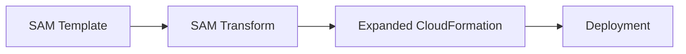

# How to Use CloudFormation with SAM Transform for Serverless

Author: [nawazdhandala](https://github.com/nawazdhandala)

Tags: AWS, CloudFormation, SAM, Serverless, Lambda

Description: Learn how to use the AWS SAM transform with CloudFormation to simplify serverless application deployment with Lambda, API Gateway, and DynamoDB.

---

Building serverless applications with raw CloudFormation is verbose. A single Lambda function with an API Gateway trigger needs a Lambda function resource, an IAM role, an API Gateway REST API, a method, a deployment, a stage, and Lambda permissions. That's seven resources for one endpoint. The SAM (Serverless Application Model) transform collapses all of that into a few lines.

## What is the SAM Transform?

SAM is a CloudFormation transform that extends the template syntax with simplified resource types for serverless applications. When CloudFormation processes a SAM template, it expands the SAM resources into the full CloudFormation resources behind the scenes.



A `AWS::Serverless::Function` becomes a `AWS::Lambda::Function` plus an IAM role, plus any event source mappings, permissions, and API resources. All generated automatically.

## Enabling the SAM Transform

Add the transform declaration at the top of your template:

```yaml
# Enable SAM transform in your template
AWSTemplateFormatVersion: '2010-09-09'
Transform: AWS::Serverless-2016-10-31
Description: Serverless application using SAM
```

That's it. Now you can use SAM resource types alongside standard CloudFormation resources.

## SAM Resource Types

SAM provides these simplified resource types:

| SAM Type | Expands To |
|---|---|
| `AWS::Serverless::Function` | Lambda + IAM Role + Event Sources |
| `AWS::Serverless::Api` | API Gateway REST API |
| `AWS::Serverless::HttpApi` | API Gateway HTTP API (v2) |
| `AWS::Serverless::SimpleTable` | DynamoDB Table |
| `AWS::Serverless::LayerVersion` | Lambda Layer |
| `AWS::Serverless::Application` | Nested SAM application |

## Your First SAM Template

Here's a simple API with a Lambda function:

```yaml
# A complete API with one endpoint - just a few lines
AWSTemplateFormatVersion: '2010-09-09'
Transform: AWS::Serverless-2016-10-31
Description: Hello World API

Globals:
  Function:
    Timeout: 30
    Runtime: python3.12
    MemorySize: 256

Resources:
  HelloFunction:
    Type: AWS::Serverless::Function
    Properties:
      Handler: app.handler
      CodeUri: ./src/
      Events:
        HelloAPI:
          Type: Api
          Properties:
            Path: /hello
            Method: get

Outputs:
  ApiUrl:
    Value: !Sub 'https://${ServerlessRestApi}.execute-api.${AWS::Region}.amazonaws.com/Prod/hello'
```

That's it. This creates:
- A Lambda function
- An IAM execution role with basic Lambda permissions
- An API Gateway REST API with a `/hello` GET endpoint
- A deployment and Prod stage
- Lambda invoke permission for API Gateway

In raw CloudFormation, this would be 60+ lines.

## The Globals Section

SAM adds a `Globals` section for settings that apply to all functions:

```yaml
# Global settings apply to all Lambda functions in the template
Globals:
  Function:
    Timeout: 30
    Runtime: python3.12
    MemorySize: 512
    Tracing: Active
    Environment:
      Variables:
        ENVIRONMENT: !Ref Environment
        LOG_LEVEL: INFO
    Tags:
      Application: my-api
      ManagedBy: SAM
```

Individual functions can override global settings:

```yaml
Resources:
  FastFunction:
    Type: AWS::Serverless::Function
    Properties:
      Handler: fast.handler
      Timeout: 5  # Overrides the global 30 seconds
      MemorySize: 128  # Overrides the global 512 MB
```

## Event Sources

SAM functions support many event source types:

```yaml
# Function with multiple event sources
Resources:
  ProcessorFunction:
    Type: AWS::Serverless::Function
    Properties:
      Handler: processor.handler
      Runtime: python3.12
      CodeUri: ./src/
      Events:
        # API Gateway trigger
        ApiEndpoint:
          Type: Api
          Properties:
            Path: /process
            Method: post

        # SQS queue trigger
        QueueTrigger:
          Type: SQS
          Properties:
            Queue: !GetAtt ProcessingQueue.Arn
            BatchSize: 10

        # S3 bucket event trigger
        BucketUpload:
          Type: S3
          Properties:
            Bucket: !Ref UploadBucket
            Events: s3:ObjectCreated:*
            Filter:
              S3Key:
                Rules:
                  - Name: prefix
                    Value: uploads/

        # Scheduled event (cron)
        DailyCleanup:
          Type: Schedule
          Properties:
            Schedule: rate(1 day)
            Description: Daily cleanup task

        # DynamoDB stream trigger
        TableStream:
          Type: DynamoDB
          Properties:
            Stream: !GetAtt DataTable.StreamArn
            StartingPosition: TRIM_HORIZON
            BatchSize: 100
```

## A Full Serverless Application

Here's a realistic CRUD API with DynamoDB:

```yaml
# Full CRUD API with DynamoDB backend
AWSTemplateFormatVersion: '2010-09-09'
Transform: AWS::Serverless-2016-10-31
Description: Task management API

Parameters:
  Environment:
    Type: String
    AllowedValues: [dev, staging, prod]
    Default: dev

Globals:
  Function:
    Timeout: 30
    Runtime: python3.12
    MemorySize: 256
    Environment:
      Variables:
        TABLE_NAME: !Ref TasksTable
        ENVIRONMENT: !Ref Environment
    Tracing: Active

Resources:
  # API Gateway with CORS
  TaskApi:
    Type: AWS::Serverless::HttpApi
    Properties:
      StageName: !Ref Environment
      CorsConfiguration:
        AllowOrigins:
          - '*'
        AllowMethods:
          - GET
          - POST
          - PUT
          - DELETE
        AllowHeaders:
          - Content-Type
          - Authorization

  # Create task
  CreateTaskFunction:
    Type: AWS::Serverless::Function
    Properties:
      Handler: handlers/create.handler
      CodeUri: ./src/
      Policies:
        - DynamoDBCrudPolicy:
            TableName: !Ref TasksTable
      Events:
        CreateTask:
          Type: HttpApi
          Properties:
            ApiId: !Ref TaskApi
            Path: /tasks
            Method: post

  # List tasks
  ListTasksFunction:
    Type: AWS::Serverless::Function
    Properties:
      Handler: handlers/list.handler
      CodeUri: ./src/
      Policies:
        - DynamoDBReadPolicy:
            TableName: !Ref TasksTable
      Events:
        ListTasks:
          Type: HttpApi
          Properties:
            ApiId: !Ref TaskApi
            Path: /tasks
            Method: get

  # Get single task
  GetTaskFunction:
    Type: AWS::Serverless::Function
    Properties:
      Handler: handlers/get.handler
      CodeUri: ./src/
      Policies:
        - DynamoDBReadPolicy:
            TableName: !Ref TasksTable
      Events:
        GetTask:
          Type: HttpApi
          Properties:
            ApiId: !Ref TaskApi
            Path: /tasks/{taskId}
            Method: get

  # Update task
  UpdateTaskFunction:
    Type: AWS::Serverless::Function
    Properties:
      Handler: handlers/update.handler
      CodeUri: ./src/
      Policies:
        - DynamoDBCrudPolicy:
            TableName: !Ref TasksTable
      Events:
        UpdateTask:
          Type: HttpApi
          Properties:
            ApiId: !Ref TaskApi
            Path: /tasks/{taskId}
            Method: put

  # Delete task
  DeleteTaskFunction:
    Type: AWS::Serverless::Function
    Properties:
      Handler: handlers/delete.handler
      CodeUri: ./src/
      Policies:
        - DynamoDBCrudPolicy:
            TableName: !Ref TasksTable
      Events:
        DeleteTask:
          Type: HttpApi
          Properties:
            ApiId: !Ref TaskApi
            Path: /tasks/{taskId}
            Method: delete

  # DynamoDB table
  TasksTable:
    Type: AWS::Serverless::SimpleTable
    Properties:
      PrimaryKey:
        Name: TaskId
        Type: String
      Tags:
        Environment: !Ref Environment

Outputs:
  ApiEndpoint:
    Description: API endpoint URL
    Value: !Sub 'https://${TaskApi}.execute-api.${AWS::Region}.amazonaws.com/${Environment}'
```

## SAM Policy Templates

SAM provides pre-built policy templates that simplify IAM:

```yaml
# Using SAM policy templates instead of writing full IAM policies
Resources:
  MyFunction:
    Type: AWS::Serverless::Function
    Properties:
      Handler: index.handler
      Runtime: python3.12
      Policies:
        # Read/write DynamoDB
        - DynamoDBCrudPolicy:
            TableName: !Ref MyTable

        # Read from S3
        - S3ReadPolicy:
            BucketName: !Ref DataBucket

        # Publish to SNS
        - SNSPublishMessagePolicy:
            TopicArn: !Ref NotificationTopic

        # Read SSM parameters
        - SSMParameterReadPolicy:
            ParameterName: /myapp/*

        # Put events to EventBridge
        - EventBridgePutEventsPolicy:
            EventBusName: default

        # Full custom policy if needed
        - Version: '2012-10-17'
          Statement:
            - Effect: Allow
              Action: ses:SendEmail
              Resource: '*'
```

## Deploying SAM Templates

You can deploy with the regular CloudFormation CLI:

```bash
# Package the template (uploads code to S3)
aws cloudformation package \
  --template-file template.yaml \
  --s3-bucket my-deployment-bucket \
  --output-template-file packaged.yaml

# Deploy the packaged template
aws cloudformation deploy \
  --stack-name my-serverless-app \
  --template-file packaged.yaml \
  --parameter-overrides Environment=prod \
  --capabilities CAPABILITY_IAM CAPABILITY_AUTO_EXPAND
```

Note: `CAPABILITY_AUTO_EXPAND` is required because the SAM transform expands into additional resources.

Or use the SAM CLI (which wraps CloudFormation):

```bash
# Build and deploy with SAM CLI
sam build
sam deploy \
  --stack-name my-serverless-app \
  --parameter-overrides Environment=prod \
  --capabilities CAPABILITY_IAM CAPABILITY_AUTO_EXPAND \
  --resolve-s3
```

## Mixing SAM and Standard CloudFormation

SAM resources work alongside regular CloudFormation resources:

```yaml
# Mix SAM and standard CloudFormation resources
AWSTemplateFormatVersion: '2010-09-09'
Transform: AWS::Serverless-2016-10-31

Resources:
  # SAM resource
  ApiFunction:
    Type: AWS::Serverless::Function
    Properties:
      Handler: api.handler
      Runtime: python3.12
      Events:
        Api:
          Type: HttpApi

  # Standard CloudFormation resource
  NotificationTopic:
    Type: AWS::SNS::Topic
    Properties:
      TopicName: api-notifications

  # Standard CloudFormation with reference to SAM resource
  FunctionAlarm:
    Type: AWS::CloudWatch::Alarm
    Properties:
      AlarmName: api-errors
      MetricName: Errors
      Namespace: AWS/Lambda
      Statistic: Sum
      Period: 300
      EvaluationPeriods: 1
      Threshold: 5
      ComparisonOperator: GreaterThanThreshold
      Dimensions:
        - Name: FunctionName
          Value: !Ref ApiFunction
```

## Viewing the Expanded Template

To see what SAM generates under the hood:

```bash
# Create a change set and view the processed template
aws cloudformation create-change-set \
  --stack-name my-serverless-app \
  --template-body file://packaged.yaml \
  --change-set-name view-expansion \
  --capabilities CAPABILITY_IAM CAPABILITY_AUTO_EXPAND

aws cloudformation get-template \
  --stack-name my-serverless-app \
  --change-set-name view-expansion \
  --template-stage Processed
```

## Best Practices

**Use the Globals section.** Don't repeat runtime, timeout, and memory settings across every function. Set them once globally.

**Use SAM policy templates.** They're simpler and less error-prone than writing full IAM policies manually.

**Keep functions focused.** One function per API endpoint or event handler. Don't build a monolithic Lambda that handles everything.

**Use HttpApi over Api when possible.** `AWS::Serverless::HttpApi` creates an HTTP API (API Gateway v2), which is cheaper and faster than the REST API created by `Type: Api`.

**Set appropriate timeouts.** The default 3-second timeout is too short for most real-world functions. Set it in Globals.

**Include CAPABILITY_AUTO_EXPAND.** The SAM transform creates additional resources that require this capability acknowledgment.

**Monitor your functions.** Set up CloudWatch alarms for errors and duration. You can add standard CloudFormation alarm resources alongside your SAM resources, or integrate with [OneUptime](https://oneuptime.com/blog/post/detect-fix-cloudformation-drift/view) for comprehensive monitoring.

The SAM transform dramatically reduces the boilerplate for serverless applications. It's not a separate product - it's just a smarter way to write CloudFormation templates for serverless workloads.
