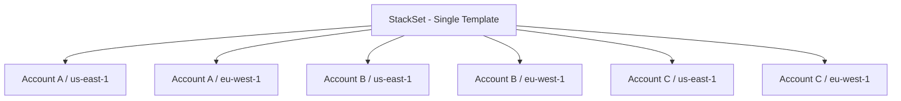

# How to Use CloudFormation Stack Sets for Multi-Account Deployment

Author: [nawazdhandala](https://github.com/nawazdhandala)

Tags: AWS, CloudFormation, Multi-Account, AWS Organizations, DevOps

Description: Learn how to use CloudFormation StackSets to deploy infrastructure across multiple AWS accounts and regions from a single template.

---

Managing one AWS account is straightforward. Managing twenty accounts across four regions is a different game entirely. CloudFormation StackSets let you deploy a single template across multiple accounts and regions simultaneously, maintaining consistency without logging into each account individually.

## What Are Stack Sets?

A StackSet is a collection of CloudFormation stacks deployed from a single template across multiple accounts and/or regions. You define the template once, specify the target accounts and regions, and StackSets handles the rest.



Each box at the bottom is a "stack instance" - an individual CloudFormation stack created from the StackSet's template.

## When to Use StackSets

Common use cases include:

- **Guardrails**: Deploy Config rules, CloudTrail, or GuardDuty across all accounts
- **Security baselines**: Set up IAM password policies, security groups, or WAF rules everywhere
- **Logging**: Enable CloudWatch logging and S3 access logging in every account
- **Networking**: Deploy VPCs with consistent CIDR blocks across accounts
- **Compliance**: Ensure every account meets organizational standards

## Permission Models

StackSets supports two permission models:

**Self-managed permissions**: You manually create IAM roles in the administrator account and each target account. More setup, but works without AWS Organizations.

**Service-managed permissions**: Uses AWS Organizations to automatically manage permissions. Less setup, supports automatic deployments to new accounts. This is the recommended approach if you're using Organizations.

## Setting Up with Service-Managed Permissions

If you're using AWS Organizations, enable trusted access first:

```bash
# Enable trusted access for StackSets in AWS Organizations
aws organizations enable-aws-service-access \
  --service-principal member.org.stacksets.cloudformation.amazonaws.com
```

Then you can target accounts by Organizational Unit (OU) instead of listing individual account IDs.

## Setting Up with Self-Managed Permissions

You need two IAM roles. First, in the administrator account:

```yaml
# admin-role.yaml - Role in the administrator account
AWSTemplateFormatVersion: '2010-09-09'
Description: StackSets administrator role

Resources:
  StackSetAdminRole:
    Type: AWS::IAM::Role
    Properties:
      RoleName: AWSCloudFormationStackSetAdministrationRole
      AssumeRolePolicyDocument:
        Version: '2012-10-17'
        Statement:
          - Effect: Allow
            Principal:
              Service: cloudformation.amazonaws.com
            Action: sts:AssumeRole
      Policies:
        - PolicyName: AssumeExecutionRole
          PolicyDocument:
            Version: '2012-10-17'
            Statement:
              - Effect: Allow
                Action: sts:AssumeRole
                Resource: 'arn:aws:iam::*:role/AWSCloudFormationStackSetExecutionRole'
```

Then in each target account:

```yaml
# execution-role.yaml - Role in each target account
AWSTemplateFormatVersion: '2010-09-09'
Description: StackSets execution role for target accounts

Parameters:
  AdministratorAccountId:
    Type: String
    Description: AWS account ID of the StackSets administrator

Resources:
  StackSetExecutionRole:
    Type: AWS::IAM::Role
    Properties:
      RoleName: AWSCloudFormationStackSetExecutionRole
      AssumeRolePolicyDocument:
        Version: '2012-10-17'
        Statement:
          - Effect: Allow
            Principal:
              AWS: !Sub 'arn:aws:iam::${AdministratorAccountId}:root'
            Action: sts:AssumeRole
      ManagedPolicyArns:
        - arn:aws:iam::aws:policy/AdministratorAccess
```

In production, you'd scope down the execution role's permissions instead of granting full admin access.

## Creating a StackSet

Let's create a StackSet that deploys a security baseline across accounts. Here's the template:

```yaml
# security-baseline.yaml - Deployed to all accounts
AWSTemplateFormatVersion: '2010-09-09'
Description: Security baseline for all accounts

Resources:
  # Enable CloudTrail
  CloudTrail:
    Type: AWS::CloudTrail::Trail
    Properties:
      TrailName: organization-trail
      IsLogging: true
      S3BucketName: !Ref TrailBucket
      EnableLogFileValidation: true
      IsMultiRegionTrail: true

  TrailBucket:
    Type: AWS::S3::Bucket
    Properties:
      BucketName: !Sub 'cloudtrail-${AWS::AccountId}-${AWS::Region}'
      VersioningConfiguration:
        Status: Enabled
      BucketEncryption:
        ServerSideEncryptionConfiguration:
          - ServerSideEncryptionByDefault:
              SSEAlgorithm: AES256

  TrailBucketPolicy:
    Type: AWS::S3::BucketPolicy
    Properties:
      Bucket: !Ref TrailBucket
      PolicyDocument:
        Version: '2012-10-17'
        Statement:
          - Sid: AWSCloudTrailAclCheck
            Effect: Allow
            Principal:
              Service: cloudtrail.amazonaws.com
            Action: s3:GetBucketAcl
            Resource: !GetAtt TrailBucket.Arn
          - Sid: AWSCloudTrailWrite
            Effect: Allow
            Principal:
              Service: cloudtrail.amazonaws.com
            Action: s3:PutObject
            Resource: !Sub '${TrailBucket.Arn}/*'
            Condition:
              StringEquals:
                s3:x-amz-acl: bucket-owner-full-control

  # Password policy
  PasswordPolicy:
    Type: AWS::IAM::AccountPasswordPolicy
    Properties:
      MinimumPasswordLength: 14
      RequireSymbols: true
      RequireNumbers: true
      RequireUppercaseCharacters: true
      RequireLowercaseCharacters: true
      MaxPasswordAge: 90
      PasswordReusePrevention: 12
```

Create the StackSet:

```bash
# Create a StackSet with service-managed permissions
aws cloudformation create-stack-set \
  --stack-set-name security-baseline \
  --template-body file://security-baseline.yaml \
  --permission-model SERVICE_MANAGED \
  --auto-deployment Enabled=true,RetainStacksOnAccountRemoval=false \
  --capabilities CAPABILITY_IAM CAPABILITY_NAMED_IAM

# Or with self-managed permissions
aws cloudformation create-stack-set \
  --stack-set-name security-baseline \
  --template-body file://security-baseline.yaml \
  --permission-model SELF_MANAGED \
  --administration-role-arn arn:aws:iam::123456789012:role/AWSCloudFormationStackSetAdministrationRole \
  --execution-role-name AWSCloudFormationStackSetExecutionRole \
  --capabilities CAPABILITY_IAM
```

## Deploying Stack Instances

After creating the StackSet, add stack instances to target accounts:

```bash
# Deploy to specific accounts and regions (self-managed)
aws cloudformation create-stack-instances \
  --stack-set-name security-baseline \
  --accounts 111111111111 222222222222 333333333333 \
  --regions us-east-1 us-west-2 eu-west-1

# Deploy to an Organizational Unit (service-managed)
aws cloudformation create-stack-instances \
  --stack-set-name security-baseline \
  --deployment-targets OrganizationalUnitIds=ou-abc123 \
  --regions us-east-1 us-west-2 eu-west-1
```

## Monitoring StackSet Operations

```bash
# List all operations for a StackSet
aws cloudformation list-stack-set-operations \
  --stack-set-name security-baseline

# Get details of a specific operation
aws cloudformation describe-stack-set-operation \
  --stack-set-name security-baseline \
  --operation-id abc123-def456

# List stack instances and their statuses
aws cloudformation list-stack-instances \
  --stack-set-name security-baseline \
  --query 'Summaries[*].{Account:Account,Region:Region,Status:Status}'
```

## Updating a StackSet

When you update the template, StackSets rolls the update across all instances:

```bash
# Update the StackSet template
aws cloudformation update-stack-set \
  --stack-set-name security-baseline \
  --template-body file://security-baseline-v2.yaml \
  --capabilities CAPABILITY_IAM

# Control the rollout speed
aws cloudformation update-stack-set \
  --stack-set-name security-baseline \
  --template-body file://security-baseline-v2.yaml \
  --operation-preferences \
    MaxConcurrentPercentage=25,FailureTolerancePercentage=10 \
  --capabilities CAPABILITY_IAM
```

The `MaxConcurrentPercentage` controls how many accounts update simultaneously. `FailureTolerancePercentage` sets how many failures are acceptable before the operation stops.

## Handling Failures

If a stack instance fails to create or update:

```bash
# Find failed instances
aws cloudformation list-stack-instances \
  --stack-set-name security-baseline \
  --filters Name=DETAILED_STATUS,Values=FAILED

# Retry failed instances
aws cloudformation create-stack-instances \
  --stack-set-name security-baseline \
  --accounts 222222222222 \
  --regions us-east-1 \
  --operation-preferences MaxConcurrentCount=1
```

Common failure reasons include insufficient permissions in the target account, resource limits, or region-specific service availability.

## Deleting Stack Instances and StackSets

Remove instances before deleting the StackSet:

```bash
# Remove stack instances (delete the stacks in target accounts)
aws cloudformation delete-stack-instances \
  --stack-set-name security-baseline \
  --accounts 111111111111 222222222222 \
  --regions us-east-1 us-west-2 \
  --no-retain-stacks

# After all instances are removed, delete the StackSet
aws cloudformation delete-stack-set \
  --stack-set-name security-baseline
```

Use `--retain-stacks` instead of `--no-retain-stacks` if you want to keep the deployed resources but just disconnect them from the StackSet.

## Best Practices

**Start with non-critical accounts.** Test your StackSet on dev or sandbox accounts before rolling out to production.

**Use failure tolerance wisely.** Set low tolerance for critical infrastructure. If one account fails, you want to know before rolling to more accounts.

**Prefer service-managed permissions.** If you use AWS Organizations, service-managed is simpler and supports auto-deployment to new accounts.

**Keep StackSet templates simple.** Complex templates with many resources are harder to debug across accounts. Break complex deployments into multiple StackSets.

**Use parameter overrides per account.** You can customize parameter values per account or region if some accounts need slightly different configurations.

**Monitor drift.** Stack instances can drift from the template if someone makes manual changes. Use [drift detection](https://oneuptime.com/blog/post/detect-fix-cloudformation-drift/view) regularly to catch this.

StackSets are essential for any multi-account AWS organization. They ensure consistency, reduce manual work, and give you a single pane of glass for managing infrastructure across your entire AWS footprint.
