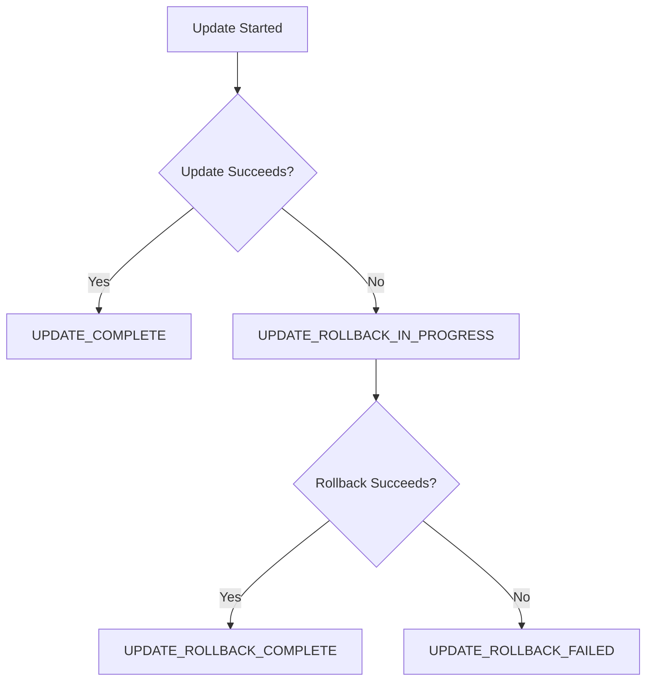

# How to Handle CloudFormation Stack Update Rollbacks

Author: [nawazdhandala](https://github.com/nawazdhandala)

Tags: AWS, CloudFormation, Infrastructure as Code, Troubleshooting

Description: Learn how to handle CloudFormation stack update rollbacks, diagnose the root cause, recover from UPDATE_ROLLBACK_FAILED states, and prevent future failures.

---

You deploy a stack update and instead of seeing `UPDATE_COMPLETE`, you get `UPDATE_ROLLBACK_IN_PROGRESS`. CloudFormation is reverting everything to the previous state. That's the safety net working as intended. But sometimes even the rollback fails, leaving your stack in the dreaded `UPDATE_ROLLBACK_FAILED` state. This guide covers both scenarios.

## Why Updates Fail

Stack updates fail for a variety of reasons:

- **Resource creation errors**: The new resource can't be created (name conflict, permissions issue, service limit)
- **Property validation failures**: An invalid property value that CloudFormation can't catch during template validation
- **Dependency issues**: A resource depends on another that hasn't finished creating
- **Service outages**: The AWS service is temporarily unavailable
- **Custom resource failures**: A Lambda-backed custom resource returns a failure

## Understanding the Rollback Process

When an update fails, CloudFormation tries to restore the previous state:



`UPDATE_ROLLBACK_COMPLETE` means the rollback worked - your stack is back to where it was before the failed update. You can try again.

`UPDATE_ROLLBACK_FAILED` means the rollback itself failed. Your stack is stuck and needs manual intervention.

## Diagnosing the Failure

First, figure out what went wrong:

```bash
# Find the first failure event in the stack
aws cloudformation describe-stack-events \
  --stack-name my-app-prod \
  --query 'StackEvents[?ResourceStatus==`UPDATE_FAILED`].[Timestamp,LogicalResourceId,ResourceStatusReason]' \
  --output table
```

Common error messages and what they mean:

| Error Message | Cause | Fix |
|---|---|---|
| "Resource already exists" | Name collision with an existing resource | Use unique or dynamic names |
| "Limit exceeded" | Hit an AWS service limit | Request a limit increase |
| "Access Denied" | CloudFormation role lacks permissions | Update the role's policy |
| "Template error" | Invalid property or reference | Fix the template |
| "Resource handler returned message" | The resource-specific API returned an error | Check the specific error message |

## Handling UPDATE_ROLLBACK_COMPLETE

This is the normal failure scenario. The rollback succeeded, and your stack is in a usable state. You can:

1. Fix whatever caused the failure
2. Try the update again

```bash
# Check what the current stack looks like
aws cloudformation describe-stacks \
  --stack-name my-app-prod \
  --query 'Stacks[0].{Status:StackStatus,Parameters:Parameters}'

# Fix your template, then try again
aws cloudformation deploy \
  --stack-name my-app-prod \
  --template-file fixed-template.yaml \
  --parameter-overrides Environment=prod \
  --capabilities CAPABILITY_IAM
```

Before retrying, use a [change set](https://oneuptime.com/blog/post/2026-02-12-cloudformation-change-sets-safe-updates/view) to preview the update. This helps you catch issues before committing.

## Handling UPDATE_ROLLBACK_FAILED

This is the scary one. The stack is stuck - you can't update it, delete it, or create new change sets. Here's how to recover.

### Step 1: Identify What Blocked the Rollback

```bash
# Find why the rollback failed
aws cloudformation describe-stack-events \
  --stack-name my-app-prod \
  --query 'StackEvents[?ResourceStatus==`UPDATE_ROLLBACK_FAILED` || ResourceStatus==`DELETE_FAILED`].[Timestamp,LogicalResourceId,ResourceStatusReason]' \
  --output table
```

Common rollback failure reasons:

- A resource was manually deleted during the update
- A resource can't be reverted to its previous state (e.g., an S3 bucket that now has objects)
- Network or permission issues prevent CloudFormation from reaching the resource

### Step 2: Fix the Underlying Issue

Before continuing the rollback, fix whatever is blocking it. For example:

- If a resource was manually deleted, recreate it with the same physical ID
- If an S3 bucket can't be deleted because it has objects, empty it
- If there's a permissions issue, fix the IAM role

### Step 3: Continue the Rollback

Use `continue-update-rollback` to retry. You can optionally skip resources that can't be rolled back:

```bash
# Continue the rollback, skipping problematic resources
aws cloudformation continue-update-rollback \
  --stack-name my-app-prod \
  --resources-to-skip MyProblematicResource AnotherStuckResource
```

The `--resources-to-skip` flag tells CloudFormation to ignore those resources and continue rolling back everything else. Only use this when you're sure the resource is either gone or manually restored.

```bash
# Wait for the rollback to complete
aws cloudformation wait stack-rollback-complete \
  --stack-name my-app-prod

# Verify the stack status
aws cloudformation describe-stacks \
  --stack-name my-app-prod \
  --query 'Stacks[0].StackStatus'
# Should show: UPDATE_ROLLBACK_COMPLETE
```

### Step 4: Reconcile Skipped Resources

If you skipped resources, your stack's view of reality no longer matches actual infrastructure. You need to:

1. Decide if the skipped resource should exist
2. Either import it back into the stack or remove it from the template
3. Deploy an update that aligns the template with reality

For resource import, check our guide on [CloudFormation resource import](https://oneuptime.com/blog/post/2026-02-12-cloudformation-resource-import/view).

## Preventing Update Failures

### Validate before deploying

```bash
# Always validate your template first
aws cloudformation validate-template \
  --template-body file://template.yaml
```

See our full guide on [validating CloudFormation templates](https://oneuptime.com/blog/post/2026-02-12-validate-cloudformation-templates-before-deployment/view).

### Use change sets

Preview every update before executing:

```bash
# Create a change set to review before updating
aws cloudformation create-change-set \
  --stack-name my-app-prod \
  --template-body file://template.yaml \
  --change-set-name review-update \
  --capabilities CAPABILITY_IAM
```

### Use stack policies

Stack policies prevent accidental modifications to critical resources:

```json
{
  "Statement": [
    {
      "Effect": "Allow",
      "Action": "Update:*",
      "Principal": "*",
      "Resource": "*"
    },
    {
      "Effect": "Deny",
      "Action": "Update:Replace",
      "Principal": "*",
      "Resource": "LogicalResourceId/ProductionDatabase"
    }
  ]
}
```

```bash
# Apply a stack policy that prevents database replacement
aws cloudformation set-stack-policy \
  --stack-name my-app-prod \
  --stack-policy-body file://stack-policy.json
```

This policy allows all updates but explicitly denies replacing the database. If an update would cause database replacement, it fails before making any changes.

### Use UpdateReplacePolicy

For resources where replacement would be catastrophic:

```yaml
# Retain the database if CloudFormation tries to replace it
Resources:
  ProductionDatabase:
    Type: AWS::RDS::DBInstance
    UpdateReplacePolicy: Retain
    DeletionPolicy: Retain
    Properties:
      DBInstanceClass: db.r5.large
      Engine: postgres
```

For more details, see our guide on [CloudFormation UpdateReplacePolicy](https://oneuptime.com/blog/post/2026-02-12-cloudformation-updatereplacepolicy/view).

### Enable rollback triggers

CloudWatch alarms can automatically trigger a rollback if metrics go bad during an update:

```bash
# Set a rollback trigger based on a CloudWatch alarm
aws cloudformation update-stack \
  --stack-name my-app-prod \
  --template-body file://template.yaml \
  --rollback-configuration \
    RollbackTriggers=[{Arn=arn:aws:cloudwatch:us-east-1:123456789:alarm:high-error-rate,Type=AWS::CloudWatch::Alarm}],MonitoringTimeInMinutes=5
```

If the alarm fires within the monitoring window, CloudFormation rolls back automatically.

## A Recovery Checklist

When a stack update goes wrong:

1. **Don't panic.** CloudFormation's rollback is designed to protect you.
2. **Read the events.** Find the first `UPDATE_FAILED` event and understand the root cause.
3. **If rollback completed**: Fix the issue and retry with a change set.
4. **If rollback failed**: Identify the blocking resource, fix it (or prepare to skip it), and run `continue-update-rollback`.
5. **After recovery**: Reconcile any skipped resources and update your template to prevent the same issue.
6. **Post-mortem**: Document what went wrong and add validation or policies to prevent recurrence.

## Best Practices

**Always use change sets for production.** The few extra minutes of review save hours of recovery.

**Set stack policies on critical stacks.** Prevent accidental replacement of databases, queues with data, and encryption keys.

**Monitor your stacks.** Set up notifications for stack status changes so you know immediately when an update fails.

**Keep templates small.** Smaller templates mean smaller blast radius. Use [nested stacks](https://oneuptime.com/blog/post/2026-02-12-cloudformation-nested-stacks/view) to break up large deployments.

**Test updates in lower environments first.** Always deploy to dev and staging before production. If it fails there, it would have failed in production too.

Stack update failures are inevitable. What matters is how quickly you can diagnose, recover, and prevent recurrence. With the right tools and processes, a failed update becomes a minor inconvenience instead of a crisis.
