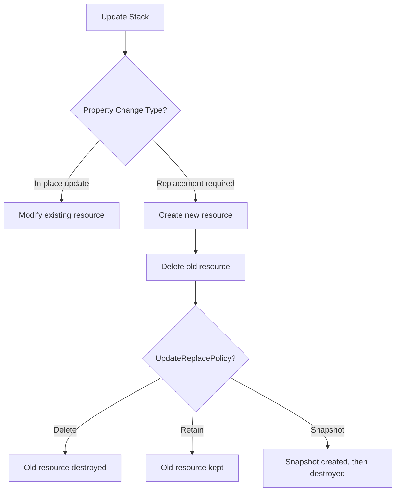

# How to Use CloudFormation UpdateReplacePolicy

Author: [nawazdhandala](https://github.com/nawazdhandala)

Tags: AWS, CloudFormation, Infrastructure as Code, Data Protection

Description: Learn how to use CloudFormation UpdateReplacePolicy to control what happens when resources are replaced during stack updates, preventing accidental data loss.

---

DeletionPolicy protects resources when you delete a stack. But there's a sneaky gap: when a stack update causes a resource to be replaced, DeletionPolicy doesn't apply. The old resource is deleted and a new one is created, and your data goes with it. That's where `UpdateReplacePolicy` comes in.

## Understanding Resource Replacement

Some CloudFormation property changes trigger a resource replacement. Instead of modifying the existing resource in place, CloudFormation creates a new one and then deletes the old one.

For example, changing the `DBInstanceIdentifier` on an RDS instance, or changing the `BucketName` on an S3 bucket, triggers replacement. The existing resource with all its data is destroyed and a fresh empty one is created.



Without `UpdateReplacePolicy`, the old resource is deleted during replacement - regardless of your `DeletionPolicy` setting.

## Setting UpdateReplacePolicy

The syntax is identical to DeletionPolicy:

```yaml
# Protect a database from replacement-triggered deletion
Resources:
  ProductionDatabase:
    Type: AWS::RDS::DBInstance
    UpdateReplacePolicy: Snapshot
    DeletionPolicy: Snapshot
    Properties:
      DBInstanceClass: db.r5.large
      Engine: postgres
      AllocatedStorage: 100
```

The three options:

| Policy | What Happens During Replacement |
|---|---|
| `Delete` | Old resource is deleted (default) |
| `Retain` | Old resource is kept, disconnected from CloudFormation |
| `Snapshot` | Final snapshot of old resource, then deleted |

## Why You Need Both Policies

Consider what happens with only DeletionPolicy set:

```yaml
# DANGEROUS - only DeletionPolicy is set
Resources:
  Database:
    Type: AWS::RDS::DBInstance
    DeletionPolicy: Retain  # Protects against stack deletion
    # UpdateReplacePolicy defaults to Delete!
    Properties:
      DBInstanceIdentifier: my-database
      DBInstanceClass: db.r5.large
      Engine: postgres
```

If someone changes the `DBInstanceIdentifier` in the template, CloudFormation replaces the database. Since `UpdateReplacePolicy` defaults to `Delete`, the old database is destroyed. The `DeletionPolicy: Retain` is irrelevant - that only kicks in on stack deletion, not resource replacement.

The safe version:

```yaml
# SAFE - both policies protect the resource
Resources:
  Database:
    Type: AWS::RDS::DBInstance
    UpdateReplacePolicy: Retain
    DeletionPolicy: Retain
    Properties:
      DBInstanceIdentifier: my-database
      DBInstanceClass: db.r5.large
      Engine: postgres
```

Now the database is protected in both scenarios.

## Common Replacement Triggers

Not all property changes cause replacement. Here are some that do:

**RDS (AWS::RDS::DBInstance)**:
- Changing `DBInstanceIdentifier`
- Changing `Engine`
- Changing `AvailabilityZone` (for Single-AZ)

**S3 (AWS::S3::Bucket)**:
- Changing `BucketName`

**DynamoDB (AWS::DynamoDB::Table)**:
- Changing `TableName`
- Changing key schema attributes

**EC2 (AWS::EC2::Instance)**:
- Changing `AvailabilityZone`
- Changing `ImageId` (AMI)
- Changing `InstanceType` (when using instance store)

**Lambda (AWS::Lambda::Function)**:
- Changing `FunctionName`

To know if a property change causes replacement, check the CloudFormation documentation for that resource type. Each property lists its "Update requires" behavior: No interruption, Some interruption, or Replacement.

## Using Change Sets to Catch Replacements

Before updating, create a [change set](https://oneuptime.com/blog/post/2026-02-12-cloudformation-change-sets-safe-updates/view) to preview whether any resources will be replaced:

```bash
# Create a change set to see if replacements will happen
aws cloudformation create-change-set \
  --stack-name my-app-prod \
  --template-body file://updated-template.yaml \
  --change-set-name check-for-replacements

aws cloudformation wait change-set-create-complete \
  --stack-name my-app-prod \
  --change-set-name check-for-replacements

# Check for replacements
aws cloudformation describe-change-set \
  --stack-name my-app-prod \
  --change-set-name check-for-replacements \
  --query 'Changes[?ResourceChange.Replacement==`True`].ResourceChange.{Resource:LogicalResourceId,Type:ResourceType}' \
  --output table
```

If the output shows replacements for data-bearing resources, stop and reconsider.

## A Complete Protection Template

Here's a template that properly protects all data-bearing resources:

```yaml
# Template with comprehensive replacement and deletion protection
AWSTemplateFormatVersion: '2010-09-09'
Description: Application with full data protection policies

Resources:
  # Database - Snapshot on both replace and delete
  AppDatabase:
    Type: AWS::RDS::DBInstance
    UpdateReplacePolicy: Snapshot
    DeletionPolicy: Snapshot
    Properties:
      DBInstanceClass: db.r5.large
      Engine: postgres
      MasterUsername: admin
      MasterUserPassword: '{{resolve:ssm-secure:/app/db-pass}}'
      AllocatedStorage: 200
      StorageEncrypted: true

  # S3 bucket - Retain on both (no snapshot for S3)
  DataBucket:
    Type: AWS::S3::Bucket
    UpdateReplacePolicy: Retain
    DeletionPolicy: Retain
    Properties:
      BucketName: !Sub '${AWS::StackName}-data'
      VersioningConfiguration:
        Status: Enabled

  # DynamoDB table - Retain on both
  UserTable:
    Type: AWS::DynamoDB::Table
    UpdateReplacePolicy: Retain
    DeletionPolicy: Retain
    Properties:
      TableName: !Sub '${AWS::StackName}-users'
      BillingMode: PAY_PER_REQUEST
      AttributeDefinitions:
        - AttributeName: UserId
          AttributeType: S
      KeySchema:
        - AttributeName: UserId
          KeyType: HASH

  # KMS Key - Always retain (losing key = losing encrypted data)
  EncryptionKey:
    Type: AWS::KMS::Key
    UpdateReplacePolicy: Retain
    DeletionPolicy: Retain
    Properties:
      Description: App encryption key
      EnableKeyRotation: true

  # ElastiCache - Snapshot on both
  CacheCluster:
    Type: AWS::ElastiCache::CacheCluster
    UpdateReplacePolicy: Snapshot
    DeletionPolicy: Snapshot
    Properties:
      CacheNodeType: cache.r5.large
      Engine: redis
      NumCacheNodes: 1

  # Security group - Delete is fine (no data)
  AppSecurityGroup:
    Type: AWS::EC2::SecurityGroup
    # Both policies default to Delete - that's fine for stateless resources
    Properties:
      GroupDescription: Application SG
```

## Handling Retained Resources After Replacement

When `UpdateReplacePolicy: Retain` keeps the old resource, you end up with both the old and new versions. The old one is no longer in your CloudFormation stack.

To manage the old resource:

```bash
# If you want to import it back into the stack
aws cloudformation create-change-set \
  --stack-name my-app-prod \
  --change-set-name import-old-db \
  --change-set-type IMPORT \
  --resources-to-import '[{"ResourceType":"AWS::RDS::DBInstance","LogicalResourceId":"LegacyDatabase","ResourceIdentifier":{"DBInstanceIdentifier":"old-db-name"}}]' \
  --template-body file://template-with-legacy-db.yaml

# If you want to delete it
aws rds delete-db-instance \
  --db-instance-identifier old-db-name \
  --final-db-snapshot-identifier old-db-final-snapshot

# If you want to keep it, tag it for tracking
aws rds add-tags-to-resource \
  --resource-name arn:aws:rds:us-east-1:123456789:db:old-db-name \
  --tags Key=RetainedFrom,Value=my-app-prod Key=RetainedAt,Value=$(date -u +%Y-%m-%dT%H:%M:%SZ)
```

## Stack Policies as Additional Protection

Stack policies can prevent replacements at the stack level:

```json
{
  "Statement": [
    {
      "Effect": "Allow",
      "Action": "Update:*",
      "Principal": "*",
      "Resource": "*"
    },
    {
      "Effect": "Deny",
      "Action": "Update:Replace",
      "Principal": "*",
      "Resource": "LogicalResourceId/AppDatabase"
    },
    {
      "Effect": "Deny",
      "Action": "Update:Replace",
      "Principal": "*",
      "Resource": "LogicalResourceId/UserTable"
    }
  ]
}
```

```bash
# Apply the stack policy
aws cloudformation set-stack-policy \
  --stack-name my-app-prod \
  --stack-policy-body file://stack-policy.json
```

With this policy, any update that would replace the database or DynamoDB table will fail before making changes. You'd need to temporarily override the policy to allow the replacement.

## Best Practices

**Always set both DeletionPolicy and UpdateReplacePolicy.** They cover different scenarios. Missing one leaves a gap.

**Use Snapshot when available.** For RDS, ElastiCache, and Redshift, Snapshot gives you a backup without ongoing costs.

**Use Retain for S3, DynamoDB, and KMS.** These don't support snapshots, so Retain is your only safety option.

**Combine with change sets.** Always preview updates to catch unexpected replacements before they happen.

**Add stack policies for critical resources.** Belt and suspenders - prevent replacements from even being attempted.

**Tag retained resources.** When a resource is retained during replacement, tag it immediately so you can track and clean it up later.

**Review the "Update requires" documentation.** Before adding a new property or changing an existing one, check whether it triggers replacement. The CloudFormation docs list this for every property.

UpdateReplacePolicy closes the data protection gap that DeletionPolicy leaves open. Together, they ensure your critical resources survive any CloudFormation operation - whether it's a stack deletion, a template update, or an accidental property change.
