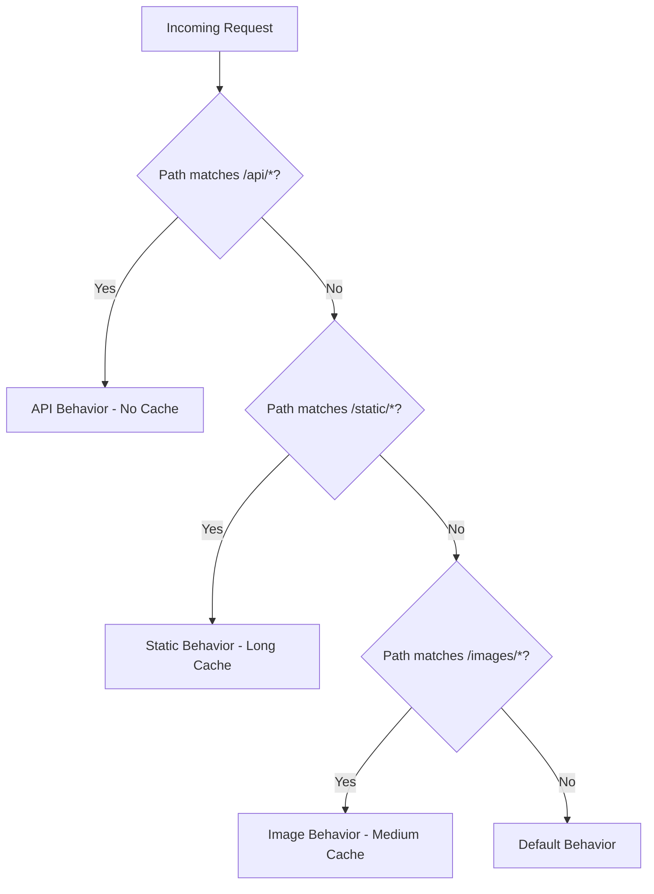

# How to Configure CloudFront Behaviors and Cache Policies

Author: [nawazdhandala](https://github.com/nawazdhandala)

Tags: AWS, CloudFront, Caching, CDN, Performance

Description: Deep dive into configuring CloudFront cache behaviors and managed or custom cache policies for optimal performance and cache hit rates.

---

Getting CloudFront's cache configuration right is the difference between a CDN that actually helps and one that just adds latency. Cache behaviors tell CloudFront how to handle requests for different URL patterns, and cache policies define what makes a cached object unique. Let's break down both in detail.

## How Cache Behaviors Work

Every CloudFront distribution has a default cache behavior and can have up to 25 additional behaviors. When a request comes in, CloudFront checks the URL path against each behavior's path pattern in order. The first match wins. If nothing matches, the default behavior handles it.



## Creating Cache Behaviors

Each behavior controls several important aspects:

- Which origin to route requests to
- Whether to cache and for how long
- Which HTTP methods to allow
- Whether to compress responses
- What to forward to the origin (headers, cookies, query strings)

Here's how to configure them through the CLI:

```bash
# Get the current distribution config
aws cloudfront get-distribution-config \
  --id E1234567890 > dist-config.json
```

Then edit the `CacheBehaviors` section. Here's a practical example with three behaviors:

```json
{
  "CacheBehaviors": {
    "Quantity": 3,
    "Items": [
      {
        "PathPattern": "/api/*",
        "TargetOriginId": "api-origin",
        "ViewerProtocolPolicy": "https-only",
        "AllowedMethods": ["GET", "HEAD", "OPTIONS", "PUT", "POST", "PATCH", "DELETE"],
        "CachedMethods": ["GET", "HEAD"],
        "CachePolicyId": "4135ea2d-6df8-44a3-9df3-4b5a84be39ad",
        "OriginRequestPolicyId": "216adef6-5c7f-47e4-b989-5492eafa07d3",
        "Compress": true
      },
      {
        "PathPattern": "/static/*",
        "TargetOriginId": "s3-origin",
        "ViewerProtocolPolicy": "redirect-to-https",
        "AllowedMethods": ["GET", "HEAD"],
        "CachedMethods": ["GET", "HEAD"],
        "CachePolicyId": "658327ea-f89d-4fab-a63d-7e88639e58f6",
        "Compress": true
      },
      {
        "PathPattern": "/ws/*",
        "TargetOriginId": "api-origin",
        "ViewerProtocolPolicy": "https-only",
        "AllowedMethods": ["GET", "HEAD"],
        "CachedMethods": ["GET", "HEAD"],
        "CachePolicyId": "4135ea2d-6df8-44a3-9df3-4b5a84be39ad"
      }
    ]
  }
}
```

## Understanding Cache Policies

Cache policies replaced the old forwarding configuration and give you much cleaner control over caching. A cache policy defines the **cache key** - the combination of values that make each cached object unique.

The cache key can include:

- **Headers** - Different header values produce different cache entries
- **Cookies** - Different cookie values produce different cache entries
- **Query strings** - Different query parameters produce different cache entries

The golden rule: include as little as possible in the cache key. The more you include, the fewer cache hits you get.

## AWS Managed Cache Policies

AWS provides several built-in policies. Here are the most useful ones:

```bash
# List all managed cache policies
aws cloudfront list-cache-policies \
  --type managed \
  --query 'CachePolicyList.Items[].CachePolicy.{Name:CachePolicyConfig.Name,Id:Id}'
```

Key managed policies:

| Policy | ID | Use Case |
|--------|-----|----------|
| CachingOptimized | 658327ea-f89d-4fab-a63d-7e88639e58f6 | Static content, max caching |
| CachingDisabled | 4135ea2d-6df8-44a3-9df3-4b5a84be39ad | API calls, dynamic content |
| CachingOptimizedForUncompressedObjects | b2884449-e4de-46a7-ac36-70bc7f1ddd6d | Already compressed files |
| Elemental-MediaPackage | 08627262-05a9-4f76-9ded-b50ca2e3a84f | Media streaming |

**CachingOptimized** is the go-to for static content. It includes query strings in the cache key but not headers or cookies, and enables gzip and Brotli compression. TTL defaults to 24 hours.

**CachingDisabled** passes everything through to the origin without caching. Use this for API endpoints and dynamic content.

## Creating Custom Cache Policies

When managed policies don't fit, create your own:

```bash
# Create a custom cache policy for pages that vary by language
aws cloudfront create-cache-policy \
  --cache-policy-config '{
    "Name": "language-aware-caching",
    "Comment": "Cache separately by Accept-Language header",
    "DefaultTTL": 3600,
    "MaxTTL": 86400,
    "MinTTL": 0,
    "ParametersInCacheKeyAndForwardedToOrigin": {
      "EnableAcceptEncodingGzip": true,
      "EnableAcceptEncodingBrotli": true,
      "HeadersConfig": {
        "HeaderBehavior": "whitelist",
        "Headers": {
          "Quantity": 1,
          "Items": ["Accept-Language"]
        }
      },
      "CookiesConfig": {
        "CookieBehavior": "none"
      },
      "QueryStringsConfig": {
        "QueryStringBehavior": "whitelist",
        "QueryStrings": {
          "Quantity": 2,
          "Items": ["page", "sort"]
        }
      }
    }
  }'
```

This policy caches content separately based on the `Accept-Language` header and the `page` and `sort` query parameters. Everything else is ignored for caching purposes.

Here's another common pattern - caching that respects a session cookie:

```bash
# Create a cache policy that varies by session cookie
aws cloudfront create-cache-policy \
  --cache-policy-config '{
    "Name": "session-aware-caching",
    "Comment": "Cache varies by session ID for personalized content",
    "DefaultTTL": 300,
    "MaxTTL": 3600,
    "MinTTL": 0,
    "ParametersInCacheKeyAndForwardedToOrigin": {
      "EnableAcceptEncodingGzip": true,
      "EnableAcceptEncodingBrotli": true,
      "HeadersConfig": {
        "HeaderBehavior": "none"
      },
      "CookiesConfig": {
        "CookieBehavior": "whitelist",
        "Cookies": {
          "Quantity": 1,
          "Items": ["session_id"]
        }
      },
      "QueryStringsConfig": {
        "QueryStringBehavior": "all"
      }
    }
  }'
```

Be careful with this pattern though - caching per session essentially means you're caching per user, which defeats the purpose if you don't have many repeated requests per session.

## Origin Request Policies

Origin request policies are separate from cache policies. They control what gets forwarded to the origin when there's a cache miss. You might want to forward headers like `User-Agent` to the origin for server-side rendering without including them in the cache key.

```bash
# Create an origin request policy that forwards useful headers
aws cloudfront create-origin-request-policy \
  --origin-request-policy-config '{
    "Name": "forward-app-headers",
    "Comment": "Forward useful headers without affecting cache key",
    "HeadersConfig": {
      "HeaderBehavior": "whitelist",
      "Headers": {
        "Quantity": 3,
        "Items": ["X-Forwarded-For", "User-Agent", "Referer"]
      }
    },
    "CookiesConfig": {
      "CookieBehavior": "all"
    },
    "QueryStringsConfig": {
      "QueryStringBehavior": "all"
    }
  }'
```

## TTL Settings Explained

Three TTL values work together with your origin's `Cache-Control` headers:

- **MinTTL** - The minimum time CloudFront caches an object, even if the origin says to cache for less
- **DefaultTTL** - Used when the origin doesn't send `Cache-Control` or `Expires` headers
- **MaxTTL** - The maximum cache duration, overriding any longer TTL from the origin

```
Origin says: Cache-Control: max-age=600 (10 minutes)

MinTTL=0, DefaultTTL=86400, MaxTTL=31536000
Result: Cached for 600 seconds (origin wins, within bounds)

MinTTL=3600, DefaultTTL=86400, MaxTTL=31536000
Result: Cached for 3600 seconds (MinTTL overrides the shorter origin TTL)

Origin sends no Cache-Control header:
Result: Cached for 86400 seconds (DefaultTTL kicks in)
```

## Debugging Cache Hits and Misses

Check response headers to see if CloudFront served from cache:

```bash
# Check if a request was a cache hit
curl -I https://d1234.cloudfront.net/static/app.js 2>/dev/null | grep -i x-cache
# X-Cache: Hit from cloudfront   (served from cache)
# X-Cache: Miss from cloudfront  (fetched from origin)

# Also check the age header
curl -I https://d1234.cloudfront.net/static/app.js 2>/dev/null | grep -i age
# Age: 12345  (seconds since the object was cached)
```

If you're getting more misses than expected, the cache key is probably too broad. Check which headers, cookies, or query strings are included in your cache policy.

## Best Practices

1. **Start with CachingDisabled and add caching incrementally** - It's safer to start with everything passing through and then add caching for specific paths as you validate they're safe to cache.

2. **Don't include unnecessary headers in the cache key** - Every additional header multiplies the number of cache variants. The `Accept-Language` header alone can create dozens of variants.

3. **Use versioned URLs for static assets** - Instead of relying on cache invalidation, use URLs like `/static/app.v2.js`. This gives you instant updates without invalidation delays.

4. **Set appropriate TTLs per content type** - Static assets with versioned names can be cached for a year. HTML pages might only be cached for minutes. API responses often shouldn't be cached at all.

5. **Monitor your cache hit rate** - Aim for 80%+ for static content. If it's lower, review your cache key configuration.

## Summary

CloudFront behaviors and cache policies give you granular control over how content is cached and delivered. Use path patterns to route different URL patterns to different origins with different caching strategies. Keep cache keys minimal, use managed policies where possible, and create custom policies only when you need specific header, cookie, or query string handling. Monitor cache hit rates and adjust your configuration based on the data.
