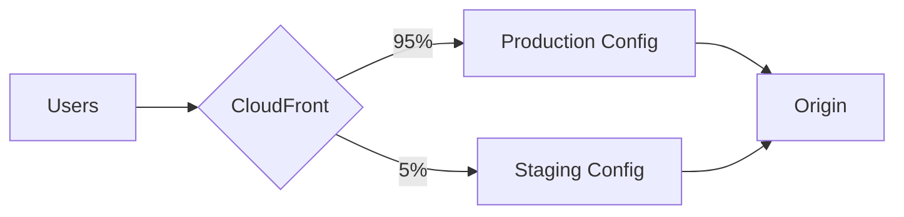

# How to Use CloudFront Continuous Deployment for Safe Rollouts

Author: [nawazdhandala](https://github.com/nawazdhandala)

Tags: AWS, CloudFront, Deployment, CDN, DevOps

Description: Learn how to use CloudFront continuous deployment to safely test configuration changes with a staging distribution before promoting to production.

---

Changing a CloudFront distribution configuration used to be a hold-your-breath moment. You'd update the config, wait 15-20 minutes for it to propagate globally, and hope nothing broke. If something went wrong, you'd make another change and wait another 15-20 minutes. That's a terrible feedback loop.

CloudFront Continuous Deployment fixes this with staging distributions. You create a staging copy of your production distribution, test changes there with real traffic, and then promote the staging config to production when you're confident. It's canary deployments for your CDN.

## How It Works

The continuous deployment workflow involves:

1. You have a production distribution serving your live traffic.
2. You create a staging distribution that's linked to the production one.
3. A traffic policy routes a percentage of requests to the staging distribution.
4. You verify the staging distribution behaves correctly.
5. You promote the staging configuration to production.



Both distributions share the same domain name and origin. The difference is the configuration (cache behaviors, functions, custom headers, etc.).

## Creating a Staging Distribution

First, you need a continuous deployment policy that defines how traffic is split.

Create a continuous deployment policy:

```bash
# Create the policy
aws cloudfront create-continuous-deployment-policy \
  --continuous-deployment-policy-config '{
    "StagingDistributionDnsNames": {
      "Items": ["d111111abcdef8.cloudfront.net"],
      "Quantity": 1
    },
    "Enabled": true,
    "TrafficConfig": {
      "Type": "SingleWeight",
      "SingleWeightConfig": {
        "Weight": 0.05
      }
    }
  }'
```

This sends 5% of traffic to the staging distribution. You can also use header-based routing instead of weight-based, which is useful for internal testing.

Header-based traffic routing for targeted testing:

```bash
aws cloudfront create-continuous-deployment-policy \
  --continuous-deployment-policy-config '{
    "StagingDistributionDnsNames": {
      "Items": ["d111111abcdef8.cloudfront.net"],
      "Quantity": 1
    },
    "Enabled": true,
    "TrafficConfig": {
      "Type": "SingleHeader",
      "SingleHeaderConfig": {
        "Header": "aws-cf-cd-staging",
        "Value": "true"
      }
    }
  }'
```

With header-based routing, only requests containing the `aws-cf-cd-staging: true` header go to the staging distribution. This lets your QA team test against staging while 100% of real user traffic stays on production.

## Creating the Staging Distribution

Create a staging distribution that mirrors your production config with the changes you want to test.

Copy your production config and create a staging distribution:

```bash
# Get your production distribution config
aws cloudfront get-distribution-config \
  --id E1234567890ABC > prod-config.json

# Modify the config for staging (change what you want to test)
# Then create the staging distribution
aws cloudfront create-distribution-with-tags \
  --distribution-config-with-tags file://staging-config.json
```

The staging distribution config should include the continuous deployment policy ID.

CloudFormation for the complete setup:

```yaml
AWSTemplateFormatVersion: '2010-09-09'
Description: CloudFront Continuous Deployment

Resources:
  ProductionDistribution:
    Type: AWS::CloudFront::Distribution
    Properties:
      DistributionConfig:
        Enabled: true
        DefaultCacheBehavior:
          TargetOriginId: primary-origin
          ViewerProtocolPolicy: redirect-to-https
          CachePolicyId: 658327ea-f89d-4fab-a63d-7e88639e58f6
          # Production function association
          FunctionAssociations:
            - EventType: viewer-request
              FunctionARN: !GetAtt ProductionFunction.FunctionARN
        Origins:
          - Id: primary-origin
            DomainName: origin.example.com
            CustomOriginConfig:
              HTTPSPort: 443
              OriginProtocolPolicy: https-only
        Aliases:
          - cdn.example.com
        ViewerCertificate:
          AcmCertificateArn: !Ref CertificateArn
          SslSupportMethod: sni-only

  ContinuousDeploymentPolicy:
    Type: AWS::CloudFront::ContinuousDeploymentPolicy
    Properties:
      ContinuousDeploymentPolicyConfig:
        Enabled: true
        StagingDistributionDnsNames:
          Items:
            - !GetAtt StagingDistribution.DomainName
          Quantity: 1
        TrafficConfig:
          Type: SingleWeight
          SingleWeightConfig:
            Weight: 0.05

  StagingDistribution:
    Type: AWS::CloudFront::Distribution
    Properties:
      DistributionConfig:
        Enabled: true
        Staging: true
        ContinuousDeploymentPolicyId: !Ref ContinuousDeploymentPolicy
        DefaultCacheBehavior:
          TargetOriginId: primary-origin
          ViewerProtocolPolicy: redirect-to-https
          CachePolicyId: 658327ea-f89d-4fab-a63d-7e88639e58f6
          # New function being tested
          FunctionAssociations:
            - EventType: viewer-request
              FunctionARN: !GetAtt StagingFunction.FunctionARN
        Origins:
          - Id: primary-origin
            DomainName: origin.example.com
            CustomOriginConfig:
              HTTPSPort: 443
              OriginProtocolPolicy: https-only
```

## Testing the Staging Distribution

Once deployed, you can test staging in two ways.

Direct testing with the staging header:

```bash
# Test using the staging header
curl -H "aws-cf-cd-staging: true" https://cdn.example.com/test-page

# Compare with production
curl https://cdn.example.com/test-page
```

Monitoring staging metrics:

```bash
# Check error rates on the staging distribution
aws cloudwatch get-metric-data \
  --metric-data-queries '[
    {
      "Id": "staging4xx",
      "MetricStat": {
        "Metric": {
          "Namespace": "AWS/CloudFront",
          "MetricName": "4xxErrorRate",
          "Dimensions": [
            {"Name": "DistributionId", "Value": "STAGING_DIST_ID"},
            {"Name": "Region", "Value": "Global"}
          ]
        },
        "Period": 300,
        "Stat": "Average"
      }
    },
    {
      "Id": "prod4xx",
      "MetricStat": {
        "Metric": {
          "Namespace": "AWS/CloudFront",
          "MetricName": "4xxErrorRate",
          "Dimensions": [
            {"Name": "DistributionId", "Value": "PROD_DIST_ID"},
            {"Name": "Region", "Value": "Global"}
          ]
        },
        "Period": 300,
        "Stat": "Average"
      }
    }
  ]' \
  --start-time "2026-02-12T00:00:00Z" \
  --end-time "2026-02-12T12:00:00Z"
```

Compare error rates, latency, and cache hit ratios between staging and production. If staging looks healthy, you're ready to promote.

## Gradually Increasing Traffic

Start with a small percentage and ramp up as confidence grows.

Increase staging traffic percentage:

```bash
# Bump from 5% to 15%
aws cloudfront update-continuous-deployment-policy \
  --id policy-abc123 \
  --if-match ETAG \
  --continuous-deployment-policy-config '{
    "StagingDistributionDnsNames": {
      "Items": ["d111111abcdef8.cloudfront.net"],
      "Quantity": 1
    },
    "Enabled": true,
    "TrafficConfig": {
      "Type": "SingleWeight",
      "SingleWeightConfig": {
        "Weight": 0.15
      }
    }
  }'
```

A typical rollout progression might be: 5% for 30 minutes, 15% for 1 hour, 50% for 1 hour, then promote to 100%.

## Promoting to Production

When you're satisfied with the staging distribution's behavior, promote its configuration to production.

Promote the staging config:

```bash
# Promote staging to production
aws cloudfront update-distribution-with-staging-config \
  --id E_PROD_DIST_ID \
  --staging-distribution-id E_STAGING_DIST_ID \
  --if-match PROD_ETAG,STAGING_ETAG
```

This copies the staging distribution's configuration to the production distribution. It's atomic - there's no gap where some edge locations have the old config and others have the new one.

## Rollback Strategy

If something goes wrong during the staged rollout, you've got easy options:

**Before promotion**: Just disable the continuous deployment policy. All traffic immediately goes back to the production distribution.

```bash
# Disable the continuous deployment policy
aws cloudfront update-continuous-deployment-policy \
  --id policy-abc123 \
  --if-match ETAG \
  --continuous-deployment-policy-config '{
    "StagingDistributionDnsNames": {
      "Items": ["d111111abcdef8.cloudfront.net"],
      "Quantity": 1
    },
    "Enabled": false,
    "TrafficConfig": {
      "Type": "SingleWeight",
      "SingleWeightConfig": {
        "Weight": 0.0
      }
    }
  }'
```

**After promotion**: Create a new staging distribution with the previous configuration and promote it. This is effectively a "roll forward to the old config."

## Use Cases

Continuous deployment is particularly valuable for:

- **CloudFront Function changes**: Test URL rewriting, header manipulation, or redirect logic with real traffic before going live.
- **Cache policy updates**: Verify that new cache key configurations don't cause unexpected cache misses.
- **Origin changes**: Test new origin endpoints or failover configurations.
- **Security header updates**: Validate Content-Security-Policy or CORS header changes don't break client applications.

The key benefit is reducing the blast radius of CDN configuration changes from "every user globally" to "a small percentage of users." Combined with monitoring, this gives you a safety net that traditional CloudFront updates simply don't provide.

For more on optimizing your CloudFront setup, check out [Origin Shield configuration](https://oneuptime.com/blog/post/cloudfront-origin-shield-cache-optimization/view).
