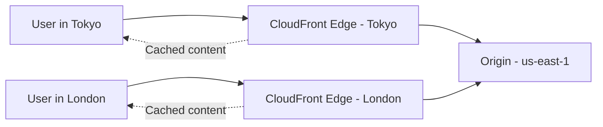

# How to Create CloudFront Distributions for Web Applications

Author: [nawazdhandala](https://github.com/nawazdhandala)

Tags: AWS, CloudFront, CDN, Web Performance

Description: Complete guide to creating and configuring CloudFront distributions for web applications, covering origins, behaviors, caching, and SSL setup.

---

CloudFront sits between your users and your origin server, caching content at edge locations around the world. For web applications, this means faster page loads, lower origin server load, and built-in DDoS protection. Let's build a CloudFront distribution from scratch, covering everything from basic setup to production-ready configuration.

## What CloudFront Does for Web Apps

Think of CloudFront as a globally distributed reverse proxy with caching. When a user in Tokyo requests your page, CloudFront serves it from the nearest edge location instead of routing the request all the way back to your server in Virginia. Static assets like images, CSS, and JavaScript get cached at the edge, while dynamic API requests pass through to your origin.



## Step 1: Prepare Your Origin

Your origin can be an S3 bucket, an ALB, an EC2 instance, or any HTTP server with a public DNS name. For a typical web app, you'll likely use an ALB or S3.

Make sure your origin is accessible and serving content correctly before setting up CloudFront. Test it:

```bash
# Test that your origin responds correctly
curl -I https://origin.example.com/
curl -I https://origin.example.com/api/health
```

## Step 2: Create the Distribution

Here's a complete distribution configuration for a web application with both static and dynamic content:

```json
{
  "CallerReference": "webapp-dist-001",
  "Comment": "Production web application",
  "Enabled": true,
  "DefaultRootObject": "index.html",
  "PriceClass": "PriceClass_100",
  "HttpVersion": "http2and3",
  "IsIPV6Enabled": true,
  "Origins": {
    "Quantity": 2,
    "Items": [
      {
        "Id": "alb-origin",
        "DomainName": "my-alb-123.us-east-1.elb.amazonaws.com",
        "CustomOriginConfig": {
          "HTTPPort": 80,
          "HTTPSPort": 443,
          "OriginProtocolPolicy": "https-only",
          "OriginSslProtocols": {
            "Quantity": 1,
            "Items": ["TLSv1.2"]
          },
          "OriginReadTimeout": 30,
          "OriginKeepaliveTimeout": 5
        }
      },
      {
        "Id": "s3-static-origin",
        "DomainName": "my-static-assets.s3.amazonaws.com",
        "S3OriginConfig": {
          "OriginAccessIdentity": ""
        },
        "OriginAccessControlId": "E2QWRUHEXAMPLE"
      }
    ]
  },
  "DefaultCacheBehavior": {
    "TargetOriginId": "alb-origin",
    "ViewerProtocolPolicy": "redirect-to-https",
    "AllowedMethods": ["GET", "HEAD", "OPTIONS", "PUT", "POST", "PATCH", "DELETE"],
    "CachedMethods": ["GET", "HEAD"],
    "Compress": true,
    "CachePolicyId": "4135ea2d-6df8-44a3-9df3-4b5a84be39ad",
    "OriginRequestPolicyId": "216adef6-5c7f-47e4-b989-5492eafa07d3"
  },
  "CacheBehaviors": {
    "Quantity": 1,
    "Items": [
      {
        "PathPattern": "/static/*",
        "TargetOriginId": "s3-static-origin",
        "ViewerProtocolPolicy": "redirect-to-https",
        "AllowedMethods": ["GET", "HEAD"],
        "CachedMethods": ["GET", "HEAD"],
        "Compress": true,
        "CachePolicyId": "658327ea-f89d-4fab-a63d-7e88639e58f6",
        "MinTTL": 0,
        "DefaultTTL": 86400,
        "MaxTTL": 31536000
      }
    ]
  },
  "ViewerCertificate": {
    "CloudFrontDefaultCertificate": true
  }
}
```

Create the distribution:

```bash
# Create the CloudFront distribution
aws cloudfront create-distribution \
  --distribution-config file://distribution-config.json
```

This takes a few minutes to deploy globally. Check the status:

```bash
# Check distribution status
aws cloudfront get-distribution \
  --id E1234567890 \
  --query 'Distribution.Status'
```

## Step 3: Configure Cache Behaviors

Cache behaviors are where you control how CloudFront handles different URL paths. The default behavior catches everything not matched by a specific behavior pattern.

For a typical web app, you want different caching strategies for different content types:

**Static assets** (CSS, JS, images) - Cache aggressively:

```json
{
  "PathPattern": "/static/*",
  "TargetOriginId": "s3-static-origin",
  "ViewerProtocolPolicy": "redirect-to-https",
  "CachePolicyId": "658327ea-f89d-4fab-a63d-7e88639e58f6",
  "Compress": true
}
```

**API endpoints** - Don't cache, forward everything:

```json
{
  "PathPattern": "/api/*",
  "TargetOriginId": "alb-origin",
  "ViewerProtocolPolicy": "https-only",
  "AllowedMethods": ["GET", "HEAD", "OPTIONS", "PUT", "POST", "PATCH", "DELETE"],
  "CachePolicyId": "4135ea2d-6df8-44a3-9df3-4b5a84be39ad",
  "OriginRequestPolicyId": "216adef6-5c7f-47e4-b989-5492eafa07d3"
}
```

For more on configuring behaviors and cache policies, check out our detailed guide on [CloudFront behaviors and cache policies](https://oneuptime.com/blog/post/2026-02-12-cloudfront-behaviors-cache-policies/view).

## Step 4: Enable Compression

CloudFront can compress responses using gzip and Brotli before sending them to users. This dramatically reduces transfer sizes for text-based content:

```bash
# Update the distribution to enable compression on the default behavior
# This is set via the Compress: true flag in the cache behavior
```

Make sure your origin doesn't also compress the response, or you'll end up with double-compressed content that browsers can't decode.

## Step 5: Set Up Custom Error Pages

When your origin returns errors, you can have CloudFront serve custom error pages instead. This is especially useful for single-page applications where a 404 from the origin should serve the index.html (for client-side routing):

```json
{
  "CustomErrorResponses": {
    "Quantity": 2,
    "Items": [
      {
        "ErrorCode": 403,
        "ResponseCode": "200",
        "ResponsePagePath": "/index.html",
        "ErrorCachingMinTTL": 10
      },
      {
        "ErrorCode": 404,
        "ResponseCode": "200",
        "ResponsePagePath": "/index.html",
        "ErrorCachingMinTTL": 10
      }
    ]
  }
}
```

## Step 6: Add a Custom Domain and SSL

For production, you'll want your own domain. Request an ACM certificate (must be in us-east-1):

```bash
# Request SSL certificate in us-east-1
aws acm request-certificate \
  --domain-name app.example.com \
  --validation-method DNS \
  --region us-east-1
```

Update the distribution with the certificate and alternate domain names:

```bash
# Get current config
aws cloudfront get-distribution-config --id E1234567890 > current-config.json

# Edit to add Aliases and ViewerCertificate, then update
aws cloudfront update-distribution \
  --id E1234567890 \
  --distribution-config file://updated-config.json \
  --if-match ETAG_VALUE
```

Then create a Route 53 alias record pointing to the distribution. For details on that, see our guide on [pointing a domain to CloudFront with Route 53](https://oneuptime.com/blog/post/2026-02-12-point-domain-to-cloudfront-with-route-53/view).

## Step 7: Configure Security Headers

Add security headers using a CloudFront response headers policy:

```bash
# Create a response headers policy with security headers
aws cloudfront create-response-headers-policy \
  --response-headers-policy-config '{
    "Name": "security-headers",
    "Comment": "Standard security headers for web app",
    "SecurityHeadersConfig": {
      "XSSProtection": {
        "Override": true,
        "Protection": true,
        "ModeBlock": true
      },
      "FrameOptions": {
        "Override": true,
        "FrameOption": "DENY"
      },
      "ContentTypeOptions": {
        "Override": true
      },
      "StrictTransportSecurity": {
        "Override": true,
        "IncludeSubdomains": true,
        "Preload": true,
        "AccessControlMaxAgeSec": 63072000
      },
      "ContentSecurityPolicy": {
        "Override": true,
        "ContentSecurityPolicy": "default-src '\''self'\''; script-src '\''self'\''"
      }
    }
  }'
```

## Monitoring Your Distribution

CloudFront publishes metrics to CloudWatch automatically. The key ones to watch:

- **Requests** - Total number of requests
- **BytesDownloaded** - Total data transferred
- **4xxErrorRate** and **5xxErrorRate** - Error percentages
- **CacheHitRate** - How effectively your cache is working

```bash
# Check the cache hit rate over the last hour
aws cloudwatch get-metric-statistics \
  --namespace AWS/CloudFront \
  --metric-name CacheHitRate \
  --dimensions Name=DistributionId,Value=E1234567890 Name=Region,Value=Global \
  --start-time $(date -u -d '1 hour ago' +%Y-%m-%dT%H:%M:%S) \
  --end-time $(date -u +%Y-%m-%dT%H:%M:%S) \
  --period 300 \
  --statistics Average
```

A low cache hit rate means your caching configuration needs tuning.

## Summary

A well-configured CloudFront distribution for a web application uses multiple origins (S3 for static assets, ALB for dynamic content), different cache behaviors per path pattern, compression, HTTPS with a custom domain, and security headers. Start with the basic setup and iterate on the caching configuration based on your cache hit rate metrics. The investment in getting caching right pays off massively in both performance and cost savings.
