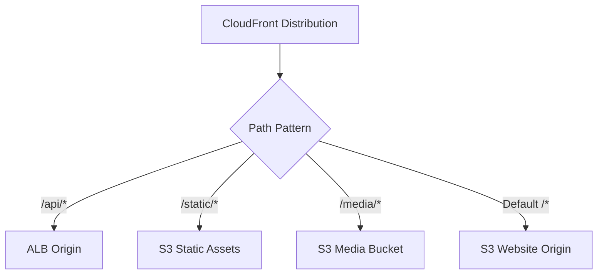

# How to Set Up CloudFront with Multiple Origins and Origin Groups

Author: [nawazdhandala](https://github.com/nawazdhandala)

Tags: AWS, CloudFront, High Availability, CDN

Description: Learn how to configure CloudFront distributions with multiple origins and origin groups for content routing, failover, and high availability.

---

Most real-world CloudFront distributions don't have just one origin. Your static assets might live in S3, your API on an ALB, your media files in a different S3 bucket, and you might want automatic failover between origins. CloudFront handles all of this through multiple origins and origin groups. Let's build a production configuration.

## Why Multiple Origins?

Different types of content have different requirements. Static files benefit from S3's durability and low cost. API requests need to reach your application servers. Media files might come from a dedicated media bucket or a third-party service. Routing each request type to the right origin keeps things efficient and maintainable.



## Configuring Multiple Origins

Here's a distribution with four origins serving different content types:

```json
{
  "CallerReference": "multi-origin-001",
  "Comment": "Distribution with multiple origins",
  "Enabled": true,
  "DefaultRootObject": "index.html",
  "Origins": {
    "Quantity": 4,
    "Items": [
      {
        "Id": "s3-website",
        "DomainName": "my-website.s3.us-east-1.amazonaws.com",
        "S3OriginConfig": {
          "OriginAccessIdentity": ""
        },
        "OriginAccessControlId": "E2QWRUHEXAMPLE"
      },
      {
        "Id": "s3-static-assets",
        "DomainName": "my-static-assets.s3.us-east-1.amazonaws.com",
        "OriginPath": "/production",
        "S3OriginConfig": {
          "OriginAccessIdentity": ""
        },
        "OriginAccessControlId": "E2QWRUHEXAMPLE"
      },
      {
        "Id": "alb-api",
        "DomainName": "internal-api-alb-123456.us-east-1.elb.amazonaws.com",
        "CustomOriginConfig": {
          "HTTPPort": 80,
          "HTTPSPort": 443,
          "OriginProtocolPolicy": "https-only",
          "OriginSslProtocols": {
            "Quantity": 1,
            "Items": ["TLSv1.2"]
          },
          "OriginReadTimeout": 60,
          "OriginKeepaliveTimeout": 30
        }
      },
      {
        "Id": "s3-media",
        "DomainName": "my-media-bucket.s3.us-east-1.amazonaws.com",
        "S3OriginConfig": {
          "OriginAccessIdentity": ""
        },
        "OriginAccessControlId": "E3MEDIAEXAMPLE"
      }
    ]
  }
}
```

## Routing Requests with Cache Behaviors

Cache behaviors connect URL patterns to origins. The order matters - CloudFront evaluates path patterns sequentially and uses the first match:

```json
{
  "DefaultCacheBehavior": {
    "TargetOriginId": "s3-website",
    "ViewerProtocolPolicy": "redirect-to-https",
    "AllowedMethods": ["GET", "HEAD"],
    "CachedMethods": ["GET", "HEAD"],
    "CachePolicyId": "658327ea-f89d-4fab-a63d-7e88639e58f6",
    "Compress": true
  },
  "CacheBehaviors": {
    "Quantity": 3,
    "Items": [
      {
        "PathPattern": "/api/*",
        "TargetOriginId": "alb-api",
        "ViewerProtocolPolicy": "https-only",
        "AllowedMethods": ["GET", "HEAD", "OPTIONS", "PUT", "POST", "PATCH", "DELETE"],
        "CachedMethods": ["GET", "HEAD"],
        "CachePolicyId": "4135ea2d-6df8-44a3-9df3-4b5a84be39ad",
        "OriginRequestPolicyId": "216adef6-5c7f-47e4-b989-5492eafa07d3",
        "Compress": true
      },
      {
        "PathPattern": "/static/*",
        "TargetOriginId": "s3-static-assets",
        "ViewerProtocolPolicy": "redirect-to-https",
        "AllowedMethods": ["GET", "HEAD"],
        "CachedMethods": ["GET", "HEAD"],
        "CachePolicyId": "658327ea-f89d-4fab-a63d-7e88639e58f6",
        "Compress": true
      },
      {
        "PathPattern": "/media/*",
        "TargetOriginId": "s3-media",
        "ViewerProtocolPolicy": "redirect-to-https",
        "AllowedMethods": ["GET", "HEAD"],
        "CachedMethods": ["GET", "HEAD"],
        "CachePolicyId": "658327ea-f89d-4fab-a63d-7e88639e58f6",
        "Compress": false
      }
    ]
  }
}
```

Notice how each behavior has different settings:
- API behavior allows all HTTP methods, uses no caching, and forwards all headers
- Static assets use aggressive caching with compression
- Media files use caching but skip compression (media is already compressed)

## Setting Up Origin Groups for Failover

Origin groups let you define a primary and secondary origin. If the primary returns specific error codes, CloudFront automatically retries the request with the secondary origin:

```json
{
  "OriginGroups": {
    "Quantity": 1,
    "Items": [
      {
        "Id": "api-failover-group",
        "FailoverCriteria": {
          "StatusCodes": {
            "Quantity": 4,
            "Items": [500, 502, 503, 504]
          }
        },
        "Members": {
          "Quantity": 2,
          "Items": [
            {
              "OriginId": "alb-api-primary"
            },
            {
              "OriginId": "alb-api-secondary"
            }
          ]
        }
      }
    ]
  }
}
```

You'll need both origins defined in the Origins section first. Here's a complete example with primary and secondary API origins:

```json
{
  "Origins": {
    "Quantity": 3,
    "Items": [
      {
        "Id": "alb-api-primary",
        "DomainName": "primary-api-alb.us-east-1.elb.amazonaws.com",
        "CustomOriginConfig": {
          "HTTPSPort": 443,
          "OriginProtocolPolicy": "https-only"
        }
      },
      {
        "Id": "alb-api-secondary",
        "DomainName": "secondary-api-alb.us-west-2.elb.amazonaws.com",
        "CustomOriginConfig": {
          "HTTPSPort": 443,
          "OriginProtocolPolicy": "https-only"
        }
      },
      {
        "Id": "s3-website",
        "DomainName": "my-website.s3.us-east-1.amazonaws.com",
        "S3OriginConfig": {
          "OriginAccessIdentity": ""
        }
      }
    ]
  },
  "OriginGroups": {
    "Quantity": 1,
    "Items": [
      {
        "Id": "api-failover",
        "FailoverCriteria": {
          "StatusCodes": {
            "Quantity": 4,
            "Items": [500, 502, 503, 504]
          }
        },
        "Members": {
          "Quantity": 2,
          "Items": [
            {"OriginId": "alb-api-primary"},
            {"OriginId": "alb-api-secondary"}
          ]
        }
      }
    ]
  }
}
```

Then point your cache behavior to the origin group instead of a single origin:

```json
{
  "PathPattern": "/api/*",
  "TargetOriginId": "api-failover",
  "ViewerProtocolPolicy": "https-only"
}
```

## S3 Failover with Origin Groups

A common pattern is using S3 cross-region replication with an origin group for static content high availability:

```bash
# Create an S3 bucket in the secondary region
aws s3 mb s3://my-website-secondary --region us-west-2

# Enable cross-region replication from primary to secondary
aws s3api put-bucket-replication \
  --bucket my-website-primary \
  --replication-configuration '{
    "Role": "arn:aws:iam::123456789012:role/S3ReplicationRole",
    "Rules": [{
      "Status": "Enabled",
      "Priority": 1,
      "Filter": {},
      "Destination": {
        "Bucket": "arn:aws:s3:::my-website-secondary"
      },
      "DeleteMarkerReplication": {"Status": "Enabled"}
    }]
  }'
```

Then set up an origin group with both buckets:

```json
{
  "OriginGroups": {
    "Quantity": 1,
    "Items": [
      {
        "Id": "s3-failover",
        "FailoverCriteria": {
          "StatusCodes": {
            "Quantity": 2,
            "Items": [403, 404]
          }
        },
        "Members": {
          "Quantity": 2,
          "Items": [
            {"OriginId": "s3-primary-us-east-1"},
            {"OriginId": "s3-secondary-us-west-2"}
          ]
        }
      }
    ]
  }
}
```

For S3 origins, you'd typically fail over on 403 (access denied) and 404 (not found) in addition to 5xx errors, since S3 doesn't return traditional server errors the same way application servers do.

## Creating the Distribution with CLI

```bash
# Create the complete multi-origin distribution
aws cloudfront create-distribution \
  --distribution-config file://multi-origin-config.json
```

## Testing the Configuration

Verify each path pattern routes to the correct origin:

```bash
# Test default behavior (should hit s3-website)
curl -I https://d1234abcdef.cloudfront.net/

# Test API routing (should hit alb-api)
curl https://d1234abcdef.cloudfront.net/api/health

# Test static assets (should hit s3-static-assets)
curl -I https://d1234abcdef.cloudfront.net/static/app.js

# Test media routing (should hit s3-media)
curl -I https://d1234abcdef.cloudfront.net/media/video.mp4
```

Check the `X-Cache` and `Via` response headers to confirm CloudFront is processing the request:

```bash
# Detailed response headers showing CloudFront processing
curl -sI https://d1234abcdef.cloudfront.net/static/app.js | grep -i 'x-cache\|via\|x-amz'
```

## Monitoring Multi-Origin Setups

With multiple origins, monitor each one separately:

```bash
# Check error rate per origin
aws cloudwatch get-metric-statistics \
  --namespace AWS/CloudFront \
  --metric-name 5xxErrorRate \
  --dimensions \
    Name=DistributionId,Value=E1234567890 \
    Name=Region,Value=Global \
  --start-time $(date -u -d '1 hour ago' +%Y-%m-%dT%H:%M:%S) \
  --end-time $(date -u +%Y-%m-%dT%H:%M:%S) \
  --period 300 \
  --statistics Average
```

For origin-specific health monitoring, use Route 53 health checks or external monitoring to verify each origin independently. For a comprehensive monitoring setup, check our post on [CloudFront origin failover for high availability](https://oneuptime.com/blog/post/cloudfront-origin-failover-high-availability/view).

## Summary

Multiple origins let you route different URL patterns to different backends, keeping your architecture clean and each origin optimized for its content type. Origin groups add automatic failover when a primary origin returns errors. Combine both for a production distribution that serves static assets from S3, routes API calls to your ALB, handles media from a dedicated bucket, and automatically fails over to backup origins when things go wrong. The key is getting the path patterns right and choosing appropriate caching and forwarding settings for each content type.
