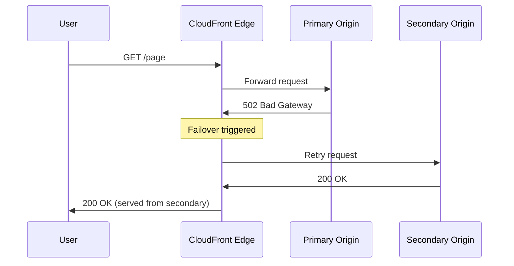

# How to Use CloudFront Origin Failover for High Availability

Author: [nawazdhandala](https://github.com/nawazdhandala)

Tags: AWS, CloudFront, High Availability, Failover

Description: Guide to implementing CloudFront origin failover with origin groups for automatic disaster recovery and high availability of web applications.

---

When your primary origin goes down, you don't want your users staring at error pages. CloudFront origin failover automatically switches to a secondary origin when the primary returns specific HTTP error codes. It's built into CloudFront at no extra cost and adds a layer of resilience that can save you during outages.

## How Origin Failover Works

Origin failover uses origin groups, each containing a primary and secondary origin. When CloudFront sends a request to the primary origin and gets back a configured error status code (like 500, 502, 503, or 504), it automatically retries the same request against the secondary origin. This happens transparently - the user just gets a slightly slower response instead of an error.



Important: failover happens per-request, not globally. If the primary returns 200 for one request and 502 for another, only the failing request goes to the secondary.

## When to Use Origin Failover

Origin failover makes sense when you have:

- A primary application server and a backup in a different region
- An S3 bucket with cross-region replication
- A primary and read-replica API setup
- A main site and a static maintenance page

It doesn't replace proper load balancing or health checks. It's a last line of defense when the primary origin is returning errors.

## Setting Up a Basic Failover Configuration

Let's set up failover between ALBs in two regions.

First, define both origins:

```json
{
  "Origins": {
    "Quantity": 2,
    "Items": [
      {
        "Id": "primary-alb",
        "DomainName": "app-alb.us-east-1.elb.amazonaws.com",
        "CustomOriginConfig": {
          "HTTPPort": 80,
          "HTTPSPort": 443,
          "OriginProtocolPolicy": "https-only",
          "OriginSslProtocols": {
            "Quantity": 1,
            "Items": ["TLSv1.2"]
          },
          "OriginReadTimeout": 30,
          "OriginKeepaliveTimeout": 5
        },
        "ConnectionAttempts": 3,
        "ConnectionTimeout": 10
      },
      {
        "Id": "secondary-alb",
        "DomainName": "app-alb.us-west-2.elb.amazonaws.com",
        "CustomOriginConfig": {
          "HTTPPort": 80,
          "HTTPSPort": 443,
          "OriginProtocolPolicy": "https-only",
          "OriginSslProtocols": {
            "Quantity": 1,
            "Items": ["TLSv1.2"]
          },
          "OriginReadTimeout": 30,
          "OriginKeepaliveTimeout": 5
        },
        "ConnectionAttempts": 3,
        "ConnectionTimeout": 10
      }
    ]
  }
}
```

Now create the origin group:

```json
{
  "OriginGroups": {
    "Quantity": 1,
    "Items": [
      {
        "Id": "app-failover-group",
        "FailoverCriteria": {
          "StatusCodes": {
            "Quantity": 4,
            "Items": [500, 502, 503, 504]
          }
        },
        "Members": {
          "Quantity": 2,
          "Items": [
            {"OriginId": "primary-alb"},
            {"OriginId": "secondary-alb"}
          ]
        }
      }
    ]
  }
}
```

Point your cache behavior at the origin group:

```json
{
  "DefaultCacheBehavior": {
    "TargetOriginId": "app-failover-group",
    "ViewerProtocolPolicy": "redirect-to-https",
    "AllowedMethods": ["GET", "HEAD", "OPTIONS", "PUT", "POST", "PATCH", "DELETE"],
    "CachedMethods": ["GET", "HEAD"],
    "CachePolicyId": "4135ea2d-6df8-44a3-9df3-4b5a84be39ad",
    "OriginRequestPolicyId": "216adef6-5c7f-47e4-b989-5492eafa07d3"
  }
}
```

```bash
# Create the distribution with failover
aws cloudfront create-distribution \
  --distribution-config file://failover-distribution.json
```

## Failover to a Maintenance Page

A practical pattern is failing over to a static S3 bucket that shows a maintenance page when your primary origin is down:

```json
{
  "Origins": {
    "Quantity": 2,
    "Items": [
      {
        "Id": "app-server",
        "DomainName": "app-alb.us-east-1.elb.amazonaws.com",
        "CustomOriginConfig": {
          "HTTPSPort": 443,
          "OriginProtocolPolicy": "https-only"
        }
      },
      {
        "Id": "maintenance-page",
        "DomainName": "maintenance-page-bucket.s3.us-east-1.amazonaws.com",
        "S3OriginConfig": {
          "OriginAccessIdentity": ""
        },
        "OriginAccessControlId": "E2QWRUHEXAMPLE"
      }
    ]
  },
  "OriginGroups": {
    "Quantity": 1,
    "Items": [
      {
        "Id": "app-with-maintenance",
        "FailoverCriteria": {
          "StatusCodes": {
            "Quantity": 4,
            "Items": [500, 502, 503, 504]
          }
        },
        "Members": {
          "Quantity": 2,
          "Items": [
            {"OriginId": "app-server"},
            {"OriginId": "maintenance-page"}
          ]
        }
      }
    ]
  }
}
```

Prepare the maintenance page bucket:

```bash
# Create and configure the maintenance bucket
aws s3 mb s3://maintenance-page-bucket

# Upload a friendly maintenance page
aws s3 cp maintenance.html s3://maintenance-page-bucket/index.html \
  --content-type "text/html" \
  --cache-control "no-cache"
```

The maintenance page itself should be simple and self-contained (inline CSS, no external dependencies):

```html
<!DOCTYPE html>
<html>
<head>
  <title>We'll Be Right Back</title>
  <style>
    body { font-family: sans-serif; text-align: center; padding: 50px; }
    h1 { color: #333; }
    p { color: #666; max-width: 500px; margin: 20px auto; }
  </style>
</head>
<body>
  <h1>We're doing some maintenance</h1>
  <p>Our site is temporarily unavailable while we make improvements.
     We'll be back shortly. Thanks for your patience.</p>
</body>
</html>
```

## S3 Cross-Region Failover

For static content, use S3 cross-region replication with origin failover:

```bash
# Enable versioning on both buckets (required for replication)
aws s3api put-bucket-versioning \
  --bucket primary-content-us-east-1 \
  --versioning-configuration Status=Enabled

aws s3api put-bucket-versioning \
  --bucket secondary-content-us-west-2 \
  --versioning-configuration Status=Enabled

# Set up replication
aws s3api put-bucket-replication \
  --bucket primary-content-us-east-1 \
  --replication-configuration '{
    "Role": "arn:aws:iam::123456789012:role/S3ReplicationRole",
    "Rules": [{
      "Status": "Enabled",
      "Priority": 1,
      "Filter": {},
      "Destination": {
        "Bucket": "arn:aws:s3:::secondary-content-us-west-2",
        "StorageClass": "STANDARD"
      },
      "DeleteMarkerReplication": {"Status": "Enabled"}
    }]
  }'
```

Configure CloudFront with failover between the two S3 origins. For S3, include 403 and 404 in the failover criteria since S3 returns 403 for permission issues and missing objects (when public access is blocked):

```json
{
  "FailoverCriteria": {
    "StatusCodes": {
      "Quantity": 4,
      "Items": [403, 404, 500, 502]
    }
  }
}
```

## Failover Timing and Performance

When failover happens, the user experiences additional latency:

1. CloudFront connects to the primary origin (ConnectionTimeout: up to 10 seconds per attempt, 3 attempts)
2. Primary returns an error code
3. CloudFront retries with the secondary origin
4. Secondary responds

Worst case, that's 30+ seconds for connection timeouts before failover kicks in. To minimize this:

```json
{
  "ConnectionAttempts": 1,
  "ConnectionTimeout": 5,
  "OriginReadTimeout": 10
}
```

With these settings, failover happens after at most 15 seconds (5 second connection timeout + 10 second read timeout) instead of potentially much longer.

## Monitoring Failover Events

You can detect failover events by monitoring CloudFront metrics:

```bash
# Monitor the 5xx error rate - spikes indicate failover may be occurring
aws cloudwatch put-metric-alarm \
  --alarm-name "cloudfront-high-origin-errors" \
  --namespace AWS/CloudFront \
  --metric-name 5xxErrorRate \
  --dimensions Name=DistributionId,Value=E1234567890 Name=Region,Value=Global \
  --statistic Average \
  --period 60 \
  --threshold 5 \
  --comparison-operator GreaterThanThreshold \
  --evaluation-periods 3 \
  --alarm-actions arn:aws:sns:us-east-1:123456789012:ops-alerts
```

Also check CloudFront access logs (standard or real-time) for the `x-edge-result-type` field. When failover happens, you'll see `Error` results from the primary followed by `Miss` results as requests go to the secondary.

For more on real-time monitoring, see our guide on [CloudFront real-time logging](https://oneuptime.com/blog/post/2026-02-12-cloudfront-real-time-logging/view).

## Limitations to Know

- **No automatic failback**: CloudFront doesn't track origin health over time. Each request independently tries the primary first. Once the primary recovers, requests automatically go back to it.
- **Only HTTP status codes trigger failover**: Connection timeouts trigger failover, but slow responses (within the timeout) that return 200 don't trigger failover even if the response is wrong.
- **Two origins maximum per group**: You can't chain three origins.
- **POST/PUT requests are retried**: Be careful with non-idempotent requests. If the primary processes the request but returns a 500 after processing, the secondary will also process it.

## Testing Failover

Test your failover setup before you need it:

```bash
# Option 1: Return 503 from your primary origin temporarily
# On your origin server, add a health check endpoint that you can toggle

# Option 2: Use a WAF rule to block the primary origin temporarily
aws wafv2 update-web-acl \
  --name test-failover \
  --scope REGIONAL \
  --default-action '{"Block":{"CustomResponse":{"ResponseCode":503}}}' \
  --id ACL_ID \
  --lock-token LOCK_TOKEN \
  --visibility-config '{"SampledRequestsEnabled":true,"CloudWatchMetricsEnabled":true,"MetricName":"test-failover"}'
```

During testing, monitor response times and verify the secondary origin serves correct content.

## Summary

CloudFront origin failover provides automatic disaster recovery at the CDN level. Set up origin groups with primary and secondary origins, configure which HTTP status codes trigger failover, and tune connection timeouts to minimize failover latency. Common patterns include multi-region ALB failover, S3 cross-region replication failover, and graceful degradation to maintenance pages. Test your failover configuration regularly, and combine it with proper monitoring to know when failovers are actually happening.
