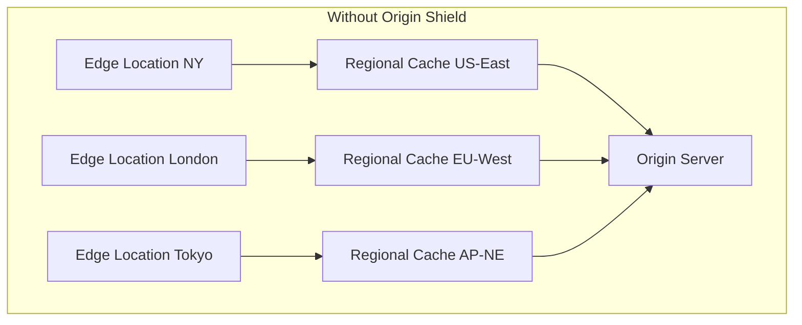
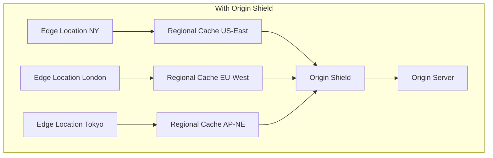

# How to Configure CloudFront Origin Shield for Cache Hit Optimization

Author: [nawazdhandala](https://github.com/nawazdhandala)

Tags: AWS, CloudFront, Caching, CDN, Performance

Description: Learn how to enable and configure CloudFront Origin Shield to improve cache hit ratios, reduce origin load, and optimize content delivery performance.

---

CloudFront's default caching architecture works well for most use cases, but there's a gap. When a cache miss happens at an edge location, the request goes to the regional edge cache. If that's also a miss, it goes directly to your origin. The problem is that CloudFront has multiple regional edge caches, and each one might independently request the same content from your origin. Your origin ends up handling duplicate requests for content it's already served to another regional cache.

Origin Shield adds a centralized caching layer between the regional edge caches and your origin. It acts as a single point of contact for your origin, collapsing duplicate requests and improving cache hit ratios. The result: fewer requests to your origin, lower latency for cache fills, and better overall performance.

## How Origin Shield Fits In

Here's the request flow with and without Origin Shield:





Without Origin Shield, three regional caches might all request the same object from your origin simultaneously. With Origin Shield, only one request reaches the origin - the other two are served from Origin Shield's cache.

## Enabling Origin Shield

Origin Shield is configured per origin in your CloudFront distribution. You choose which AWS region to use as the Origin Shield location - pick the region closest to your origin for the lowest latency.

Enable Origin Shield via the AWS CLI:

```bash
# Get your current distribution config
aws cloudfront get-distribution-config --id E1234567890ABC > dist-config.json

# Edit the config to add Origin Shield to your origin
# Then update the distribution
aws cloudfront update-distribution \
  --id E1234567890ABC \
  --if-match ETAG_VALUE \
  --distribution-config file://dist-config-updated.json
```

The origin configuration with Origin Shield looks like this:

```json
{
  "Origins": {
    "Items": [
      {
        "Id": "my-s3-origin",
        "DomainName": "my-bucket.s3.us-east-1.amazonaws.com",
        "S3OriginConfig": {
          "OriginAccessIdentity": "origin-access-identity/cloudfront/E1234567890"
        },
        "OriginShield": {
          "Enabled": true,
          "OriginShieldRegion": "us-east-1"
        }
      }
    ]
  }
}
```

## CloudFormation Setup

Here's a complete CloudFormation template with Origin Shield enabled.

CloudFormation template for CloudFront with Origin Shield:

```yaml
AWSTemplateFormatVersion: '2010-09-09'
Description: CloudFront Distribution with Origin Shield

Parameters:
  OriginBucket:
    Type: String
  OriginShieldRegion:
    Type: String
    Default: us-east-1
    AllowedValues:
      - us-east-1
      - us-west-2
      - eu-west-1
      - ap-northeast-1

Resources:
  CloudFrontDistribution:
    Type: AWS::CloudFront::Distribution
    Properties:
      DistributionConfig:
        Enabled: true
        DefaultCacheBehavior:
          TargetOriginId: s3-origin
          ViewerProtocolPolicy: redirect-to-https
          CachePolicyId: 658327ea-f89d-4fab-a63d-7e88639e58f6
          Compress: true
        Origins:
          - Id: s3-origin
            DomainName: !Sub "${OriginBucket}.s3.${AWS::Region}.amazonaws.com"
            S3OriginConfig:
              OriginAccessIdentity: !Sub "origin-access-identity/cloudfront/${OAI}"
            OriginShield:
              Enabled: true
              OriginShieldRegion: !Ref OriginShieldRegion
        PriceClass: PriceClass_All

  OAI:
    Type: AWS::CloudFront::CloudFrontOriginAccessIdentity
    Properties:
      CloudFrontOriginAccessIdentityConfig:
        Comment: !Sub "OAI for ${OriginBucket}"

Outputs:
  DistributionDomain:
    Value: !GetAtt CloudFrontDistribution.DomainName
```

## Choosing the Right Origin Shield Region

The Origin Shield region should be as close as possible to your origin. Here's a quick reference:

- **Origin in us-east-1**: Use `us-east-1` for Origin Shield
- **Origin in eu-west-1**: Use `eu-west-1`
- **Origin in ap-northeast-1**: Use `ap-northeast-1`
- **Origin on-premises in US East**: Use `us-east-1`
- **Origin on-premises in Europe**: Use `eu-west-1` or `eu-central-1`

If your origin is behind a CDN or in a location not listed, choose the region with the lowest latency to your origin. You can test this with simple ping or traceroute measurements.

## Measuring the Impact

After enabling Origin Shield, you'll want to measure its effectiveness. CloudFront provides metrics that show the cache hit ratio at different layers.

Query CloudFront metrics to measure Origin Shield effectiveness:

```bash
# Get cache hit ratio over the last 24 hours
aws cloudwatch get-metric-data \
  --metric-data-queries '[
    {
      "Id": "originShieldHitRatio",
      "MetricStat": {
        "Metric": {
          "Namespace": "AWS/CloudFront",
          "MetricName": "OriginShieldHitRatio",
          "Dimensions": [
            {
              "Name": "DistributionId",
              "Value": "E1234567890ABC"
            },
            {
              "Name": "Region",
              "Value": "Global"
            }
          ]
        },
        "Period": 3600,
        "Stat": "Average"
      }
    },
    {
      "Id": "originRequests",
      "MetricStat": {
        "Metric": {
          "Namespace": "AWS/CloudFront",
          "MetricName": "OriginLatency",
          "Dimensions": [
            {
              "Name": "DistributionId",
              "Value": "E1234567890ABC"
            },
            {
              "Name": "Region",
              "Value": "Global"
            }
          ]
        },
        "Period": 3600,
        "Stat": "Average"
      }
    }
  ]' \
  --start-time "2026-02-11T00:00:00Z" \
  --end-time "2026-02-12T00:00:00Z"
```

A healthy Origin Shield deployment should show:
- Origin Shield hit ratio above 50% (higher is better)
- Reduced origin request count compared to pre-Origin Shield baseline
- Lower average origin latency

## Optimizing Cache Hit Ratios Further

Origin Shield helps, but there are additional techniques to maximize cache performance.

Configure cache keys to avoid unnecessary cache misses:

```bash
# Create a cache policy that minimizes cache key variation
aws cloudfront create-cache-policy \
  --cache-policy-config '{
    "Name": "optimized-cache-policy",
    "MinTTL": 1,
    "MaxTTL": 86400,
    "DefaultTTL": 3600,
    "ParametersInCacheKeyAndForwardedToOrigin": {
      "EnableAcceptEncodingGzip": true,
      "EnableAcceptEncodingBrotli": true,
      "HeadersConfig": {
        "HeaderBehavior": "none"
      },
      "CookiesConfig": {
        "CookieBehavior": "none"
      },
      "QueryStringsConfig": {
        "QueryStringBehavior": "whitelist",
        "QueryStrings": {
          "Items": ["version", "format"],
          "Quantity": 2
        }
      }
    }
  }'
```

Key optimization strategies:

1. **Minimize cache key components**: Only include query strings, headers, and cookies that actually affect the response. Every additional component creates a separate cache entry.

2. **Normalize URLs**: Ensure your application generates consistent URLs. `/images/logo.png?v=1` and `/images/logo.png?v=1&` are different cache keys.

3. **Use appropriate TTLs**: Longer TTLs mean fewer cache misses. Set TTLs as high as your content freshness requirements allow.

4. **Enable compression**: The `EnableAcceptEncodingGzip` and `EnableAcceptEncodingBrotli` settings let CloudFront cache compressed versions, reducing transfer size without splitting the cache.

## Origin Shield with Dynamic Content

Origin Shield also helps with dynamic content, though the benefits are different. For API responses with even short TTLs (a few seconds), Origin Shield can collapse concurrent requests. If 50 regional caches all request the same API endpoint at the same time, Origin Shield sends one request to your origin and serves the response to all 50.

This request collapsing happens automatically. It's particularly valuable for:

- Product pages with short TTLs
- API responses that are the same for many users
- Thumbnail generation where the same image is requested from many regions simultaneously

## Cost Analysis

Origin Shield adds an incremental cost per request that flows through it. As of 2026, the pricing is roughly $0.0035 per 10,000 requests (varies by region). For most workloads, the reduction in origin requests more than offsets this cost.

Calculate the ROI:

```
Origin requests before Origin Shield: 1,000,000/day
Origin Shield hit ratio: 60%
Origin requests after: 400,000/day
Origin Shield cost: ~$1.05/day (300k requests * 3 regions)
Origin compute savings: depends on your origin infrastructure
```

If your origin is running on expensive compute (EC2, Fargate, or API Gateway), the cost savings from reduced origin load often dwarf the Origin Shield fees.

For related CDN optimization techniques, take a look at our post on [CloudFront continuous deployment](https://oneuptime.com/blog/post/cloudfront-continuous-deployment-safe-rollouts/view).
