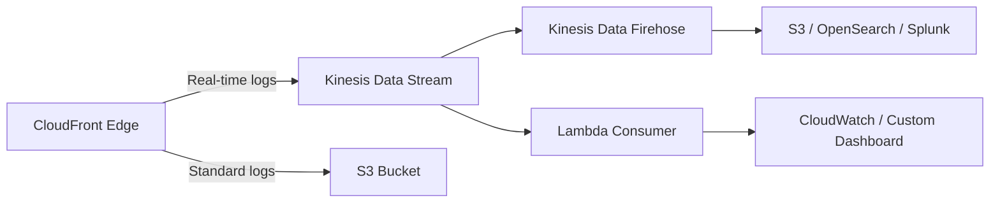

# How to Configure CloudFront Real-Time Logging

Author: [nawazdhandala](https://github.com/nawazdhandala)

Tags: AWS, CloudFront, Logging, Monitoring, Kinesis

Description: Step-by-step guide to setting up CloudFront real-time logs using Kinesis Data Streams for live traffic analysis, debugging, and monitoring.

---

CloudFront's standard access logs land in S3 with a delay of up to several minutes. When you're debugging a production issue or monitoring traffic in real time, that delay is too long. Real-time logging sends request data to Kinesis Data Streams within seconds, giving you near-instant visibility into what's happening at the edge.

## Standard Logs vs Real-Time Logs

**Standard access logs** are free, go to S3, and have a 5-30 minute delay. They include all requests. Good for historical analysis and compliance.

**Real-time logs** cost money (Kinesis charges), arrive within seconds, and let you choose which fields to include and sample requests. Good for live monitoring, alerting, and debugging.

You can use both simultaneously. Many teams use standard logs for archives and real-time logs for operational monitoring.

## Architecture Overview



## Step 1: Create a Kinesis Data Stream

Real-time logs require a Kinesis Data Stream as the delivery target:

```bash
# Create a Kinesis data stream for CloudFront logs
aws kinesis create-stream \
  --stream-name cloudfront-realtime-logs \
  --shard-count 2 \
  --region us-east-1
```

The number of shards depends on your traffic volume. Each shard handles 1MB/sec or 1,000 records/sec of write throughput. For a site doing 10,000 requests per second, you'd need roughly 10-15 shards (depending on the fields you log and sampling rate).

Wait for the stream to become active:

```bash
# Wait for the stream to become active
aws kinesis describe-stream \
  --stream-name cloudfront-realtime-logs \
  --query 'StreamDescription.StreamStatus'
```

## Step 2: Create an IAM Role for CloudFront

CloudFront needs permission to write to your Kinesis stream:

```json
{
  "Version": "2012-10-17",
  "Statement": [
    {
      "Effect": "Allow",
      "Principal": {
        "Service": "cloudfront.amazonaws.com"
      },
      "Action": "sts:AssumeRole"
    }
  ]
}
```

```bash
# Create the IAM role for CloudFront
aws iam create-role \
  --role-name CloudFrontRealtimeLogRole \
  --assume-role-policy-document file://trust-policy.json
```

Attach a policy granting Kinesis write access:

```json
{
  "Version": "2012-10-17",
  "Statement": [
    {
      "Effect": "Allow",
      "Action": [
        "kinesis:DescribeStreamSummary",
        "kinesis:DescribeStream",
        "kinesis:PutRecord",
        "kinesis:PutRecords"
      ],
      "Resource": "arn:aws:kinesis:us-east-1:123456789012:stream/cloudfront-realtime-logs"
    }
  ]
}
```

```bash
# Create and attach the Kinesis write policy
aws iam put-role-policy \
  --role-name CloudFrontRealtimeLogRole \
  --policy-name KinesisWriteAccess \
  --policy-document file://kinesis-policy.json
```

## Step 3: Create the Real-Time Log Configuration

Now create the logging configuration. You choose which fields to include:

```bash
# Create the real-time log configuration
aws cloudfront create-realtime-log-config \
  --name "production-realtime-logs" \
  --sampling-rate 100 \
  --end-points '[{
    "StreamType": "Kinesis",
    "KinesisStreamConfig": {
      "RoleARN": "arn:aws:iam::123456789012:role/CloudFrontRealtimeLogRole",
      "StreamARN": "arn:aws:kinesis:us-east-1:123456789012:stream/cloudfront-realtime-logs"
    }
  }]' \
  --fields "timestamp" "c-ip" "cs-method" "cs-uri-stem" "sc-status" \
    "sc-bytes" "time-taken" "x-edge-result-type" "x-edge-response-result-type" \
    "cs-protocol" "cs-host" "x-edge-location" "cs-user-agent" \
    "x-forwarded-for" "cs-uri-query" "x-edge-request-id"
```

Available fields include everything from standard logs plus some extras. Here are the most useful ones:

| Field | Description |
|-------|-------------|
| timestamp | Request timestamp |
| c-ip | Client IP |
| cs-method | HTTP method |
| cs-uri-stem | URL path |
| sc-status | HTTP status code |
| sc-bytes | Response bytes |
| time-taken | Total request time in seconds |
| x-edge-result-type | Hit, Miss, Error, etc. |
| x-edge-location | Which edge location served the request |
| cs-user-agent | Client user agent string |

The `sampling-rate` is a percentage (1-100). Set to 100 for all requests, or lower to reduce costs on high-traffic sites. Even 10% sampling gives you statistically meaningful data for most monitoring purposes.

## Step 4: Associate with Your Distribution

Attach the log config to a cache behavior:

```bash
# Get current distribution config
aws cloudfront get-distribution-config --id E1234567890 > config.json
```

Add the real-time log config ARN to the cache behavior:

```json
{
  "DefaultCacheBehavior": {
    "RealtimeLogConfigArn": "arn:aws:cloudfront::123456789012:realtime-log-config/production-realtime-logs",
    "TargetOriginId": "my-origin",
    "ViewerProtocolPolicy": "redirect-to-https"
  }
}
```

```bash
# Update the distribution
aws cloudfront update-distribution \
  --id E1234567890 \
  --distribution-config file://updated-config.json \
  --if-match ETAG_VALUE
```

## Step 5: Process the Logs

### Option A: Kinesis Data Firehose to S3

For storage and batch analysis, pipe the stream to S3 via Firehose:

```bash
# Create a Firehose delivery stream from Kinesis to S3
aws firehose create-delivery-stream \
  --delivery-stream-name cloudfront-logs-to-s3 \
  --delivery-stream-type KinesisStreamAsSource \
  --kinesis-stream-source-configuration '{
    "KinesisStreamARN": "arn:aws:kinesis:us-east-1:123456789012:stream/cloudfront-realtime-logs",
    "RoleARN": "arn:aws:iam::123456789012:role/FirehoseRole"
  }' \
  --s3-destination-configuration '{
    "RoleARN": "arn:aws:iam::123456789012:role/FirehoseRole",
    "BucketARN": "arn:aws:s3:::my-cloudfront-logs",
    "Prefix": "realtime-logs/year=!{timestamp:yyyy}/month=!{timestamp:MM}/day=!{timestamp:dd}/",
    "ErrorOutputPrefix": "errors/",
    "BufferingHints": {"SizeInMBs": 64, "IntervalInSeconds": 60},
    "CompressionFormat": "GZIP"
  }'
```

### Option B: Lambda Consumer for Real-Time Analysis

Process logs in real time with a Lambda function:

```python
import base64
import json

def handler(event, context):
    """Process CloudFront real-time logs from Kinesis."""
    error_count = 0
    slow_requests = 0

    for record in event['Records']:
        # Decode the Kinesis record
        payload = base64.b64decode(record['kinesis']['data']).decode('utf-8')
        fields = payload.split('\t')

        # Parse relevant fields (order matches your field configuration)
        timestamp = fields[0]
        client_ip = fields[1]
        method = fields[2]
        uri = fields[3]
        status = int(fields[4])
        bytes_sent = int(fields[5])
        time_taken = float(fields[6])
        result_type = fields[7]

        # Count errors
        if status >= 500:
            error_count += 1
            print(f"5xx Error: {status} {method} {uri} from {client_ip}")

        # Track slow requests (over 3 seconds)
        if time_taken > 3.0:
            slow_requests += 1
            print(f"Slow request: {time_taken}s {method} {uri}")

    # Publish custom metrics
    if error_count > 0 or slow_requests > 0:
        publish_metrics(error_count, slow_requests)

    return {'statusCode': 200}
```

Set up the Lambda event source mapping:

```bash
# Connect Lambda to the Kinesis stream
aws lambda create-event-source-mapping \
  --function-name cloudfront-log-processor \
  --event-source-arn arn:aws:kinesis:us-east-1:123456789012:stream/cloudfront-realtime-logs \
  --starting-position LATEST \
  --batch-size 100 \
  --maximum-batching-window-in-seconds 5
```

### Option C: Direct to OpenSearch

For searchable log analysis, send to OpenSearch via Firehose:

```bash
# Create Firehose delivery to OpenSearch
aws firehose create-delivery-stream \
  --delivery-stream-name cloudfront-logs-to-opensearch \
  --delivery-stream-type KinesisStreamAsSource \
  --kinesis-stream-source-configuration '{
    "KinesisStreamARN": "arn:aws:kinesis:us-east-1:123456789012:stream/cloudfront-realtime-logs",
    "RoleARN": "arn:aws:iam::123456789012:role/FirehoseRole"
  }' \
  --amazonopensearchservice-destination-configuration '{
    "RoleARN": "arn:aws:iam::123456789012:role/FirehoseRole",
    "DomainARN": "arn:aws:es:us-east-1:123456789012:domain/my-domain",
    "IndexName": "cloudfront-logs",
    "IndexRotationPeriod": "OneDay",
    "BufferingHints": {"IntervalInSeconds": 60, "SizeInMBs": 1},
    "S3BackupMode": "FailedDocumentsOnly",
    "S3Configuration": {
      "RoleARN": "arn:aws:iam::123456789012:role/FirehoseRole",
      "BucketARN": "arn:aws:s3:::my-cloudfront-logs-backup"
    }
  }'
```

## Monitoring the Pipeline

Make sure your logging pipeline itself is healthy:

```bash
# Check Kinesis stream metrics
aws cloudwatch get-metric-statistics \
  --namespace AWS/Kinesis \
  --metric-name IncomingRecords \
  --dimensions Name=StreamName,Value=cloudfront-realtime-logs \
  --start-time $(date -u -d '1 hour ago' +%Y-%m-%dT%H:%M:%S) \
  --end-time $(date -u +%Y-%m-%dT%H:%M:%S) \
  --period 300 \
  --statistics Sum

# Check for write throttling
aws cloudwatch get-metric-statistics \
  --namespace AWS/Kinesis \
  --metric-name WriteProvisionedThroughputExceeded \
  --dimensions Name=StreamName,Value=cloudfront-realtime-logs \
  --start-time $(date -u -d '1 hour ago' +%Y-%m-%dT%H:%M:%S) \
  --end-time $(date -u +%Y-%m-%dT%H:%M:%S) \
  --period 300 \
  --statistics Sum
```

If you see throttling, increase the shard count.

## Cost Optimization

Real-time logs can get expensive at scale. Ways to manage costs:

- **Reduce sampling rate** - 10-20% is often enough for monitoring
- **Limit fields** - Only include the fields you actually use
- **Use on-demand Kinesis capacity** - Scales automatically without over-provisioning
- **Apply to specific behaviors** - Only log the behaviors you care about, not every request

## Summary

CloudFront real-time logging delivers request data to Kinesis within seconds, enabling live monitoring and rapid debugging. The setup involves creating a Kinesis stream, an IAM role, and a real-time log config that you attach to cache behaviors. Process the logs with Lambda for alerting, Firehose for storage, or OpenSearch for searchable analysis. Start with a low sampling rate and essential fields, then expand as needed. Combine with standard S3 logs for a complete logging strategy.
