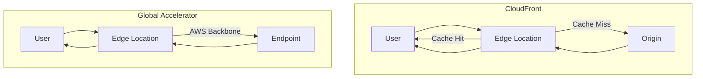
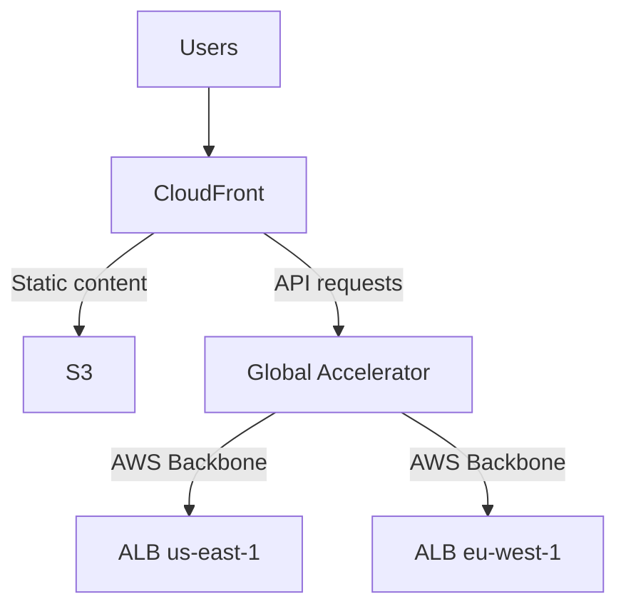

# How to Compare CloudFront vs Global Accelerator

Author: [nawazdhandala](https://github.com/nawazdhandala)

Tags: AWS, CloudFront, Global Accelerator, CDN, Networking

Description: Detailed comparison of AWS CloudFront and Global Accelerator covering use cases, performance characteristics, pricing, and when to choose each service.

---

CloudFront and Global Accelerator both improve application performance for global users, but they solve different problems in different ways. Choosing the wrong one wastes money and might not even help your performance issues. Let's break down exactly what each does, how they compare, and when to pick one over the other.

## The Fundamental Difference

**CloudFront** is a content delivery network. It caches content at edge locations and serves cached copies to users. It's primarily designed for HTTP/HTTPS traffic and excels at reducing origin load through caching.

**Global Accelerator** is a network routing service. It doesn't cache anything. It routes traffic through AWS's private backbone network instead of the public internet. It works with TCP and UDP at the network layer.



## Feature Comparison

| Feature | CloudFront | Global Accelerator |
|---------|-----------|-------------------|
| Caching | Yes, at 400+ edge locations | No caching |
| Protocols | HTTP, HTTPS, WebSocket | TCP, UDP |
| Static IPs | No (uses DNS names) | Yes, two anycast IPs |
| Edge Logic | CloudFront Functions, Lambda@Edge | No edge compute |
| SSL Termination | At the edge | At the endpoint (pass-through) |
| Origin Types | S3, ALB, Custom HTTP | ALB, NLB, EC2, Elastic IP |
| Health Checks | Via origin groups | Built-in per endpoint group |
| Failover | Origin groups (HTTP error codes) | Automatic (health check based) |
| DDoS Protection | AWS Shield Standard included | AWS Shield Standard included |
| WAF Integration | Yes | No |
| Cost Model | Per request + data transfer | Fixed hourly + data transfer premium |
| Geo Restriction | Built-in | No |
| Signed URLs | Yes | No |

## When to Choose CloudFront

CloudFront is the right choice when:

**Your content is cacheable.** If users are requesting the same static assets, images, CSS, JavaScript, or even semi-dynamic HTML pages, CloudFront's caching dramatically reduces latency and origin load. A cache hit at the edge is always faster than even the most optimized network path to your origin.

**You need edge compute.** CloudFront Functions and Lambda@Edge let you run code at the edge for URL rewrites, A/B testing, authentication, and header manipulation. Global Accelerator has no equivalent.

**You need WAF protection.** AWS WAF integrates directly with CloudFront to filter malicious requests at the edge before they reach your origin.

**You serve HTTP/HTTPS traffic.** CloudFront is purpose-built for web traffic with features like automatic gzip/Brotli compression, HTTP/2 and HTTP/3 support, and intelligent content negotiation.

**You want content restriction.** Signed URLs, signed cookies, and geo-restrictions are CloudFront-only features.

Example setup for a web application:

```bash
# CloudFront is ideal for this kind of setup
aws cloudfront create-distribution \
  --distribution-config '{
    "Origins": {
      "Quantity": 2,
      "Items": [
        {
          "Id": "api",
          "DomainName": "api-alb.us-east-1.elb.amazonaws.com",
          "CustomOriginConfig": {"HTTPSPort": 443, "OriginProtocolPolicy": "https-only"}
        },
        {
          "Id": "static",
          "DomainName": "static-assets.s3.amazonaws.com",
          "S3OriginConfig": {"OriginAccessIdentity": ""}
        }
      ]
    },
    "DefaultCacheBehavior": {
      "TargetOriginId": "api",
      "ViewerProtocolPolicy": "redirect-to-https",
      "CachePolicyId": "4135ea2d-6df8-44a3-9df3-4b5a84be39ad"
    },
    "CacheBehaviors": {
      "Quantity": 1,
      "Items": [{
        "PathPattern": "/static/*",
        "TargetOriginId": "static",
        "CachePolicyId": "658327ea-f89d-4fab-a63d-7e88639e58f6"
      }]
    }
  }'
```

## When to Choose Global Accelerator

Global Accelerator is the right choice when:

**Your traffic is non-HTTP.** Gaming (UDP), VoIP, IoT protocols, custom TCP protocols - CloudFront can't handle these. Global Accelerator works with any TCP or UDP traffic.

**You need static IP addresses.** Some enterprise clients need to allowlist IPs in their firewalls. CloudFront uses DNS-based routing with changing IPs. Global Accelerator gives you two fixed IPs that never change.

**Your content isn't cacheable.** If every request is unique (real-time bidding, financial trading, live data feeds), CloudFront's caching provides no benefit. Global Accelerator's backbone routing still helps with latency and consistency.

**You need instant failover.** CloudFront origin failover depends on HTTP error codes from the origin. Global Accelerator failover is based on active health checks and triggers in seconds when an endpoint becomes unhealthy, even before any user request fails.

**You need TCP/UDP pass-through.** Global Accelerator doesn't terminate SSL - it passes connections through. This matters when your application handles its own TLS or uses mutual TLS (mTLS).

Example for a gaming service:

```bash
# Global Accelerator for a game server
aws globalaccelerator create-accelerator \
  --name "game-servers" \
  --ip-address-type IPV4 \
  --enabled \
  --region us-west-2
```

## Performance Comparison

Both services improve performance, but in different ways:

**CloudFront performance gain**: Primarily from caching. A cache hit eliminates the round trip to the origin entirely. For cache misses, CloudFront uses optimized routes to the origin, but the improvement is modest compared to a cache hit.

**Global Accelerator performance gain**: From network path optimization. Every request benefits from the AWS backbone, regardless of cacheability. Typical improvement is 20-60% reduction in latency, depending on the user's location and the quality of the public internet path.

Real-world example: A user in Mumbai accessing a server in us-east-1.

| Scenario | Latency |
|----------|---------|
| Direct public internet | ~280ms |
| Global Accelerator | ~180ms |
| CloudFront (cache miss) | ~200ms |
| CloudFront (cache hit) | ~15ms |

The numbers tell the story: if your content is cacheable, CloudFront wins by a huge margin. If it's not cacheable, Global Accelerator provides a consistent improvement.

## Using Both Together

For some architectures, using both services together makes sense:



In this setup:
- CloudFront handles all HTTP traffic and caches static assets
- For dynamic API calls, CloudFront forwards to Global Accelerator
- Global Accelerator provides backbone routing and instant failover between regions

This gives you caching benefits for static content and backbone routing for dynamic requests.

## Cost Comparison

**CloudFront pricing**: $0.085/GB data transfer (US/EU, decreasing with volume) + $0.0075-$0.02 per 10,000 requests. No fixed monthly fee. Free tier: 1TB/month transfer, 10M requests/month.

**Global Accelerator pricing**: ~$0.025/hour per accelerator (~$18/month fixed) + data transfer premium varying by region ($0.015-$0.090/GB on top of standard transfer). No free tier.

For a site serving 1TB/month:
- CloudFront: ~$85 in data transfer + request charges
- Global Accelerator: ~$18 fixed + ~$15-90 data transfer premium

CloudFront is generally cheaper for standard web traffic, especially with a high cache hit rate. Global Accelerator's fixed cost makes it more economical at higher traffic volumes.

## Decision Framework

Ask these questions:

1. **Is your traffic HTTP/HTTPS?** If no, use Global Accelerator.
2. **Is your content cacheable?** If yes, CloudFront will likely be both faster and cheaper.
3. **Do you need static IPs?** If yes, use Global Accelerator (or both).
4. **Do you need WAF, signed URLs, or edge compute?** If yes, use CloudFront.
5. **Do you need instant health-check-based failover?** Global Accelerator.
6. **Do you need deterministic instance-level routing?** Global Accelerator custom routing.

## Summary

CloudFront and Global Accelerator serve different purposes despite both improving global application performance. CloudFront is a CDN that shines with cacheable HTTP content, edge compute, and WAF integration. Global Accelerator is a network optimizer that works with any TCP/UDP traffic, provides static IPs, and offers fast health-check-based failover. For web applications, CloudFront is usually the first choice. For non-HTTP protocols, static IP requirements, or purely dynamic traffic, Global Accelerator is the way to go. And for complex architectures, using both together gives you the best of both worlds.
