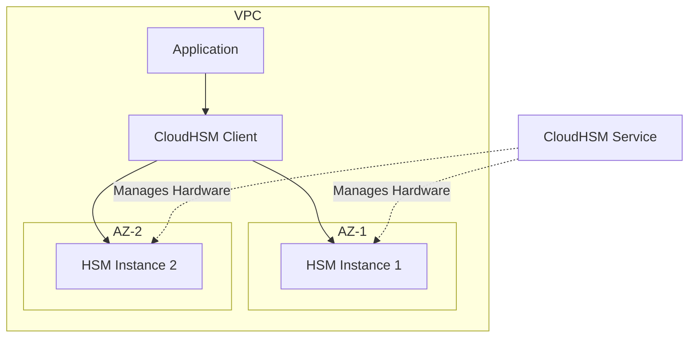

# How to Set Up CloudHSM for Hardware Key Management

Author: [nawazdhandala](https://github.com/nawazdhandala)

Tags: AWS, CloudHSM, Encryption, Key Management, Security

Description: Deploy and configure AWS CloudHSM to manage cryptographic keys in dedicated FIPS 140-2 Level 3 validated hardware security modules.

---

KMS handles encryption for most workloads just fine. But when you need FIPS 140-2 Level 3 validation, full control over key material, or compliance with regulations that demand dedicated hardware security modules, KMS isn't enough. That's where CloudHSM comes in.

CloudHSM gives you dedicated HSM appliances running in your VPC. You control the keys, AWS manages the hardware. Nobody - not even AWS - can access your key material. This is the level of control that financial institutions, healthcare organizations, and government agencies need. It's also more complex and expensive than KMS, so make sure you actually need it before diving in.

## When to Use CloudHSM vs KMS

Use **KMS** when you need:
- AWS-integrated encryption for S3, EBS, RDS, etc.
- Simple key management with automatic rotation
- Cost-effective encryption at scale

Use **CloudHSM** when you need:
- FIPS 140-2 Level 3 compliance (KMS is Level 2)
- Full control over key material
- Support for asymmetric keys and custom algorithms
- TLS/SSL offloading
- Certificate authority operations
- Integration with applications that require PKCS#11, JCE, or CNG interfaces

## Architecture

CloudHSM runs as a cluster of HSM instances across multiple AZs in your VPC. The cluster automatically synchronizes keys across all HSMs for redundancy.



## Step 1: Create the CloudHSM Cluster

First, create a cluster. It needs a VPC and subnets in at least two AZs for high availability.

This creates a CloudHSM cluster in your VPC:

```bash
# Create the CloudHSM cluster
aws cloudhsmv2 create-cluster \
  --hsm-type hsm1.medium \
  --subnet-ids subnet-aaa111 subnet-bbb222 \
  --tags Key=Environment,Value=Production Key=Name,Value=prod-hsm-cluster
```

Note the cluster ID from the output. Check status:

```bash
aws cloudhsmv2 describe-clusters \
  --filters clusterIds=cluster-abc123 \
  --query 'Clusters[0].{State:State,SecurityGroup:SecurityGroup}'
```

## Step 2: Create the First HSM

Add an HSM to the cluster. You need at least one to initialize the cluster.

```bash
# Create the first HSM in AZ-1
aws cloudhsmv2 create-hsm \
  --cluster-id cluster-abc123 \
  --availability-zone us-east-1a
```

Wait for it to reach the `ACTIVE` state:

```bash
aws cloudhsmv2 describe-clusters \
  --filters clusterIds=cluster-abc123 \
  --query 'Clusters[0].Hsms[].{HsmId:HsmId,State:State,AZ:AvailabilityZone,IP:EniIp}'
```

## Step 3: Initialize the Cluster

### Download the CSR

Before you can use the cluster, you need to initialize it with a certificate signing request (CSR).

```bash
# Get the cluster CSR
aws cloudhsmv2 describe-clusters \
  --filters clusterIds=cluster-abc123 \
  --query 'Clusters[0].Certificates.ClusterCsr' \
  --output text > cluster-csr.pem
```

### Sign the CSR with Your CA

You need to sign this CSR with a certificate authority you control. This is how you establish trust - only you can prove ownership of the cluster.

Here's a simple self-signed CA approach for testing (use a proper CA in production):

```bash
# Create a self-signed CA (for testing only)
openssl genrsa -out ca-key.pem 2048
openssl req -new -x509 -key ca-key.pem -out ca-cert.pem -days 3650 \
  -subj "/CN=CloudHSM CA"

# Sign the cluster CSR
openssl x509 -req -in cluster-csr.pem \
  -CA ca-cert.pem -CAkey ca-key.pem \
  -CAcreateserial -out cluster-cert.pem \
  -days 3650 -sha256
```

### Initialize with the Signed Certificate

```bash
# Initialize the cluster
aws cloudhsmv2 initialize-cluster \
  --cluster-id cluster-abc123 \
  --signed-cert file://cluster-cert.pem \
  --trust-anchor file://ca-cert.pem
```

Wait for initialization to complete:

```bash
aws cloudhsmv2 describe-clusters \
  --filters clusterIds=cluster-abc123 \
  --query 'Clusters[0].State'
```

## Step 4: Install the CloudHSM Client

Install the CloudHSM client software on the EC2 instance that will interact with the HSMs.

For Amazon Linux 2 / RHEL:

```bash
# Download and install CloudHSM client
wget https://s3.amazonaws.com/cloudhsmv2-software/CloudHsmClient/EL7/cloudhsm-client-latest.el7.x86_64.rpm
sudo yum install -y ./cloudhsm-client-latest.el7.x86_64.rpm

# Install PKCS#11 library
wget https://s3.amazonaws.com/cloudhsmv2-software/CloudHsmClient/EL7/cloudhsm-pkcs11-latest.el7.x86_64.rpm
sudo yum install -y ./cloudhsm-pkcs11-latest.el7.x86_64.rpm

# Configure the client with the HSM IP
sudo /opt/cloudhsm/bin/configure -a <HSM_IP_ADDRESS>

# Copy the CA certificate
sudo cp ca-cert.pem /opt/cloudhsm/etc/customerCA.crt
```

## Step 5: Activate the Cluster

Connect to the HSM and set up the crypto officer (CO) account.

```bash
# Start the CloudHSM client
sudo start cloudhsm-client

# Use the management utility
/opt/cloudhsm/bin/cloudhsm_mgmt_util /opt/cloudhsm/etc/cloudhsm_mgmt_util.cfg
```

Inside the management utility:

```
# Login as the pre-crypto officer (PRECO)
loginHSM PRECO admin password

# Change the CO password
changePswd CO admin <new-strong-password>

# Create a crypto user for your applications
createUser CU app_user <app-password>

# Logout
logoutHSM
quit
```

## Step 6: Add More HSMs for High Availability

Always run at least two HSMs across different AZs.

```bash
# Add a second HSM in AZ-2
aws cloudhsmv2 create-hsm \
  --cluster-id cluster-abc123 \
  --availability-zone us-east-1b
```

Keys automatically synchronize to the new HSM.

## Using CloudHSM for Key Operations

### Generating Keys via PKCS#11

Here's a Python example using the PKCS#11 interface.

This generates an AES-256 key on the HSM:

```python
import pkcs11
from pkcs11 import Mechanism, KeyType, Attribute

# Load the CloudHSM PKCS#11 library
lib = pkcs11.lib('/opt/cloudhsm/lib/libcloudhsm_pkcs11.so')

# Open a session
token = lib.get_token()
session = token.open(user_pin='app_user:app-password')

# Generate an AES-256 key
key = session.generate_key(
    KeyType.AES,
    256,
    label='my-encryption-key',
    store=True,  # Persist on HSM
    capabilities=Attribute.ENCRYPT | Attribute.DECRYPT
)

print(f"Key generated: {key.label}")
```

### Encrypting and Decrypting Data

```python
# Encrypt data
plaintext = b"sensitive data that needs protection"
iv, ciphertext = key.encrypt(plaintext, mechanism=Mechanism.AES_CBC_PAD)

print(f"Encrypted: {ciphertext.hex()}")

# Decrypt data
decrypted = key.decrypt(ciphertext, mechanism=Mechanism.AES_CBC_PAD, mechanism_param=iv)
print(f"Decrypted: {decrypted.decode()}")
```

### Generating RSA Key Pairs

```python
# Generate RSA 2048-bit key pair
public_key, private_key = session.generate_keypair(
    KeyType.RSA,
    2048,
    public_template={
        Attribute.LABEL: 'my-rsa-public',
    },
    private_template={
        Attribute.LABEL: 'my-rsa-private',
        Attribute.SENSITIVE: True,
        Attribute.EXTRACTABLE: False,
    },
    store=True
)

# Sign data
signature = private_key.sign(
    b"data to sign",
    mechanism=Mechanism.SHA256_RSA_PKCS
)

# Verify signature
public_key.verify(
    b"data to sign",
    signature,
    mechanism=Mechanism.SHA256_RSA_PKCS
)
```

## KMS Custom Key Store Integration

You can use CloudHSM as a backing store for KMS, getting the AWS service integration of KMS with the hardware control of CloudHSM.

This creates a KMS custom key store backed by your CloudHSM cluster:

```bash
# Create custom key store
aws kms create-custom-key-store \
  --custom-key-store-name "hsm-backed-keystore" \
  --cloud-hsm-cluster-id cluster-abc123 \
  --key-store-password <kmsuser-password> \
  --trust-anchor-certificate file://ca-cert.pem

# Connect the key store
aws kms connect-custom-key-store \
  --custom-key-store-id cks-abc123

# Create a KMS key in the custom key store
aws kms create-key \
  --origin AWS_CLOUDHSM \
  --custom-key-store-id cks-abc123 \
  --description "HSM-backed encryption key"
```

## Monitoring CloudHSM

Monitor your HSM cluster health and performance:

```bash
# Check cluster status
aws cloudhsmv2 describe-clusters \
  --filters clusterIds=cluster-abc123

# CloudWatch metrics are available for HSM performance
aws cloudwatch get-metric-statistics \
  --namespace AWS/CloudHSM \
  --metric-name HsmKeysSessionOccupied \
  --dimensions Name=ClusterId,Value=cluster-abc123 \
  --start-time 2026-02-11T00:00:00Z \
  --end-time 2026-02-12T00:00:00Z \
  --period 3600 \
  --statistics Average
```

## Cost Considerations

CloudHSM is not cheap. Each HSM instance runs about $1.50 per hour (roughly $1,100/month). You need at least two for HA, so budget $2,200/month minimum. Compare that to KMS at $1/key/month plus usage charges.

## Best Practices

**Always run at least 2 HSMs.** If a single HSM fails, you lose access to your keys until it's replaced. Two HSMs across AZs provide redundancy.

**Back up your cluster regularly.** CloudHSM provides automated backups, but verify they're working.

**Use strong passwords.** HSM accounts can't be recovered if you lose the passwords. Store them securely in your organization's password manager.

**Limit network access.** The HSM security group should only allow traffic from your application instances.

**Monitor continuously.** Use [OneUptime](https://oneuptime.com) to track HSM availability and performance. An HSM going down can cascade into application failures fast.

For KMS-level encryption needs, check out our guide on [cross-region KMS keys](https://oneuptime.com/blog/post/2026-02-12-cross-region-kms-keys-encryption/view). CloudHSM is the heavy artillery - make sure you need it before deploying.
