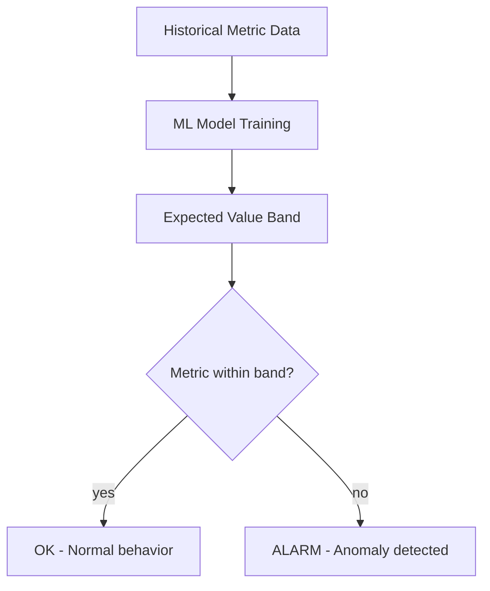

# How to Use CloudWatch Anomaly Detection for Alarms

Author: [nawazdhandala](https://github.com/nawazdhandala)

Tags: AWS, CloudWatch, Monitoring, Machine Learning, Alerting

Description: Learn how to use CloudWatch anomaly detection to create intelligent alarms that automatically adapt to your metric patterns instead of relying on static thresholds.

---

Static thresholds work when your metrics are predictable. If CPU should never exceed 80%, a threshold alarm at 80% is perfect. But many metrics aren't that simple. Your request count at 3 AM on a Sunday is wildly different from 11 AM on a Monday. A static threshold that catches Sunday night anomalies will false-alarm every weekday morning during normal traffic.

CloudWatch anomaly detection uses machine learning to learn your metric's patterns - daily cycles, weekly patterns, seasonal trends - and creates a dynamic expected range. Instead of alarming when a metric crosses a fixed number, it alarms when the metric deviates from what's normal for that specific time.

## How Anomaly Detection Works

CloudWatch analyzes up to two weeks of historical data for a metric and builds a model that predicts expected values. The model accounts for:

- **Hourly patterns** - Traffic peaks during business hours, drops at night
- **Daily patterns** - Weekdays vs weekends
- **Trends** - Gradual growth over time
- **Seasonal patterns** - Regular recurring patterns

The model outputs a band (upper and lower bounds) around the expected value. You set the band width using a threshold parameter - a higher value makes the band wider (less sensitive), and a lower value makes it narrower (more sensitive).



## Enabling Anomaly Detection on a Metric

First, create an anomaly detection model for a metric:

```bash
# Create an anomaly detection model for request count
aws cloudwatch put-anomaly-detector \
  --namespace "AWS/ApplicationELB" \
  --metric-name RequestCount \
  --dimensions Name=LoadBalancer,Value=app/my-alb/abc123 \
  --stat Sum
```

The model starts training immediately. It takes about a few hours to build an initial model, and the model improves over time as it sees more data. After two weeks of data, the model is generally quite accurate.

You can check the model status:

```bash
# Describe the anomaly detector
aws cloudwatch describe-anomaly-detectors \
  --namespace "AWS/ApplicationELB" \
  --metric-name RequestCount \
  --dimensions Name=LoadBalancer,Value=app/my-alb/abc123
```

## Creating an Anomaly Detection Alarm

Once the model is trained, create an alarm based on the anomaly detection band:

```bash
# Alarm when request count is anomalously high or low
aws cloudwatch put-metric-alarm \
  --alarm-name "anomalous-request-count" \
  --alarm-description "Request count outside expected range" \
  --metrics '[
    {
      "Id": "m1",
      "MetricStat": {
        "Metric": {
          "Namespace": "AWS/ApplicationELB",
          "MetricName": "RequestCount",
          "Dimensions": [
            {"Name": "LoadBalancer", "Value": "app/my-alb/abc123"}
          ]
        },
        "Period": 300,
        "Stat": "Sum"
      },
      "ReturnData": true
    },
    {
      "Id": "ad1",
      "Expression": "ANOMALY_DETECTION_BAND(m1, 2)",
      "Label": "RequestCount (Expected)",
      "ReturnData": true
    }
  ]' \
  --threshold-metric-id "ad1" \
  --comparison-operator LessThanLowerOrGreaterThanUpperThreshold \
  --evaluation-periods 3 \
  --alarm-actions "arn:aws:sns:us-east-1:123456789012:ops-alerts"
```

Let's break down the key parts:

The `ANOMALY_DETECTION_BAND(m1, 2)` expression creates the expected range. The `2` is the band width - think of it as the number of standard deviations from the expected value. A value of 2 means roughly 95% of normal data points should fall within the band.

The `comparison-operator` of `LessThanLowerOrGreaterThanUpperThreshold` means the alarm fires if the metric goes above the upper band OR below the lower band. You can also use:
- `GreaterThanUpperThreshold` - Only alert on values above the band
- `LessThanLowerThreshold` - Only alert on values below the band

## Choosing the Right Band Width

The band width controls sensitivity. Here's how to think about it:

| Band Width | Sensitivity | False Alarm Rate | Use Case |
|------------|------------|-------------------|----------|
| 1 | Very High | High | Critical security metrics |
| 2 | Medium | Low | Most production metrics |
| 3 | Low | Very Low | Noisy metrics, cost optimization |
| 4+ | Very Low | Minimal | Background monitoring |

Start with a band width of 2 and adjust based on your experience. If you're getting too many false alarms, increase it. If you're missing real anomalies, decrease it.

```bash
# Tight band for critical error metrics
"Expression": "ANOMALY_DETECTION_BAND(m1, 1.5)"

# Wide band for noisy but important metrics
"Expression": "ANOMALY_DETECTION_BAND(m1, 3)"
```

## Practical Use Cases

### Request Volume Anomalies

Detect unusual traffic patterns that might indicate an attack, a broken client, or a marketing campaign you weren't told about:

```bash
# Detect anomalous request volume
aws cloudwatch put-metric-alarm \
  --alarm-name "traffic-anomaly" \
  --metrics '[
    {
      "Id": "requests",
      "MetricStat": {
        "Metric": {
          "Namespace": "AWS/ApplicationELB",
          "MetricName": "RequestCount",
          "Dimensions": [
            {"Name": "LoadBalancer", "Value": "app/my-alb/abc123"}
          ]
        },
        "Period": 300,
        "Stat": "Sum"
      },
      "ReturnData": true
    },
    {
      "Id": "band",
      "Expression": "ANOMALY_DETECTION_BAND(requests, 2)",
      "ReturnData": true
    }
  ]' \
  --threshold-metric-id "band" \
  --comparison-operator LessThanLowerOrGreaterThanUpperThreshold \
  --evaluation-periods 3 \
  --alarm-actions "arn:aws:sns:us-east-1:123456789012:ops-alerts"
```

### Latency Anomalies

Latency naturally varies by time of day (heavier load means higher latency). Anomaly detection handles this automatically:

```bash
# Detect anomalous latency
aws cloudwatch put-metric-alarm \
  --alarm-name "latency-anomaly" \
  --metrics '[
    {
      "Id": "latency",
      "MetricStat": {
        "Metric": {
          "Namespace": "AWS/ApplicationELB",
          "MetricName": "TargetResponseTime",
          "Dimensions": [
            {"Name": "LoadBalancer", "Value": "app/my-alb/abc123"}
          ]
        },
        "Period": 300,
        "Stat": "p99"
      },
      "ReturnData": true
    },
    {
      "Id": "band",
      "Expression": "ANOMALY_DETECTION_BAND(latency, 2)",
      "ReturnData": true
    }
  ]' \
  --threshold-metric-id "band" \
  --comparison-operator GreaterThanUpperThreshold \
  --evaluation-periods 2 \
  --alarm-actions "arn:aws:sns:us-east-1:123456789012:ops-alerts"
```

Notice we only alarm on values above the upper threshold for latency. Lower-than-expected latency is usually a good thing.

### Database Performance

Database query times and connection counts follow predictable patterns tied to application usage:

```bash
# Detect anomalous database CPU
aws cloudwatch put-anomaly-detector \
  --namespace "AWS/RDS" \
  --metric-name CPUUtilization \
  --dimensions Name=DBInstanceIdentifier,Value=prod-db \
  --stat Average

aws cloudwatch put-metric-alarm \
  --alarm-name "db-cpu-anomaly" \
  --metrics '[
    {
      "Id": "cpu",
      "MetricStat": {
        "Metric": {
          "Namespace": "AWS/RDS",
          "MetricName": "CPUUtilization",
          "Dimensions": [
            {"Name": "DBInstanceIdentifier", "Value": "prod-db"}
          ]
        },
        "Period": 300,
        "Stat": "Average"
      },
      "ReturnData": true
    },
    {
      "Id": "band",
      "Expression": "ANOMALY_DETECTION_BAND(cpu, 2)",
      "ReturnData": true
    }
  ]' \
  --threshold-metric-id "band" \
  --comparison-operator GreaterThanUpperThreshold \
  --evaluation-periods 3 \
  --alarm-actions "arn:aws:sns:us-east-1:123456789012:dba-alerts"
```

### Cost Monitoring

Detect unexpected spending spikes by putting anomaly detection on billing metrics:

```bash
# Detect anomalous daily spending
aws cloudwatch put-anomaly-detector \
  --namespace "AWS/Billing" \
  --metric-name EstimatedCharges \
  --dimensions Name=Currency,Value=USD \
  --stat Maximum

aws cloudwatch put-metric-alarm \
  --alarm-name "spending-anomaly" \
  --metrics '[
    {
      "Id": "cost",
      "MetricStat": {
        "Metric": {
          "Namespace": "AWS/Billing",
          "MetricName": "EstimatedCharges",
          "Dimensions": [
            {"Name": "Currency", "Value": "USD"}
          ]
        },
        "Period": 86400,
        "Stat": "Maximum"
      },
      "ReturnData": true
    },
    {
      "Id": "band",
      "Expression": "ANOMALY_DETECTION_BAND(cost, 2)",
      "ReturnData": true
    }
  ]' \
  --threshold-metric-id "band" \
  --comparison-operator GreaterThanUpperThreshold \
  --evaluation-periods 1 \
  --alarm-actions "arn:aws:sns:us-east-1:123456789012:finance-alerts"
```

## Excluding Time Periods

If you have planned events that would skew the model (maintenance windows, known traffic spikes), you can exclude them:

```bash
# Exclude a specific time range from the model
aws cloudwatch put-anomaly-detector \
  --namespace "AWS/ApplicationELB" \
  --metric-name RequestCount \
  --dimensions Name=LoadBalancer,Value=app/my-alb/abc123 \
  --stat Sum \
  --configuration '{
    "ExcludedTimeRanges": [
      {
        "StartTime": "2026-01-15T00:00:00Z",
        "EndTime": "2026-01-15T06:00:00Z"
      }
    ],
    "MetricTimezone": "America/New_York"
  }'
```

Setting the `MetricTimezone` is important. Without it, the model uses UTC, which means daily patterns don't align with your actual business hours.

## Combining with Composite Alarms

Anomaly detection alarms work great as inputs to composite alarms. Use anomaly detection for the signal and composite alarms for the logic:

```bash
# Anomaly alarm: unusual latency
aws cloudwatch put-metric-alarm \
  --alarm-name "latency-anomaly" \
  --metrics '[...]' \
  --threshold-metric-id "band" \
  --comparison-operator GreaterThanUpperThreshold \
  --evaluation-periods 2

# Static alarm: error rate above 5%
aws cloudwatch put-metric-alarm \
  --alarm-name "error-rate-high" \
  --namespace "Custom/App" \
  --metric-name ErrorRate \
  --statistic Average --period 300 --threshold 5 \
  --comparison-operator GreaterThanThreshold \
  --evaluation-periods 2

# Composite: anomalous latency AND errors = real problem
aws cloudwatch put-composite-alarm \
  --alarm-name "service-anomaly-with-impact" \
  --alarm-rule 'ALARM("latency-anomaly") AND ALARM("error-rate-high")' \
  --alarm-actions "arn:aws:sns:us-east-1:123456789012:pagerduty"
```

This way, the anomaly detection catches unusual patterns, but you only get paged when there's actual user impact.

## Anomaly Detection vs Static Thresholds

When to use each:

**Use anomaly detection when:**
- The metric has predictable patterns (daily, weekly)
- Normal values change over time (growing traffic)
- You don't know what the "right" threshold should be
- You want to catch deviations from normal behavior

**Use static thresholds when:**
- You have hard limits (disk space, connection pools)
- The metric has a clear danger zone (CPU at 95%)
- You need deterministic, predictable alarm behavior
- The metric doesn't have time-based patterns

Most production monitoring uses a mix of both. Static thresholds for hard limits and resource ceilings, anomaly detection for behavioral patterns.

## Wrapping Up

CloudWatch anomaly detection replaces guesswork with data-driven alerting. Instead of picking a threshold and hoping it's right, the ML model learns what's normal for your specific metric and alerts you when something genuinely unusual happens.

Start with your highest-traffic metrics where patterns are strongest - the model needs data to work well. Give it two weeks of training data before relying on it for production alerting. And always pair anomaly detection alarms with static threshold alarms for critical resource limits where you know the absolute boundary.

For the fundamentals of CloudWatch alarming, see our guide on [creating CloudWatch metric alarms](https://oneuptime.com/blog/post/create-cloudwatch-metric-alarms/view). And for combining multiple alarms into smarter alerts, check out [creating CloudWatch composite alarms](https://oneuptime.com/blog/post/create-cloudwatch-composite-alarms/view).
