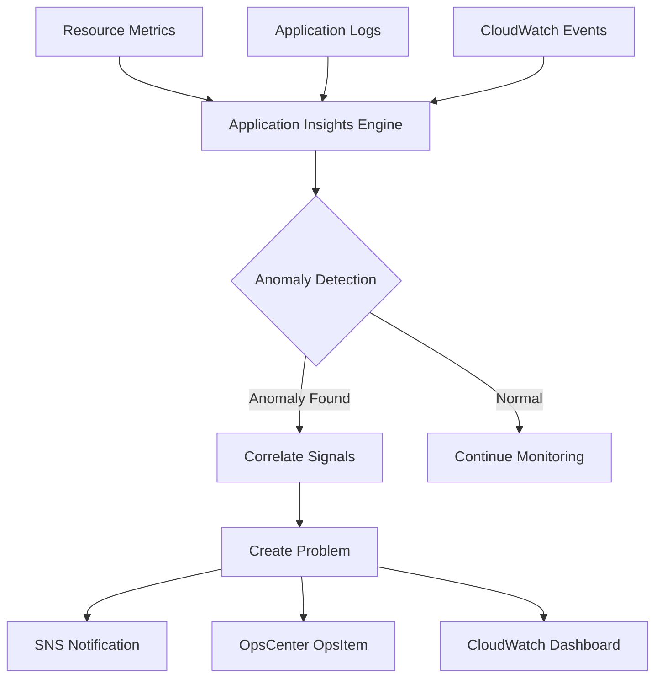

# How to Set Up CloudWatch Application Insights

Author: [nawazdhandala](https://github.com/nawazdhandala)

Tags: AWS, CloudWatch, Application Insights, Monitoring, Observability

Description: Learn how to set up Amazon CloudWatch Application Insights to automatically detect and diagnose application health issues across your AWS resources.

---

If you've ever spent hours digging through CloudWatch metrics trying to figure out why your application is misbehaving, you'll appreciate what Application Insights brings to the table. It's one of those AWS features that doesn't get nearly enough attention, but it can save you a ton of troubleshooting time.

CloudWatch Application Insights automatically sets up monitoring for your applications, detects anomalies, and correlates signals across different AWS resources. Instead of manually building dashboards and setting up alarms for every component, Application Insights does the heavy lifting for you.

## What Exactly Is Application Insights?

Application Insights is a feature within CloudWatch that monitors application resources and detects common problems. It uses machine learning and built-in best practices to set up monitors, create alarms, and surface problems automatically.

It works with a bunch of AWS resource types - EC2 instances, RDS databases, ELB load balancers, Lambda functions, API Gateway, S3, DynamoDB, and more. Once you group your resources together, Application Insights watches them as a cohesive application rather than isolated components.

The real value shows up when something goes wrong. Instead of getting a flood of unrelated CloudWatch alarms, you get a consolidated problem view that shows what happened, when it started, and which resources are affected.

## Prerequisites

Before you dive in, make sure you have the following:

- An AWS account with appropriate IAM permissions
- Resources already deployed (EC2, RDS, etc.) that form your application
- A resource group created in AWS Resource Groups (or you can create one during setup)

You'll need these IAM permissions at minimum:

```json
// IAM policy for Application Insights setup
{
  "Version": "2012-10-17",
  "Statement": [
    {
      "Effect": "Allow",
      "Action": [
        "applicationinsights:*",
        "cloudwatch:*",
        "logs:*",
        "ec2:DescribeInstances",
        "rds:DescribeDBInstances",
        "elasticloadbalancing:DescribeLoadBalancers",
        "resource-groups:*",
        "tag:GetResources"
      ],
      "Resource": "*"
    }
  ]
}
```

## Setting Up via the Console

The quickest way to get started is through the AWS Console.

**Step 1:** Navigate to CloudWatch in your AWS Console. In the left sidebar, find "Application Insights" under the Insights section.

**Step 2:** Click "Add an application." You'll be prompted to select a resource group. If you don't have one yet, you can create a tag-based resource group right here. For example, tag all your production resources with `Environment: Production` and group them together.

**Step 3:** Enable "Monitor CloudWatch Events" and "Integrate with AWS Systems Manager OpsCenter" if you want operational items created automatically.

**Step 4:** Application Insights will analyze your resource group and suggest monitoring configurations. Review the detected components - it's pretty good at figuring out what's what.

**Step 5:** Click through and let it configure. It typically takes a few minutes to set everything up.

## Setting Up via AWS CLI

For repeatable setups, the CLI is the way to go.

First, create a resource group if you don't have one:

```bash
# Create a resource group based on tags
aws resource-groups create-group \
  --name "my-web-app" \
  --resource-query '{
    "Type": "TAG_FILTERS_1_0",
    "Query": "{\"ResourceTypeFilters\":[\"AWS::AllSupported\"],\"TagFilters\":[{\"Key\":\"Application\",\"Values\":[\"WebApp\"]}]}"
  }'
```

Now create the Application Insights application:

```bash
# Create the Application Insights application
aws application-insights create-application \
  --resource-group-name "my-web-app" \
  --ops-center-enabled \
  --cwe-monitor-enabled
```

You can check the status:

```bash
# Describe the application to see its current state
aws application-insights describe-application \
  --resource-group-name "my-web-app"
```

To list the components that Application Insights detected:

```bash
# List components in the application
aws application-insights list-components \
  --resource-group-name "my-web-app"
```

## Setting Up with CloudFormation

For infrastructure-as-code workflows, here's a CloudFormation template:

```yaml
# CloudFormation template for Application Insights
AWSTemplateFormatVersion: '2010-09-09'
Description: Application Insights monitoring setup

Resources:
  AppResourceGroup:
    Type: AWS::ResourceGroups::Group
    Properties:
      Name: my-production-app
      ResourceQuery:
        Type: TAG_FILTERS_1_0
        Query:
          ResourceTypeFilters:
            - AWS::AllSupported
          TagFilters:
            - Key: Environment
              Values:
                - Production

  ApplicationInsightsMonitoring:
    Type: AWS::ApplicationInsights::Application
    Properties:
      ResourceGroupName: !Ref AppResourceGroup
      AutoConfigurationEnabled: true
      CWEMonitorEnabled: true
      OpsCenterEnabled: true
```

The `AutoConfigurationEnabled: true` flag tells Application Insights to automatically detect and configure monitoring for all recognized components. This is usually what you want for a first pass.

## Customizing Component Monitoring

After the initial setup, you might want to tweak things. Application Insights lets you customize monitoring for each component.

Here's how to update a component configuration via CLI:

```bash
# Update component configuration for an EC2 instance group
aws application-insights update-component-configuration \
  --resource-group-name "my-web-app" \
  --component-name "my-ec2-component" \
  --monitor true \
  --tier "DEFAULT" \
  --component-configuration '{
    "alarmMetrics": [
      {
        "alarmMetricName": "CPUUtilization",
        "monitor": true
      },
      {
        "alarmMetricName": "StatusCheckFailed",
        "monitor": true
      }
    ],
    "logs": [
      {
        "logGroupName": "/var/log/messages",
        "logType": "DEFAULT",
        "monitor": true
      }
    ]
  }'
```

## Understanding Problems and Anomalies

Once Application Insights is running, it starts looking for problems. A "problem" in Application Insights is a collection of related observations that indicate something is off.

You can list detected problems:

```bash
# List problems detected in the last 24 hours
aws application-insights list-problems \
  --resource-group-name "my-web-app" \
  --start-time $(date -d '24 hours ago' +%s) \
  --end-time $(date +%s)
```

To get details on a specific problem:

```bash
# Get detailed information about a specific problem
aws application-insights describe-problem \
  --problem-id "p-1234567890"
```

And to see the observations that make up a problem:

```bash
# List observations related to a problem
aws application-insights describe-problem-observations \
  --problem-id "p-1234567890"
```

## How Application Insights Detection Works

Application Insights uses a combination of approaches to spot issues:



It looks at metric thresholds, log patterns, and event changes simultaneously. When multiple signals fire around the same time, it groups them into a single problem rather than creating separate alerts. This correlation is where the real magic happens - it cuts through the noise.

## Setting Up Notifications

You'll want to know when problems are detected. Application Insights can send notifications through SNS:

```bash
# Create an SNS topic for notifications
aws sns create-topic --name app-insights-alerts

# Subscribe your email
aws sns subscribe \
  --topic-arn arn:aws:sns:us-east-1:123456789012:app-insights-alerts \
  --protocol email \
  --notification-endpoint your-team@company.com
```

Then configure Application Insights to use this topic through the console or by updating the application settings.

## Best Practices

Here are some tips I've picked up from running Application Insights in production:

**Tag everything consistently.** The resource group is the foundation. If your tagging is sloppy, Application Insights won't pick up all your resources. Establish a tagging convention and enforce it.

**Start with auto-configuration.** Let Application Insights figure out the initial monitoring setup, then customize from there. Fighting the defaults from the start just makes more work.

**Review detected problems regularly.** Application Insights might flag things that aren't actually problems for your use case. Tuning the sensitivity over the first few weeks is normal.

**Combine with other monitoring.** Application Insights is great for AWS resource monitoring, but it doesn't replace application-level observability. Pair it with tools like [X-Ray for tracing](https://oneuptime.com/blog/post/xray-tracing-application-requests/view) and custom metrics for a complete picture.

**Use OpsCenter integration.** When you enable OpsCenter, each detected problem creates an operational item that your team can track to resolution. It adds accountability to the process.

## Limitations to Be Aware Of

Application Insights isn't perfect. It only works with supported AWS resource types, so if you're running something exotic, you might not get full coverage. It also doesn't monitor on-premises resources or other cloud providers.

The anomaly detection can be noisy during the initial learning period. Give it a week or two to baseline your application's normal behavior before you trust the problem detection fully.

There's also a cost component - Application Insights itself is free, but the CloudWatch metrics, logs, and alarms it creates do count toward your CloudWatch bill. Check out our guide on [reducing CloudWatch costs](https://oneuptime.com/blog/post/reduce-cloudwatch-costs/view) if that's a concern.

## Wrapping Up

CloudWatch Application Insights is one of the easier wins in AWS monitoring. It takes about 10 minutes to set up and immediately starts watching your application resources for common issues. The problem correlation alone makes it worth enabling - getting one consolidated alert instead of a dozen individual alarms is a huge quality-of-life improvement for on-call engineers.

Start with a non-critical application to get a feel for how it works, then roll it out across your production workloads. The auto-configuration handles most of the initial setup, and you can always fine-tune from there.
