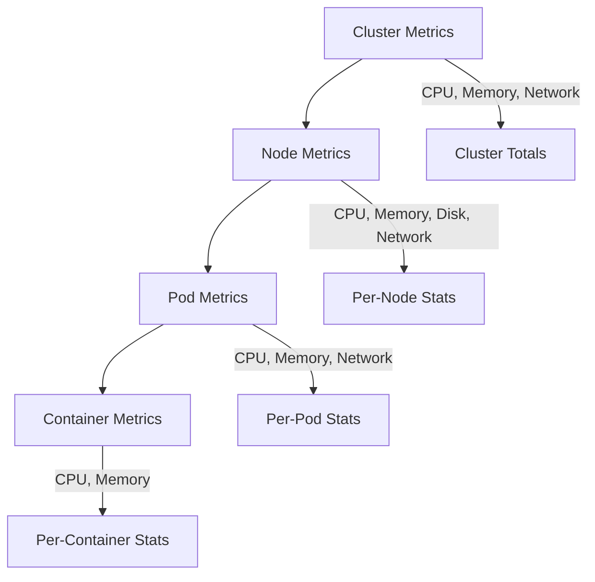

# How to Set Up CloudWatch Container Insights for EKS

Author: [nawazdhandala](https://github.com/nawazdhandala)

Tags: AWS, CloudWatch, EKS, Kubernetes, Container Insights

Description: Complete walkthrough for setting up CloudWatch Container Insights on Amazon EKS to monitor Kubernetes cluster, node, pod, and container metrics.

---

Kubernetes monitoring on EKS can feel overwhelming. Between node metrics, pod metrics, container metrics, and control plane logs, there's a lot of data to collect and make sense of. CloudWatch Container Insights for EKS gives you a structured way to capture all of it and surface it through CloudWatch dashboards and queries.

Container Insights on EKS works differently from the ECS version. On ECS, you flip a switch and you're done. On EKS, you need to deploy agents into your cluster. But once it's running, you get deep visibility into your Kubernetes workloads - from the cluster level all the way down to individual containers.

## What Metrics Does Container Insights Collect?

Container Insights for EKS captures metrics at multiple levels:



At each level, you get CPU utilization, memory usage, network I/O, and (where applicable) filesystem usage. You also get Kubernetes-specific metrics like pod restart counts, pod status, and node conditions.

## Prerequisites

You'll need:

- An EKS cluster running Kubernetes 1.23 or later
- `kubectl` configured to talk to your cluster
- `helm` (optional but recommended)
- The cluster must have an OIDC provider configured for IAM Roles for Service Accounts (IRSA)

Verify your cluster:

```bash
# Check your EKS cluster version and status
aws eks describe-cluster --name my-cluster --query "cluster.{Version:version,Status:status}"

# Verify kubectl connectivity
kubectl get nodes
```

## Option 1: Install Using the CloudWatch Agent with Helm

The recommended approach is using the Amazon CloudWatch Observability Helm chart. It installs both the CloudWatch agent and Fluent Bit for log collection.

```bash
# Add the EKS charts repository
helm repo add aws-observability https://aws-observability.github.io/helm-charts
helm repo update

# Install the CloudWatch Observability addon
helm install cloudwatch-agent aws-observability/amazon-cloudwatch-observability \
  --namespace amazon-cloudwatch \
  --create-namespace \
  --set clusterName=my-cluster \
  --set region=us-east-1 \
  --set containerInsights.enabled=true
```

This deploys the CloudWatch agent as a DaemonSet (runs on every node) and Fluent Bit for log forwarding.

## Option 2: Install Using the EKS Add-on

AWS also offers Container Insights as a managed EKS add-on:

```bash
# Install the CloudWatch Observability EKS add-on
aws eks create-addon \
  --cluster-name my-cluster \
  --addon-name amazon-cloudwatch-observability \
  --addon-version v1.5.0-eksbuild.1 \
  --service-account-role-arn arn:aws:iam::123456789012:role/CloudWatchAgentRole
```

Check the add-on status:

```bash
# Verify the add-on is active
aws eks describe-addon \
  --cluster-name my-cluster \
  --addon-name amazon-cloudwatch-observability \
  --query "addon.status"
```

## Setting Up IAM Roles for Service Accounts (IRSA)

The CloudWatch agent running in your cluster needs AWS permissions. The proper way to grant these is through IRSA.

Create a trust policy:

```json
// Trust policy for the CloudWatch agent service account
{
  "Version": "2012-10-17",
  "Statement": [
    {
      "Effect": "Allow",
      "Principal": {
        "Federated": "arn:aws:iam::123456789012:oidc-provider/oidc.eks.us-east-1.amazonaws.com/id/EXAMPLED539D4633E53DE1B71EXAMPLE"
      },
      "Action": "sts:AssumeRoleWithWebIdentity",
      "Condition": {
        "StringEquals": {
          "oidc.eks.us-east-1.amazonaws.com/id/EXAMPLED539D4633E53DE1B71EXAMPLE:sub": "system:serviceaccount:amazon-cloudwatch:cloudwatch-agent"
        }
      }
    }
  ]
}
```

Create the IAM role with the required permissions:

```bash
# Create the IAM role
aws iam create-role \
  --role-name CloudWatchAgentRole \
  --assume-role-policy-document file://trust-policy.json

# Attach the CloudWatch agent policy
aws iam attach-role-policy \
  --role-name CloudWatchAgentRole \
  --policy-arn arn:aws:iam::aws:policy/CloudWatchAgentServerPolicy

# Also attach the X-Ray write policy if you want tracing
aws iam attach-role-policy \
  --role-name CloudWatchAgentRole \
  --policy-arn arn:aws:iam::aws:policy/AWSXRayDaemonWriteAccess
```

## Verifying the Installation

After installing, check that everything is running:

```bash
# Check that the CloudWatch agent pods are running on every node
kubectl get pods -n amazon-cloudwatch

# You should see one cloudwatch-agent pod per node
# and one fluent-bit pod per node (if log collection is enabled)

# Check the agent logs for errors
kubectl logs -n amazon-cloudwatch -l app=cloudwatch-agent --tail=50
```

Give it about 5 minutes, then check CloudWatch for the metrics:

```bash
# List metrics in the Container Insights namespace
aws cloudwatch list-metrics \
  --namespace "ContainerInsights" \
  --dimensions Name=ClusterName,Value=my-cluster
```

## Querying Container Insights Data

Container Insights stores performance data in CloudWatch Logs under `/aws/containerinsights/{cluster-name}/performance`. You can run powerful queries using Logs Insights.

Find pods with high CPU usage:

```sql
-- Top 10 pods by CPU utilization
stats max(pod_cpu_utilization) as max_cpu by PodName, Namespace
| sort max_cpu desc
| limit 10
```

Check for pods that keep restarting:

```sql
-- Find pods with restart counts in the last hour
stats max(pod_number_of_container_restarts) as restarts by PodName, Namespace
| filter restarts > 0
| sort restarts desc
```

Monitor node resource pressure:

```sql
-- Node memory utilization over time
stats avg(node_memory_utilization) as avg_mem by NodeName, bin(5m)
| sort avg_mem desc
```

Find pods approaching their memory limits:

```sql
-- Pods using more than 80% of their memory request
stats max(pod_memory_utilization_over_pod_limit) as mem_pct by PodName, Namespace
| filter mem_pct > 80
| sort mem_pct desc
```

## Enabling EKS Control Plane Logging

Container Insights for metrics is great, but don't forget about the EKS control plane logs. These are separate but complementary:

```bash
# Enable all control plane log types
aws eks update-cluster-config \
  --name my-cluster \
  --logging '{
    "clusterLogging": [
      {
        "types": ["api", "audit", "authenticator", "controllerManager", "scheduler"],
        "enabled": true
      }
    ]
  }'
```

These logs go to CloudWatch Logs under `/aws/eks/{cluster-name}/cluster`. They're invaluable for debugging authentication issues, failed deployments, and scheduler decisions.

## Setting Up Alarms

Create alarms on Container Insights metrics to catch problems:

```bash
# Alarm when cluster CPU exceeds 75%
aws cloudwatch put-metric-alarm \
  --alarm-name "EKS-HighClusterCPU" \
  --namespace "ContainerInsights" \
  --metric-name "node_cpu_utilization" \
  --dimensions Name=ClusterName,Value=my-cluster \
  --statistic Average \
  --period 300 \
  --threshold 75 \
  --comparison-operator GreaterThanThreshold \
  --evaluation-periods 3 \
  --alarm-actions arn:aws:sns:us-east-1:123456789012:eks-alerts

# Alarm when pod restarts are detected
aws cloudwatch put-metric-alarm \
  --alarm-name "EKS-PodRestarts" \
  --namespace "ContainerInsights" \
  --metric-name "pod_number_of_container_restarts" \
  --dimensions Name=ClusterName,Value=my-cluster Name=Namespace,Value=production \
  --statistic Sum \
  --period 300 \
  --threshold 5 \
  --comparison-operator GreaterThanThreshold \
  --evaluation-periods 1 \
  --alarm-actions arn:aws:sns:us-east-1:123456789012:eks-alerts
```

## Monitoring Fargate Pods on EKS

If you're running Fargate pods on EKS, Container Insights works differently. You don't need the DaemonSet since there are no nodes to run it on. Instead, AWS collects metrics automatically for Fargate pods.

However, Fargate pod metrics have some limitations compared to EC2-backed pods:

- No disk I/O metrics
- No node-level metrics (since there's no visible node)
- Network metrics may be limited

For Fargate, make sure your pod execution role has CloudWatch permissions:

```yaml
# Fargate pod role with CloudWatch permissions
apiVersion: v1
kind: ServiceAccount
metadata:
  name: my-app
  namespace: production
  annotations:
    eks.amazonaws.com/role-arn: arn:aws:iam::123456789012:role/FargatePodRole
```

## Integrating with Prometheus Metrics

If you're already using Prometheus in your cluster, Container Insights can scrape Prometheus metrics too. Configure the CloudWatch agent to collect Prometheus metrics:

```yaml
# CloudWatch agent Prometheus scrape config
apiVersion: v1
kind: ConfigMap
metadata:
  name: prometheus-config
  namespace: amazon-cloudwatch
data:
  prometheus.yaml: |
    global:
      scrape_interval: 1m
      scrape_timeout: 10s
    scrape_configs:
      - job_name: 'kubernetes-pods'
        kubernetes_sd_configs:
          - role: pod
        relabel_configs:
          - source_labels: [__meta_kubernetes_pod_annotation_prometheus_io_scrape]
            action: keep
            regex: true
          - source_labels: [__meta_kubernetes_pod_annotation_prometheus_io_path]
            action: replace
            target_label: __metrics_path__
            regex: (.+)
```

This sends your custom Prometheus metrics to CloudWatch alongside the built-in Container Insights metrics. For a more Prometheus-native approach, check out [Amazon Managed Prometheus](https://oneuptime.com/blog/post/2026-02-12-amazon-managed-prometheus-container-metrics/view).

## Cost Optimization Tips

Container Insights generates a lot of data, which means CloudWatch costs can climb. Here are some ways to keep them reasonable:

- **Reduce metric granularity** if you don't need per-container breakdowns - node and pod level might be enough
- **Set retention policies** on the performance log group - 30 days is usually sufficient
- **Use metric filters** instead of querying raw logs for frequently checked patterns
- **Consider sampling** for high-cardinality environments

For more cost strategies, see our detailed guide on [reducing CloudWatch costs](https://oneuptime.com/blog/post/2026-02-12-reduce-cloudwatch-costs/view).

## Wrapping Up

Setting up Container Insights for EKS takes a bit more work than ECS, but the result is the same - solid visibility into your container workloads. Whether you use the Helm chart or the EKS add-on, you'll have cluster-to-container metrics flowing into CloudWatch within minutes.

Combine these metrics with control plane logging and you've got a comprehensive monitoring foundation for your EKS clusters. From there, you can layer on tracing with X-Ray and visualization with [Amazon Managed Grafana](https://oneuptime.com/blog/post/2026-02-12-amazon-managed-grafana-cloudwatch/view) for an even richer observability stack.
