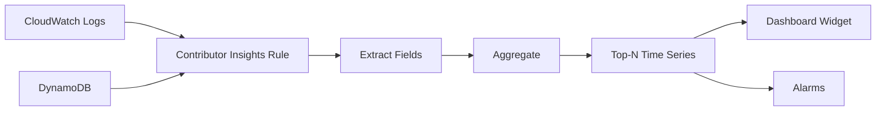

# How to Use CloudWatch Contributor Insights for Top-N Analysis

Author: [nawazdhandala](https://github.com/nawazdhandala)

Tags: AWS, CloudWatch, Contributor Insights, Log Analysis

Description: Learn how to use CloudWatch Contributor Insights to identify top contributors to system behavior, find heavy hitters, and analyze usage patterns in your AWS resources.

---

Ever tried to figure out which IP addresses are hammering your API the hardest? Or which DynamoDB partition keys are getting the most traffic? These "top-N" questions come up constantly in operations, and answering them usually means writing custom log analysis queries or exporting data to a separate analytics tool.

CloudWatch Contributor Insights makes this easier. It continuously analyzes log data and creates time series showing the top contributors to a given metric. Think of it as a real-time leaderboard for whatever dimension you care about - top talkers, heaviest users, busiest keys, noisiest error sources.

## How It Works

Contributor Insights works by applying rules to CloudWatch Logs or DynamoDB data. A rule defines:

1. Which log group or table to analyze
2. What fields to extract (the "contributors")
3. How to aggregate (count, sum, etc.)
4. How many top contributors to track

The service then continuously processes incoming data and maintains a time series of the top-N contributors. You can visualize these as time series graphs, and they update in near real-time.



## Creating a Rule via the Console

The fastest way to start is through the CloudWatch Console:

1. Open CloudWatch and click "Contributor Insights" in the left nav
2. Click "Create rule"
3. Choose "CloudWatch Logs" or "DynamoDB" as the data source
4. Select the log group
5. Define the log format and fields
6. Set the contributor key (what you want to rank by)
7. Choose the aggregation (count, sum, max, min)
8. Set the number of top contributors to display (typically 10 or 25)

## Creating Rules via CLI

Let's create some practical rules using the CLI. These examples cover common use cases.

### Top IP Addresses Hitting Your Application

If your application logs include IP addresses (like ALB access logs), this rule finds the busiest clients:

```bash
# Create a rule to find top IP addresses by request count
aws cloudwatch put-insight-rule \
  --rule-name "TopIPAddresses" \
  --rule-state "ENABLED" \
  --rule-definition '{
    "Schema": {
      "Name": "CloudWatchLogRule",
      "Version": 1
    },
    "LogGroupNames": ["/aws/elasticloadbalancing/my-alb"],
    "LogFormat": "CLF",
    "Contribution": {
      "Keys": ["client_ip"],
      "ValueOf": "request_count",
      "Filters": []
    },
    "AggregateOn": "Sum"
  }'
```

### Top Error-Producing Endpoints

This rule identifies which API endpoints are generating the most 5xx errors:

```bash
# Create a rule to find endpoints with the most errors
aws cloudwatch put-insight-rule \
  --rule-name "Top5xxEndpoints" \
  --rule-state "ENABLED" \
  --rule-definition '{
    "Schema": {
      "Name": "CloudWatchLogRule",
      "Version": 1
    },
    "LogGroupNames": ["/aws/apigateway/my-api"],
    "LogFormat": "JSON",
    "Contribution": {
      "Keys": ["$.resourcePath"],
      "ValueOf": "$.count",
      "Filters": [
        {
          "Match": "$.status",
          "GreaterThan": 499
        }
      ]
    },
    "AggregateOn": "Sum"
  }'
```

### Top DynamoDB Partition Keys

One of the most useful built-in integrations is with DynamoDB. You can identify hot partition keys that might be causing throttling:

```bash
# Enable Contributor Insights on a DynamoDB table
aws dynamodb update-contributor-insights \
  --table-name OrdersTable \
  --contributor-insights-action ENABLE
```

That single command creates Contributor Insights rules for both the table and any global secondary indexes. You'll see the most accessed and most throttled partition keys without writing any custom rules.

Check the status:

```bash
# Verify Contributor Insights is enabled
aws dynamodb describe-contributor-insights \
  --table-name OrdersTable
```

### Custom JSON Log Analysis

For applications that output structured JSON logs, you can create very specific rules:

```bash
# Find top users by error count from application logs
aws cloudwatch put-insight-rule \
  --rule-name "TopUserErrors" \
  --rule-state "ENABLED" \
  --rule-definition '{
    "Schema": {
      "Name": "CloudWatchLogRule",
      "Version": 1
    },
    "LogGroupNames": ["/app/my-service/production"],
    "LogFormat": "JSON",
    "Contribution": {
      "Keys": ["$.userId", "$.errorType"],
      "Filters": [
        {
          "Match": "$.level",
          "EqualTo": "ERROR"
        }
      ]
    },
    "AggregateOn": "Count"
  }'
```

Notice you can use multiple keys. This rule shows the top combinations of userId and errorType, so you can see things like "user-123 had 500 ValidationError events in the last hour."

## Querying Contributor Insights Data

Once a rule is running, you can pull the data programmatically:

```bash
# Get the top contributors for the last hour
aws cloudwatch get-insight-rule-report \
  --rule-name "TopIPAddresses" \
  --start-time $(date -u -d '1 hour ago' +%Y-%m-%dT%H:%M:%S) \
  --end-time $(date -u +%Y-%m-%dT%H:%M:%S) \
  --period 300 \
  --max-contributor-count 10
```

The response includes:

- A list of top contributors with their aggregate values
- Time series data points for each contributor
- The approximate unique count of contributors

You can also query this data from Lambda for automated analysis:

```python
# Lambda function to check top contributors and alert on anomalies
import boto3
from datetime import datetime, timedelta

def lambda_handler(event, context):
    cw = boto3.client('cloudwatch')

    end_time = datetime.utcnow()
    start_time = end_time - timedelta(hours=1)

    # Get the top contributors report
    response = cw.get_insight_rule_report(
        RuleName='TopIPAddresses',
        StartTime=start_time,
        EndTime=end_time,
        Period=300,
        MaxContributorCount=5
    )

    # Check if any single IP is responsible for more than 50% of traffic
    total = sum(c['ApproximateAggregateValue'] for c in response['Contributors'])

    for contributor in response['Contributors']:
        pct = (contributor['ApproximateAggregateValue'] / total) * 100
        ip = contributor['Keys'][0]

        if pct > 50:
            print(f"WARNING: {ip} accounts for {pct:.1f}% of traffic")
            # Send SNS notification, update WAF rule, etc.

    return {
        'top_contributors': len(response['Contributors']),
        'total_count': total
    }
```

## Adding to CloudWatch Dashboards

Contributor Insights integrates directly with CloudWatch dashboards. Add a widget that shows the top-N chart:

```json
// Dashboard widget for Contributor Insights
{
  "widgets": [
    {
      "type": "metric",
      "x": 0,
      "y": 0,
      "width": 12,
      "height": 6,
      "properties": {
        "insightRule": {
          "maxContributorCount": 10,
          "orderBy": "Sum",
          "ruleName": "TopIPAddresses"
        },
        "period": 300,
        "title": "Top 10 IP Addresses by Request Count",
        "region": "us-east-1"
      }
    }
  ]
}
```

## Creating Alarms on Contributor Data

You can alarm when a contributor exceeds a threshold:

```bash
# Alarm when any single IP makes more than 10,000 requests in 5 minutes
aws cloudwatch put-metric-alarm \
  --alarm-name "HighTrafficSingleIP" \
  --metric-name "UniqueContributors" \
  --namespace "AWS/InsightRule" \
  --statistic Maximum \
  --dimensions Name=RuleName,Value=TopIPAddresses \
  --period 300 \
  --threshold 10000 \
  --comparison-operator GreaterThanThreshold \
  --evaluation-periods 1 \
  --alarm-actions arn:aws:sns:us-east-1:123456789012:alerts
```

## Real-World Use Cases

**DDoS detection.** When one or a few IP addresses suddenly dominate your traffic, Contributor Insights makes it visible immediately. You can couple this with AWS WAF to automatically block abusive IPs.

**DynamoDB hot key detection.** Uneven partition key distribution causes throttling. Contributor Insights on DynamoDB tells you exactly which keys are hot, so you can redesign your access patterns.

**Cost attribution.** If your API serves multiple tenants, Contributor Insights can show which tenants consume the most resources. This feeds into billing and capacity planning.

**Error pattern analysis.** Instead of just knowing your error rate went up, you can see which specific users, endpoints, or request types are driving the errors.

**Security analysis.** Track which IAM principals are making the most API calls, which source IPs are accessing your resources, or which user agents are hitting your endpoints.

## Pricing and Limits

Contributor Insights rules have associated costs:

- Each rule costs approximately $0.50/month to run
- Each rule match (log event that contributes) costs a small per-match fee
- The first month of each new rule is free

There are limits to be aware of: you can have up to 100 rules per account per region, and each rule can track up to 4,000 unique contributors. For most use cases, these limits are more than enough.

## Best Practices

**Keep rules focused.** A rule that tries to track too many dimensions will be slow and expensive. Create separate rules for separate questions.

**Use filters aggressively.** If you only care about errors, filter on error status before aggregation. This reduces the data processed and makes the results more actionable.

**Combine with Logs Insights.** Contributor Insights tells you the "who" - Logs Insights tells you the "why." Use Contributor Insights to identify the top offender, then switch to Logs Insights to investigate the details.

**Monitor DynamoDB tables proactively.** Even if you're not experiencing throttling yet, enabling Contributor Insights on your DynamoDB tables gives you early warning of developing hot key issues.

## Wrapping Up

Contributor Insights fills a specific niche in the monitoring toolkit - answering "who are the top contributors?" questions in real time. It's not trying to replace general-purpose log analysis, but for the specific class of top-N problems, it's faster and more convenient than writing ad-hoc queries.

If you're dealing with noisy neighbors, hot partition keys, or just want to understand who's using your system the most, give Contributor Insights a try. The DynamoDB integration alone is worth the minimal setup effort.
