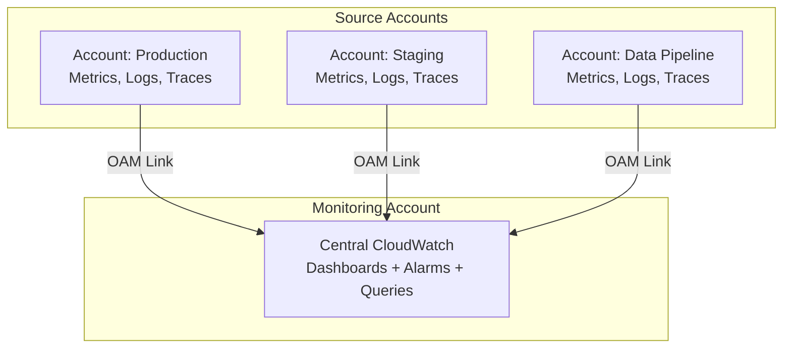

# How to Set Up CloudWatch Cross-Account Observability

Author: [nawazdhandala](https://github.com/nawazdhandala)

Tags: AWS, CloudWatch, Multi-Account, Observability, Monitoring

Description: Step-by-step guide to setting up CloudWatch cross-account observability so you can monitor metrics, logs, and traces from multiple AWS accounts in one place.

---

When your AWS footprint spans multiple accounts, monitoring becomes fragmented. Your production workloads are in one account, your data pipeline in another, your staging environment in a third. Each account has its own CloudWatch metrics, logs, and traces. Without cross-account observability, you're constantly switching between accounts just to get a complete picture of what's happening.

CloudWatch cross-account observability fixes this by letting you designate a central "monitoring account" that can view and query telemetry data from all your other "source accounts." You don't have to copy or replicate data - the monitoring account gets live access to metrics, logs, and traces in the source accounts.

## Architecture Overview

The setup involves two roles:

- **Monitoring account**: The central account where you build dashboards, create alarms, and run queries across all accounts.
- **Source accounts**: The accounts that contain your actual workloads and their telemetry data.



This is built on the CloudWatch Observability Access Manager (OAM), which manages the trust relationships between accounts.

## Step 1: Create an OAM Sink in the Monitoring Account

First, in your monitoring account, create an OAM sink. This is the receiving end that source accounts connect to.

```bash
# In the monitoring account: create an OAM sink
aws oam create-sink \
  --name "central-monitoring-sink" \
  --region us-east-1
```

This returns a sink ARN that looks like:

```
arn:aws:oam:us-east-1:999999999999:sink/abc123def456
```

Save this ARN - you'll need it when configuring source accounts.

## Step 2: Create a Sink Policy

Next, define which accounts are allowed to link to your sink. You can specify individual account IDs or use an organization path:

```bash
# Allow specific accounts to connect to the sink
aws oam put-sink-policy \
  --sink-identifier "arn:aws:oam:us-east-1:999999999999:sink/abc123def456" \
  --policy '{
    "Version": "2012-10-17",
    "Statement": [
      {
        "Effect": "Allow",
        "Principal": {
          "AWS": [
            "111111111111",
            "222222222222",
            "333333333333"
          ]
        },
        "Action": [
          "oam:CreateLink",
          "oam:UpdateLink"
        ],
        "Resource": "*",
        "Condition": {
          "ForAllValues:StringEquals": {
            "oam:ResourceTypes": [
              "AWS::CloudWatch::Metric",
              "AWS::Logs::LogGroup",
              "AWS::XRay::Trace"
            ]
          }
        }
      }
    ]
  }'
```

If you're using AWS Organizations, you can allow all accounts in an OU:

```bash
# Allow all accounts in an organizational unit
aws oam put-sink-policy \
  --sink-identifier "arn:aws:oam:us-east-1:999999999999:sink/abc123def456" \
  --policy '{
    "Version": "2012-10-17",
    "Statement": [
      {
        "Effect": "Allow",
        "Principal": "*",
        "Action": ["oam:CreateLink", "oam:UpdateLink"],
        "Resource": "*",
        "Condition": {
          "ForAnyValue:StringEquals": {
            "aws:PrincipalOrgPaths": [
              "o-org123456/r-root/ou-root-workloads/"
            ]
          },
          "ForAllValues:StringEquals": {
            "oam:ResourceTypes": [
              "AWS::CloudWatch::Metric",
              "AWS::Logs::LogGroup",
              "AWS::XRay::Trace"
            ]
          }
        }
      }
    ]
  }'
```

## Step 3: Create Links from Source Accounts

In each source account, create a link to the monitoring account's sink:

```bash
# In each source account: create a link to the monitoring sink
aws oam create-link \
  --label-template "account-name" \
  --resource-types "AWS::CloudWatch::Metric" "AWS::Logs::LogGroup" "AWS::XRay::Trace" \
  --sink-identifier "arn:aws:oam:us-east-1:999999999999:sink/abc123def456" \
  --region us-east-1
```

The `label-template` parameter determines how the source account is identified in the monitoring account. You can use `$AccountName`, `$AccountEmail`, or `$AccountEmailNoDomain`.

## Automating with CloudFormation

For organizations with many accounts, automate the source-side setup with CloudFormation StackSets:

```yaml
AWSTemplateFormatVersion: '2010-09-09'
Description: CloudWatch cross-account observability - source account configuration

Parameters:
  MonitoringSinkArn:
    Type: String
    Description: ARN of the OAM sink in the monitoring account

Resources:
  ObservabilityLink:
    Type: AWS::Oam::Link
    Properties:
      LabelTemplate: "$AccountName"
      ResourceTypes:
        - "AWS::CloudWatch::Metric"
        - "AWS::Logs::LogGroup"
        - "AWS::XRay::Trace"
      SinkIdentifier: !Ref MonitoringSinkArn
```

Deploy it across your organization:

```bash
# Deploy the source configuration to all workload accounts
aws cloudformation create-stack-set \
  --stack-set-name cross-account-observability \
  --template-body file://source-account-template.yaml \
  --parameters ParameterKey=MonitoringSinkArn,ParameterValue=arn:aws:oam:us-east-1:999999999999:sink/abc123def456 \
  --permission-model SERVICE_MANAGED \
  --auto-deployment Enabled=true,RetainStacksOnAccountRemoval=true

# Create instances in all accounts within a specific OU
aws cloudformation create-stack-instances \
  --stack-set-name cross-account-observability \
  --deployment-targets OrganizationalUnitIds=ou-root-workloads \
  --regions us-east-1
```

## Step 4: Querying Cross-Account Metrics

Once the links are established, you can query metrics from source accounts directly in the monitoring account. In the CloudWatch console, you'll see an "Account" dropdown that lets you select which account to view.

Via the CLI, use the `--account-id` parameter:

```bash
# Query a metric from a source account
aws cloudwatch get-metric-data \
  --metric-data-queries '[
    {
      "Id": "prod_cpu",
      "MetricStat": {
        "Metric": {
          "Namespace": "AWS/EC2",
          "MetricName": "CPUUtilization",
          "Dimensions": [
            { "Name": "InstanceId", "Value": "i-1234567890abcdef0" }
          ]
        },
        "Period": 300,
        "Stat": "Average"
      },
      "AccountId": "111111111111"
    }
  ]' \
  --start-time 2026-02-12T00:00:00Z \
  --end-time 2026-02-12T12:00:00Z
```

## Step 5: Cross-Account Log Queries

You can also run Logs Insights queries across accounts:

```bash
# Query logs from a source account's log group
aws logs start-query \
  --log-group-identifiers "arn:aws:logs:us-east-1:111111111111:log-group:/aws/lambda/my-function" \
  --start-time 1707696000 \
  --end-time 1707782400 \
  --query-string 'fields @timestamp, @message | filter @message like /ERROR/ | sort @timestamp desc | limit 50'
```

In the CloudWatch console, Logs Insights automatically shows log groups from all linked source accounts.

## Building Cross-Account Dashboards

Now you can create dashboards in the monitoring account that show metrics from all your accounts:

```json
{
  "widgets": [
    {
      "type": "text",
      "x": 0, "y": 0, "width": 24, "height": 1,
      "properties": {
        "markdown": "# Multi-Account Application Health"
      }
    },
    {
      "type": "metric",
      "x": 0, "y": 1, "width": 12, "height": 6,
      "properties": {
        "metrics": [
          ["AWS/ECS", "CPUUtilization", "ServiceName", "api",
            { "accountId": "111111111111", "label": "Prod", "stat": "Average" }],
          ["AWS/ECS", "CPUUtilization", "ServiceName", "api",
            { "accountId": "222222222222", "label": "Staging", "stat": "Average" }]
        ],
        "title": "API Service CPU by Environment",
        "view": "timeSeries",
        "region": "us-east-1"
      }
    },
    {
      "type": "log",
      "x": 0, "y": 7, "width": 24, "height": 6,
      "properties": {
        "query": "SOURCE 'arn:aws:logs:us-east-1:111111111111:log-group:/aws/ecs/api'\n| filter @message like /ERROR/\n| fields @timestamp, @message\n| sort @timestamp desc\n| limit 10",
        "title": "Production API Errors",
        "view": "table"
      }
    }
  ]
}
```

For more on building these dashboards, see our post on [creating CloudWatch dashboards](https://oneuptime.com/blog/post/create-cloudwatch-dashboards-application-monitoring/view).

## Cross-Account Alarms

You can create alarms in the monitoring account that watch metrics in source accounts:

```bash
# Create an alarm in the monitoring account for a source account metric
aws cloudwatch put-metric-alarm \
  --alarm-name "ProdHighCPU" \
  --namespace "AWS/ECS" \
  --metric-name "CPUUtilization" \
  --dimensions Name=ServiceName,Value=api Name=ClusterName,Value=prod \
  --statistic Average \
  --period 300 \
  --threshold 80 \
  --comparison-operator GreaterThanThreshold \
  --evaluation-periods 3 \
  --alarm-actions arn:aws:sns:us-east-1:999999999999:ops-alerts \
  --treat-missing-data notBreaching
```

## Troubleshooting

If metrics from source accounts aren't showing up in the monitoring account, check these things:

1. **Link status**: Run `aws oam list-links` in the source account and verify the link status is `ACTIVE`.
2. **Sink policy**: Make sure the sink policy allows the source account ID.
3. **Resource types**: Verify that the link includes the resource types you need (metrics, logs, traces).
4. **Region match**: The sink and link must be in the same region.
5. **IAM permissions**: The user or role in the monitoring account needs `cloudwatch:GetMetricData` and similar permissions.

```bash
# Check link status in a source account
aws oam list-links --region us-east-1

# Check attached links in the monitoring account
aws oam list-attached-links \
  --sink-identifier "arn:aws:oam:us-east-1:999999999999:sink/abc123def456"
```

## Cost Considerations

Cross-account observability itself doesn't have a separate charge. You pay the normal CloudWatch prices for the metrics, logs, and traces in the source accounts. However, cross-account log queries count toward Logs Insights query charges in the monitoring account. And cross-account metric data retrieval counts toward API call quotas. Keep this in mind for high-volume scenarios.

## Wrapping Up

Cross-account observability is essential for any multi-account AWS setup. With a central monitoring account, you get a single pane of glass for all your metrics, logs, and traces. The setup is straightforward - create a sink, set a policy, create links from source accounts - and the payoff is huge. No more context-switching between accounts just to understand what's happening in your infrastructure. Combine this with [shared dashboards](https://oneuptime.com/blog/post/share-cloudwatch-dashboards-across-accounts/view) to give everyone in your organization the visibility they need.
