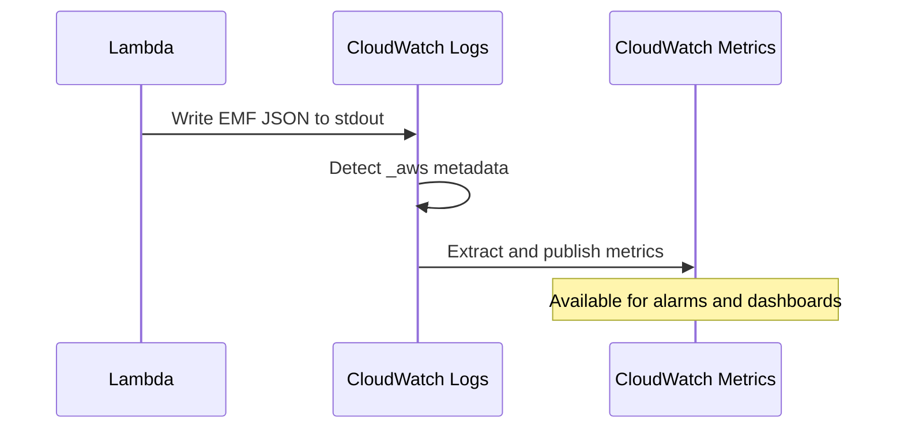

# How to Use CloudWatch Embedded Metric Format in Lambda

Author: [nawazdhandala](https://github.com/nawazdhandala)

Tags: AWS, CloudWatch, Lambda, Serverless, Monitoring

Description: Learn how to use the CloudWatch Embedded Metric Format to publish custom metrics directly from Lambda function logs without extra API calls or costs.

---

If you've ever tried publishing custom CloudWatch metrics from a Lambda function using the standard `PutMetricData` API, you've probably noticed the downsides. Each API call adds latency to your function execution, increases your AWS bill, and can even get throttled under high concurrency. The CloudWatch Embedded Metric Format (EMF) solves all of these problems by letting you embed metric definitions directly in your log output.

When CloudWatch Logs receives a log entry in EMF format, it automatically extracts the metric data and publishes it as a custom CloudWatch metric. No extra API calls. No added latency. No throttling concerns. You just write a specially structured JSON object to stdout, and CloudWatch handles the rest.

## How EMF Works

The flow is surprisingly simple. Your Lambda function writes a JSON blob to stdout that follows the EMF specification. CloudWatch Logs picks it up (like it does with any Lambda log output), recognizes the `_aws` metadata field, extracts the metric definitions, and publishes them as custom metrics.



The key advantage is that this happens asynchronously. Your Lambda function doesn't wait for a `PutMetricData` API call to complete. It just logs and moves on.

## The Raw EMF JSON Format

At its core, EMF is just a specific JSON structure. Here's what it looks like:

```json
{
  "_aws": {
    "Timestamp": 1707753600000,
    "CloudWatchMetrics": [
      {
        "Namespace": "MyApp/OrderService",
        "Dimensions": [["Environment", "FunctionName"]],
        "Metrics": [
          { "Name": "OrdersProcessed", "Unit": "Count" },
          { "Name": "ProcessingTime", "Unit": "Milliseconds" }
        ]
      }
    ]
  },
  "Environment": "prod",
  "FunctionName": "process-orders",
  "OrdersProcessed": 1,
  "ProcessingTime": 234,
  "OrderId": "ord-12345",
  "CustomerId": "cust-6789"
}
```

Notice that the metric values (`OrdersProcessed` and `ProcessingTime`) are just regular fields in the JSON. The `_aws.CloudWatchMetrics` section tells CloudWatch which fields to treat as metrics and what dimensions to use. Any other fields (like `OrderId` and `CustomerId`) become searchable log properties but don't create metric dimensions.

This is actually a huge benefit - you get rich, queryable log data AND metrics from a single log line.

## Using the aws-embedded-metrics Library (Node.js)

While you can construct EMF JSON manually, the official `aws-embedded-metrics` library makes it much easier. Here's how to use it in a Node.js Lambda:

First, install the package:

```bash
npm install aws-embedded-metrics
```

Then use it in your handler:

```javascript
const { metricScope, Unit } = require('aws-embedded-metrics');

// Wrap your handler with metricScope to get a metrics object
exports.handler = metricScope((metrics) => async (event, context) => {
  // Set the namespace for all metrics in this invocation
  metrics.setNamespace('MyApp/OrderService');

  // Add dimensions - these become filterable in CloudWatch
  metrics.setDimensions({ Environment: 'prod', FunctionName: context.functionName });

  // Process each order in the batch
  const startTime = Date.now();
  const orders = event.Records || [];

  for (const order of orders) {
    try {
      await processOrder(order);
      // Increment the success counter
      metrics.putMetric('OrdersProcessed', 1, Unit.Count);
    } catch (err) {
      metrics.putMetric('OrdersFailed', 1, Unit.Count);
      console.error('Failed to process order:', err.message);
    }
  }

  // Record the total processing time
  const duration = Date.now() - startTime;
  metrics.putMetric('BatchProcessingTime', duration, Unit.Milliseconds);

  // Add properties that appear in logs but don't become metric dimensions
  metrics.setProperty('BatchSize', orders.length);
  metrics.setProperty('RequestId', context.awsRequestId);

  return { statusCode: 200, body: `Processed ${orders.length} orders` };
});
```

The library handles flushing the EMF JSON automatically at the end of each invocation.

## Using the aws-embedded-metrics Library (Python)

Python support is just as straightforward:

```bash
pip install aws-embedded-metrics
```

```python
from aws_embedded_metrics import metric_scope
from aws_embedded_metrics.unit import Unit
import time

@metric_scope
def handler(event, context, metrics):
    # Configure the metric namespace
    metrics.set_namespace("MyApp/OrderService")
    metrics.set_dimensions({"Environment": "prod", "FunctionName": context.function_name})

    start = time.time()
    orders = event.get("Records", [])
    success_count = 0
    fail_count = 0

    for order in orders:
        try:
            process_order(order)
            success_count += 1
        except Exception as e:
            fail_count += 1
            print(f"Failed to process order: {e}")

    duration_ms = (time.time() - start) * 1000

    # Publish the metrics - these become CloudWatch custom metrics automatically
    metrics.put_metric("OrdersProcessed", success_count, Unit.COUNT)
    metrics.put_metric("OrdersFailed", fail_count, Unit.COUNT)
    metrics.put_metric("BatchProcessingTime", duration_ms, Unit.MILLISECONDS)

    # Properties show up in logs but don't create metric dimensions
    metrics.set_property("BatchSize", len(orders))
    metrics.set_property("RequestId", context.aws_request_id)

    return {"statusCode": 200, "body": f"Processed {len(orders)} orders"}
```

## Multiple Dimension Sets

Sometimes you want the same metric to be queryable by different dimension combinations. EMF supports this with multiple dimension sets:

```javascript
const { metricScope, Unit } = require('aws-embedded-metrics');

exports.handler = metricScope((metrics) => async (event, context) => {
  metrics.setNamespace('MyApp/API');

  // Create multiple dimension sets so you can query the metric
  // by different slices
  metrics.setDimensions(
    { Environment: 'prod', Endpoint: '/api/orders' },  // slice by env + endpoint
    { Environment: 'prod' },                             // slice by env only
    { Endpoint: '/api/orders' }                          // slice by endpoint only
  );

  metrics.putMetric('RequestLatency', 45.2, Unit.Milliseconds);
  metrics.putMetric('RequestCount', 1, Unit.Count);

  // Each dimension set creates a separate CloudWatch metric
  // So this publishes 3 copies of each metric with different dimensions
});
```

Be careful here though - each dimension combination counts as a separate custom metric for billing purposes. Three dimension sets with two metrics each means you're paying for six custom metrics.

## Manual EMF Without the Library

If you don't want to add a dependency, you can construct EMF JSON yourself. It's really just a `console.log` call with the right structure:

```javascript
exports.handler = async (event, context) => {
  const startTime = Date.now();

  // Do your work here
  const result = await processRequest(event);

  const duration = Date.now() - startTime;

  // Manually construct and emit EMF JSON
  const emfLog = {
    _aws: {
      Timestamp: Date.now(),
      CloudWatchMetrics: [
        {
          Namespace: 'MyApp/API',
          Dimensions: [['Environment', 'Endpoint']],
          Metrics: [
            { Name: 'Latency', Unit: 'Milliseconds' },
            { Name: 'StatusCode', Unit: 'None' }
          ]
        }
      ]
    },
    // Dimension values
    Environment: process.env.ENVIRONMENT || 'dev',
    Endpoint: event.path || '/unknown',
    // Metric values (must match the names in Metrics array)
    Latency: duration,
    StatusCode: result.statusCode,
    // Extra properties for log context
    RequestId: context.awsRequestId,
    TraceId: event.headers?.['X-Amzn-Trace-Id'] || 'none'
  };

  // This single console.log line creates both a log entry and custom metrics
  console.log(JSON.stringify(emfLog));

  return result;
};
```

## EMF vs PutMetricData: When to Use Which

EMF is almost always the better choice inside Lambda functions. Here's a quick comparison:

| Factor | EMF | PutMetricData API |
|--------|-----|-------------------|
| Latency impact | None (async via logs) | Adds API call latency |
| Cost | Free (part of log ingestion) | $0.01 per 1,000 API calls |
| Throttling | Not subject to metric API limits | 150 TPS per account/region |
| Rich log data | Yes, same log line | Separate log and metric calls |
| High resolution | 1-second supported | 1-second supported |
| Outside Lambda | Needs CloudWatch agent | Works anywhere |

The main situation where you'd still want `PutMetricData` is when you're running outside Lambda - on EC2, ECS, or on-premises. For those cases, check out our post on [publishing custom CloudWatch metrics](https://oneuptime.com/blog/post/2026-02-12-publish-custom-cloudwatch-metrics/view).

## Querying EMF Logs with Logs Insights

One of the best things about EMF is that the full JSON structure ends up in CloudWatch Logs. This means you can query it with Logs Insights to find specific requests or analyze patterns that go beyond what metric aggregations can show:

```
# Find the slowest orders processed in the last hour
fields @timestamp, OrderId, CustomerId, ProcessingTime
| filter ProcessingTime > 1000
| sort ProcessingTime desc
| limit 20
```

For more on writing these queries, check out [CloudWatch Logs Insights query syntax](https://oneuptime.com/blog/post/2026-02-12-cloudwatch-logs-insights-query-syntax/view).

## Tips and Gotchas

A few things to keep in mind. First, each EMF log line can contain up to 100 metrics and 30 dimensions. If you exceed these limits, the metrics won't be extracted. Second, the `_aws.Timestamp` field is optional - if you omit it, CloudWatch uses the log event timestamp. Third, make sure your metric values are numbers, not strings. A stringified number like `"42"` won't be extracted as a metric.

Also, watch out for cold starts. The `aws-embedded-metrics` library initializes quickly, but if you're constructing EMF manually, make sure you're emitting valid JSON even on the first invocation.

## Wrapping Up

The CloudWatch Embedded Metric Format is one of those AWS features that feels like it should have existed from day one. It eliminates the tension between "I want custom metrics" and "I don't want to slow down my Lambda function." If you're running Lambda at any reasonable scale, EMF should be your default approach for custom metrics. Pair it with CloudWatch dashboards and alarms, and you've got a solid monitoring setup without any third-party dependencies.
