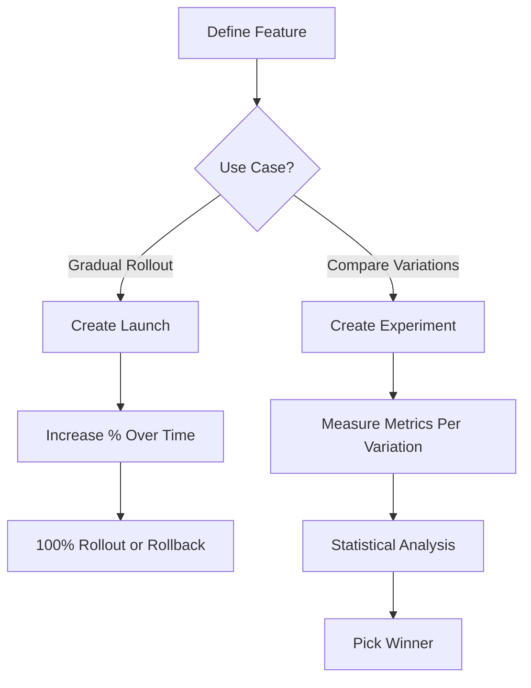

# How to Use CloudWatch Evidently for Feature Flags and A/B Testing

Author: [nawazdhandala](https://github.com/nawazdhandala)

Tags: AWS, CloudWatch, Evidently, Feature Flags, A/B Testing

Description: Learn how to use Amazon CloudWatch Evidently to implement feature flags and run A/B tests on your applications with built-in metrics collection and analysis.

---

Rolling out new features is always a bit nerve-wracking. Will users like it? Will it break anything? Will it tank your conversion rate? Traditionally, you'd either ship it to everyone and hope for the best, or build a custom feature flag system. CloudWatch Evidently gives you a third option - an AWS-native service for feature flags and A/B testing with built-in metrics analysis.

Evidently lets you safely roll out features to a percentage of users, run experiments comparing variations, and measure the impact using CloudWatch metrics. It's not as feature-rich as dedicated platforms like LaunchDarkly or Split, but if you're already in the AWS ecosystem, it integrates cleanly and doesn't require another vendor.

## Core Concepts

Evidently has three main concepts:

**Features** define what you're controlling. A feature has variations (like `enabled` and `disabled`, or `blue` and `green`), and you configure which users get which variation.

**Launches** are gradual rollouts of a feature. Start with 10% of users, monitor metrics, then increase to 50%, then 100%. If something goes wrong, roll back instantly.

**Experiments** are A/B tests. Split users into groups, show each group a different variation, and measure which performs better on your chosen metrics.



## Setting Up a Project

Everything in Evidently lives inside a project:

```bash
# Create an Evidently project
aws evidently create-project \
  --name "web-app" \
  --description "Web application feature flags and experiments"
```

If you want experiment data stored in CloudWatch or S3:

```bash
# Create a project with data storage configured
aws evidently create-project \
  --name "web-app" \
  --data-delivery '{
    "cloudWatchLogs": {
      "logGroup": "/evidently/web-app"
    }
  }'
```

## Creating a Feature Flag

Let's create a feature flag for a new checkout flow:

```bash
# Create a feature with two variations
aws evidently create-feature \
  --project "web-app" \
  --name "new-checkout-flow" \
  --description "New streamlined checkout experience" \
  --variations '[
    {
      "name": "old-checkout",
      "value": {"boolValue": false}
    },
    {
      "name": "new-checkout",
      "value": {"boolValue": true}
    }
  ]' \
  --default-variation "old-checkout"
```

Features can also have string or numeric variations:

```bash
# Feature with string variations (for different UI themes)
aws evidently create-feature \
  --project "web-app" \
  --name "checkout-button-color" \
  --variations '[
    {
      "name": "blue",
      "value": {"stringValue": "#0066CC"}
    },
    {
      "name": "green",
      "value": {"stringValue": "#00CC66"}
    },
    {
      "name": "orange",
      "value": {"stringValue": "#FF6600"}
    }
  ]' \
  --default-variation "blue"
```

## Evaluating Features in Your Application

Your application needs to call the Evidently API to determine which variation a user should see.

### JavaScript/Node.js

```javascript
// Evaluate a feature flag for a specific user
const { EvidentlyClient, EvaluateFeatureCommand } = require('@aws-sdk/client-evidently');

const client = new EvidentlyClient({ region: 'us-east-1' });

async function getFeatureVariation(userId, featureName) {
  const command = new EvaluateFeatureCommand({
    project: 'web-app',
    feature: featureName,
    entityId: userId  // Unique user identifier - ensures consistent experience
  });

  try {
    const response = await client.send(command);
    return {
      variation: response.variation,
      value: response.value
    };
  } catch (error) {
    console.error('Feature evaluation failed, using default:', error);
    return { variation: 'old-checkout', value: { boolValue: false } };
  }
}

// Usage in an Express route
app.get('/checkout', async (req, res) => {
  const userId = req.user.id;
  const feature = await getFeatureVariation(userId, 'new-checkout-flow');

  if (feature.value.boolValue) {
    // Render new checkout experience
    res.render('checkout-new');
  } else {
    // Render original checkout experience
    res.render('checkout-old');
  }
});
```

### Python

```python
# Evaluate feature flags in Python
import boto3

evidently = boto3.client('evidently')

def get_feature_variation(user_id, feature_name):
    """Get the feature variation for a specific user."""
    try:
        response = evidently.evaluate_feature(
            project='web-app',
            feature=feature_name,
            entityId=user_id
        )
        return {
            'variation': response['variation'],
            'value': response['value']
        }
    except Exception as e:
        print(f'Feature evaluation failed: {e}')
        # Return a safe default
        return {'variation': 'old-checkout', 'value': {'boolValue': False}}


# Usage in a Flask route
@app.route('/checkout')
def checkout():
    user_id = current_user.id
    feature = get_feature_variation(str(user_id), 'new-checkout-flow')

    if feature['value'].get('boolValue', False):
        return render_template('checkout_new.html')
    else:
        return render_template('checkout_old.html')
```

### Batch Evaluations

If you need multiple feature flags per request, use batch evaluation to reduce API calls:

```python
# Evaluate multiple features at once
def get_all_features(user_id):
    response = evidently.batch_evaluate_feature(
        project='web-app',
        requests=[
            {'entityId': user_id, 'feature': 'new-checkout-flow'},
            {'entityId': user_id, 'feature': 'checkout-button-color'},
            {'entityId': user_id, 'feature': 'show-recommendations'}
        ]
    )

    features = {}
    for result in response['results']:
        features[result['feature']] = result['value']

    return features
```

## Creating a Launch (Gradual Rollout)

A launch lets you gradually increase the percentage of users seeing the new feature:

```bash
# Create a launch with scheduled steps
aws evidently create-launch \
  --project "web-app" \
  --name "checkout-rollout" \
  --description "Gradual rollout of new checkout flow" \
  --groups '[
    {
      "name": "new-checkout-group",
      "feature": "new-checkout-flow",
      "variation": "new-checkout"
    }
  ]' \
  --scheduled-splits-config '{
    "steps": [
      {
        "startTime": "2026-02-13T00:00:00Z",
        "groupWeights": {"new-checkout-group": 10000}
      },
      {
        "startTime": "2026-02-15T00:00:00Z",
        "groupWeights": {"new-checkout-group": 50000}
      },
      {
        "startTime": "2026-02-18T00:00:00Z",
        "groupWeights": {"new-checkout-group": 100000}
      }
    ]
  }'
```

The `groupWeights` value is in units of 0.001%, so 10000 = 10%, 50000 = 50%, 100000 = 100%.

Start the launch:

```bash
# Start the launch
aws evidently start-launch \
  --project "web-app" \
  --launch "checkout-rollout"
```

If something goes wrong, stop the launch immediately:

```bash
# Stop the launch and revert to default variation
aws evidently stop-launch \
  --project "web-app" \
  --launch "checkout-rollout" \
  --desired-state "CANCELLED"
```

## Creating an Experiment (A/B Test)

Experiments need metrics to measure. First, define your metrics:

```bash
# Create an experiment comparing checkout button colors
aws evidently create-experiment \
  --project "web-app" \
  --name "button-color-test" \
  --description "Test which button color gets more conversions" \
  --treatments '[
    {
      "name": "blue-button",
      "feature": "checkout-button-color",
      "variation": "blue"
    },
    {
      "name": "green-button",
      "feature": "checkout-button-color",
      "variation": "green"
    }
  ]' \
  --metric-goals '[
    {
      "metricDefinition": {
        "name": "conversion-rate",
        "entityIdKey": "userId",
        "valueKey": "converted",
        "eventPattern": "{\"eventType\": [\"checkout.completed\"]}"
      },
      "desiredChange": "INCREASE"
    },
    {
      "metricDefinition": {
        "name": "page-load-time",
        "entityIdKey": "userId",
        "valueKey": "loadTime",
        "eventPattern": "{\"eventType\": [\"checkout.page.loaded\"]}"
      },
      "desiredChange": "DECREASE"
    }
  ]' \
  --online-ab-config '{
    "controlTreatmentName": "blue-button",
    "treatmentWeights": {
      "blue-button": 50000,
      "green-button": 50000
    }
  }'
```

Start the experiment:

```bash
# Start the experiment
aws evidently start-experiment \
  --project "web-app" \
  --experiment "button-color-test"
```

## Sending Custom Events for Experiments

Your application needs to send events to Evidently so it can calculate metrics:

```python
# Send events to Evidently for experiment analysis
import boto3
import json
from datetime import datetime

evidently = boto3.client('evidently')

def track_conversion(user_id, converted):
    """Track whether a user completed checkout."""
    evidently.put_project_events(
        project='web-app',
        events=[
            {
                'timestamp': datetime.utcnow(),
                'type': 'aws.evidently.custom',
                'data': json.dumps({
                    'details': {
                        'eventType': 'checkout.completed',
                        'userId': user_id,
                        'converted': 1 if converted else 0
                    },
                    'userDetails': {
                        'userId': user_id
                    }
                })
            }
        ]
    )

def track_page_load(user_id, load_time_ms):
    """Track checkout page load time."""
    evidently.put_project_events(
        project='web-app',
        events=[
            {
                'timestamp': datetime.utcnow(),
                'type': 'aws.evidently.custom',
                'data': json.dumps({
                    'details': {
                        'eventType': 'checkout.page.loaded',
                        'userId': user_id,
                        'loadTime': load_time_ms
                    },
                    'userDetails': {
                        'userId': user_id
                    }
                })
            }
        ]
    )
```

## Viewing Experiment Results

Check how your experiment is performing:

```bash
# Get experiment results
aws evidently get-experiment-results \
  --project "web-app" \
  --experiment "button-color-test" \
  --metric-names "conversion-rate" \
  --treatment-names "blue-button" "green-button" \
  --result-stats "BaseStat"
```

Evidently provides statistical analysis including:

- Mean values for each treatment
- Confidence intervals
- Statistical significance

When you have a winner:

```bash
# Stop the experiment
aws evidently stop-experiment \
  --project "web-app" \
  --experiment "button-color-test" \
  --desired-state "COMPLETED"

# Update the feature to use the winning variation as default
aws evidently update-feature \
  --project "web-app" \
  --name "checkout-button-color" \
  --default-variation "green"
```

## CloudFormation Template

```yaml
# CloudFormation for Evidently project and feature
AWSTemplateFormatVersion: '2010-09-09'

Resources:
  EvidentlyProject:
    Type: AWS::Evidently::Project
    Properties:
      Name: web-app
      Description: Web application experiments

  CheckoutFeature:
    Type: AWS::Evidently::Feature
    Properties:
      Project: !Ref EvidentlyProject
      Name: new-checkout-flow
      DefaultVariation: old-checkout
      Variations:
        - VariationName: old-checkout
          BooleanValue: false
        - VariationName: new-checkout
          BooleanValue: true
```

## Best Practices

**Always include a fallback.** If the Evidently API is unreachable, your code should gracefully fall back to the default experience. Never let feature flag evaluation block the user experience.

**Use consistent entity IDs.** The `entityId` determines which variation a user gets. Use a stable identifier (user ID, session ID) so users don't see different variations on each page load.

**Run experiments long enough.** Don't call a winner after 2 hours. You need enough data for statistical significance, which usually means several days to a couple of weeks depending on traffic.

**Monitor operational metrics alongside experiment metrics.** While measuring conversion rate, also watch error rates and latency. A variation that improves conversions but introduces errors is not a winner.

**Clean up completed experiments.** Old features and experiments clutter the project. Archive or delete them after you've made the rollout decision.

## Wrapping Up

CloudWatch Evidently brings feature flags and A/B testing into the AWS ecosystem. It's straightforward to set up, integrates with CloudWatch for metrics, and handles the statistical analysis for you. If you're looking for a basic feature flag solution without adding another third-party tool to your stack, Evidently is worth a look. Start with a simple boolean feature flag, get comfortable with the API, then try a real A/B experiment on a non-critical feature before using it for high-stakes product decisions.
