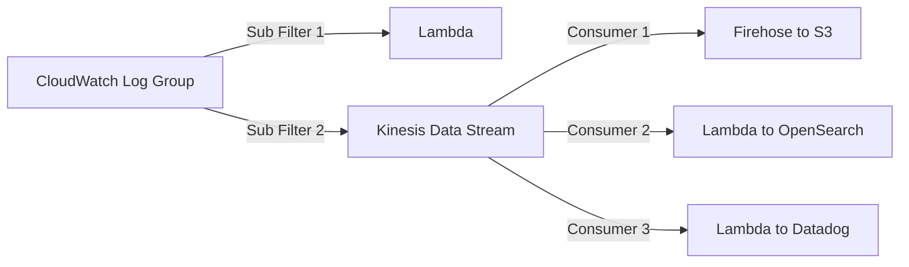

# How to Set Up CloudWatch Log Subscriptions

Author: [nawazdhandala](https://github.com/nawazdhandala)

Tags: AWS, CloudWatch, Logging, Streaming, Monitoring

Description: A complete guide to CloudWatch Log subscription filters covering all destination types, filter patterns, cross-account streaming, and operational best practices.

---

CloudWatch Log subscription filters are the mechanism for streaming log data out of CloudWatch Logs in real time. They let you send matching log events to Lambda functions, Kinesis Data Streams, Kinesis Data Firehose, or OpenSearch Service. This is the foundation for building log processing pipelines, real-time alerting systems, and log forwarding to external platforms.

If you've read our posts on [streaming logs to Lambda](https://oneuptime.com/blog/post/stream-cloudwatch-logs-lambda-processing/view) or [streaming logs to OpenSearch](https://oneuptime.com/blog/post/stream-cloudwatch-logs-opensearch/view), this post goes broader - covering all destination types, advanced filter patterns, cross-account streaming, and troubleshooting.

## Subscription Filter Basics

A subscription filter has three components:

1. **Log group** - the source of log events
2. **Filter pattern** - which events to forward (or empty string for all events)
3. **Destination** - where to send matching events (Lambda, Kinesis, Firehose, or OpenSearch)

Each log group supports up to **2 subscription filters**. This limit is firm and can't be increased. If you need to send logs to more than two destinations, use a fan-out pattern: stream to a Kinesis Data Stream, then have multiple consumers read from it.



## Destination 1: Lambda

Lambda is the most flexible destination. Your function receives batched log events and can do anything with them - transform, filter, alert, forward to any API.

```bash
# Give CloudWatch Logs permission to invoke the Lambda
aws lambda add-permission \
  --function-name "my-log-processor" \
  --statement-id "cloudwatch-invoke" \
  --principal "logs.amazonaws.com" \
  --action "lambda:InvokeFunction" \
  --source-arn "arn:aws:logs:us-east-1:123456789012:log-group:/myapp/production/*"

# Create subscription filter targeting Lambda
aws logs put-subscription-filter \
  --log-group-name "/myapp/production/api" \
  --filter-name "errors-to-lambda" \
  --filter-pattern '{ $.level = "ERROR" }' \
  --destination-arn "arn:aws:lambda:us-east-1:123456789012:function:my-log-processor"
```

**Pros**: Maximum flexibility, serverless scaling, no infrastructure to manage.
**Cons**: Lambda concurrency limits, cold start latency, per-invocation costs at high volume.

## Destination 2: Kinesis Data Streams

Kinesis is ideal when you have high-volume log streams or need multiple consumers:

```bash
# Create a Kinesis stream
aws kinesis create-stream \
  --stream-name "log-stream" \
  --shard-count 2

# Create the IAM role for CloudWatch to write to Kinesis
# (See the IAM section below for the policy)

# Create subscription filter targeting Kinesis
aws logs put-subscription-filter \
  --log-group-name "/myapp/production/api" \
  --filter-name "all-logs-to-kinesis" \
  --filter-pattern "" \
  --destination-arn "arn:aws:kinesis:us-east-1:123456789012:stream/log-stream" \
  --role-arn "arn:aws:iam::123456789012:role/CWLtoKinesisRole"
```

The IAM role needs these permissions:

```json
{
  "Version": "2012-10-17",
  "Statement": [
    {
      "Effect": "Allow",
      "Action": [
        "kinesis:PutRecord",
        "kinesis:PutRecords"
      ],
      "Resource": "arn:aws:kinesis:us-east-1:123456789012:stream/log-stream"
    }
  ]
}
```

With a trust policy for CloudWatch Logs:

```json
{
  "Version": "2012-10-17",
  "Statement": [
    {
      "Effect": "Allow",
      "Principal": {
        "Service": "logs.amazonaws.com"
      },
      "Action": "sts:AssumeRole"
    }
  ]
}
```

**Pros**: High throughput, multiple consumers, ordered delivery per shard.
**Cons**: Costs more, requires shard management, more complex setup.

## Destination 3: Kinesis Data Firehose

Firehose is the simplest path to S3, OpenSearch, or Redshift:

```bash
# Create subscription filter targeting Firehose
aws logs put-subscription-filter \
  --log-group-name "/myapp/production/api" \
  --filter-name "logs-to-firehose" \
  --filter-pattern "" \
  --destination-arn "arn:aws:firehose:us-east-1:123456789012:deliverystream/log-delivery" \
  --role-arn "arn:aws:iam::123456789012:role/CWLtoFirehoseRole"
```

**Pros**: Fully managed delivery, automatic batching and compression, built-in retry.
**Cons**: Higher delivery latency (1-5 minutes), less flexibility than Lambda.

## Destination 4: OpenSearch Service

Stream directly to an OpenSearch domain:

```bash
# Create subscription filter targeting OpenSearch
aws logs put-subscription-filter \
  --log-group-name "/myapp/production/api" \
  --filter-name "logs-to-opensearch" \
  --filter-pattern "" \
  --destination-arn "arn:aws:es:us-east-1:123456789012:domain/log-analytics" \
  --role-arn "arn:aws:iam::123456789012:role/CWLtoOpenSearchRole"
```

This uses a built-in Lambda function under the hood, so you get the OpenSearch indexing without writing any code.

## Advanced Filter Patterns

The filter pattern determines which log events get forwarded. Here are some useful patterns:

```bash
# All events (empty pattern matches everything)
""

# Only errors (text match)
"ERROR"

# JSON field matching
'{ $.level = "ERROR" }'

# Numeric comparison
'{ $.statusCode >= 500 }'

# Multiple conditions
'{ $.level = "ERROR" && $.service = "payment" }'

# Pattern with OR
'{ $.statusCode = 500 || $.statusCode = 502 || $.statusCode = 503 }'

# Match when a field exists
'{ $.errorStack IS TRUE }'
```

Smart filtering is important for cost control. If you only care about errors, don't stream all logs - filter at the subscription level. This reduces Lambda invocations, Kinesis throughput, and downstream processing costs.

## Cross-Account Log Streaming

You can stream logs from one account to a destination in another account. This is useful for centralizing logs in a monitoring account.

In the destination account, create a Kinesis stream or Lambda function. Then create a destination policy:

```bash
# In the destination account: create a destination
aws logs put-destination \
  --destination-name "central-log-destination" \
  --target-arn "arn:aws:kinesis:us-east-1:999999999999:stream/central-logs" \
  --role-arn "arn:aws:iam::999999999999:role/CWLtoKinesisRole"

# Set the access policy to allow source accounts
aws logs put-destination-policy \
  --destination-name "central-log-destination" \
  --access-policy '{
    "Version": "2012-10-17",
    "Statement": [
      {
        "Effect": "Allow",
        "Principal": {
          "AWS": ["111111111111", "222222222222"]
        },
        "Action": "logs:PutSubscriptionFilter",
        "Resource": "arn:aws:logs:us-east-1:999999999999:destination:central-log-destination"
      }
    ]
  }'
```

In the source accounts, create subscription filters pointing to the destination:

```bash
# In the source account: stream to the central destination
aws logs put-subscription-filter \
  --log-group-name "/myapp/production/api" \
  --filter-name "cross-account-stream" \
  --filter-pattern "" \
  --destination-arn "arn:aws:logs:us-east-1:999999999999:destination:central-log-destination"
```

## Managing Subscription Filters

List existing filters:

```bash
# List subscription filters on a log group
aws logs describe-subscription-filters \
  --log-group-name "/myapp/production/api"
```

Delete a filter:

```bash
# Remove a subscription filter
aws logs delete-subscription-filter \
  --log-group-name "/myapp/production/api" \
  --filter-name "errors-to-lambda"
```

## Monitoring Subscription Filter Health

CloudWatch publishes metrics for subscription filters under the `AWS/Logs` namespace:

- `ForwardedBytes` - bytes forwarded to the destination
- `ForwardedLogEvents` - number of events forwarded
- `DeliveryErrors` - failed delivery attempts
- `DeliveryThrottling` - events dropped due to throttling

Set up alarms on `DeliveryErrors` to catch pipeline failures:

```bash
# Alert if subscription filter delivery fails
aws cloudwatch put-metric-alarm \
  --alarm-name "SubscriptionFilterErrors" \
  --namespace "AWS/Logs" \
  --metric-name "DeliveryErrors" \
  --dimensions Name=LogGroupName,Value=/myapp/production/api Name=FilterName,Value=errors-to-lambda \
  --statistic Sum \
  --period 300 \
  --threshold 1 \
  --comparison-operator GreaterThanOrEqualToThreshold \
  --evaluation-periods 1 \
  --alarm-actions arn:aws:sns:us-east-1:123456789012:ops-alerts
```

## Troubleshooting

If events aren't reaching your destination:

1. **Check the filter pattern**: Test it with `aws logs filter-log-events` to make sure it matches.
2. **Check permissions**: The IAM role needs the right permissions for the destination.
3. **Check Lambda errors**: If the destination is Lambda, check the function's own CloudWatch Logs for errors.
4. **Check Kinesis throughput**: If events are being throttled, add more shards.
5. **Check the 2-filter limit**: If you already have 2 filters, you can't add more.

## Wrapping Up

Subscription filters are the key to building real-time log processing pipelines on AWS. Choose Lambda for flexibility, Kinesis for high throughput with multiple consumers, Firehose for simple delivery to S3, and OpenSearch for full-text search. Combine filter patterns with the right destination to keep costs down while getting the data where it needs to go. For more on the specific destinations, see our posts on [streaming to Lambda](https://oneuptime.com/blog/post/stream-cloudwatch-logs-lambda-processing/view), [streaming to OpenSearch](https://oneuptime.com/blog/post/stream-cloudwatch-logs-opensearch/view), and [exporting to S3](https://oneuptime.com/blog/post/export-cloudwatch-logs-s3/view).
